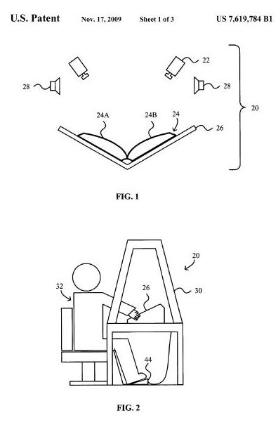

Google was granted a patent today on one aspect of a book scanning process that raises the question what kind of music helps someone scan books best.

The patent is [Pacing and error monitoring of manual page turning operator](http://patft.uspto.gov/netacgi/nph-Parser?Sect1=PTO2&Sect2=HITOFF&u=%2Fnetahtml%2FPTO%2Fsearch-adv.htm&r=1&p=1&f=G&l=50&d=PTXT&S1=7,619,784.PN.&OS=pn/7,619,784&RS=PN/7,619,784) (US Patent 7,619,784), which lists Joseph K. O’Sullivan, R. Alexander Proudfoot, and Christopher R. Uhlik as inventors. Note the cameras and speakers above a book in a scanning cradle, in the image below from the patent:

The patent was originally filed on June 30, 2003, and describes how a musical tempo might be used to help someone manually turning pages while scanning books. The abstract from the patent reads as follows:

> Systems and methods for pacing and error monitoring of a manual page turning operator of a system for capturing images of a bound document are disclosed. The system includes a speaker for playing music having a tempo and a controller for controlling the tempo based on an imaging rate and/or an error rate. The operator is influenced by the music tempo to capture images at a given rate.
>
> Alternative or in addition to audio, error detection may be implemented using OCR to determine page numbers to track page sequence and/or a sensor to detect errors such as object intrusion in the image frame and insufficient light.
>
> The operator may be alerted of an error with audio signals and signaled to turn back a certain number of pages to be recaptured. When music is played, the tempo can be adjusted in response to the error rate to reduce operator errors and increase overall throughput of the image capturing system. The tempo may be limited to a maximum tempo based on the maximum image capture rate.

While we don’t know for certain that Google is using this process as described in the patent, there have been a few sites that have shown errors in Google Books that include images of hands turning pages.

The patent tells us of least three related patents from Google involving book scanning:

- Moveable Document Cradle for Facilitating Imaging of Bound Documents
- Acquiring and Using Three-Dimensional Information in a Document Scanning System
- Imaging Opposing Bound Pages at High Speed Using Multiple Cameras

Why would Google manually scan books and magazines and other bound documents instead of using an automated process?

One reason would be to protect the documents themselves from flat-bed scanners that might damage the spines and bindings of books. The inventors behind the patent also tell us that automated page turning systems often require someone to manually turn the pages of books and magazines.

The patent goes into a fair amount of detail on how musical tempos might be used to help a manual scanner keep up a certain pace in turning pages, and how audio messages might be used to notify people scanning of errors on previous pages, including the appearance of hands and arms in images of those pages.

Of course, I’m curious as to whether people are listening to country, classical, hip hop, or rock, but we aren’t told in the patent if actual songs are used in the scanning of books.
