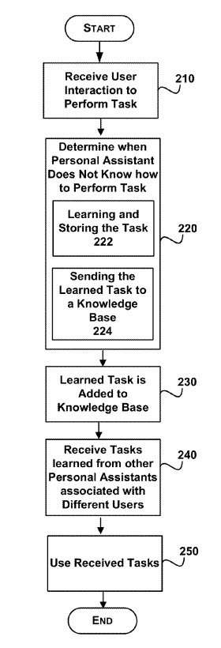
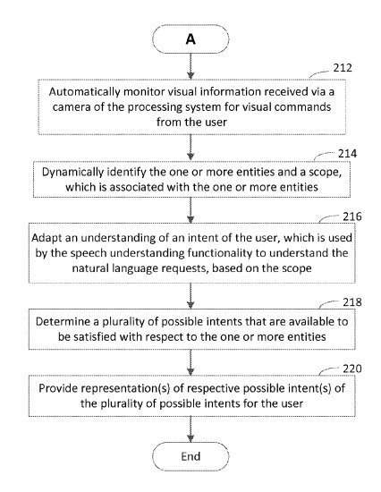
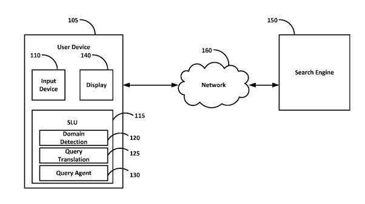

In January, Microsoft introduced a new build of Windows 10, which it will be giving away for free for non-enterprise users running Windows 7 and Windows 8.1. One of the features on this update is a personal digital assistant that goes by the name Cortana.

It’s one of the most anticipated features of the new Windows 10, and I’ve started digging through patents at the USPTO to get some hints of what this might mean for us. An article published recently got me started, with the name, [Here’s how to make the most of Cortana, the Windows 10 digital assistant](https://www.digitaltrends.com/computing/get-know-cortana-windows-10/).

You’ve likely seen Apple’s Personal Assistant Siri, which was featured on a number of celebrity enhanced advertisements, and you may have seen people writing about Google Now, which feeds you cards to give you information that it predicts you might need or want when that information becomes available. Cortana is Microsoft’s entry into the Personal Assistant field.

Cortana is supposedly “powered by Bing” and “developed for Windows Phone 8.1”, and it looks like an important feature in Windows 10. I’ve been having difficulties defining what “powered by Bing” actually means, except that it seems to imply that all of the questions asked to Cortana are answered by the Bing search engine.

From an April 17th article on the Microsoft research blog, [Anticipating More from Cortana](https://www.microsoft.com/en-us/research/blog/anticipating-more-from-cortana/?from=http%3A%2F%2Fresearch.microsoft.com%2Fen-us%2Fnews%2Ffeatures%2Fcortana-041614.aspx) we learned more about the people who have been working on Cortana, including Larry Heck who started the “conversational-understanding (CU) personal-assistant” project in 2009.

When I read that, I went over the the United States Patent and Trademark Office site and started looking for patents that were co-invented by Larry Heck, filed in 2009 or later, and about personal assitants, to get an idea of some of the things that Cortana might be capable of. There were more than a couple.

## Digital Assistants Learning from Each Other

The first one I ran across was a patent application by the name of [Collaborative Learning through User Generated Knowledge](http://appft.uspto.gov/netacgi/nph-Parser?Sect1=PTO1&Sect2=HITOFF&d=PG01&p=1&u=%2Fnetahtml%2FPTO%2Fsrchnum.html&r=1&f=G&l=50&s1=%2220140201629%22.PGNR.&OS=DN/20140201629&RS=DN/20140201629) (20140201629)

Its focus is upon having personal assistants helping to teach each other. It tells us that in its abstract:

> A feedback loop is used by a central knowledge manager to obtain information from different users and deliver learned information to other users. Each user utilizes a personal assistant that learns from the user over time. The user may teach their personal assistant new knowledge through a natural user interface (NUI) and/or some other interface.
>
> For example, a combination of a natural language dialog and other non-verbal modalities of expressing intent (gestures, touch, gaze, images/videos, spoken prosody, . . . ) may be used to interact with the personal assistant. As knowledge is learned, each personal assistant sends the newly learned knowledge back to the knowledge manager.
>
> The knowledge obtained from the personal assistants is combined to form a collective intelligence. This collective intelligence is then transferred back to each of the individual personal assistants. In this way, the knowledge of one personal assistant benefits the other personal assistants through the feedback loop.

So, having phones that help each other learn, even though they are owned by different people, is kind of interesting. But, what kinds of things might they be teaching each other?

## Request and Command Capabilities

Another patent that looks like it could involve Cortana combining what is being called “a request and a command.”

Here’s a description from that patent of this type of behavior:

> For instance, a user may hold a juice can to a camera of a processing system and say “Add calories for this” to update a calorie log; the user may point the camera at a scene and say “Send this to Ken” to email an electronic image of the scene to Ken; the user may press or point at a portion of a display of the processing system in which a movie trailer is playing and say “What times is this showing tonight” to obtain a list of showtimes at cinemas near the user’s home, etc.

The granted patent is:

[Satisfying specified intent(s) based on multimodal request(s)](http://patft.uspto.gov/netacgi/nph-Parser?Sect1=PTO2&Sect2=HITOFF&p=1&u=%2Fnetahtml%2FPTO%2Fsearch-adv.htm&r=1&f=G&l=50&d=PALL&S1=08788269&OS=PN/08788269&RS=PN/08788269) (8,788,269)

The abstract for the patent tells us:

Abstract

> Techniques are described herein that are capable of satisfying specified intent(s) based on multimodal request(s).
>
> A multimodal request is a request that includes at least one request of a first type and at least one request of a second type that is different from the first type.
>
> Example types of request include but are not limited to a speech request, a text command, a tactile command, and a visual command. A determination is made that one or more entities in visual content are selected in accordance with an explicit scoping command from a user. In response, speech understanding functionality is automatically activated, and audio signals are automatically monitored for speech requests from the user to be processed using the speech understanding functionality.

So the examples above, for calculating calories for a can of juice and possibly adding those to a total count for a meal, or to email an image to someone else, are the kinds of “requests and commands” anticipated by this patent.

That sounds useful.

Maybe even more interesting might be how well Cortana might respond to natural language queries.

## Translating Natural Language Utterances into Queries

Imagine that you ask your phone or your computer to find a restaurant of a certain type for you in a certain location which might have reservations available, using a phrase like “find me an Italian restaurant nearby with a table for two.”

That type of request for information isn’t the kind of thing that you ask a search engine these days to answer for you, at least using language like that. Your personal assistant could potentially perform a number of queries and tasks (such as locating a certain type of restaurant nearby, and checking for availability of seating).

This is another patent likely involving Cortana, and it tells us that this kind of query could also be covered:

> [0014] Spoken language understanding (SLU) in human/machine spoken dialog systems is a process that aims to automatically identify a user’s goal-driven intents for a given domain. For example, the user’s intent may be to make a dinner reservation, with goals of: (a) locating a restaurant (b) in a particular area (c) with available reservations and (d) for a particular time and date. A query may be expressed in natural language, such as “find me an Italian restaurant nearby with a table for two,” and the SLU system may detect a top level domain as an initial classification. In the example query above, the domain may comprise “restaurants.”

The patent application is:

[Translating Natural Language Utterances to Keyword Search Queries](http://appft.uspto.gov/netacgi/nph-Parser?Sect1=PTO1&Sect2=HITOFF&d=PG01&p=1&u=%2Fnetahtml%2FPTO%2Fsrchnum.html&r=1&f=G&l=50&s1=%2220140059030%22.PGNR.&OS=DN/20140059030&RS=DN/20140059030) (20140059030)

The abstract tells us:

> Natural language query translation may be provided. A statistical model may be trained to detect domains according to a plurality of query click log data. Upon receiving a natural language query, the statistical model may be used to translate the natural language query into an action. The action may then be performed and at least one result associated with performing the action may be provided.

## Take-Aways

There are 21 pending and one granted Microsoft patents that have Larry Heck’s name on them as an inventor for Microsoft. Most of them look like they could potentially be used for the personal assistant Cortana, and provide some features that would make Cortana pretty interesting.

It’s difficult telling how much any of these patents have been developed, and put into use for Cortana. But they look like they might provide a challenge for both Apple’s Siri, and Google Now when it comes to which Personal Assistant might be the best of the bunch.
