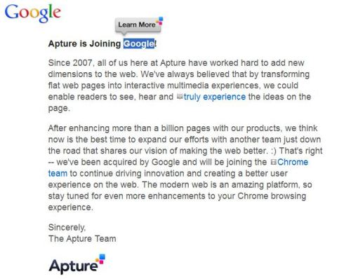
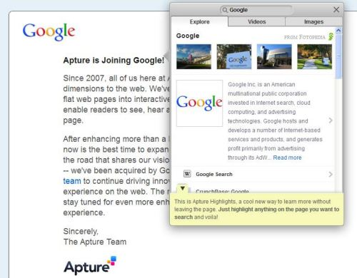
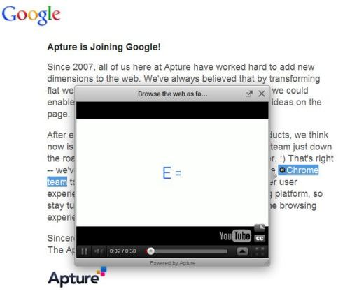
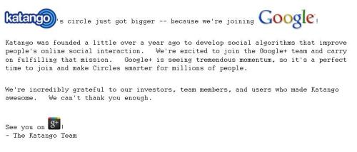
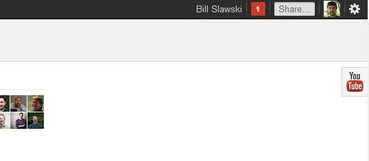
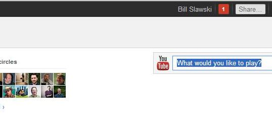

Imagine being able to highlight any text on a web page and search the Web based upon that text? Or an easier way to embed videos or other content in windows that will appear and open up without launching a new browser window.

Now imagine that your Google Plus Circles could engage in friend relationship management, being better at self organizing by grouping people whom you add to your Google Plus Account by whether they are co-workers, or if they live nearby, or the kind of company they work for, or the school that they went to or many other ways that might make circle management smarter and a little more fun. Now imagine that the technology behind that involves the use of intelligent social media agents that keep an eye on the social activity of your contacts.

Google revealed last Thursday that they acquired a couple of companies, seemingly both for the expertise and knowledge of the people employed by those companies and the technology that they have developed. I found the patent filings that have been assigned to both companies to try to get a deeper glimpse at some of the technologies that both companies have developed.

One of the companies that Google acquired is [Apture](http://apture.com/), a business started by Tristan Harris and [Can Sar](https://cansar.com/), a couple of Stanford students in 2007. The Apture Website notes that the Apture team will be joining Google’s Chrome Team. That makes sense since Apture specializes in making browser experiences richer by proving text boxes that pop-out when you click upon links on a page. Apture was supplying these types of features for a number of partner sites as well as a plugin that would work with Chrome, Firefox, and Safari.

This first image is the Apture homepage with the notice that they’ve been acquired by Google. I highlighted the word “Google” on the page, and a caption box appears above my highlighting with the caption “Learn More” appearing within it. Note that there are a couple of links on the page as well that have different kinds of icons in front of them, signifying that they will launch different types of boxes that display certain types of information. In front of the link with the anchor text “truly experience” is an icon that looks like an open book. Immediately before the anchor text “Chrome Team” is an icon that looks like a film strip.

When I clicked upon the “Learn More,” a information/search results window opens on the page without launching a new browser window. Note that the box has three tabs, with the first labeled “explore,” which includes an informational annotation followed by search results. The second tab is labeled “videos,” and shows a number of videos in response to the word that I highlighted. The third tab is labeled images, and includes a number of images in response to my highlighted search term.

In this third image, I’ve clicked upon the link with the anchor text “Chrome Team,” with the filmstrip icon in front of it. A YouTube video appears about Google Chrome.

The other company is [Katango](http://web.archive.org/web/20130530013658/https://s3.amazonaws.com/static.katango.com/announcement.html), and they published a note on a page which redirects from the Katango.com page to an Amazon hosted page, that the company was acquired by Google and that they would be joining the Google Plus team. The chairman of the company is Yoav Shoham, a professor at Stanford University. The company was originally named CafeBots, and has described what they do in the past as [Personal Crowd Control](https://techcrunch.com/2011/05/31/under-the-covers-at-katango-kleiner-perkins-first-sfund-investment/).

Google’s Bradley Horowitz, the Vice President of Product Management for Google+ also announced the Katango acquisition on November 10th.

Apture makes it easier to search from any page on the Web, and to more easily embed different types of content on web pages. Kantago could make managing your Circles on Google Plus much easier.

Here are the patent application filings that are available at the USTPO. It’s possible that both companies may have more filed that haven’t been published yet.

**Apture Patent Applications**

This patent application describes a layout manager for determining where an interactive window might appear upon a browser page.

[System for intelligent automated layout and management of interactive windows](http://appft.uspto.gov/netacgi/nph-Parser?Sect1=PTO2&Sect2=HITOFF&u=%2Fnetahtml%2FPTO%2Fsearch-adv.html&r=1&p=1&f=G&l=50&d=PG01&S1=20100011316.PGNR.&OS=dn/20100011316&RS=DN/20100011316)
Invented by Can Sar, Jesse Young, and Tristan Harris
US Patent Application 20100011316
Published January 14, 2010
Filed: January 21, 2009

Abstract

> The present invention relates to the automated layout and scrolling of windows.

The patent filing description starts off by pointing out that the process described in this application differs from the embedding of videos or other objects into a page.

[Creating first class objects from web resources](http://appft.uspto.gov/netacgi/nph-Parser?Sect1=PTO2&Sect2=HITOFF&u=%2Fnetahtml%2FPTO%2Fsearch-adv.html&r=1&p=1&f=G&l=50&d=PG01&S1=20090199077.PGNR.&OS=dn/20090199077&RS=DN/20090199077)
Invented by Can Sar, Jesse Young, and Tristan Harris
US Patent Application 20090199077
Published August 6, 2009
Filed: January 21, 2009

Abstract

> The present inventions are directed to apparatus and method for creating first class object representations from web pages that are not normally considered first class objects.

Annotations using intelligent windows might be added by visitors to a webpage. This could be limited to the owner of a page, or expanded to others who visit the page, in wiki like fashion.

[Method of enabling the modification and annotation of a webpage from a web browser](http://appft.uspto.gov/netacgi/nph-Parser?Sect1=PTO2&Sect2=HITOFF&u=%2Fnetahtml%2FPTO%2Fsearch-adv.html&r=1&p=1&f=G&l=50&d=PG01&S1=20090199083.PGNR.&OS=dn/20090199083&RS=DN/20090199083)
Invented by Can Sar, Jesse Young, and Tristan Harris
US Patent Application 20090199083
Published August 6, 2009
Filed: January 21, 2009

Abstract

> The present invention relates to enabling the modification and annotation of any webpage from a web browser by any user (with appropriate privileges) without the need for custom plugins or browser extensions.

This patent application seems to describe something like the scrolling [Youtube Slider box](https://googleblog.blogspot.com/2011/11/shipping-google-in-google.html) that appears on Google Plus Stream pages, and will scroll down a page as you do. When clicked upon that box provides a way to search Youtube videos. The Youtube slider on Google Plus Stream pages starts out as a box at the top right of the page:

If you click upon it, it expands so that you can search through YouTube videos:

The box slides down the side of the page, in contracted mode if you haven’t clicked upon it, and in expanded mode if you haven’t clicked to contract it again:

[Independent Visual Element Configuration](http://appft.uspto.gov/netacgi/nph-Parser?Sect1=PTO2&Sect2=HITOFF&u=%2Fnetahtml%2FPTO%2Fsearch-adv.html&r=1&p=1&f=G&l=50&d=PG01&S1=20110225487.PGNR.&OS=dn/20110225487&RS=DN/20110225487)
Invented by Tristan Arguello Harris and Omer Faruk Nafiz Ates
US Patent Application 20110225487
Published September 15, 2011
Filed: March 10, 2011

Abstract

> A system and a method are disclosed for a configuration in which any user interface feature that would otherwise have been hidden while the user is interacting with the rest of the web page are made available at the top of the web page.

**Katango Patent Application**

What we’ve heard about Katango’s capabilities includes a friend management program that can make circle management easier. But this patent filing goes beyond that by introducing a social media agent that can act on behalf of someone to capture information about other people’s activities on multiple social networks, and perhaps present that information in dashboards. This agent would look beyond information located in profiles when helping manage circles, and could collect information based upon actions performed by your contacts on social networks to help suggest how you might organize those contacts.

[Automated Agent for Social Media Systems](http://appft.uspto.gov/netacgi/nph-Parser?Sect1=PTO2&Sect2=HITOFF&u=%2Fnetahtml%2FPTO%2Fsearch-adv.html&r=1&p=1&f=G&l=50&d=PG01&S1=20110184886.PGNR.&OS=dn/20110184886&RS=DN/20110184886)
Invented by Yoav Shoham
US Patent Application 20110184886
Published July 28, 2011
Filed: June 22, 2010

Abstract

> A method to automatically process social media data includes capturing captured data, describing actions and/or context relating a user across multiple social media systems. The captured data is stored within a database. One or more interfaces are provided in order to provide access to the stored captured data. A rules database is configured to store multiple social media rules (e.g., behaviors) that may be associated with a user. A behavior engine is configured to perform autonomous activities, on behalf of a user with respect to multiple social media platforms, based on the social medial rules and/or the captured data.

**Conclusion**

Google has been pretty mum on some of the many acquisitions that they’ve made in the past year, rumored at roughly 50 or so. I’m not sure why they decided to announce these particular acquisitions except for the fact that both have customers that they may no longer support in the future. Katango was providing an iPhone app that helped organize Facebook Friends. Apture’s technology was being used by a good number of websites and as a plugin for Chrome, Firefox, and Safari.

The technologies are pretty interesting, and I do suspect that we will see them integrated into offerings from Google fairly soon. I don’t know if the YouTube slider on Google Plus streams were from Apture, but they do seem to be a good match for the last of the Apture patent filings.

There’s a pretty interesting interview between Robert Scoble and Yoav Shoham on Cruchbase that’s worth watching after you spend some time with the patent, since Yoav Shoham refers to much of the technology behind what they do as “magic” and it’s a little fun to have a some sense of what the magic might be.

A Google Plus post from Yee Lee of Katango notes that today was going to be his first day of work at Google.
