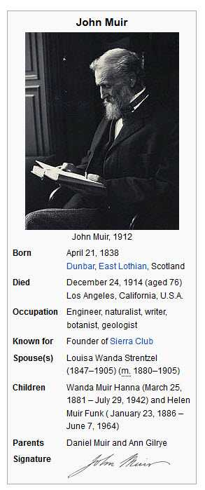

In my first Patent Free Friday, I was going to write about two of the best marketers in the town I live in, a pair of bakers who bake on either end of the historic Main Street in Warrenton Virginia. I guess getting up in the early morning to bake the bread is conducive to letting marketing ideas nurture and thrive. They are both worth writing about, so I’m going to reserve that topic for another day, and not give away too much here, yet.

_by [Kimberly Vardeman](https://www.flickr.com/photos/kimberlykv/) | [http://creativecommons.org/licenses/by/4.0/](https://creativecommons.org/licenses/by/4.0/)_

Another topic arose last week as I presented at Pubcon, and ran into an old friend, who used to be a moderator in a web forum that I was an administrator of. He asked me a question that I’ve been thinking about since, coming up with a lot of different answers. I’m going to share that question now, but not my answers until another Friday, to give you a chance to think about how you might answer the question.

*If you could go back in time and change one thing, what would it be?*

Instead, I’m going to dip into the whitepapers I see and share one that I thought was pretty interesting. And I’m kind of cheating on the first official Patent Free Friday. I found the paper in a list of “other references” for a patent. I saw the title of the paper and had to go look it up. Once I found a copy, I felt like I had to share it. It answers a few questions about how Google learns about the Web.

One of the places where Google learns about the Web is by looking at patterns that appear upon it in relation to certain types of content. This goes back to Sergey Brin’s DIPRE algorithm, described in [Extracting Patterns and Relations from the World Wide Web](http://web.archive.org/web/20120314072716/http://ilpubs.stanford.edu:8090/421/1/1999-65.pdf)

So what if Google used templates from sources such as Wikipedia and other websites, to learn about entities on the Web, and what type of entity each of those might be?

For example, the Wikipedia infobox below for John Muir tells us more about the environmentalist. By the existence of a page and a template for him at Wikipedia, and information about his date of birth, type of occupation and so on, we know that he was a person of some notability (Because of Wikipedia’s notability policy for people listed in the online encyclopedia). With Google collecting facts from such templates, and looking for patterns from them which could make it easier to extract more information about these entities from the web, we can see how Google might build up a fact repository of information about Entities.

The white paper is

[Web-Scale Named Entity Recognition](https://wenku.baidu.com/view/84800936f111f18583d05a3f.html)
by Casey Whitelaw, Alex Kehlenbeck, Nemanja Petrovic, and Lyle Ungar, of Google
from the Proceedings of the 17.sup.th ACM Conference on Information and Knowledge Management, Oct. 2008, pp. 123-132

Abstract:

> Automatic recognition of named entities such as people, places, organizations, books, and movies across the entire web presents a number of challenges, both of scale and scope.
>
> Data for training general named entity recognizers is difficult to come by, and efficient machine learning methods are required once we have found hundreds of millions of labeled observations. We present an implemented system that addresses these issues, including a method for automatically generating training data, and a multi-class online classification training method that learns to recognize not only high level categories such as place and person, but also more finegrained categories such as soccer players, birds, and universities.
>
> The resulting system gives precision and recall performance comparable to that obtained for more limited entity types in much more structured domains such as company recognition in newswire, even though web documents often lack consistent capitalization and grammatical sentence construction.

The paper is broken down into the following sections:

1. Introduction
2. Training Set Generation
2.1 Entity Extraction with Factzor
2.1.1 Mention Extraction via lists
2.1.2 Mention Extraction Via Templates
2.2 Training Set Extension
2.3 Non-Entities
2.4 Feature Generator
3 Machine Learning
3.1 Feature Screening
3.2 Perceptron Algorithm
3.3 Use of Class Hierarchy
3.4 Error Correcting Output Codes
3.5 Prediction Resolution
4. Results
4.1 Feature Benefit
5. Related Work
6. Conclusions

This was the most telling passage for me:

> Key to the success of our system was the use of a method we call “factzor” for the unsupervised extraction of facts from the web. Factzor finds templates that can be used to identify high-quality entity mentions of known type. Factzor starts with a seed set of entities of known type and (optionally) relations among them. As mentioned above, we use entities and facts extracted from sources such as Wikipedia and IMDB. We then search the web for occurrences of the names of entities. Recurring patterns(“templates”)in the text around the names are extracted, fialtered, (optionally) generalized, and then used to extract more facts or, in our case, entity mentions of known type.

It really wasn’t that information about entities was hard to find on the Web. Instead, the difficulty was knowing where to look for it and how to ask for it, in a way that made it easy to extract from the Web.

That might be true about a lot of things.
