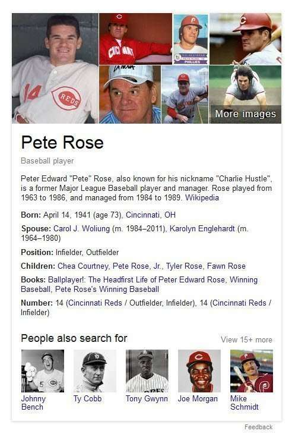

During a civil or criminal legal case, the prosecuting side needs to present evidence to a judge or a jury. Each piece of evidence doesn’t have to prove the innocence or guilt of the party being tried by itself, but the combination of that evidence has to meet a certain standard. For a criminal case, the standard is beyond a reasonable doubt. For a civil case, it’s a standard of more probable than not. So, criminal cases tend to require higher levels of confidence.

When Google collects information from related documents on the Web about an entity, for their knowledge graph, they want that information to be as trustworthy as possible.

If you’ve read anything about Google’s introduction of the knowledge graph, one of the points about it that stands out is that ***there’s a high level of confidence in the information listed***. There is more confidence in the facts that are associated with entities than there might have been in the Knowledge Graph.

There’s more confidence that the entities listed are unique and different from other entities in the knowledge graph.

In [Extracting Facts for Entities from Sources such as Wikipedia Titles and Infoboxes](https://www.seobythesea.com/2014/08/extracting-facts-for-entities-from-sources/), I wrote about patent from Google that discussed how it might take facts about a particular entity from sources such as Wikipedia.

## Site Structure Can Influence Confidence About Fact Sources

The confidence that those facts applied to a specific entity involved analyzing Wikipedia’s structure, its use of page titles that included the entity the page was about, and the use of infobox on that page that contained facts about that entity.

This post is about a patent from Google involving entities and the Semantic Web, and how Google might choose facts from sources that it has a higher level of confidence in, and where it looks for *evidence of that confidence*.

When Google “finds” facts about an object or entity, it usually includes the source of that fact in its index entry for that fact with the unique object it is a fact for. The “Extracting Facts for Entities” patent I wrote about mentioned this patent as a “related” patent. They both share Shubin Zhao as an inventor.

This patent specifically looks for proof of the “subject” of a source document. If I want to collect facts about Pete Rose, the baseball player, to include in a knowledge base entry about Pete Rose, I will likely try to collect those facts from pages about Pete Rose (related documents). Not a page about Joe Morgan, or Tony Perez, or Johnny Bench or other baseball players who might have played with Pete Rose, even though they may contain some information about him.

A page about Pete Rose is likely a good source of trustworthy facts about Pete Rose. If the facts are important facts about Pete Rose, they should be on a page about him. Especially if that page is on the same domain about both Pete Rose and the other players on the team.

So imagine that there are a bunch of pages on an authoritative site about the baseball team, and each player has his page, such as “Pete Rose – Cincinnati Reds – Official Home Page” Or “Joe Morgan – Cincinnati Reds – Official Home Page”.

## The Importance of Related Documents

The fact that these pages are on the same domain, or a sub-domain on the same domain, or share the same IP address means that they are related documents. The process in this patent is looking for pages on related documents. It’s another sign that the pages are related in a meaningful way, increasing their value as evidence, and their confidence.

Those related documents may also use players’ names in anchor text pointed to the pages. So the page for Pete Rose might use “Pete Rose” as anchor text in a link pointing to the page.

Since the web site is one about the Cincinnati Reds, the team Pete Rose played for, the page about Rose includes his name in the title for the page, and links to the page from pages on the same domain link to the page with the words “Pete Rose,” those are good signs that the subject of that page is “Pete Rose.”

In the knowledge base information on facts for the entity Pete Rose, the URL for the page where facts were extracted can be included, and the subject of “Pete Rose” can show that the page was about Rose.

The patent is:

[Determining document subject by using title and anchor text of related documents](http://patft.uspto.gov/netacgi/nph-Parser?Sect1=PTO2&Sect2=HITOFF&p=1&u=%2Fnetahtml%2FPTO%2Fsearch-adv.htm&r=1&f=G&l=50&d=PALL&S1=07590628&OS=PN/07590628&RS=PN/07590628)
Invented by Shubin Zhao
Assigned to Google
US Patent 7,590,628
Granted September 15, 2009
Filed: March 31, 2006

Abstract

> A system and method identify a subject for a source document. The system and method identify a collection of related documents from the same domain as the source document.
>
> For each of the related documents, a collection of linking documents containing a hyperlink to the peer document is identified. For each of the peer documents, a label is generated by choosing the longest-match anchor text of the linking documents.
>
> A pattern between the labels and the titles of the collection of related documents is deduced. The subject of the source document is identified by applying the pattern to the title of the source document.

This patent was filed years before Google came up with the idea of a knowledge graph, but the idea of finding the best source for facts possible was around back then, too.
