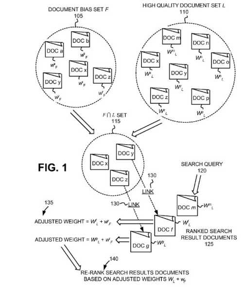

## Personalized Search Results and Bias Document Sets

Most SEOs are aware that search results at Google are sometimes personalized for searchers, but it’s not something that I’ve seen too much written about. So when I came across a patent that is about personalized search results, I wanted to dig in and see if it could give us more insights.

The patent was an updated continuation patent. I love to look at those because it is possible to compare changes to claims from an older version to see if they can provide some details of how processes described in those patents have changed. Sometimes changes are spelled out in great detail. Sometimes, they focus on different concepts in the original version of the patent but weren’t necessarily focused upon so much.

One of the last continuation patents I looked at was one from Navneet Panda, in the post, [Click a Panda: High-Quality Search Results based on Repeat Clicks and Visit Duration](https://gofishdigital.com/high-quality-search-results/) In that one, we saw a shift in focus to involve more user behavior data such as repeat clicks by the same user on a site, and the duration of a visit to a site.

This personalized search results patent is at:

[Personalizing search results](http://patft.uspto.gov/netacgi/nph-Parser?Sect1=PTO1&Sect2=HITOFF&d=PALL&p=1&u=%2Fnetahtml%2FPTO%2Fsrchnum.htm&r=1&f=G&l=50&s1=9,734,211.PN.&OS=PN/9,734,211&RS=PN/9,734,211)
Inventors: Paul Tucker
Assignee: GOOGLE INC.
US Patent: 9,734,211
Granted: August 15, 2017
Filed: February 27, 2015

Abstract

> A system receives a search query from a user and performs a search of a corpus of documents, based on the search query, to form a ranked set of search results. The system re-ranks the set of search results based on the user’s preferences or a group of users and provides the re-ranked search results to the user.

The older version of the personalized search results patent is [Personalizing search results](http://patft.uspto.gov/netacgi/nph-Parser?Sect1=PTO1&Sect2=HITOFF&d=PALL&p=1&u=%2Fnetahtml%2FPTO%2Fsrchnum.htm&r=1&f=G&l=50&s1=8,977,630.PN.&OS=PN/8,977,630&RS=PN/8,977,630), which was filed on September 16, 2013, and was granted on March 10, 2015.

A continuation patent has claims rewritten on it that reflect changes in how a process that has been patented might have changed, using the filing date of the original version of the patent.

I like comparing the claims since that is what usually changes in continuation patents. However, I noticed some significant changes from the older version to this newer personalized search results patent.

There is a lot more emphasis on “high quality” sites and “distrusted sites” in the new version of the patent, which can be seen in the first claim of the patent. Therefore, it’s worth putting the old and the new first claim one after the other and comparing the two.

## The Old First Claim

> 1. A method comprising: identifying, by at least one of one or more server devices, a first set of documents associated with a user, documents, in the first set of documents, being assigned weights that reflect a relative quantification of an interest of the user in the documents in the first set of documents; receiving, by at least one of the one or more server devices, a search query from a client device associated with the user; identifying, by at least one of the one or more server devices and based on the search query, a second set of documents, each document from the second set of documents having a respective score; determining, by at least one of the one or more server devices, that a particular document, from the second set of documents, matches or links to one of the documents in the first set of documents; adjusting, by at least one of the one or more server devices, the respective score of the particular document, to form an adjusted score, based on the weight assigned to the one of the documents in the first set of documents; forming, by at least one of the one or more server devices, a list of documents in which documents from the second set of documents are ranked based on the respective scores, the particular document being ranked in the list based on the adjusted score; and providing, by at least one of the one or more server devices, the list of documents to the client device.

## The New First Claim

This is newly granted this week:

> 1. A method, comprising: determining, by at least one of one or more server devices, preferences of a user or a group of users, wherein the preferences indicate a document bias set and weights assigned to the documents, wherein the weights include distrusted document weights; determining, by the at least one of the one or more server devices, a high quality document set obtained from a document ranking algorithm; creating, by at least one of the one or more server devices, an intersection set of documents which includes documents in both the document bias set and the high quality document set; receiving, by at least one of the one or more server devices, a search query from the user; performing, by at least one of the one or more server devices, a search of a corpus of documents, based on the search query, to form a ranked set of search result documents; determining, by at least one of the one or more server devices, at least one link from the intersection set of documents to at least one document in the ranked set of search result documents, the at least one document not in the intersection set of documents; re-ranking, by at least one of the one or more server devices, the set of search result documents based on the preferences of the user or the group of users, wherein re-ranking the set of search results comprises: identifying a link of the set of links from the intersection set of documents to the document of the set of search result documents, and based on identifying the link, adjusting a rank of the search result document based on the weight assigned to the document in the document bias set from where the identified link originated from; and providing, by at least one of the one or more server devices, the re-ranked search results to the user.

The changes I see in these two different first claims involve what are being called “distrusted document weights” from a “document bias set” and showing pages from “a high-quality document set.” The newer claim makes it more clear that personalized results come from these two different sets of results. It’s possible that it doesn’t change how personalization works, but the increased clarity is good to see.

## The Purpose of these Personalized Search Results Patents

We are told that some sites are favored more than others, and some are disliked more than others, and those are created from a query or browser history to generate a document bias set:

> FIG. 1 illustrates an overview of the re-ranking of search results based on a user’s or group’s document or site preferences. Following this aspect of the invention, a documented bias set F 105 may be generated, indicating the user’s or group’s preferred and/or disfavored documents. Bias set F 105 may be automatically collected from a query or browser history of a user. Bias set F 105 may also be generated by human compilation or editing of an automatically generated set. Bias set F 105 may include a set of documents shared or developed by a group that may further include a community of users of common interest. Document bias set F 105 may include one or more designated documents (e.g., documents a, b, x, y and z) with associated weights (e.g. w.sup.a.sub.F, w.sup.b.sub.F, w.sup.x.sub.F, w.sup.y.sub.F and w.sup.z.sub.F). The weights may be assigned to each document (e.g., documents a, b, x, y, and z) based on a user’s or group’s relative preferences among documents of bias set F 105. For example, bias set F 105 may include a user’s most-respected or most-distrusted document list. The weights being assigned to each document in bias set F 105 are based on a relative quantification of the user’s preference among each of the documents of the set.

This document bias set mention appears in both the older and the newer version of the patent.

The patents also both refer to a high-quality document set, and that is described in a way that seems to place a lot of attention on PageRank or a Hubs and Authority approach to ranking:

> A high-quality document set L 110 may be obtained from any existing document ranking algorithm. Such document ranking algorithms may include a link-based ranking algorithm, such as, for example, Google’s PageRank algorithm or Kleinberg’s Hubs and Authorities ranking algorithm. The document ranking algorithm may provide a global ranking of document quality that may be used for ranking the results of searches performed by search engines. High-quality document set L 110 may be derived from the highest-ranking documents on the web as ranked by an existing document ranking algorithm. For example, in one implementation, set L 110 may include the top percentage of the documents globally ranked by an existing document ranking algorithm (e.g., the highest-ranked 20% of documents). In an implementation using PageRank, set L 110 may include documents having PageRank scores higher than a threshold value (e.g., documents with PageRank scores higher than 10,000,000). Set L 110 may include multiple documents (e.g., documents m, n, o, p, x, y and z) with associated weights (e.g., weights W.sup.m.sub.L, W.sup.n.sub.L, W.sup.o.sub.L, W.sup.p.sub.L, W.sup.x.sub.L, W.sup.y.sub.L and W.sup.Z.sub.L). The weights may be assigned to each document (e.g., documents m, n, o, p, x, y, and z) based on a relative ranking of “quality” between the different documents of set L 110 produced by the document ranking algorithm.

Personalized results served to a searcher are results that come from both the document bias set and the high-quality document set (as the patent says, from an “intersection” between the two sets).

If you are interested in how personalized search results may work at Google, spending some time with this new patent may provide some insights. Knowing about how two different sets of documents are involved in returning results is a good starting point.

Back in 2008, I wrote about another Google Patent that describes [How Google Might Personalize Search Results](https://www.seobythesea.com/2008/11/how-google-might-personalize-search-results-outside-of-personalized-search/)

Last updated August 9, 2019.
