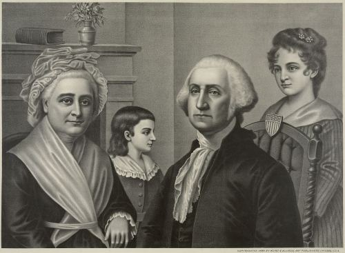

When someone types “George Washington” into a search box, they are probably more interested in the Revolutionary War general and President than some random George in Washington. A search for “Washington Hotels” is more likely looking for lodging in Washington than hotels named Washington. Searches for places with signs that say “Washington Slept Here” are probably not about hotels (and those searchers probably have too much time on their hands).

When words used in search queries can have more than one meaning, a search engine may provide better search results to searchers if the search engines can calculate a probability of the most likely meaning of that word. That’s the focus of a patent granted to Yahoo this past week:

[System for determining probable meanings of inputted words](http://patft.uspto.gov/netacgi/nph-Parser?Sect1=PTO2&Sect2=HITOFF&u=%2Fnetahtml%2FPTO%2Fsearch-adv.htm&r=1&p=1&f=G&l=50&d=PTXT&S1=7,681,147.PN.&OS=pn/7,681,147&RS=PN/7,681,147)
Invented by David Richardson-Bunbury, Soren Riise, Devesh Patel, Eugene H. Stipp, Paul J. Grealish
Assigned to Yahoo!
US Patent 7,681,147
Granted March 16, 2010
Filed December 13, 2005

Abstract

> A system is disclosed for determining probable meanings of words. An input of a word is obtained. Probable meanings of the word may be determined in accordance with a prior probability of probable meanings of the word and a context frequency probability of probable meanings of the word.

Examples in the patent primarily focus upon place names, but the inventors listed in the patent tell us that the processes described could be used for other terms that could be interpreted more than one way. So, a jaguar could be a kind of animal, a car, or a NFL footballer from Jacksonville.

A search engine may attempt to calculate a probability that a search for “jaguar” may be intended to meet one of those meanings. If another term is added, those probabilities may be calculated differently based upon context. A search for “Jacksonville Jaguar” is more likely about someone playing football, while the odds are that a search for “Jaguar carburetor” isn’t.

A web search at Google for Jaguar brings back pictures of cars and cats. Same search at Yahoo shows a couple of images alongside snippets for pages, one of a feline in the wild, and one of a stylized feline in a logo for the automobile.

How might a search engine such as Yahoo (and possibly Bing if they acquire the rights to this patent), use statistical probabilities of meanings of words? The patent’s authors give us the following list on how the best estimate of the meaning of a word might be used in different ways:

- Web pages may be indexed to a search.
- News stories location may be plotted on a map.
- Geographically relevant advertisements may be placed on a web page.
- Enhanced statistics may be calculated for use in query analysis.
- Search result listings may be presented to the user in accordance with the probabilities.
- Ads may focus upon that meaning for pay-for-placement, cost-per-click, pay-per-call and pay-per-act type services.

Instead of attempting to match up queries with pages where those words may be keyword phrases that appear on those pages or in links to those pages, the search engine may rerank search results based upon probabilities that a searcher intended to see something related to one type of search rather than another.

So, someone with the last name “Ind” and the first name “Gary” could possibly have a personal web page that might rank highest on a search for “Gary Ind.” But, the search engine may calculate a higher probability that someone searching for “Gary Ind.” wants to see information about a City named Gary in the State Indiana, than the home page of Gary Ind. Based upon those probabilities, it might rerank search results for “Gary, Ind.” to show pages about the City first.

If you live in the City of Bath in the UK, and you’re in need of a plumber, you may still have problems finding what you’re looking for when you search for “Bath plumber” (Good luck to you). We’re told about the City of Springfield:

> For example if there are thirty different places called “Springfield”, then thirty-one prior probabilities may be generated, one for each place plus one for the possibility that it is not a place at all.

The patent does provide a number of examples as well as some details on how probabilities might be calculated for different words used both alone, and within the context of other words. If you’re interested in how probabilities might be used to rerank search result, you may want to spend some time with this patent.

When someone searches for “Washington,” do they mean the State of Washington, the District of Columbia, a City named Washington, George, or something else completely? Probabilities, in addition to ranking signals based upon things such as relevance and quality and link analysis, may play a role in what pages show up where in search results.
