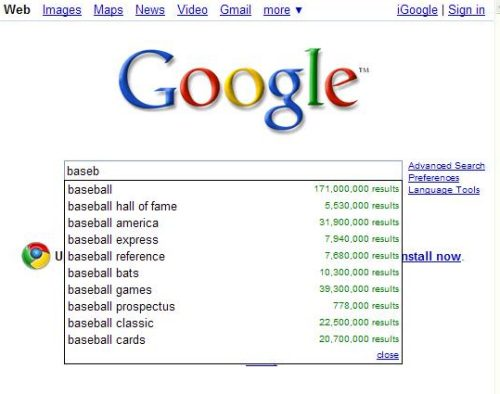
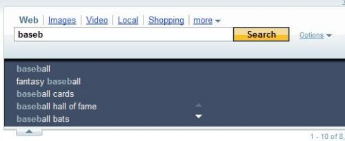
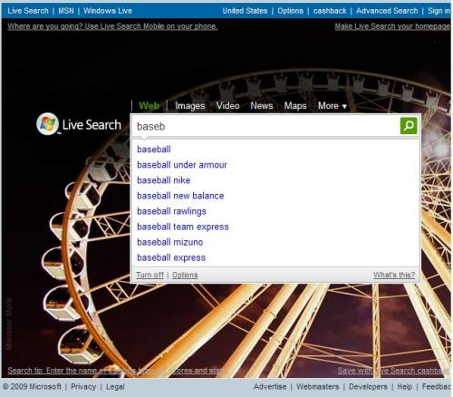
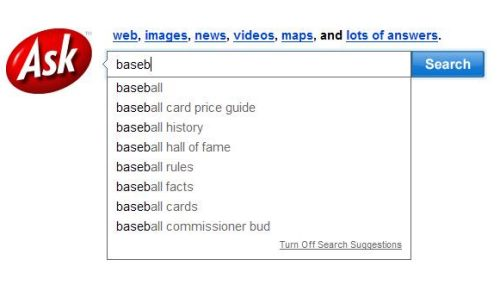
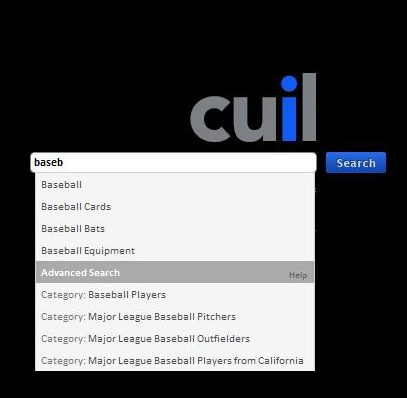

When you start typing a query into a search box at many search engines, you may see a dropdown appear under the search box, which offers selectable suggestions for query terms even before you may have finished typing. These predictive search suggestions may also provide alternative URLs for web pages if you are typing the address of a web page into the search box.

We’ve seen a few patent filings in the past that describe this kind of behavior, but they haven’t gone into a lot of detail about how those specific predictive search suggestions might have been chosen.

A patent application published by Google this week gives us a little more insight into the search suggestions that it offers. Interestingly, the query suggestions that I see might be different than the ones that you may be offered, based upon things such as whether or not either of us:

- Is using a mobile device to connect to the search engine or a desktop computer
- Might be identifiable as a member of a group profile interested in certain topics or categories of sites
- Has a search history that the search engine can use to bias those suggestions towards something we are interested in
- Are viewing a specific page that has a specific profile attached to it and is using a search toolbar for our search
- May be connecting to the Web at different connection speeds, or are using different connection types
- Could have set our browsing preferences differently in our browser or through the search engine for things such as preferred language
- Others

The patent filing also describes filters that might keep certain terms and phrases from showing up in predictive search suggestions—more on those filters below.

**Predictive Search Suggestion Interfaces**

Predictive search suggestions have become pretty popular, and they tend to look pretty similar from one search engine to another. Even though they may look similar, the way each search engine comes up with suggestions may vary drastically. Regardless of that, I thought it would be interesting to look at how many search engines present their suggestions and see if they provided any information about those suggestions on their pages.

***Google:***

Google describes its predictive search query suggestion approach on one of their help pages titled [Features: Google Suggest](https://support.google.com/websearch/answer/106230?hl=en). Before query suggestions were integrated into Google’s Web search, Google had a separate page in their experimental labs called “Google Suggest” where you could receive query suggestions. While that page is no longer available, the [Google Suggest FAQ](https://support.google.com/websearch/answer/106230?hl=en) still exists.

***Yahoo Search Assist***

Yahoo’s predictive search query suggestions have a slightly different look and feel, in a scrollable box that opens below their search box, and they are known as Yahoo Search Assist.

***Microsoft Live Search Suggestions***

Microsoft Live calls their predictive search query suggestions Search Suggestions.

***Ask.com***

While I found a patent application from Ask.com on search suggestions, it mainly described an interface for suggestions without much detail on how those suggestions were derived. It also didn’t look much like the query suggestions offered today on Ask.com. There isn’t much else on the ask.com site about their predictive search query suggestion approach.

***Cuil.com***

On Cuil’s Features page (no longer available) is a subtle dig at Google in their description of their Search query suggestions, where they tell us:

> When you type a query, sometimes you’ll see a search suggestion with an icon representing a website. Click on this link, and you will go directly to that website. We let you look before you leap because not everyone feels lucky.

Presumably, the mention of the word “lucky” refers to Google’s “I’m Feeling Lucky” button on the front page of that search engine, which normally brings you directly to the first result in the search results for a query typed into Google’s search box. Here’s what Cuil’s search suggestions look like:

**Patent Filings for Predictive Search Query Suggestions**

There have been a number of papers and patent filings involving predictve search query suggestions from the major commercial search engines. I’ve written about a few of them in the past. If you’d like to see those posts, they are available here:

- [Can Google Read Your Mind? Processing Predictive Queries](https://www.seobythesea.com/2005/12/can-google-read-your-mind-processing-predictive-queries/)
- [Google Improving Mobile Search](https://www.seobythesea.com/2006/01/google-improving-mobile-search/)
- [Google predicting queries](https://www.seobythesea.com/2006/06/google-predicting-queries/)
- [Yahoo’s Predictive Queries, Invisible Tabs, and Temporal and Monetization Bias Experiments](https://www.seobythesea.com/2007/03/yahoos-predictive-queries-invisible-tabs-and-temporal-and-monetization-bias-experiments/)
- [Predictive Queries versus Unique Searches](https://www.seobythesea.com/2007/06/predictive-queries-versus-unique-searches/)
- [Yahoo’s “Universal Search” and Vertical Search Suggestions](https://www.seobythesea.com/2008/01/yahoos-universal-search-and-vertical-search-suggestions/)

The latest patent filing that I’ve seen on predictive search query suggestions was published this week from Google:

[Method and System for Autocompletion Using Ranked Results](http://appft.uspto.gov/netacgi/nph-Parser?Sect1=PTO2&Sect2=HITOFF&u=%2Fnetahtml%2FPTO%2Fsearch-adv.html&r=1&p=1&f=G&l=50&d=PG01&S1=20090119289.PGNR.&OS=dn/20090119289&RS=DN/20090119289)
Invented by Kevin A. Gibbs, Sepandar D. Kamvar, Taher H. Haveliwala, and Glen M. Jeh
Assigned to Google
US Patent Application 20090119289
Published May 7, 2009
Filed December 29, 2008

Abstract

> A set of ordered predicted completion strings are presented to a user as the user enters text in a text entry box (e.g., a browser or a toolbar). The predicted completion strings can be in the form of URLs or query strings. The ordering may be based on any number of factors (e.g., a query’s frequency of submission from a community of users). URLs can be ranked based on the importance value of the URL. In many ways, privacy is taken into account, such as using a previously submitted query only when more than a certain number of unique requesters have made the query.
>
> The sets of ordered predicted completion strings are obtained by matching a fingerprint value of the user’s entry string to a fingerprint to table map, which contains the set of ordered predicted completion strings.

This differs most from some of the previous patent filings on the topic. The predictive search query suggestions shown for one searcher may differ from the query suggestions shown for other searchers based upon many different possible signals.

While one method of ranking and displaying specific predictive search query suggestions may depend upon how frequently queries shown as suggestions may have been submitted to the search engine in the past, other factors can influence which suggestions are shown to whom. I started this post with a list of some of those signals.

User personalization information may play a role in determining which predictive search query suggestions you might see as you search. The patent filing tells us:

> For instance, user personalization information may include information about subjects, concepts, or categories of information that are of interest to the user. The user personalization information may be provided directly by the user, or maybe inferred with the user’s permission from the user’s prior search or browsing activities, or maybe based at least in part on information about a group associated with the user or to which the user belongs (e.g., as a member, or as an employee).

It’s also possible that the predictive queries shown to a searcher may be influenced by search queries stored locally on your computing device. So, if you’ve searched for a topic before, and your query search history may contain some queries that might part of your search history, those can be offered to you as well as new suggestions which might be taken from the search engine’s cache of previous queries, or a database of queries if the cache doesn’t contain many suggestions.

**FingerPrints and Predictive Search Query Suggestions**

The search queries that may be suggested for your search can be based upon a “fingerprint” associated with that search. Each query (or partial query as you type) can have many different fingerprints associated with it based upon several different factors, such as:

- Profile information provided by the user, including things like location
- Information taken from the request itself, such as language
- Information associated with the user based upon user behavior signals such as previous searches during a search session
- Device-type – a handheld might receive fewer predictive queries due to their smaller screen size
- Connection-speed
- Connection type
- Importance Factors Associated with Query Terms – query terms having lower importance factors could be removed from the predictions before terms having higher importance factors
- Categories Associated with Users – different sets of fingerprint-to-table maps might be used for respective categories of users, where those categories or topics are associated with the user
- Historic Queries Associated with web sites – a partial search query received from a particular website (perhaps through a toolbar search) might be mapped to predicted results generated from historical queries received from the same website or from a group of websites that might be seen to be similar to that particular website
- Misspellings – if a query is typed in could be considered to be a “conspicuously misspelled word,” predictive queries for the correctly spelled word may be merged with the predicted results
- Concepts extraction – the terms in the query might be analyzed to extract concepts from the search terms indicating a particular category of information, such as “technology, “food,” “music,” or “animals.”
- Community Membership – queries from searchers sharing at least one similar characteristic such as: “belonging to the same workgroup, using the same language, having an internet address associated with the same country or geographic region, or; the like.”

**Filters**

Some predictive search query suggestions may not appear in the dropdown box because filters keep them from showing up. Many different types of filters might be involved, such as:

***A Privacy Filter*** – Since the number of queries that the search engine has received is one of the signals looked at to decide whether a term or phrase should show up as a query suggestion, terms that haven’t been searched for by a certain number of “unique submitters” may not be shown to searchers.

***Infrequently Submitted Query Filter*** – eliminates queries which are infrequently submitted and probably not likely to be selected by a user.

***An Appropriateness Filter*** – blocks certain queries based upon factors such as particular keywords in a query and the content of search result pages that correspond to the query.

***A Recency Filter*** – blocks query suggestions that may have been submitted earlier than a particular historical point in time, which might be hours, days, weeks, months, or years. So, if a particular query term was used commonly last year, but not so much this year, it might not be shown.

***An Antispoofing Filter*** – could be used to prevent certain queries or URLs from showing up in predictions if the prediction system sees them in a large number of artificially generated queries or URL submissions.

**Conclusion**

The patent application from Google provides more details and examples of how it might develop different predictive search query suggestions for different searchers. What I thought was important was knowing that the predictive query suggestions that I see when I search might be different from what you see.

Last Updated May 22, 2019
