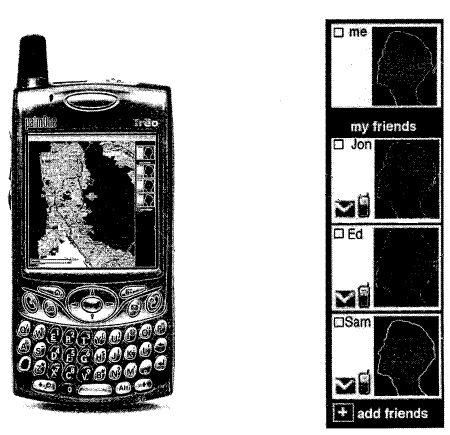

The next time you visit an amusement park with a group of friends, or explore a shopping mall or other large building together or go off on a pub crawl, and you all have mobile phones, Yahoo may have a way for you to keep in touch with each other and find one another if you get separated.

A couple of patent applications from Yahoo describe a way of using maps from a mapping service or creating private maps through photographs of an area, and allowing members of a group to track each other with the use of global positioning satellite informaton or by placing themselves on the private map that they have created. The following screenshot from the patent shows this system being used in the San Francisco Bay area:

Using a private map may be helpful when you are inside of a building or a large complex such as a shopping mall or amusement park where there aren’t any maps available from a mapping service. A private map can be attached to a public map to make it easier to locate each other.

The mapping program would also allow for using SMS communications and alerts, so that the members of the group would know when someone was added to the maps, and when someone changed their locations on the private maps.

[User Defined Private Maps](http://appft1.uspto.gov/netacgi/nph-Parser?Sect1=PTO2&Sect2=HITOFF&u=%2Fnetahtml%2FPTO%2Fsearch-adv.html&r=1&p=1&f=G&l=50&d=PG01&S1=20070204218.PGNR.&OS=dn/20070204218&RS=DN/20070204218)
Inventors: Karon A. Weber, Jonathan Trevor, Edward Ho, and Samantha Tripodi)
US Patent Application 20070204218
Published August 30, 2007
Filed: February 24, 2006

[Method and system for communicating with multiple users via a map over the internet](http://appft1.uspto.gov/netacgi/nph-Parser?Sect1=PTO2&Sect2=HITOFF&u=%2Fnetahtml%2FPTO%2Fsearch-adv.html&r=1&p=1&f=G&l=50&d=PG01&S1=20070200713.PGNR.&OS=dn/20070200713&RS=DN/20070200713)
Inventors: Karon A. Weber, Jonathan Trevor, Edward Ho, and Samantha Tripodi
US Patent Application 20070200713
Published August 30, 2007
Filed: February 24, 2006

Abstract

> A method, device, and system for presenting one or more user-defined private maps with a public map for sharing among a group of users are disclosed. The device includes a processor for executing computer programs, a memory for storing data, an input module for entering user commands, a communication module for transmitting and receiving data, and a display for showing information on a screen.
>
> The device further includes logic for importing a public map representing a publicly available mapping of an area or a location, logic for creating one or more user-defined private maps, logic for linking the one or more user-defined private maps to the public map through a set of corresponding map icons, and logic for displaying the public map and the one or more user-defined private maps.

There would be a number of ways for people to define the community that they would include on their maps, such as assembling the group from an address book, or inviting people to join. An email could be sent to someone with a phone number and either could be used to add them to a group.

Images taken from maps of convention centers, or the “You are here” maps at shopping malls could be used as private maps, to help make a system like this work inside buildings, or when public maps aren’t available. Those images could also be annotated by users to make it easy to understand the layout of the map. An example from the patent filings of private mapping in action:

> Each friend may send an instant message to communicate with other friends in the group. For example, upon arrival, the user (me) 606 may send the message “I’m here (front door”. By doing so, the message brings up the application in her friends’ mobile devices informing them of her arrival and waiting for their responses.
>
> In response, Jon 608 may send the message “Bar by games”. Ed 610 can send the message “playing poker w/sam”, and Sam 612 can send the message “with ed”. In this way, the friends keep each other informed of their whereabouts, and it would be easy to find each other in a large, crowded, and noisy place where cellular phones may not be an effective means for communicating with other members of the group.

This system would also allow the members of the group to tag images, place the images at their locations on the maps, and share them with each other. In the case of landmarks that might be easily found, that could be as helpful as having a map with locations of the group members shown upon it, making a statement like “let’s all meet at the fountain I’ve justed added to the map at 4:00pm,” possible and meaningful.

**Why I find this potentially very helpful…**

One of the highlights of my recent trip to San Jose for the Search Engine Strategies Conference was a visit to Google for their annual Google Dance. Thousands of attendees of the conference, and thousands of Google employees joined together to eat, drink, dance, sing karaoke, talk to Google engineers, and wander around the courtyard of the Googleplex.

The group I arrived with sticked together for most of the party, though we did get separated at times. At one point, I found myself alone, with a message on my phone (which I couldn’t hear ringing because of the music and sounds of thousands of party goers), to meet my group at the Karaoke booth. Unfortunately, there were two Karaoke booths, and I only knew about one of them.

I did reunite with my group, but I had missed out on some Karaoke from people within my group by the time I had. The private maps described in these patents would have made it easier to locate everyone. It would have been kind of fun to use Yahoo private maps to find my friends at a Google party.

There’s no telling whether Yahoo will develop this private maps application, or if they do, when it would be released, but I think that it would be both fun and very useful.
