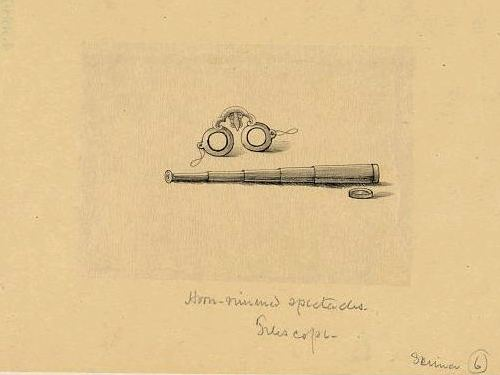
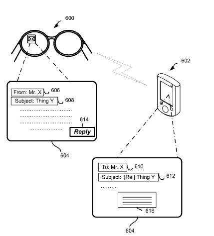
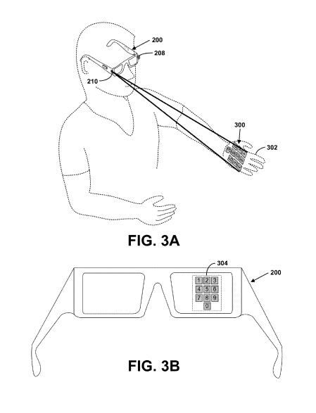
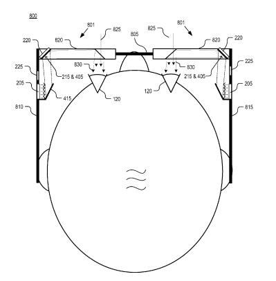
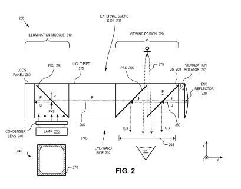
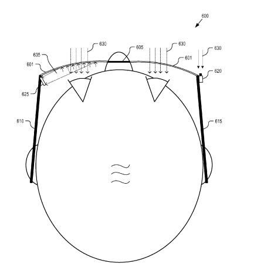

In the first part of this series, [Google Glass Hardware Patents, Part 1](https://www.seobythesea.com/2013/01/google-glass-hardware-patents/), I looked at 5 patent filings from Google published over the past couple of weeks, about Project Glass. Those included (1) a closer look at the optical systems that Google Glass might use, (2) how a bone conducting system might provide audio to wearers, (3) enhancing a person’s vision in real-time to do things like zoom on objects that might be hard to see, (4) using input from other devices such as a phone or laptop to run Google Glasses, and (5) a patent filing about speech input for commands and queries that you can run on your glasses.

One of the things someone joked about in a comment from one of my earlier posts about Project Glass would be running up to someone wearing the device, and triggering a search by voice command on the glasses. The last patent filing I mentioned above told us that the glasses would ignore commands from others. It’s good to see that someone at Google anticipated that potential problem. I’m surprised at how thorough the patent filings about Project Glass have been. I’m also impressed by the volume of patent filings that have been published by Google for these heads-up displays. The Google Glass Foundry workshops for developers started yesterday – I’m guessing that the developers who participated probably had a lot to see and discuss.

I was going to write about issues like privacy and advertising on Google Glass with this post, but I think that’s something that we have some time to think about. There was a post at Mashable late last week that did explore some advertising related topics, titled [How Google Glass Could Change Advertising](https://mashable.com/2013/01/23/google-glass-advertising/#2QmAGUQJ2gqw). The post discusses alerts, coupon offers, connecting with nearby friends, personalization of advertising, and game-ification in Project Glass use.

A post from a more academic Australian website published yesterday asked the question, [Google Glass: augmenting minds or helping us sleepwalk?](https://theconversation.com/google-glass-augmenting-minds-or-helping-us-sleepwalk-11784). What will the impact of a technology that is always on, and puts itself between us and reality to “augment” our lives, our senses, our ability to communicate and interact with others?

Here are some more of the patent filings that Google has filed involving Project Glass. It’s beginning to look like the camera or cameras that Project Glass uses aren’t just on when you want to collect video, but may be an essential part of how the Glasses work. Is that something that we should be concerned about when thinking about privacy?

**Running Applications on a Heads-up Device and Another Device**

It’s not unusual these days for someone to own a desktop computer, a laptop, and a smartphone. Add a tablet computer, and maybe even a wearable computing device like Google Glasses. Being able to share digital content across devices in realtime can be useful, as the image below shows where an email is received on Google Glass and responded to on a smartphone. Viewing a web page on Glasses, and sharing that page with a laptop or desktop when wanting to fill out a form could be useful for people who might want to use a keyboard while doing so.

[Systems and Methods for Accessing an Interaction State Between Multiple Devices](http://appft.uspto.gov/netacgi/nph-Parser?Sect1=PTO1&Sect2=HITOFF&d=PG01&p=1&u=%2Fnetahtml%2FPTO%2Fsrchnum.html&r=1&f=G&l=50&s1=%2220130017789%22.PGNR.&OS=DN/20130017789&RS=DN/20130017789)
Invented by Liang-Yu (Tom) Chi, Sanjay Mavinkurve, Luis Ricardo Prada Gomez
Assigned to Google
US Patent Application 20130017789
Published January 17, 2013
Filed: August 22, 2012

Abstract

> The present application discloses systems and methods for accessing digital content between multiple devices. The systems and methods may be directed to providing access to an interaction with the first application on a head-mounted display (HMD) to a second device. Contextual information relating information of the HMD and information associated with the interaction to describe an interaction state may be stored. A second device may be selected upon which the interaction state may be accessed and a determination of attributes of the second device may be made.
>
> The HMD may transfer to the second device the stored contextual information such that the second device may provide via the second application access to the interaction state. Information associated with user input to the first application may also be transferred. In one example, the contextual information may describe an identified occurrence of digital content accessed via the first application.

**Projector and Camera for a Virtual Input Device**

Imagine being able to project a number keypad or some other input device on your hand, or the wall in front of you, or the floor, and using a camera also attached to your Google Glass to add input to a computing system.

[Methods and Systems for a Virtual Input Device](http://appft.uspto.gov/netacgi/nph-Parser?Sect1=PTO1&Sect2=HITOFF&d=PG01&p=1&u=%2Fnetahtml%2FPTO%2Fsrchnum.html&r=1&f=G&l=50&s1=%2220130016070%22.PGNR.&OS=DN/20130016070&RS=DN/20130016070)
Invented by Thad Eugene Starner, Liang-Yu (Tom) Chi, Luis Ricardo Prada Gomez
Assigned to Google
US Patent Application 20130016070
Published January 17, 2013
Filed: June 26, 2012

Abstract

> The present application discloses systems and methods for a virtual input device. In one example, the virtual input device includes a projector and a camera. The projector projects a pattern onto a surface. The camera captures images that can be interpreted by a processor to determine actions. The projector may be mounted on an arm of a pair of eyeglasses and the camera may be mounted on an opposite arm of the eyeglasses.
>
> A pattern for a virtual input device can be projected onto a “display hand” of a user, and the camera may be able to detect when the user uses an opposite hand to select items of the virtual input device. In another example, the camera may detect when the display hand is moving and interpret display hand movements as inputs to the virtual input device, and/or realign the projection onto the moving display hand.

**Viewing Full Images with a Near-to-Eye Device**

It’s difficult for the human eye to focus upon objects that are very close to it. This invention describes how an image might be presented far enough away from an eye to allowing a viewer to see a whole image.

[Whole Image Scanning Mirror Display System](http://appft.uspto.gov/netacgi/nph-Parser?Sect1=PTO1&Sect2=HITOFF&d=PG01&p=1&u=%2Fnetahtml%2FPTO%2Fsrchnum.html&r=1&f=G&l=50&s1=%2220130016413%22.PGNR.&OS=DN/20130016413&RS=DN/20130016413)
Invented by Ehsan Saeedi, Xiaoyu Miao, and Babak Amirparviz
Assigned to Google
US Patent Application 20130016413
Published January 17, 2013
Filed: July 12, 2011

Abstract

> An optical apparatus includes an image source, a scanning mirror, an actuator, and a scanning controller. The image source outputs an image by simultaneously projecting a two-dimensional array of image pixels representing a whole portion of the image. The scanning mirror is positioned in an optical path of the image to reflect the image.
>
> The actuator is coupled to the scanning mirror to selectively adjust the scanning mirror about at least one axis. The scanning controller is coupled to the actuator to control a position of the scanning mirror about at least one axis. The scanning controller includes logic to continuously and repetitiously adjust the position of the scanning mirror to cause the image to be scanned over an eyebox area that is larger than the whole portion of the image.

**Presenting CGI Light to a Viewer**

The sidebar addition to Google Glass includes a light pipe that holds a Computer Generated Light (CGI) generator, which presents those images in a person’s view in a way that blends with the reality that they see in front of them.

[Eyepiece for Near-to-Eye Display with Multi-Reflectors](http://appft.uspto.gov/netacgi/nph-Parser?Sect1=PTO1&Sect2=HITOFF&d=PG01&p=1&u=%2Fnetahtml%2FPTO%2Fsrchnum.html&r=1&f=G&l=50&s1=%2220130016292%22.PGNR.&OS=DN/20130016292&RS=DN/20130016292)
Invented by Xiaoyu Miao, and Babak Amirparviz
Assigned to Google
US Patent Application 20130016292
Published January 17, 2013
Filed: July 15, 2011

Abstract

> An eyepiece for a head-mounted display includes an illumination module, an end reflector, a viewing region, and a polarization rotator. The illumination module includes an image source for launching a computer-generated image (“CGI”) light along a forward propagating path. The end reflector is disposed at an opposite end of the eyepiece from the illumination module to reflect the CGI along a reverse propagation path.
>
> The viewing region is disposed between the illumination module and the end reflector. The viewing region includes a polarizing beam splitter (“PBS) and a non-polarizing beam splitter (“non-PBS”) disposed between the PBS and the end reflector. The viewing region redirects the CGI light from the reverse propagation path out of an eye-ward side of the eyepiece. The polarization rotator is disposed in the forward and reverse propagation paths of the CGI light between the viewing region and the end reflector.

**Using Head Movements to Scroll and Pick Items/Icons in a Row**

In a smartphone, you might have a choice of applications or programs that you can tap on to choose. Using Google Glass, you might see a row of items that you can choose between. Imagine that you move your head to the left or right to get the row of items to move in one direction or another, as if they were scrolling. A different head movement enables you to select one of the items.

[Methods and Systems for Correlating Head Movement with Items Displayed on a User Interface](http://appft.uspto.gov/netacgi/nph-Parser?Sect1=PTO1&Sect2=HITOFF&d=PG01&p=1&u=%2Fnetahtml%2FPTO%2Fsrchnum.html&r=1&f=G&l=50&s1=%2220130007672%22.PGNR.&OS=DN/20130007672&RS=DN/20130007672)
Invented by Gabriel Taubman
Assigned to Google
US Patent Application 20130007672
Published January 3, 2013
Filed: June 28, 2011

Abstract

> The present description discloses systems and methods for moving and selecting items in a row on a user interface in correlation with a user’s head movements. One embodiment may include measuring an orientation of a user’s head and communicating the measurement to a device.
>
> Next, the device can be configured to execute instructions to correlate the measurement with a shift of a row of items displayed in a user interface and execute instructions to cause the items to move following the correlation. The device may also receive a measurement of an acceleration of the user’s head movement and can be configured to execute instructions to cause the items to move at an acceleration comparable to the measured acceleration.

**Tracking a Person’s Gaze and What They are Viewing**

This invention describes an eye-tracking approach that uses cameras to see what’s in front of someone, and cameras capturing where that person is looking that can combine the information from both sets of cameras to track what they are looking at. The patent tells us that the front-facing camera might do some searches for items in view before we even ask for them to speed up our actual queries when we do ask for them.

Hopefully, if I’m wearing these while watching television late at night, and I fall asleep, they’ll turn off the TV and lights for me, and set the alarm.

[Gaze Tracking System](http://appft.uspto.gov/netacgi/nph-Parser?Sect1=PTO1&Sect2=HITOFF&d=PG01&p=1&u=%2Fnetahtml%2FPTO%2Fsrchnum.html&r=1&f=G&l=50&s1=%2220120290401%22.PGNR.&OS=DN/20120290401&RS=DN/20120290401)
Invented by Hartmut Neven
Assigned to Google
US Patent Application 20120290401
Published November 15, 2012
Filed: May 11, 2011

Abstract

> A gaze tracking technique is implemented with a head-mounted gaze-tracking device that communicates with a server. The server receives scene images from the head-mounted gaze tracking device which captures external scenes viewed by a user wearing the head-mounted device.
>
> The server also receives gaze direction information from the head-mounted gaze tracking device. The gaze direction information indicates wherein the external scenes the user was gazing when viewing the external scenes. An image recognition algorithm is executed on the scene images to identify items within the external scenes viewed by the user. A gazing log tracking the identified items viewed by the user is generated.
