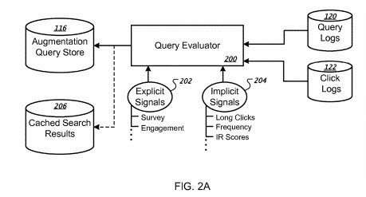

## Quality Scores and Augmentation Queries

This past March, Google was granted a patent that involves giving quality scores to queries (the quote below is from that patent). The patent refers to high-scoring queries as augmentation queries. Interesting to see that searcher selection is one way that might be used to determine the quality scores for queries.

So, when someone searches. Google may compare the SERPs they receive from the original query to augmented query results based on previous searches using the same query terms or synthetic queries.

This evaluation against augmentation queries is based upon which search results have received more clicks in the past. Google may decide to add results from an augmentation query to the query results for improving quality scores and the overall search results.

> In general, the subject matter of this specification relates to identifying or generating augmentation queries, storing the augmentation queries, and identifying stored augmentation queries for use in augmenting user searches. An augmentation query can be a query that performs well in locating desirable documents identified in the search results. In addition, user interactions can determine the performance of an augmentation query. For example, if many users that enter the same query often select one or more of the search results relevant to the query, that query may be designated an augmentation query.
>
> In addition to actual queries submitted by users, augmentation queries can also include synthetic queries that are machine-generated. For example, an augmentation query can be identified by mining a corpus of documents and identifying search terms for which popular documents are relevant. These popular documents can, for example, include documents that are often selected when presented as search results. Yet another way of identifying an augmentation query is mining structured data, e.g., business telephone listings, and identifying queries that include terms of the structured data, e.g., business names.
>
> These augmentation queries can be stored in an augmentation query data store. When a user submits a search query to a search engine, the terms of the submitted query can be evaluated and matched to terms of the stored augmentation queries to select one or more similar augmentation queries. The selected augmentation queries, in turn, can be used by the search engine to augment the search operation, thereby obtaining better search results. For example, search results obtained by a similar augmentation query can be presented to the user along with the search results obtained by the user query.

How does Google find augmentation queries? One place to look for those is in query logs and click logs. As the patent tells us:

> To obtain augmentation queries, the augmentation query subsystem can examine performance data indicative of user interactions to identify queries that perform well in locating desirable search results. For example, augmentation queries can be identified by mining query logs and click logs. Using the query logs, for example, the augmentation query subsystem can identify common user queries. The click logs can be used to identify which user queries perform best, as indicated by the number of clicks associated with each query. The augmentation query subsystem stores the augmentation queries mined from the query logs and/or the click logs in the augmentation query store.

This doesn’t mean that Google uses clicks to determine rankings directly, But it is deciding which augmentation queries might be worth using to provide SERPs that people may be satisfied with.

## How Does Google Determine Quality Scores for Augmentation Queries?

There are other things that Google may look at to decide which augmentation queries to use in a set of search results. The patent points out some other factors that may be helpful. Quality scores for augmentation queries may be made from several other scores.

> In some implementations, a synonym score, an edit distance score, and/or a transformation cost score can be applied to each candidate augmentation query. Similarity scores can also be determined based on the similarity of search results of the candidate augmentation queries to the search query. In other implementations, the synonym scores, edit distance scores, and other types of similarity scores can be applied on a term-by-term basis for terms in search queries that are being compared. These scores can then be used to compute an overall similarity score between two queries. For example, the scores can be averaged; the scores can be added; or the scores can be weighted according to the word structure (nouns weighted more than adjectives, for example) and averaged. The candidate augmentation queries can then be ranked based upon relative similarity scores.

I’ve seen white papers from Google before mentioning synthetic queries, which are performed by the search engine instead of human searchers. So it makes sense for Google to be exploring query spaces in a manner like this, see what results are like, and use information such as structured data as a source of those synthetic queries. I’ve written about synthetic queries before at least a couple of times, and in the post [Does Google Search Google? How Google May Create and Use Synthetic Queries](https://www.seobythesea.com/2013/01/google-synthetic-queries/).

## Implicit Signals of Query Scores and Quality

It is an interesting patent in that it talks about things such as [long clicks](https://moz.com/blog/long-click-and-the-quality-of-search-success) and short clicks, and ranking web pages based on such things. In addition, the patent refers to such things as “implicit Signals of query quality.” More about that in the patent here:

> In some implementations, implicit signals of query quality are used to determine if a query can be used as an augmentation query. An implicit signal is a signal based on user actions in response to the query. For example, implicit signals can include click-through rates (CTR) related to user queries, long click metrics, and/or click-through reversions, as recorded within the click logs. A click-through for a query can occur, for example, when a user of a user device selects or “clicks” on a search result returned by a search engine. The CTR is obtained by dividing the number of users that clicked on a search result by the number of times the query was submitted. For example, if a query is input 100 times and 80 persons click on a search result, then the CTR for that query is 80%.
>
> A long click occurs when a user, after clicking on a search result, dwells on the landing page (i.e., the document to which the search result links) of the search result or clicks on additional links present on the landing page. A long click can be interpreted as a signal that the query identified information that the user deemed interesting, as the user either spent a certain amount of time on the landing page or found additional items of interest on the landing page.
>
> A click-through reversion (also known as a “short click”) occurs when a user, after clicking on a search result and being provided the referenced document, quickly returns to the search results page from the referenced document. A click-through reversion can be interpreted as a signal that the query did not identify information that the user deemed to be interesting, as the user quickly returned to the search results page.
>
> These example implicit signals can be aggregated for each query, such as collecting statistics for multiple instances of using the query in search operations and can further compute an overall performance score. For example, a query with a high CTR, many long clicks, and few click-through reversions would likely have a high-performance score; conversely, a query with a low CTR, few long clicks, and many click-through reversions would likely have a low-performance score.

The reasons for the process behind the patent are explained in the description section of the patent, where we are told:

> Often, users provide queries that cause a search engine to return results that are not of interest to the users or do not fully satisfy the users’ need for information. Search engines may provide such results for several reasons, such as the query including terms having term weights that do not reflect the users’ interest (e.g., in the case when a word in a query that is deemed most important by the users is attributed less weight by the search engine than other words in the query); the queries being a poor expression of the information needed; or the queries including misspelled words or unconventional terminology.

A quality scores signal for a query term can be defined in this way:

> the quality signal being indicative of the performance of the first query in identifying information of interest to users for one or more instances of a first search operation in a search engine; determining whether the quality signal indicates that the first query exceeds a performance threshold, and storing the first query in an augmentation query data store if the quality signal indicates that the first query exceeds the performance threshold.

The patent can be found at:

[Query augmentation](http://patft.uspto.gov/netacgi/nph-Parser?Sect1=PTO1&Sect2=HITOFF&d=PALL&p=1&u=%2Fnetahtml%2FPTO%2Fsrchnum.htm&r=1&f=G&l=50&s1=9,916,366.PN.&OS=PN/9,916,366&RS=PN/9,916,366)
Inventors: Anand Shukla, Mark Pearson, Krishna Bharat and Stefan Buettcher
Assignee: Google LLC
US Patent: 9,916,366
Granted: March 13, 2018
Filed: July 28, 2015

Abstract

> Methods, systems, and apparatus, including computer program products, generate or use augmentation queries. In one aspect, a first query stored in a query log is identified, and a quality signal related to the performance of the first query is compared to a performance threshold. The first query is stored in an augmentation query data store if the quality signal indicates that the first query exceeds a performance threshold.

## References Cited about Augmentation Queries

These were several references cited by the patent applicants, which looked interesting, so I looked them up to see if I could find them to read and share here.

1. Boyan, J. et al., [A Machine Learning Architecture for Optimizing Web Search Engines](https://www.cs.cornell.edu/people/tj/publications/boyan_etal_96a.pdf),” School of Computer Science, Carnegie Mellon University, May 10, 1996, pp. 1-8. cited by applicant.
2. Brin, S. et al., “[The Anatomy of a Large-Scale Hypertextual Web Search Engine](http://infolab.stanford.edu/~backrub/google.html)“, Computer Science Department, 1998. cited by applicant.
3. Sahami, M. et al., T. D. 2006. [A web-based kernel function for measuring the similarity of short text snippets](http://wwwconference.org/www2006/programme/files/pdf/3069.pdf). In Proceedings of the 15th International Conference on World Wide Web (Edinburgh, Scotland, May 23-26, 2006). WWW ’06. ACM Press, New York, NY, pp. 377-386. cited by applicant.
4. Ricardo A. Baeza-Yates et al., [The Intention Behind Web Queries](https://www.semanticscholar.org/paper/The-Intention-Behind-Web-Queries-Baeza-Yates-Calder%C3%B3n-Benavides/e2ea9290a339dcf5a55238b0091665bfaf64e6f0). SPIRE, 2006, pp. 98-109, 2006. cited by applicant.
5. Smith et al. [Leveraging the structure of the Semantic Web to enhance information retrieval for proteomics](https://academic.oup.com/bioinformatics/article/23/22/3073/208467)” vol. 23, Oct. 7, 2007, 7 pages. cited by applicant.
6. Robertson, S.E. Documentation Note on Term Selection for Query Expansion J. of Documentation, 46(4): Dec. 1990, pp. 359-364. cited by applicant.
7. Talel Abdessalem, Bogdan Cautis, and Nora Derouiche. 2010. [ObjectRunner: lightweight, targeted extraction and querying of structured web data](http://www.vldb.org/pvldb/vldb2010/papers/D18.pdf). Proc. VLDB Endow. 3, 1-2 (Sep. 2010). cited by applicant .
8. Jane Yung-jen Hsu and Wen-tau Yih. 1997. [Template-based information mining from HTML documents](https://www.aaai.org/Papers/AAAI/1997/AAAI97-040.pdf). In Proceedings of the fourteenth national conference on artificial intelligence and ninth conference on Innovative application of artificial intelligence (AAAI’97/IAAI’97). AAAI Press, pp. 256-262. cited by applicant .
9. Ganesh, Agarwal, Govind Kabra, and Kevin Chen-Chuan Chang. 2010. [Towards rich query interpretation: walking back and forth for mining query templates](http://www.ambuehler.ethz.ch/CDstore/www2010/www/p1.pdf). In Proceedings of the 19th international conference on World wide web (WWW ’10). ACM, New York, NY USA, 1-10. DOI=10. 1145/1772690. 1772692 http://doi.acm.org/10.1145/1772690.1772692. cited by applicant.

## This is a Second Look at Augmentation Queries

This is a continuation patent, which means that it was granted before, with the same description, and it now has new claims. When that happens, it can be worth looking at the old claims and the new claims to see how they have changed. I like that the new version seems to focus more strongly on structured data. It tells us that it might use structured data in sites that appear for queries as synthetic queries, and if those meet the performance threshold, they may be added to the search results that appear for the original queries. The claims seem to focus a little more on structured data as synthetic queries, but it doesn’t change the claims much. They haven’t changed enough to publish them side by side and compare them.

## What Google Has Said about Structured Data and Rankings

Google spokespeople told us that Structured Data doesn’t impact rankings directly, but what they have been saying does seem to have changed somewhat recently. For example, in the Search Engine Roundtable post, [Google: Structured Data Doesn’t Give You A Ranking Boost But Can Help Rankings](https://www.seroundtable.com/google-structured-data-ranking-factor-25510.html) we are told that just having structured data on a site doesn’t automatically boost the rankings of a page, but if the structured data for a page are used as a synthetic query, and they meet the performance threshold as augmentation queries (achieving certain quality scores) they might be shown in rankings, thus helping in rankings (as this patent tells us.)

Note that this isn’t new, and the continuation patent’s claims don’t appear to have changed that much so that structured data is still being used as synthetic queries and is checked to see if they work as augmented queries. Nevertheless, this does seem to be an excellent reason to make sure you are using the appropriate structured data for your pages.

I’ve written a few posts about patents involving quality scores for organic SEO:

- 6/14/2011 – [Google’s Quality Score Patent: The Birth of Panda?](https://www.seobythesea.com/2011/06/googles-quality-score-patent-the-birth-of-panda/)
- 12/9/2012 = [How Google May Identify Navigational Queries and Resources](https://www.seobythesea.com/2012/12/navigational-queries-resources/)
- 5/15/2013 – [How Google May Rank Web Pages Based on Quality Ratings](https://www.seobythesea.com/2013/05/google-rank-sites-quality-ratings/)
- 5/12/2015 – [How Google May Calculate a Site Quality Score (from Navneet Panda)](https://www.seobythesea.com/2015/05/google-site-quality-scores/)
- 6/22/2015 – [How Google May Classify Sites as Low Quality Sites](https://www.seobythesea.com/2015/06/how-google-may-classify-sites-as-low-quality-sites/)
- 7/30/2018 – [Quality Scores for Queries: Structured Data, Synthetic Queries and Augmentation Queries](https://www.seobythesea.com/2018/07/quality-scores-for-queries/)
- 9/21/2017 – [Using Ngram Phrase Models to Generate Site Quality Scores](https://www.seobythesea.com/2017/09/site-quality-scores/)
- 6/10/2019 – [How Google May Rank Some Results based on Categorical Quality](https://www.seobythesea.com/2019/06/categorical-quality/)

Last Updated June 27, 2019
