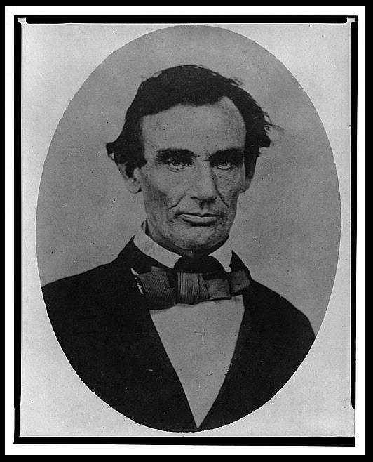

## Query Classification Can Depend on Which Entity is Associated with A Query That A Page is Optimized For

Query Classification can be challenging for a search engine based upon the query itself.

For example, How would you do query classification based on the query “lincoln?”

President Abraham Lincoln

The location, Lincoln, Nebraska

The Lincoln brand of car (shown with old-time Hollywood star Tom Mix).

## Query Classification with User Behavior Data

Search engines usually store information about pages on the Web by visiting many pages. They retrieve information from the pages with a web crawler that follows hyperlinks from those pages.

The web crawler grabs the content of those pages to index the pages. It looks at words from page titles, page headings, page contents, alt text and captions, and file names from images and other content. Google stores that information in an inverted index database for use with queries performed on the search engine.

When choosing a query, the index can find a listing of web pages that best match the query. A result for each page may exist on a search result. We may see a page with a page title linking to the page. It could have a snippet that is a short description of the page’s content. It could also show a URL for the page that sometimes shows the page’s place in a hierarchy of content on the page.

These pages work with the pages having the best mix of popularity, relevance, and authority appearing highest.

***This is a query answering result rather than a question answering result. The search engine tries to identify pages that might help satisfy a searcher’s situational or informational need rather than provide a fact-based answer to a question.***

## Query Classification

There are some reasons to try to classify a query.

A query could potentially have several meanings. Just returning the most relevant page for one of those, or the most authoritative, or the most popular, might not be very satisfying to searchers. If someone searches for Java, they may be hoping to find out more about the programming language rather than the country or the drink. It isn’t an outstanding search engine result if either the drink or the country or both show up before the programming results. How does a search engine increase the quality of its results?

One way is to pay attention to its users’ reactions when they react to a search.

Determining a query classification starts by identifying many search entities associated with a query. It then collects data about how satisfied searchers are with the different search entities, especially those selected in searches.

## Let the Query Classification that You Show Results From Depend on Entity Associations that Searchers Select in Search Results

So our search entities for the [Lincoln] search are Abraham Lincoln, Lincoln Nebraska, and Lincoln cars. There may be other good ones for searching [Lincoln], but they need to meet a certain threshold of an entity associated with a query. They also need to be internally consistent as well. So, if 20 different manufacturing companies have made Lincoln cars over the years, there’s less of a probability that people mean Lincoln cars when they search for [Lincoln].

This approach to performing query classification can mean that most people searching for [Lincoln] choose Abraham Lincoln-related pages and tend to stay on Abraham Lincoln pages longer than other pages. Google will show pages about Abraham Lincoln at the top of search results when people search for [Lincoln]. Google has to decide which is first among the best results for pages about the President, the City, and the Lincoln brand of car. Letting your users decide which to show first is probably a good idea.

The patent is:

[Propagating query classifications](http://patft.uspto.gov/netacgi/nph-Parser?Sect1=PTO2&Sect2=HITOFF&p=1&u=%2Fnetahtml%2FPTO%2Fsearch-adv.htm&r=1&f=G&l=50&d=PALL&S1=08838587&OS=PN/08838587&RS=PN/08838587)
Invented by Henle I. Adams and Hyung-Jin Kim
Assigned to Google
US Patent 8,838,587
Granted September 16, 2014
Filed: April 19, 2010

Abstract

> In general, one aspect described can be embodied in a method for determining a classification for a query. The method can include receiving a request to determine whether to assign a classification to a first query, identifying a plurality of search entities that are associated with the first query-based upon data associated with each of the plurality of search entities and the first query, and determining whether to assign the classification to the first query-based upon classifications for the identified search entities.

## Using ‘Quality of Result Statistics’

As a website owner, the people at Google want to know how well they are doing and improve when they can. One of the best measures might be if they are helping people find what they are looking for. There are several ways to use to try to measure how satisfied searchers might seem to be with the search results. According to the patent, they can include a number of the following:

## Long Clicks and Short Clicks

The quality of result statistics for a document can come from user behavior data associated with the document, such as “click data.”

How long does someone view or “dwell” on a query result document after selecting it from a document results list at a query?

A longer time spent dwelling on a “long click” document can indicate that a user found the document relevant for their query. See the section on long clicks in: [Does Google Use Reachability Scores in Ranking Resources?](https://www.seobythesea.com/2012/11/google-reachability-scores/)

A brief period viewing a document, “short click,” may be interpreted as a document without much relevance.

## Tracking Eye Movements

Another type of user behavior data is tracking users’ eye movements as they view search results. You can see which results appeared to be most interesting, and which people spent the most time reading.

## Purchase Decision Data

Another example of user behavior data is purchase decision data. Such user behavior data can be based on:

- Products searched by consumers
- Products viewed by consumers
- Details about the viewing of products products purchased by consumers

## Query Record Information

Google’s patent introduces the kind of data record-keeping in this patent that we see in the Knowledge Web. It can be kept in a form pulled into many different ways of tracking and using the data:

> Each record (herein referred to as a tuple: < document, query, data>) comprises a query submitted by users, a document reference indicating the document selected by users in response to the query, and aggregation of click data for all users or a subset of all users that selected the document reference in response to the query. </document>

Keep in mind that Google is building their knowledge graph, or knowledge base, about entities that people might search for and how searchers treat those. This information can help the search engine predict which other pages a searcher is most interested in. That would look at probabilities when performing a related query.

## Extensions to this record based approach

The patent also tells us that extensions to this tuple-based approach to user behavior data are possible, such as keeping track of other kinds of data, such as:

## 1. Country-Specific or Language-Specific identifiers

Geographic and linguistic information associated with query classification can build a probability model for future queries. These would include a country-specific tuple showing which country the query came from. It could also look at a language-specific tuple that would tell the language of the user query.

## 2. Low, Medium, or High Favorable user behavior Data

How frequently is a page with a certain query classification selected, and how long do people dwell there?

## 3. Document Classification Data

Each document can have more than one classifier associated with it or have information about associations with other sites or metadata self-indicating a different classification. A site selling ice skates can be a commerce store and as one associated with sports.

## 4. The Greatest Amount of Associated User Behavior Data Associated With The Query

While the process described in this patent attempts to understand how different sites might get treated differently by searchers, knowing how much actual information you have or the number of user interactions you have is helpful.

## Query Classification Take Aways

This patent shows how useful query classification can be. It is especially true when people tend to only use a few words in their searches that may be answerable by a wide range of sites. Google can use this to understand the intent of sites, and they do that by creating queries that use the same words but different classifications as different search entities.

We see Google using a Semantic Web approach in the patent. They use tuples to track searches that may use the same words but evidence different intents by searchers and those searchers’ reactions to the pages that show up in search results.

When someone searches for [pizza] at Google, they most likely want to order some Pizza for a meal. Some people might want to find how to make Pizza and want to see recipes. Some people might be curious about the history of Pizza – did it originate in Italy or the United States? Who invented Pizza?

## Queries that People Select can Predict what People Tend to Search For

Google may have a data store full of information about different query classifications around a search for [pizza]. This can include the pages that people go to and user behavior associated with each page. That data store likely has similar information about a lot of other subjects. It could potentially predict what people tend to search for after they’ve eaten their Pizza, cooked some themselves, or finished reading about the origins of Pizza. (OK, now I’m hungry).

Classifying queries can help Google decide what to show a searcher for an individual search.

Google may collect knowledge about what people tend to select after searching. Interestingly, how they respond to it can determine searcher satisfaction with searches and search results.

Query Log Data is often a source for meaningful substitutions for queries. I wrote about that in [Google Search Synonyms Are Found in Queries](https://www.seobythesea.com/2009/12/how-google-may-expand-searches-using-synonyms-for-words-in-queries/)
