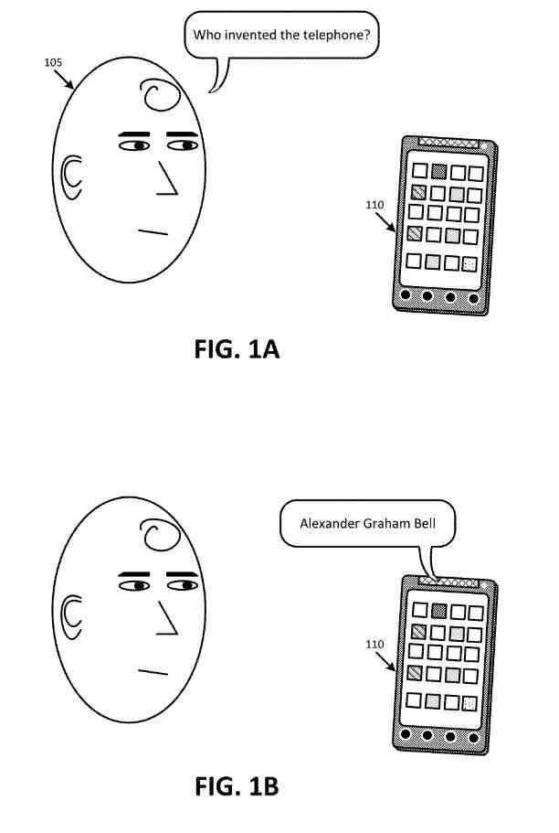
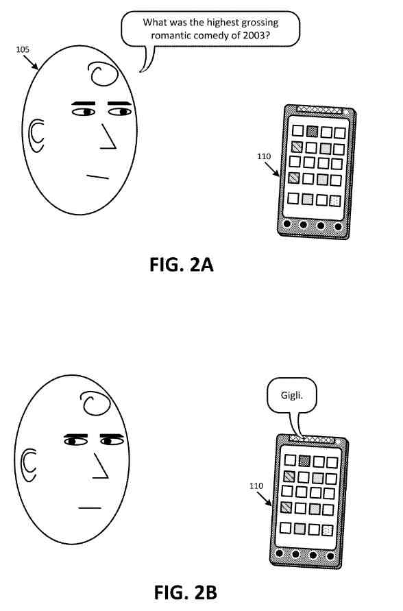
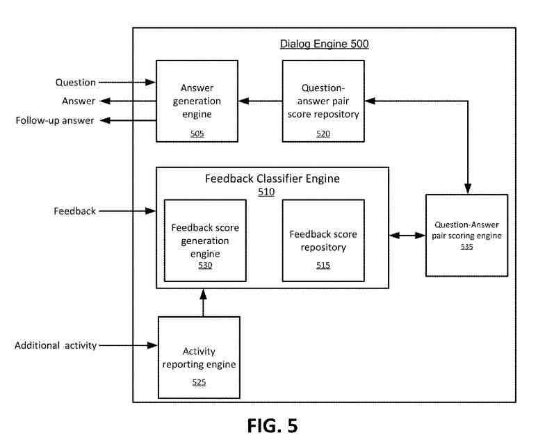

## Question-Answering in Human to Computer Dialog Systems

This patent is about Question-Answering in dialog systems and determining input from a user is feedback to a before-provided answer.

I have been writing about a few patents from Google about human to computer dialog systems, and they are an input approach that Google seems to be moving towards. Here are a couple that I wrote about in the past:

- [Human to Computer Dialog at Google](https://www.seobythesea.com/2022/01/human-to-computer-dialog-at-google/)
- [Completing Human to Computer Dialogs with Automated Assistants](https://www.seobythesea.com/2022/02/completing-human-to-computer-dialogs-with-automated-assistants/)

According to this newly granted patent, input that gets received from a user of a dialog system after a question-answering between the user and the dialog system gets evaluated to determine whether the information is feedback to the answer being provided by the dialog system.

**If the input gets determined as feedback, the dialog system may classify the input as positive or negative feedback to the answer. If the dialog system classifies the input as negative feedback, the dialog system may provide an alternative solution to the question.**

According to another innovative aspect of the subject matter described in this specification, a method includes receiving a voice input.

The method also includes determining that the received voice input get classified as feedback to an answer to a question, identifying a predetermined feedback score associated with the input, and adjusting a confidence score associated with the question and the solution based on the predetermined feedback score.

These can include the following features.

## Choosing A Feedback Score Associated With The Question-Answering Voice Input

For instance, the method includes **determining that the voice input gets classified as feedback to the answer**, then choosing a feedback score associated with the voice input; the process consists of before receiving the voice input representing the feedback to the solution,

- **Receiving**, from the computing device, an more voice input that specifies the question
- **Providing**, to the computing device, the answer to the question
- N**ormalizing** the feedback
- **Identifying** the predetermined feedback score based on the normalized feedback
- **Noting** the predetermined feedback score is lower than a threshold
- **Classifying** the feedback as negative feedback, where the confidence score gets adjusted lower based on categorizing the feedback as negative feedback; the method includes after adjusting the confidence score
- **Identifying** a second answer to the question, where a confidence score associated with the question and the second answer is higher than the adjusted confidence score associated with the question and the answer
- **Providing** the computing device, the second answer
- **Seeing** the predetermined feedback score is higher than a threshold
- **Classifying** the feedback as positive feedback, where the confidence score gets adjusted higher based on categorizing the feedback as positive feedback
- **Receiving**, from a different computing device, a second voice input
- **Choosing** that the second voice input gets classified as feedback to the answer
- **Identifying** a second predetermined feedback score associated with the input from the different computing devices
- **Adjusting** the confidence score associated with the question and the solution based on the input from the computing device and the feedback from the other computing device
- **Determining** that the voice input gets classified as feedback by selecting that a time difference between a time associated with providing the answer and a time related to receiving the voice input is within a predetermined time; Determining that the voice input gets classified as feedback by determining that the voice input get received after providing the answer to the question
- **Deciding** that voice input gets classified as feedback by determining that the voice input is like the question
- **Checking** that the voice input gets classified as feedback by identifying an action associated with the voice input
- **Identifying** the action as calling a telephone number associated with the answer or sending an email to an email address associated with the answer

## Advantages Of this Question-Answering Dialog Approach

Advantages may include the following features:

1. By identifying feedback associated with an answer, a system may gauge a user’s likely attitude toward an answer–e.g., satisfaction, dissatisfaction, or ambivalence.
2. The method may use this to improve its question-answering capability–e.g., it may allow the system to dynamically improve answers provided to questions–thus improving users’ experience.
3. The method may provide a follow-up answer when a user’s feedback indicates dissatisfaction with a solution to enhance a user’s experience.

## The Providing Answers To Voice Queries Using User Feedback Patent

[Providing answers to voice queries using user feedback](https://patft.uspto.gov/netacgi/nph-Parser?Sect1=PTO1&Sect2=HITOFF&d=PALL&p=1&u=%2Fnetahtml%2FPTO%2Fsrchnum.htm&r=1&f=G&l=50&s1=11,289,096.PN.&OS=PN/11,289,096&RS=PN/11,289,096)
Inventors: [Gabriel Taubman](https://www.linkedin.com/in/gabe-taubman-059401b0), [Andrew W. Hogue](https://www.linkedin.com/in/ahogue), and [John J. Lee](https://www.linkedin.com/in/johnjlee0/)
Assignee: Google LLC
US Patent: 11,289,096
Granted: March 29, 2022
Filed: November 15, 2019

Abstract:

> Devices implementing a dialog system may store information that indicates the strength of an answer when provided in response to a particular question. In other words, such devices may keep confidence scores for question-answer pairs. A specific score of confidence may state a relevance of a specific answer to a particular question.
>
> A system and method described herein may enable devices to generate or change question-answer pair scores based on user feedback, such as feedback that a user provides after a user device outputs an answer that responds to the user’s question.
>
> The user device may provide a follow-up answer after a user responds in a characterized way as dissatisfaction with an original solution.

## An Overview Of User Question-Answering Feedback

For example, a user may ask, “Who invented the telephone?” to a user device.

The user device may answer “Alexander Graham Bell.”

The user may provide feedback, such as speaking the word “Thanks.”

Based on this feedback getting characterized as positive feedback, the user device may store information indicating that the answer “Alexander Graham Bell” is an excellent answer to the question “Who invented the telephone?”

## Asking A Question “What Was The Highest Grossing Romantic Comedy Of 2003?” To A User Device

The user device may answer “Gigli.” the user may provide feedback, saying, “That can’t be right.” Based on this feedback getting characterized as negative feedback, the user device may store information indicating that the answer “Gigli” is not a good answer to the question “What was the highest-grossing romantic comedy of 2003?”

This user device may provide a follow-up answer, “How to Lose a Guy in 10 Days’ may be a better answer.”

This follow-up answer may include an alternative solution such as “How to Lose a Guy in 10 Days” in this example–more accurate than the user’s response to his dissatisfaction.

Furthermore, the follow-up question-answering may indicate that the answer is a follow-up to the solution provided. For example, the phrase “may be a better answer.”

## The Environment In Which Question-Answering Methods Are Used

The environment may include a user device and servers, such as a question-answer pair score repository server, a feedback classifier server consisting of a feedback score repository server, and a search engine server referred to as “servers,” connected to a network.

For simplicity, one user device and servers are related to the web. The Environment may include more user devices and servers or fewer user devices and servers in practice. Also, in some instances, a user device may perform a server function, and a server may perform a part of a user device.

The user device may include a client device, such as a mobile telephone, a personal computer, a personal digital assistant (“PDA”), a tablet computer, a laptop, or any other computation or communication device.

The user device may include audio input/output devices that allow users to communicate via speech with the user device. For example, these audio input/output devices may include microphones and speakers. The user device may also include visual input/output devices, such as cameras and screens that can present a user interface via which a user may interact.

Servers may each get implemented as a single server device or a collection of server devices that may be co-located or located. Additionally, servers may get executed within a standard server device or a single, shared pool of server devices.

## The Question-Answer Pair Score Repository Server and Confidence Scores

The question-answer pair score repository server may store information about confidence scores associated with question-answer pairs. As mentioned above, these confidence scores may each state a relevance of a particular answer to a specific question.

This question-answer pair score repository server may adjust a confidence score when a user gets connected to the servers. The question-answer pair score repository server may change a confidence score offline, where a user does not connect to the servers.

In general, the feedback classifier server may classify a user’s input as feedback on a particular answer before getting provided to the user by the servers. In some implementations, the feedback classifier server may include a feedback score repository server that stores information about feedback scores. As further described below, these scores may state how to interpret different types of feedback from users.

## Receiving Search Queries

A search engine server may put in place a search engine that receives search queries, e.g., from the user device. These search queries may get based on questions received by the user device. The search engine server may provide results to the user device in response to received search queries. As further described below, the user device may use the results when providing an answer to a received question.

More servers implementing other functions may also get implemented in Environment. These servers may provide, for example, web content, payment services, shopping services, social networking services, etc.

The Network may include any network, such as a local area network (“LAN”), a vast area network (“WAN”), a telephone network–e.g., the Public Switched Telephone Network (“PSTN”), or a cellular network–an intranet, the Internet, or a combination of networks. User devices and servers may connect to the network via wired and wireless connections.

In other words, the user device and any of the servers may connect to the network via a wired connection, a wireless connection, or a combination of a wired connection and a wireless connection.

## Functional Components Of A Dialog Engine

The dialog engine may correspond to a:

- User device
- Question-answering pair score repository server
- Feedback classifier server
- Feedback score repository server

The dialog engine may include modules. Examples of the functionality of the functional components get described below.

An answer generation engine may receive a data representation of a question. The question may get received as audio information via, for example, audio input devices, such as a microphone, associated with a user device.

Or, the question may include any other type of information, such as text information, image information, etc., received via an interface associated with the user device. The answer generation engine may receive the question, “What was the highest-grossing romantic comedy of 2003?”

Assume, in this example, that the question got provided as audio information. The answer generation engine may convert the audio data associated with the question into text information. In other words, the answer generation engine may perform a speech-to-text process on the audio data related to the question. The answer generation engine may store the text information associated with the question for further processing.

## The Answer Generation Engine

The answer generation engine may generate an answer to the received question. When developing the response, the answer generation engine may provide a search query to a search engine, such as the search engine server. The search query may get based on the question. For example, the search query may include some or all the text information associated with the question. The search query may consist of the entire question, while the search query may consist of only a part of the question.

When including only a part of the question, the answer generation engine may omit certain words from the search query. These may get predetermined as unimportant to the question, such as “stop words,” including “the,” “a,” “is,” “at,” and “on. The answer generation engine may modify the words of the question when generating the search query. For example, the answer generation engine may drop prefixes and suffixes. Continuing with the example above, the answer generation engine of some implementations may generate the search query, “highest-grossing romantic comedy 2003.”

This answer generation engine may receive results responsive to the search query from the search engine server and may generate an answer based on the obtained results. The results may get associated with a respective confidence score based on a variety of factors, such as:

- Relevance of a document associated with the result to the search query
- Quality of a document associated with the result
- Traffic to and from a document associated with the result
- Age of a document associated with the result
- Any other factor associated with the result

For example, the answer generation engine may generate an answer based on the highest-scoring result.

## Information Received From A Question-Answering Pair Score Repository

Besides, or instead of generating an answer based on search results provided by the search engine server, the answer generation engine may develop a solution based on information received from a question-answer pair score repository. As further described below, the question-answer pair score repository may store information that correlates with question-answer pairs–e.g., question-answer pair scores.

The answer generation engine may use this information to identify an answer to the question. The answer generation engine may compare the question to the information stored by the question-answer pair score repository to identify whether the question-answer pair score repository stores information correlating the question to answers. For instance, the answer generation engine may determine whether a question associated with a question-answer pair matches the received query.

This answer generation engine may determine whether a question associated with a question-answer pair is like the received question, at least beyond a particular similarity threshold. The answer generation engine may determine the similarity of the received question to a query associated with a question-answer pair based on indicators of similarity, such as semantic similarity, Hamming distance, edit distance, or any other hand of similarity.

## Ignoring Words, Such As Stop Words

Or, the answer generation engine may ignore words, such as stop words, in the received question and a query associated with a question-answer pair. For example, the answer generation engine may determine that a question-answer couple related to the question, “Which romantic comedy movie made the most money in 2003?”, is similar beyond a similarity threshold to the example received the question, “What was the highest-grossing romantic comedy of 2003?”

The answer generation engine may generate an answer based on the information received from the question-answer pair score repository 520. For instance, the answer generation engine may select a question-answer pair with the highest confidence score from question-answer teams associated with the received question. The generated answer may be based on search results obtained from the search engine server.

The answer generation engine may output the answer via audio information–e.g., through audio output devices, such as a speaker; via visual details–e.g., through optical output devices, such as a display screen; or via any other technique. The answer generation engine may output the answer “Gigli.”

Thus, the answer generation engine may output an answer based on information received from the search engine server, based on information obtained from the question-answer pair score repository, or based on information obtained from both the search engine server and the question-answer pair score repository. Additionally, and as further described below, the answer generation engine may also output follow-up answers based on a characterization of a user’s feedback.

## The Question-Answering Pair Scoring Engine

The question-answer pair scoring engine may receive feedback about the answer generation engine’s answer. For example, the user device may receive the feedback, “That can’t be right.” As described above was about the question, the user device may receive input via any information, such as audio information, text information, image information, etc. When the feedback gets received via audio data, the dialog engine may convert the audio data to text information using a speech-to-text technique.

Based on the received feedback, a feedback classifier engine may determine whether the answer generated engine’s response is a suitable answer for the question received by the answer generation engine. To make this determination, the answer generation engine may receive feedback score information from a feedback score repository, stating a score associated with the feedback. The feedback score described further below may say how to interpret the input. As similarly described above, the feedback score may get associated with the detailed feedback and, like the feedback, beyond at least a similarity threshold.

## The Feedback Classifier Engine Gets Associated With A Question-Answering Pair

The feedback classifier engine may identify that the feedback gets associated with a question-answer pair. For example, the question-answer team may get related to a question that gets asked and an answer that gets provided within a threshold time of the received feedback–e.g., within fifteen seconds, thirty seconds, one minute, etc. of the received feedback.

For instance, assume that the user answer generation engine provides the answer “Gigli” ten seconds before receiving the feedback “That can’t be right.” The feedback classifier engine may determine that the received feedback gets associated with the question-answer pair that includes the question “What was the highest-grossing romantic comedy of 2003?” and the answer “Gigli.”

Or, the feedback classifier engine may determine that the received feedback gets associated with the last question that got asked and the last answer that got provided if there was no other feedback provided. For example, the feedback classifier engine may receive the input “That can’t be right” twenty minutes after answering “Gigli.” Assume, for this example, that the feedback classifier engine has not received other feedback between providing the solution and receiving the input “That can’t be right.”

The feedback classifier engine may determine that the received feedback gets associated with the question-answer pair that includes the question “What was the highest-grossing romantic comedy of 2003?” and the answer “Gigli.”

This determination may be made independent of whether a threshold time exceeded between the question received, the answer received, and the feedback received.

When identifying the question-answer pair, the feedback classifier may omit words and characters associated with the feedback, the question, and the answer. For instance, continuing with the above example, the feedback classifier engine of some implementations may determine that the input “That can’t be right” gets associated with a question-answer pair that includes a modified version of the question, e.g., “highest-grossing romantic comedy 2003,” and the answer “Gigli.”

## A Question-Answering Pair Scoring Engine

A question-answer pair scoring engine may generate a question-answer pair based on a received question and answer. Or, the question-answer pair scoring engine may receive information about question-answer couples from a question-answer pair score repository. It may identify that the received question and answer are associated with data obtained from the question-answer score repository. The information from the question-answer pair score repository may include question-answer pairs and associated question-answer pair scores. These question-answer pair scores may taste the strength of answers to related questions.

The question-answer pair scoring engine may generate or change question-answer pair scores based on the received feedback. For example, the feedback classifier engine may identify that “That can’t be right” gets associated with a feedback score that reflects that the input “That can’t be right” is negative feedback, such as a score of 0.0 on a scale of 0.0-1.0.

## The Feedback Classifier Engine

Additionally, the feedback classifier engine may identify the question-answer pair score for the question “What was the highest-grossing romantic comedy of 2003?” The answer “Gigli” is 0.1 on a scale of 0.0-1.0. In other words, the answer “Gigli” may be considered not a solid answer to the question “What was the highest-grossing romantic comedy of 2003?”

Based on identifying the feedback score, the feedback classifier engine may communicate with the question-answer pair scoring engine to adjust the question-answer pair score. For example, the question-answer pair scoring engine may increase or decrease the question-answer pair score based on the feedback classified by the feedback classifier engine.

Assume, for example, that a question-answer pair for the question “What was the highest-grossing romantic comedy of 2003?” and the answer “Gigli” is not from the question-answer pair score repository. The question-answer pair scoring engine may generate a question-answer pair for the question “What was the highest-grossing romantic comedy of 2003?” and the answer “Gigli.”

## The Question-Answering Pair Scoring Engine

In such an example, the question-answer pair scoring engine may generate a question-answer pair score for the question-answer pair. The question-answer pair score may be a default in the middle of possible scores. For example, assume that the range of possible question-answer scores is 0.0-1.0. In this example, the question-answer pair scoring engine may assign a question-answer pair score of 0.5 to the question-answer pair. The default question-answer pair score may be a score that is not in the middle of possible scores. For example, the default score maybe 0.0, 0.1, 0.4, 0.6, 0.8, 0.9, or any other score within possible scores.

When adjusting the question-answer pair score, the question-answer pair scoring engine may use any mathematical operation that involves the feedback score and other feedback scores associated with the question-answer pair scores and identified by the feedback classifier engine–e.g., other feedback scores that get based on feedback provided by users of different user devices.

For example, the question-answer pair scoring engine may average the feedback score with other feedback scores associated with the question-answer pair score, may add a value based on the feedback score to the question-answer pair score, may multiply the question-answer pair score by a value that gets based on the feedback score, or may perform any other operation that gets based on the feedback score and the question-answer pair score.

The question-answer pair scoring engine may provide the generated or modified question-answer pair score to the question-answer pair score repository. The question-answer pair score repository 520 may update information stored by the question-answer pair score repository based on the generated or modified question-answer pair score. For example, the question-answer pair scoring repository may replace an accumulated question-answer pair score for the question “What was the highest-grossing romantic comedy of 2003?” and the answer “Gigli” with the modified question-answer pair score received from the question-answer pair scoring engine.

## The Feedback Score Repository

The feedback score repository may store information about various feedback, such as feedback scores. The feedback score repository may be a part of the feedback classifier engine. In some other implementations, the feedback repository may get separated from the fOr; some or all the information stored by the feedback score repository may accumulate by the user device—an example table of information stored by the feedback score repository.

As also mentioned above, the question-answer pair score repository may store information about various question-answer pairs, such as question-answer pair scores. The question-answer pair score repository may be implemented as devices, such as the question-answer pair score server, separate from a user device. Additionally, some or all of the information stored by the question-answer pair score repository may be held by a user device—an example table of knowledge accumulated by the question-answer pair score repository.

An activity reporting engine may receive more activity related to the answer or the feedback. The activity reporting engine may identify the additional training from the answer generation engine to the feedback classifier engine. For example, a user may start searching, call a telephone number, send an e-mail, or perform other activities after the answer generation engine responds. The feedback classifier engine may determine that the action is feedback to the answer based on the relationship between the response and the action. As another example, a user may perform a follow-up activity after the feedback classifier engine receives feedback.

A feedback score generation engine may analyze the feedback and the more activity besides the question and the answer to generate or change a feedback score associated with the input. For example, if a user repeats a question–e.g., the same question and a similar question–either after providing information or as a part of the feedback, the feedback score generation engine 530 may identify that the provided feedback gets associated with a poor answer. Accordingly, the feedback score generation engine may reduce a feedback score associated with the input and generate a score indicating the feedback is associated with a poor answer.

## Providing A Follow-up Question

Assume, as another example, that a user provides a follow-up question that gets associated with a topic of an answer provided by the answer generation engine. In this example, the feedback classifier engine may identify that the provided feedback gets associated with a firm response. Accordingly, the feedback score generation engine may increase a feedback score associated with the input and generate a score indicating the feedback is associated with a firm answer.

Other examples of more activity by a user that may state that feedback from the user gets associated with a definite answer may include the user initiating a search that gets unrelated to the question, the user calling a phone number associated with the answer, the user sending an email to an email address associated with the answer, etc. The feedback score generation engine 530 may provide the generated or modified feedback scores to the feedback score repository.

## Providing A Follow-Up Answer

As mentioned above, the answer generation engine may provide a follow-up answer when a user expresses dissatisfaction with a solution, such as when a feedback score based on feedback received by the feedback classifier engine and based on more activity received by the activity reporting engine, is below a threshold feedback score. The answer generation engine may provide the follow-up answer “How to Lose a Guy in 10 Days,” based on the feedback, “That can’t be right,” received by the feedback classifier engine. The answer generation engine may select the follow-up answer from a set of candidate answers identified in response to the question.

For example, the answer generation engine may select, for the follow-up answer, a question-answering pair with a second-highest score out of question-answer teams associated with the received question–in a scenario where the user-provided negative feedback in response to an answer based on the question-answer team with the highest score. The follow-up answer may also be found on search results from a search engine such as the search engine server.

## The Answer Generation Engine

The answer generation engine may provide a follow-up answer based on the feedback from the feedback classifier engine. The answer generation engine may provide a follow-up solution based on extra activity obtained by the feedback score generation engine may suggest to the feedback received by the feedback classifier engine to generate or change a feedback score associated with the input received by the feedback classifier engine.

Some implementations may use different scores, and ranges of scores, to similar concepts as described above. For example, while one example score range is 0.0-1.0, other possible scores, such as 0-100, 1-10, 2-7, -100 through -1, or any other different range. Additionally, where some implementations use scores at a high end of a score range, e.g., indicating the strength of an answer to a question, other implementations may use scores at a low end of a score range. For example, in one such implementation, feedback of “that’s right” may get associated with a feedback score of -100, -0.1, 0.0, 0.1, etc., while feedback of “that’s wrong” may get associated with a feedback score of 0.9, 1.0, 9, 10, 90, 100, etc.

The dialog engine may include fewer, different, or more functional components. Active components of the dialog engine may perform the tasks performed by other available members of the dialog engine.

Furthermore, servers may perform the tasks performed by functional components of the dialog engine. For example, the question-answer pair score repository server may perform the functions of the question-answer pair score repository, and the feedback score repository server may perform the feedback score repository. Information that a user device provides to and receives from the question-answer pair score repository and the feedback score repository may get delivered to and received from the question-answer pair score repository server and the feedback score repository server.

## The Question-Answering Pair Score Repository

The question-answer pair score repository server may perform the functions of the question-answer pair score repository instead of question-answering pair score repositor. The feedback score repository server may perform the functions of the feedback score generation engine instead of the question-answer pair score repository performing such operations. In some such implementations, information that a user device would provide to and receive from the question-answer pair score repository and the feedback score repository maybe instead offered to and received from the question-answer pair score repository server and the feedback score repository server,

The feedback classifier engine may receive more activity information from user activity logs beside or, instead of, receiving more activity information from the activity reporting engine. For example, a user activity repository server may store user activity logs associated with many users, including more activity information, question-answer activity, and feedback activity. The activity reporting engine may receive user activity information from such a user activity log repository server.

An example data structure may get stored by a feedback score repository, such as a feedback score repository server and devices that install the feedback score repository. The data structure may associate feedback, such as feedback received by the feedback classifier engine or predetermined feedback types, which may get associated with a respective feedback score. Assume that the feedback scores get associated with a range of 0.0-1.0, with 0.0 getting associated with feedback that indicates that an answer is a poor answer, and with 1.0 getting associated with feedback that suggests that an answer is a firm answer.

## Feedback “Awesome Thanks” And The Feedback “Great Answer” May Get Associated With A Feedback Score Of 1.0

The feedback “Maybe” and the input “I guess” may get associated with a feedback score of 0.5, the input “That may not be right” may get associated with a feedback score of 0.2, and the feedback “That’s wrong” and the feedback “Wrong answer” may get associated with a feedback score of 0.0.

As discussed above, other score ranges are possible in practice. As further discussed above, a higher score may get associated with feedback that indicates that an answer is a poorer answer. In comparison, a lower score may get related to feedback that suggests that an answer is a more substantial answer.

## A Data Structure That May Get Stored By A Question-Answering Score Repository

Such as the question-answer pair score repository server and devices that put in place the question-answer pair score repository 520. The data structure may associate question-answer pairs with a question-answer pair score. Assume that the question-answer pair scores are associated with a range of 0.0-1.0, with 0.0 being associated with the poorest answer and with 1.0 being associated with the most decisive answer.

Each row may get associated with a particular question-answering pair. For example, the row may get associated with the question-answering team that includes the question “Who invented the telephone?” and “Alexander Graham Bell,” and an associated question-answer pair score of 0.9.

The row may be associated with the question-answer pair that includes the question “Who invented the telephone?” The answer related to the question-answering pair in a Row may be a different answer than that associated with the question-answering pair in a row. The answer associated with the question-answer pair of Row is “Marty McFly.”

The associated question-answer pair score may be 0.1, which may indicate that “Marty McFly” is a poor answer to the question “Who invented the telephone.”

The data structure may store many question-answer pairs that get data structure may store a single question-answer pair for a single question such as the question-answer pair of row includes a question that is not associated with any other question-answer pairs stored by the data structure. Or, data may store many question-answer teams that have similar questions, such as the question-answer pair of row includes the question “What is the best Canadian band?”, while the question-answer pair of row includes the question “Who is the best band from Canada?”

Respectively, as tables with rows and columns, in practice, data structures may include any type of data structure, such as a linked list, a tree, a hash table, a database, or any other type of data structure. Data structures may include information generated by a user device, or by functional components. Additionally, or alternatively, data structures may include information provided from any other source, such as information provided by users, and information automatically provided by other devices.

Data structures may omit punctuation. Alternatively, data structures may include punctuation, such as question marks associated with questions, periods, commas, apostrophes, hyphens, and any other type of punctuation.

## Generating Or Modifying A Score For A Question-Answering Pair Based On User Feedback

The processes will get described as getting performed by a computer system comprising computers, for example, the user device, of the servers, and the dialog engine. However, for the sake of simplicity, processes get described below as getting performed by the user device.

This process may include receiving a question. Receiving a question may include receiving, by a dialog engine, a first input that specifies a question, where the first input may be voice input. For example, as described above with respect to the answer generation engine, the user device may receive a question, such as an audible question spoken by a user. The user device may receive the question “Who invented the telephone?”

And the process may further include generating an answer that is responsive to the question. For example, as described above with respect to the answer generation engine, the user device may receive or generate an answer to the question. For instance, as described above, the user device may use information stored in the question-answer pair score repository server and information received from the search engine server when generating an answer.

## Outputting the Answer

The Process may also include outputting the answer. In some implementations, outputting the answer may include providing, by the dialog engine, an answer to the question. For example, as described above with respect to the answer generation engine, the user device may output the answer, via an audio output device, a visual output device, or any other technique of outputting information. The user device may output the answer “Alexander Graham Bell.”

This process may additionally include receiving feedback. For example, as described above with respect to the question-answer pair scoring engine, the user device may receive feedback, such as audible feedback spoken by the user. The user device may receive the feedback “Thanks.”

## Receiving Feedback By Receiving A Voice Input

Receiving feedback may include receiving, by the dialog engine, a voice input, where the voice input may get spoken input, and determining, by the dialog engine, that the voice input gets classified as feedback to the answer. For example, determining that the voice input gets classified as feedback may include determining that a time difference between a time associated with providing the answer and a time associated with receiving the voice input is within a predetermined time. As another example, determining that the voice input gets classified as feedback may include determining that the voice input gets received after providing the answer to the question.

As another example, determining that the voice input gets classified as feedback may include determining that the voice input is semantically similar to the question. As another example, determining that the voice input gets classified as feedback may include identifying an action associated with the voice input, where the action may be calling a telephone number associated with the answer or sending an email to an email address associated with the answer.

## Identifying A Feedback Score For The Received Feedback

This process may further include identifying a feedback score for the received feedback. Identifying a feedback score for the received feedback may include determining a feedback score associated with the voice input after determining, by the dialog engine, that the voice input gets classified as feedback to the answer. Identifying a feedback score may include identifying, by the system, a predetermined feedback score associated with the feedback. Identifying a predetermined feedback score associated with the feedback may include normalizing the feedback, and identifying the predetermined feedback score based on the normalized feedback. For example, as described above with respect to the feedback classification engine, the user device may receive or generate a feedback score for the feedback received.

Assume, for instance, that the user device identifies a feedback score of 1.0 for the feedback “Awesome thanks.” The user device may determine that the feedback “Awesome thanks” is similar to the feedback “Thanks,” and may thus associate the feedback score of 1.0 with the feedback “Thanks.”

## Generating Or Modifying A Question-Answering Pair Score

The process may also include generating or modifying a question-answer pair score based on the feedback score. For example, as described above with respect to the question-answer pair scoring engine, the user device may generate or modify a question-answer pair score based on the feedback score received at the block. Continuing with the above example, the user device may identify a previous question-answer pair score of 0.9 for a question-answer pair that includes the question “Who invented the telephone?” and the answer “Alexander Graham Bell.” For instance, the question-answer pair scoring engine of the user device may receive the previous question-answer pair score of 0.9 from the question-answer pair score repository server.

The user device may modify the previous question-answer pair score of 0.9 based on the predetermined feedback score of 1.0, associated with the feedback “Thanks.” In some implementations, the system may determine the predetermined feedback score is higher than a threshold, and classify the feedback as positive feedback, where the confidence score may get adjusted higher based on classifying the feedback as positive feedback. For example, the user device may increase the previous question-answer pair score based on the feedback score.

As mentioned above with respect to the question-answer pair scoring engine, the user device may adjust a question-answer pair score, at block 830, using of a variety of techniques. In some implementations, generating or modifying a question-answer pair score may include adjusting a confidence score associated with the question and the answer based on the predetermined feedback score. One additional technique gets described.

The process may additionally include associating the generated or modified question-answer pair score with a corresponding question-answer pair. For example, as described above with respect to the question-answer pair scoring engine, the user device may store, e.g., in the question-answer pair score repository, and output, e.g., to the question-answer pair score repository server, the question-answer pair score generated or modified.

These question-answer pair scores may get used for any number of reasons. For example, these question-answer pair scores may get used when providing answers to additional questions. In some implementations, the system may determine the predetermined feedback score is lower than a threshold and may classify the feedback as negative feedback, whereas the confidence score may get adjusted lower based on classifying the feedback as negative feedback.

## Adjusting The Confidence Score Associated With The Answer

After adjusting the confidence score associated with the answer, the system may identify a second answer to the question, wherein the second answer has a higher confidence score than the adjusted confidence score associated with the answer and may provide, to the user device, the second answer. Additionally, or alternatively, attributes associated with questions, answers, question-answer pairs, and question-answer pair scores may get used to training models, such as search engine and document ranking models.

## Multiple Feedback Score Thresholds In Order To Determine Whether To Adjust A Question-Answering Pair Score

Some such implementations may allow the user device to adjust a question-answer pair score only when confidence is high that particular feedback is positive or negative.

The process may include determining whether a feedback score, such as the feedback score generated at block, is greater than the first threshold. For example, the user device may determine whether a feedback score, received at block, is greater than a first threshold score. Assume, for example, that the feedback score is 1.0, and that the first threshold score is 0.8. In such a scenario, the user device may determine that the feedback score is above the first threshold score.

If the feedback score is greater than the first threshold score, then the process may include increasing a question-answer pair score based on the feedback score. In some implementation, a question-answer pair score may be a confidence score associated with the answer, and increasing the question-answer pair score may include classifying the feedback as positive feedback, where the confidence score gets adjusted higher based on classifying the feedback as positive feedback.

For example, as discussed above with respect to the question-answer pair scoring engine, the user device may increase a question-answer pair score for a question-answer pair that includes a question received and an answer provided based on the feedback score received. Assume, for instance, that the question-answer pair score for a question-answer pair is 0.7. Based on determining that a feedback score associated with the question-answer pair is greater than the first threshold score, the user device may increase the score to, for example, 0.75, 0.8, or some other value.

If, on the other hand, the feedback score is not greater than the first threshold score, then the process may include determining whether the feedback score is less than a second threshold score . In some implementations, the second threshold score is less than the first threshold score. In one such implementation, the first and second threshold scores may get separated by some amount. For example, assume that the first threshold score is 0.8. In this example, the low threshold score maybe 0.2, 0.1, or some other value that is less than 0.8.

If the feedback score is less than the second threshold score, then the process may include decreasing a question-answer pair score based on the feedback score. In some implementations, a question-answer pair score may be a confidence score associated with the answer, and decreasing a question-answer pair score may include classifying the feedback as negative feedback, where the confidence score gets adjusted lower based on classifying the feedback as negative feedback.

For example, as discussed above with respect to the question-answer pair scoring engine, the user device may decrease a question-answer pair score for a question-answer pair that includes a question received at block and an answer provided at block based on the feedback score received at the block.

If, on the other hand, the feedback score is not less than the second threshold score and is not greater than the first threshold score, then the process may include foregoing modifying a question-answer pair score based on the feedback score. Alternatively, in such a scenario, the user device may modify a question-answer pair score, but the modification may be less extreme than a modification that would get made if the feedback score were greater than the first threshold score or less than the second threshold score.

In other words, the user device may assign a weight to the feedback score when the feedback score is between the first threshold score and the second threshold score. This weight may be lower than a weight assigned to the feedback score when the feedback score is greater than the first threshold score or less than the second threshold score.

## Generating Or Modifying A Question-Answering Pair Score Based On Feedback From One User

While processes get described above in the example context of generating or modifying a question-answer pair score based on feedback from one user, it should get understood that a question-answer pair score may get generated or modified based on feedback received from multiple users, e.g., multiple users of multiple user devices. In some implementations, the system may receive, from a different user device, a second voice input to the provided answer. The system may determine that the second voice input gets classified as feedback to the answer.

The system may identify a second predetermined feedback score associated with the feedback from the different computing devices. The system may then adjust the confidence score associated with the answer based on the feedback from the user device and the feedback from the different user devices. In some implementations, a question-answer pair score may not get generated or modified until at least a threshold amount of feedback gets received. For example, assume that the threshold amount of feedback is feedback from ten users and that feedback gets received from nine users.

Once the tenth feedback gets received, a question-answer pair score may be generated or modified. The question-answer pair score may get generated or modified based on all ten of the received feedback. The question-answer pair score may get generated or modified based on fewer than ten of the received feedback.

## What Happens When Negative Feedback Gets Received

Negative feedback gets received. For example, assume that the threshold amount of positive feedback is positive feedback from five users. Further, assume that positive feedback gets received from four users. Once the fifth positive feedback gets received, a question-answer pair score may get generated or modified. In some implementations, the positive feedback threshold may be the same as the negative feedback threshold.

For instance, assuming the positive feedback threshold is positive feedback from five users, the negative feedback threshold may be negative feedback from five users. In an alternative implementation, the positive feedback threshold may be different from the negative feedback threshold. For instance, assuming the positive feedback threshold is positive feedback from five users, the negative feedback threshold may be negative feedback from ten users.

Additionally, or alternatively, the positive feedback threshold and the negative feedback threshold may get based on the amount by which the feedback affects a question-answer pair score. For example, assume that the positive feedback threshold is 0.1. In this example, a question-answer pair score may get modified based on a set of feedback if the result of modifying the question-answer pair score is an increase of 0.1 or greater, but not if the result of modifying the question-answer pair score is an increase of 0.1 or greater. Assume, as another example, that the negative feedback threshold is 0.1.

## When The Question-Answering Pair Score Is A Decrease

In this example, a question-answer pair score may get modified based on a set of feedback if the result of modifying the question-answer pair score is a decrease of 0.1 or greater, but not if the result of modifying the question-answer pair score is a decrease of 0.1 or greater. Some implementations may include both a positive feedback threshold and a negative feedback threshold. In such implementations, a question-answer pair score may get modified if the result is an increase of the question-answer pair score by at least the positive feedback threshold, or a decrease of the question-answer pair score by at least the negative feedback threshold.

The positive feedback threshold may be the same as the negative feedback threshold. For instance, assuming the positive feedback threshold is 0.1, the negative feedback threshold maybe 0.1. In an alternative implementation, the positive feedback threshold may be different from the negative feedback threshold. For instance, assuming the positive feedback threshold is 0.1, the negative feedback threshold maybe 0.2.

## Positive And Negative Feedback

Positive and negative feedback may affect a question-answer pair score by the same magnitude but may have opposite values. Positive feedback may cause a question-answer pair score to get increased by 0.01, while negative feedback may cause the question-answer pair score to be decreased by 0.01. In other words, in such an example, positive feedback may get assigned a value of +0.01, while negative feedback may be assigned a value of -0.01.

The pPositive and negative feedback may affect a question-answer pair score by a different magnitude. For example, in some such implementations, positive feedback may cause a question-answer pair score to get increased by 0.01, while negative feedback may cause the question-answer pair score to get decreased by 0.02. In other words, in such an example, positive feedback may get assigned a value of +0.01, while negative feedback may get assigned a value of -0.02.

Although examples of scores got discussed above, some implementations may use different scores, and ranges of scores, to implement similar concepts as described above. For example, while one example score range is 0.0-1.0, other score ranges are possible, such as 0-100, 1-10, 2-7, -100 through -1, or any other score range.

Additionally, Use scores at a high end of a score range, e.g., as an indication of the strength of an answer to a question, other implementations may use scores at a low end of a score range. For example, in one such implementation, feedback of “that’s right” may get associated with a feedback score of -100, -0.1, 0.0, 0.1, etc., while feedback of “that’s wrong” may get associated with a feedback score of 0.9, 1.0, 9, 10, 90, 100, etc.

## Generating Or Modifying A Score For User Feedback

The process may get performed by a computer system comprising computers, for example, the user device, the servers, and the dialog engine. In some implementations, the process may get performed by other components instead of, or possibly in conjunction with, the user device, and the dialog engine. However, for the sake of simplicity, the process gets described below as getting performed by the user device.

This process may include outputting an answer. For example, as discussed above with respect to the answer generation engine, the user device may output an answer to a question. The process may also include receiving feedback. For example, as discussed above with respect to the question-answer pair scoring engine, the user device may receive feedback in response to the answer. Receiving feedback may include receiving voice input, and determining that the voice input gets classified as feedback to the answer.

## Detecting Additional Activity

And the process may further include detecting additional activity. Detecting additional activity may include identifying an action associated with the voice input. For example, as discussed above with respect to the activity reporting engine, the user device may detect additional activity associated with the feedback and the answer output. In some implementations, the user device may detect that the additional activity gets received after the feedback gets received.

The process may additionally include generating or modifying a feedback score, associated with the feedback, based on the additional activity. In some implementations, generating or modifying a feedback score may include determining that the voice input gets classified as feedback to the answer, then determining a feedback score associated with the voice input.

For example, as discussed above with respect to the feedback score generation engine, the user device may generate or modify a feedback score based on the additional activity detected. Process may further include storing the generated or modified feedback score. For example, as described above with respect to the feedback score generation engine and the feedback score repository, user device may store the feedback score generated or modified at the block.

## Generating or Modifying A Score For User Feedback

A user may ask a question to a user’s device. For example, the user may ask the question “What sport did Michael Jordan play?” The user device may output an answer, such as “Basketball.” , the user may provide feedback, such as “Neat.” The user device may detect additional activity from the user, such as the user asking the question “What are the rules of basketball?”

The user device may store an indication that the user speaking the word “Neat,” in this example–may identify that an answer is relevant to an asked question. In other words, this indication may indicate that this feedback gets provided by a user when an answer is a strong answer. The user device may store this indication based on the additional activity received from the user–specifically, the asking of the question “What are the rules of basketball?”–after the user device has provided the answer “Basketball.”

The user device may use this indication to modify a feedback score associated with the feedback “Neat.” For example, the user device may raise a feedback score associated with the feedback “Neat.”

## Identifying A Strong Answer

The additional activity in the above example such as the asking of the question, “What are the rules of basketball?”–may indicate that the answer provided to the question was a strong answer. This additional activity may indicate a strong answer because the additional activity gets related to a topic that the answer gets associated with–e.g., basketball–but does not re-state the question. Since the answer may be a strong answer, the user feedback provided after the answer gets provided such as “Neat”–may get identified as feedback that gets associated with a strong answer.

A user may ask a question to a user’s device. For example, the user may ask the question “Who wrote the Declaration of Independence?” The user device may output an answer, such as “John Hancock.” As shown in FIG. 12C, the user may provide feedback, such as “I don’t think so.” The user device may detect additional activity from the user, such as the user asking the question “Who was the author of the Declaration of Independence?”

The user device may store an indication that the feedback, such as specifically, the phrase “I don’t think so,” in this example–may identify that an answer is not relevant to an asked question. In other words, this indication may indicate that this feedback gets provided by a user when an answer is not a strong answer. The user device may store this indication based on the additional activity received from the user such as specifically, the asking of the question “Who was the author of the Declaration of Independence?”–after the user device has provided the answer “John Hancock.”

As described above with respect to the process, the user device may use this indication to modify a feedback score associated with the feedback “I don’t think so.” For example, the user device may lower a feedback score associated with the feedback “I don’t think so.”
