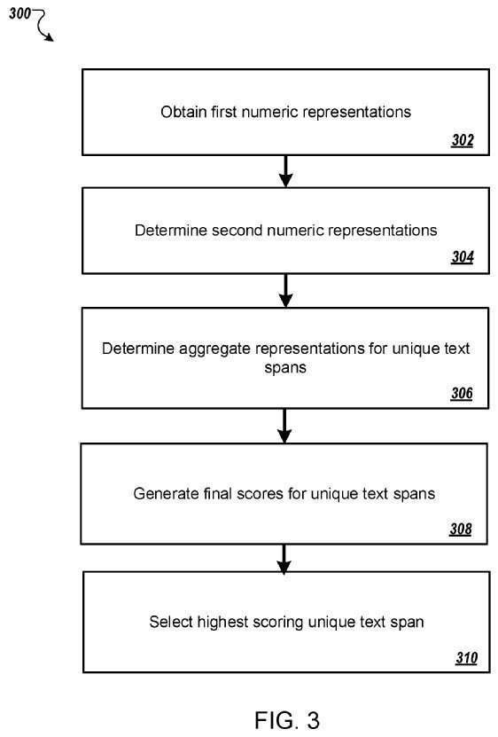

## Question Answering Using Neural Networks

Google performs question answering of queries and returns URLs in response to queries.

Google shows answers when a searcher intends to answer a question and provides a list of links to URLs when a query may be best answered by a page listed in its index.

I wrote about Google meeting a searcher’s intent that way in [Entity Seeking Queries and Semantic Dependency Trees](https://www.seobythesea.com/2020/07/entity-seeking-queries-and-semantic-dependency-trees/)

Google has been working on providing question-answering in queries.

I have written about Google using answer passages and how Google may provide direct answers to questions seeking a specific answer in response to a question, rather than a string of links to pages that may provide answers.

One recent question-answering post I wrote about was [Does Google Use Schema to Write Answer Passages for Featured Snippets?](https://gofishdigital.com/schema-answer-passages-featured-snippets/)

I wrote many posts about related question answering patents, and they are at:

- [Selecting Candidate Answer Passages](https://gofishdigital.com/selecting-candidate-answer-passages/)
- [Featured Snippet Answer Scores Ranking Signals](https://www.seobythesea.com/2020/09/featured-snippet-answer-scores/)
- [Weighted Answer Terms for Scoring Answer Passages](https://gofishdigital.com/weighted-answer-terms-for-scoring-answer-passages/)
- [Adjusting Featured Snippet Answers by Context](https://www.seobythesea.com/2020/10/adjusting-featured-snippet-answers-by-context/)

We don’t know which works with the search engine. Still, I have seen more patent applications published and granted at Google that involve machine learning approaches using neural networks.

## This Patents Uses A Word Vectors Approach to Understand and Answer Questions

This patent appears different from those because it uses a word vectors approach to understand and answer questions.

You may remember that I wrote about those in the post [Citations behind the Google Brain Word Vectors Approach](https://www.seobythesea.com/2017/09/word-vector-approach/). This tells us about the algorithm behind Rankbrain and how Google may identify words that are missing in queries based on the meanings of words that appear in those queries.

This new patent application describes a system that selects a text span from an input electronic document to answer an input question.

## How Does The Process in This Patent Work?

The patent provides a very brief summary of how it works:

> By employing lightweight, i.e., computationally-efficient models combined in a cascade to find the answer to an input question, the described systems can locate text in an input document that answers the input question.
>
> In particular, the described systems can outperform more complex, less computationally efficient architectures. Thus, the described systems can answer received questions while consuming fewer computing resources, e.g., less memory and less processing power, than conventional approaches, which may be particularly helpful when the systems are in resource-constrained environments, e.g., on mobile devices.
>
> In particular, the systems can meet state-of-the-art results on many question-answering tasks despite consuming many fewer computational resources than before state-of-the-art systems, e.g., systems that use computationally-intensive recurrent neural networks to process document tokens, questions tokens, or both.

This question answering patent is at:

[Selecting Answer Spans From Electronic Documents Using Neural Networks](https://patentscope.wipo.int/search/en/detail.jsf?docId=US302855532)
Inventors: [Thomas Mieczyslaw Kwiatkowski](https://www.linkedin.com/in/tom-kwiatkowski-48714b25/), [Ankur P. Parikh](https://www.linkedin.com/in/ankur-parikh-2a240979/), [Swabha Swayamdipta](https://www.linkedin.com/in/swabhaswayamdipta/)
Filed Date: October 29, 2018
Publication Number US20200265327
Publication Date: August 20, 2020
Applicants Google LLC

We see references to a word vectors approach in the abstract for this patent.

> Abstract
>
> Methods, systems, and apparatus, including computer programs encoded on computer storage media, select a text span from an input electronic document that answers an input question.
>
> One of the methods includes obtaining a respective first numeric representation of text spans in the input document for each of the text spans:
>
> Determining, for a segment that contains the text span, a question-aware segment vector
>  Determining, for the question, a segment-aware question vector
>  Processing the first numeric representation of the text span, the question-aware segment vector, and the segment-aware question vector using a second feedforward neural network to generate a second numeric representation of the text span
>  for each unique text span in the plurality of text spans:
>
> Determining an aggregate representation for the unique text span
>  Determining, from the aggregate representation, a final score for the unique text span
>  Selecting a unique text span.

## Some Inventors Of this Patent Have Written Papers About Question Answering Before

Two of the inventors listed on this patent are co-authors on two papers on question answering. The first is from 2017: [Learning Recurrent Span Representations For Extractive Question Anaswering](https://arxiv.org/pdf/1611.01436.pdf)

> Abstract
>
> The reading comprehension task that asks questions about a given evidence document is a central problem in natural language understanding.
>
> Recent formulations of this task have typically focused on answer selection from a set of candidates pre-defined manually or through the use of an external NLP pipeline.
>
> However, Rajpurkar et al. (2016) recently released the SQUAD dataset in which the answers can be arbitrary strings from the supplied text.
>
> This paper focuses on this answer extraction task, presenting a novel model architecture that efficiently builds fixed-length representations of all spans in the evidence document with a recurrent network.
>
> We show that scoring explicit span representations significantly improves performance over other approaches that factor the prediction into separate predictions about words or start and end markers.
>
> Our approach improves upon the best-published results of Wang & Jiang (2016) by 5% and decreases the error of Rajpurkar et al.’s baseline by > 50%.

The second is from 2019: [Real-Time Open-Domain Question Answering with Dense-Sparse Phrase Index](https://arxiv.org/pdf/1906.05807.pdf)

The abstract tells us that it is about:

> Abstract
>
> Existing open-domain question answering (QA) models are not suitable for real-time usage because they need to process several long documents on-demand for every input query.
>
> This paper introduces the query agnostic indexable representation of document phrases that can drastically speed up open-domain QA and allow us to reach longtail targets.
>
> In particular, our dense-sparse phrase encoding effectively captures syntactic, semantic, and lexical information of the phrases and eliminates the pipeline filtering of context documents.
>
> Leveraging optimization strategies, our model can be trained in a single 4-GPU server and serve the entire Wikipedia (up to 60 billion phrases) under 2TB with CPUs only.
>
> Our experiments on SQuADOpen show that our model is more accurate than DrQA (Chen et al., 2017) with 6000x reduced computational cost, which translates into at least 58x faster end-to-end inference benchmark on CPUs.1

The abstract for that paper tells us what it is about.

## How Text Spans Can Be Used to Answer Questions

This patent describes a system that chooses a text span from an electronic document answering a received question.

Once a text span is found to answer the question, the selected text span can be chosen as part of a response to the question.

The input question may have been a voice query, and the system can then provide a spoken utterance in response to the query.

A mobile device, like a smart speaker or another computing device interacting with the user with voice inputs, can receive a voice query spoken by the user and send the received query to the system. This would happen over a data communication network.

The system can then identify a candidate electronic page that may contain the answer to the received query. It would then select a text span from the page using the techniques described in this patent. Then it would send the text span to the computing device as part of a response to the voice query. It would do this as data representing a verbal utterance of the text span or a text for conversion to speech at the computing device.)

In some cases, the user can identify the candidate page.

If the user submitted the voice query while viewing a given document using the computing device, the system could identify the given document as the candidate electronic document.

In some other cases, an external system (e.g., an Internet search engine) may identify the candidate’s electronic document according to the query. Then, it would provide the candidate’s electronic document to the system.

The system can receive the question as a text query. It would then provide the text span for presentation on a user device as part of the response to the text query.

An Internet search engine can receive the text query, and the text span identified by the system can be used by the Internet search engine as part of the response to the search query. It would be a formatted presentation of content and search results identified by the Internet search engine as being responsive to the query.

## Identifying Answering Text Spans to Help with Question Answering

The system may receive an input question and input electronic document and identify a text span from the electronic document that answers the question.

Both are tokenized (i.e., so that the text of both the input question and the electronic document is represented as a respective set of tokens.)

A token can be (e.g., a word, a phrase, or other n-gram selected from a vocabulary of possible tokens.)

When an electronic document is received, the system identifies candidate text spans on the page.

## A Text Span Might be a Candidate if it does not Exceed a Threshold Number of Tokens

The system can identify as a candidate text span each possible consecutive sequence of tokens in the page, including fewer than a threshold number of tokens.

Because the same candidate text span can occur many times throughout the page, the system also identifies, from the candidate text spans in the document, a set of unique text spans (i.e., so that no text span in the set of unique text spans corresponds to any other text span in the set of unique text spans.)

The system may consider one text span to correspond to another if the two text spans are within a threshold edit distance.

The system may consider two text spans to correspond to the same entity with a named entity recognition system.

## A Cascaded Machine Learning Question Answering Model

This system uses a cascaded machine learning system (i.e., a machine learning system having a cascaded model architecture to select a text span from the set of unique text spans as the text span that answers the input question.)

The cascaded model architecture uses three machine learning models: level 1, level 2, and level 3.

This is a “cascade” because the models in each layer of the cascade receive input from the outputs of models in previous layers of the cascade.

The models in the final layer of the cascade, i.e., layer 3, generate the final prediction of the machine learning system from the output of the model in the previous layer, i.e., layer 2.

Level 1 of the cascade operates on simple features of the question and the candidate text spans to generate a respective first numeric representation of each text span.

A numeric representation is an ordered collection of numeric values (e.g., a vector, a matrix, or higher-order tensor of floating-point values or quantized floating-point values.)

The models in level 1 operate only on embeddings from a dictionary of pre-trained token embeddings and, optionally, a binary question-word feature that indicates whether a given span contains a token from the question.

An embedding is a vector of numeric values in a fixed dimensional space.

Because the embeddings have been pre-trained, the embeddings in the fixed dimensional space show similarities (e.g., semantic similarities between the tokens that they represent.)

The embedding for the word “king” may be closer in the fixed dimensional space to the embedding for the word “queen” than the embedding for the word “pawn.”

Examples of such pre-trained embeddings used by the system include [word2vec embeddings](https://towardsdatascience.com/introduction-to-word-embedding-and-word2vec-652d0c2060fa) and [GloVe embeddings](https://towardsdatascience.com/light-on-math-ml-intuitive-guide-to-understanding-glove-embeddings-b13b4f19c010).

## A Look at the Layers of the Cascade

The model in layer 2 of the cascade uses the first numeric representations generated by level 1 along with an attention mechanism that, for each candidate span, aligns question tokens with tokens in the document segment that contains the candidate span, e.g., the sentence, paragraph or other groups of tokens in the electronic document that contains the candidate span, to generate a respective second numeric representation for each candidate answer span.

The model in layer 3 receives the second numeric representations of the candidate text spans and aggregates information from all the candidate answer spans mentioned many times in the document, i.e., that occur many times throughout the document, to determine a respective final score unique text span. Thus, the final score for a given unique text span measures how well the unique text span answers the question.

The system then selects a text span from the unique text spans based on the final scores. For example, the system can select the unique text span with the highest final score to answer the question.

To allow the cascaded machine learning system to score answer spans (i.e., so that the final scores generated by level 3 of the cascade can be used to identify answers to input questions, the system trains the machine learning models in the cascade on training data that includes labeled training examples.)

That is, each labeled training example includes a question—electronic document pair that is labeled with data identifying the correct text span (i.e., the text span from the electronic document that best answers the question.)

Level 1 of the cascade can include two models: a span+short context model and a question+span model that collectively generate the first numeric representation.

## For Any Given Text Span, The Text Span Model Operates On:

1. The left context of the text span in the input document
2. The text span
3. The right context of the text span in the input document to generate as output a span-context representation of the text span

The text span is based on the pre-trained embeddings of the tokens in the text span.

The initial representation could be a bag of words embedding the tokens in the text span. This would be an average of the embeddings of the tokens in the text span.

The text span could be a concatenation of a bag of words embedding the tokens in the text span and a question-word feature that indicates whether the text span includes any of the questions tokens.

The question-word feature can be binary. This means that it could have the value 1 when the text span includes question tokens and has the value 0 when the text span does not include any of the question tokens.)

The initial representation of the left context is a bag of words embedding the tokens in the left context of the text span, i.e., an average of the embeddings of the K tokens to the immediate left of the text span in the input document.

The right context is a bag of words embedding the tokens in the right context of the text span. Those could be an average of the embeddings of the K tokens to the immediate right of the text span in the input document.

To generate the span-context representation of the text span, the model processes a concatenation of

1. The left context of the text span in the input document
2. The text span
3. The right context of the text span in the input document using a feed-forward neural network

The neural network may be a two-layer feed-forward neural network with rectified linear unit (ReLU) activations.

In particular, operations from the feed-forward neural network to generate a representation h from an input x and can display as:

(NB) where U and V parameter matrices and a and b are parameter biases of the feed-forward network.

The model is also configured to generate a score for the text span that, like the final score, measures how well the unique text span answers the question (shown as the input to a loss term l 2).

In particular, the model can generate the score by processing the span-context representation of the text span through a linear prediction layer that maps a vector to a single value.

Does this mean the operations performed by the linear prediction layer generate a value? From an input representation. It can display as:

(NB) where w and z are parameters of the linear prediction layer.

Using the score generated by the model for training is in more detail below.

For any given text span, the model operates on.

(i) The text span
(ii) A question-span representation of the text span.

The model first generates a weight for each question token based on the embedding of each question token.

The model can be a weight for the question token by first applying another feed-forward neural network. This means applying the ffnn operations to the embedding of the question token to generate an initial representation of the question token. It then means applying another linear prediction layer to the initial representation of the question token.

Also, the model can then generate the initial representation of the question token by computing a weighted average of the embeddings for the question token. The embeddings for each question token could become a normalized version of the computed weight.

Once the initial representation of the question gets generated, the model generates the question-span representation of the text span by applying another feed-forward neural network. That can mean applying the ffnn operations described above to a concatenation of the initial representation of the text span and an initial representation of the question.)

While not used during inference, the model is also configured to generate a score for the text span during training. Like the final score, that can measure how well the unique text span answers the question.

In particular, the model can generate the score by processing the question-span representation of the text span through another linear prediction layer.

The first numeric representation of the text span is a concatenation of the question-span representation and the span-context representation. It goes as input to level 2 of the cascade.

Level 2 of the cascade includes a context attention model that operates on the first numeric representation to generate the second numeric representation of the question span for a given question span.

For a given text span, the question-answering model generates:

(i) For a segment with the text span in the input document, a question-aware segment vector based on a similarity between the question tokens in the question and segment tokens in the segment that contains the text span and
(ii) For the question, a segment-aware question vector question uses the similarity between the question tokens in the question and segment tokens in the segment that contains the text span.

The model measures the similarity between every pair of questions and segment embedding to generate these two vectors. It generates a respective similarity score between each question embedding and each segment embedding.)

To generate the similarity score ? ij for a given question embedding q i—segment embedding d j pair, the model performs the following operations:

? ij =ffnn( q i) T ffnn( d i).

To generate the question-aware segment vector for the segment in the input document that contains the text span. The model then determines a respective attended vector for each segment token. That would account for the similarity of the segment token to the question tokens as reflected by the similarity scores. It can then determine the question-aware segment vector from the attended vectors for the segment tokens.

To determine the segment-aware question vector for the question, the model determines a respective attended vector for each question token that measures the similarity of the question token to the segment tokens as reflected by the similarity scores. It then determines the segment-aware question vector from the attended vectors for the question tokens.

In particular, to generate the question-aware segment vector, each original segment embedding vector and its corresponding attended vector went through concatenation and passed through another feed-forward net. The representations get added up to get the question-aware segment vector.

Each original question embedding vector and its corresponding attended vector goes through concatenation and pass-through this feed-forward net. The representations get added together to get the segment-aware question vector.

The model then processes a concatenation of:

- The first numeric representation of the text span
- The question-aware segment vector
- The segment-aware question vector
- The question-span feature using another feedforward neural network second numeric representation the text span

While not used during inference, the model is also configured to generate a score for the text span during training. Like the final score, which measures how well the unique text span answers the question.

In particular, the model can generate the score by processing the second numeric representation of the text span through another linear prediction layer.

Level 3 includes an aggregating many mentions model that receives the second numeric representations of the candidate answer spans and aggregates information from all the candidate answer spans. Those occur many times throughout the document based on the second numeric representation.

In particular, for each unique question span, the model processes the second numeric representations for each of the text spans that correspond to the unique text span. It uses another feedforward neural network to generate a transformed numeric representation for each text span.

The model then determines the total representation for the unique text span by summing the transformed numeric representations of the candidate text spans corresponding to the unique text span.

Then the model generates the final score for the unique text span by processing the total representation of the unique text span through another linear prediction layer.

The architectures of the various feed-forward neural networks and the various linear projection layers employed by the models are generally the same. Each feed-forward neural network and linear projection layer generally has different parameter values from each other neural network or projection layer.

To determine these parameter values, the system trains the cascaded machine learning system on training data.

## Training the Cascaded Neural Network System for Question Answering

For convenience, the process uses a system of computers located in one or more locations.

A question answering system performs the process.

This system can perform the process on multiple training examples to update the values of the parameters of a cascaded neural network system.

The system obtains a training example. This training example starts with a training question and a training document and identifies a correct word span from the training document that best answers the question.

The system processes the training question and the training document using the cascaded neural network system to generate:

- (i) A final score for the unique word span corresponding to the correct word span
- (ii) Scores for each of the models for each mention of the correct word span in the training document

After training, only the final score works to select the best answer for the input question. During training, each model can generate a respective score for each candidate word span training document.

The system determines an update to the parameters of the cascaded machine learning system. It does this by determining a gradient of a loss function on the parameters.

The loss function l includes terms that depend on the scores generated by a corresponding model.

In particular, the loss function includes a respective loss term for each of the models that depend on the scores assigned to the mentions of the correct word span in the training document. And, for the model, a loss term depends on the final score assigned to the unique word span corresponding to the correct word span by the model.

In particular, the loss function can be the total negative log-likelihood of the correct answer spans under all the submodels.

For example, the loss function is:

(NB) where each? Is a hyperparameter such that the ?s add to 1, S* is the set of all mentions of the correct answer span in the training document. p (k)(s|q,d) is the score assigned to a mention s in the set S* by the k-th model of the models 160- 180, and p (4)(u|q,d) is the final score assigned to a unique answer span by the model.

The system can determine the gradient about each of the parameters using a machine learning training technique. Using something such as backpropagation. It can then determine the update from the gradient by applying an update rule. It might use an ADAM update rule, a rmsprop update rule, or a stochastic gradient descent learning rate, to the gradients.
