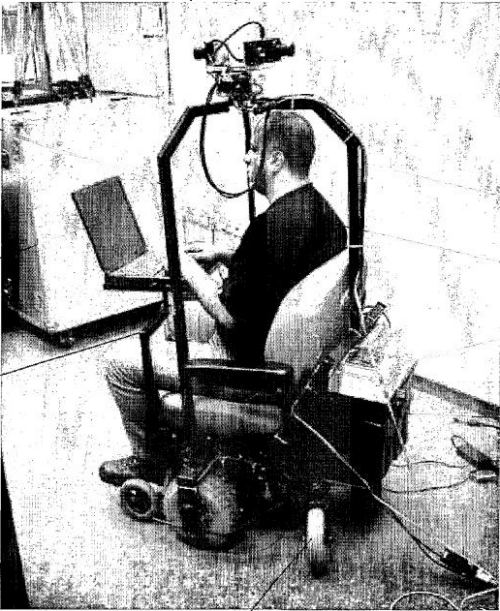
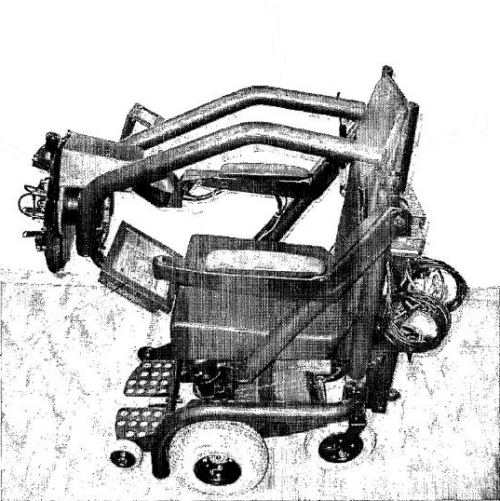
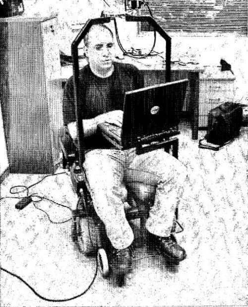

StreetView indoors? Not long ago, Google started inviting businesses to apply to have [Google Photographers](https://www.google.com/streetview/contributors/) film the insides of their businesses. But what if those photographers showed up with something like this:

The news of Google’s acquisition of Quiksee, also known as Mentorwave Technologies Ltd., is spreading around the Web. Most of the focus of the discussion is on Quiksee’s technology for easy virtual tour creation, which would bring Streetviews Indoors.

But Quiksee’s patent filings reveal that there’s more that Google might use, including a mobile device that can be used to film Streetviews indoors in places where Google’s [StreetView](https://www.google.com/streetview/) cars can’t go, such as sidewalks, parks, and indoors. Quicksee’s patents, assigned to them under the name Mentorwave Technologies Ltd., show some other technologies that might be attractive to Google.

Of course, Google photographers (and possibly Google videographers in the future) can’t be everywhere all at once, which is what makes Quiksee’s virtual tour process interesting. The following Quiksee video shows how someone can create their virtual video tour using Quiksee:

The [announcement of the acquisition](http://web.archive.org/web/20100918002911/http://www.quiksee.com:80/ugcportal/News.aspx) on the Quiksee site notes that the co-founders of Quiksee, Rony Amira, Gadi Royz, and Assaf Harel will be joining the Google Geo team.

A Google patent application filed in 2006 described the possibility that Google might take Streetviews Indoors and start indexing the interiors of stores and museums using “a small motorized vehicle or robot.” I wrote about it in [Google on Reading Text in Images from Street Views, Store Shelves, and Museum Interiors](https://www.seobythesea.com/2008/01/google-on-reading-text-in-images-from-street-views-store-shelves-and-museum-interiors/). Google acquiring Quiksee might push forward the time when we see Streetviews indoors happening.

Here are the granted patents and patent applications from Quiksee (under the name Mentorwave Technologies LTD) that would presumably go with the company to Google:

[Mobile Device Suitable for Supporting Apparatus for Site Imaging While in Transit](http://appft.uspto.gov/netacgi/nph-Parser?Sect1=PTO2&Sect2=HITOFF&u=%2Fnetahtml%2FPTO%2Fsearch-adv.html&r=1&p=1&f=G&l=50&d=PG01&S1=20080035402.PGNR.&OS=dn/20080035402&RS=DN/20080035402)
Invented by Rony Amira and Gadi Royz
Assigned to Mentorwave Technologies LTD.
US Patent Application 20080035402
US Patent 7,726,888
Granted June 1, 2010
Published February 14, 2008
Filed: June 9, 2005

Abstract

> A mobile device which supports apparatus for site imaging while in transit is disclosed. The mobile device comprises:
>
> - A plurality of wheels,
> - An imaging unit having at least one camera and supported above the head of an operator,
> - A control unit for monitoring and controlling operation of each camera and of generated image data so as to produce an interactive movie,
> - A steering device for navigating the mobile device within the site,
> - A measuring device for measuring the relative displacement of the mobile device,
> - A computer for determining the relative location and orientation of the mobile device within the site and for processing data, and
> - A monitor.
>
> In one embodiment, two of the wheels are self-aligning caster wheels, and a mechanism and method for preventing drifting during the initial advancement of the mobile device are provided. A rotating mechanism is actuated until each caster wheel achieves a trailing position.

[Method and System for Displaying via a Network of an Interactive Movie](http://appft.uspto.gov/netacgi/nph-Parser?Sect1=PTO2&Sect2=HITOFF&u=%2Fnetahtml%2FPTO%2Fsearch-adv.html&r=1&p=1&f=G&l=50&d=PG01&S1=20090019496.PGNR.&OS=dn/20090019496&RS=DN/20090019496)
Invented by Rony Amira and Assaf Harel
Assigned to Mentorwave Technologies LTD.
US Patent Application 20090019496
Published January 15, 2009
Filed: May 29, 2006

Abstract

> The present invention relates to a system for transferring an interactive walkthrough movie located at a server via a network and displaying the same at a user station, which comprises:
>
> (a) a display unit at the user station for displaying movie frames;
>
> (b) a control device at the user station for enabling the user to navigate within the movie;
>
> (c) a map of the movie describing the links between the individual movie frames and the index of each movie frame said map also maintains at any given time the present virtual location of the user within the map; and
>
> (d) a prediction unit for receiving inputs from the said map and a user control device, and based on said inputs predicting those future frames that may be required for view by the user, and instructing the server to convey said predicted future frames to the user station.
>
> The prediction unit may order the first level of resolution frames when the user is in a virtual movement, and the second level of resolution frames when the user is stationary within the interactive movie.

[Method and Apparatus for Making a Virtual Movie for Use in Exploring a site](http://appft.uspto.gov/netacgi/nph-Parser?Sect1=PTO2&Sect2=HITOFF&u=%2Fnetahtml%2FPTO%2Fsearch-adv.html&r=1&p=1&f=G&l=50&d=PG01&S1=20090174771.PGNR.&OS=dn/20090174771&RS=DN/20090174771)
Invented by Rony Amira and Gadi Royz
Assigned to Mentorwave Technologies LTD.
US Patent Application 20090174771
Published July 9, 2009
Filed: January 4, 2007

Abstract

> A method for producing an interactive virtual movie that simulates a user’s walking within a real site and exploring the same. A scanning apparatus defines minimal conditions for the capturing of a new photograph, including one or more of:
>
> (i) displacement of the apparatus by a distance D;
>
> (ii) change of the apparatus orientation by an angle.DELTA..degree.; or
>
> (iii) change of the camera’s orientation concerning the apparatus by an angle of .delta..degree.
>
> A photograph is captured each time the apparatus exceeds one of the predefined minimal conditions, wherein the measurements of the variables are reset after each capturing. The method also includes storing the captured photographs and forming open chains of those photographs captured during a common route photographing session and forming closed chains, of photographs captured during a common junction photographing. For each of those first and last from among the closed chain photographs relating to the junction, a corresponding similar photograph is found meeting one of the criteria of highest correlation or having the closest field of view direction, and connecting between them.

[Method and apparatus for virtual walkthrough](http://patft.uspto.gov/netacgi/nph-Parser?Sect1=PTO2&Sect2=HITOFF&u=%2Fnetahtml%2FPTO%2Fsearch-adv.htm&r=1&p=1&f=G&l=50&d=PTXT&S1=7,443,402.PN.&OS=pn/7,443,402&RS=PN/7,443,402)
Invented by Rony Amira and Gadi Royz
Assigned to Mentorwave Technologies LTD.
US Patent 7,443,402
Granted October 28, 2008
Filed: November 24, 2003

Abstract

> Method for producing an interactive virtual movie, which simulates walking of a user within a real site, comprising:
>
> (a) Defining first minimal conditions:
>
> (b) Defining second minimal conditions;
>
> (c) Moving a scanning apparatus along routes within site, measuring the x,y, displacement, and angular orientation of the scanning apparatus at any given time, and creating a new node at least whenever such first minimal conditions are met;
>
> (d) Obtaining an image data at each node location reflecting a camera unit field of view, and associating the image data and its orientation with the x,y. coordinates of the present node;
>
> (e) Finding and registering neighborhood links between pairs of nodes, each link satisfies at least said second minimal conditions; and
>
> (f) Further associating with each created link an exit angular orientation and entry angular orientation to nodes of each pair.

The next rider on this device might just be wearing a Google T-Shirt:

