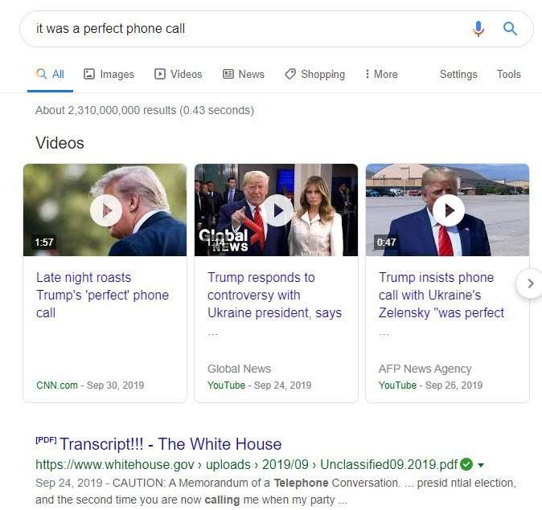

## Quote Searching has shifted at Google with an Updated Continuation Patent

In August of 2017, I wrote the post [Google Searching Quotes of Entities](https://gofishdigital.com/searching-quotes/). I wrote about the patent [Systems and methods for searching quotes of entities using a database](http://patft.uspto.gov/netacgi/nph-Parser?Sect1=PTO1&Sect2=HITOFF&d=PALL&p=1&u=%2Fnetahtml%2FPTO%2Fsrchnum.htm&r=1&f=G&l=50&s1=9,727,617.PN.&OS=PN/9,727,617&RS=PN/9,727,617).

This quote searching patent went through an update last year (February 2019). This happended with a continuation patent. I like comparing older patents with claims from newer continuation patents. They are a way of saying, “We used to do something one way, but we changed how we do it. So to protect our intellectual property, we have updated the claims with a newer version of it.”

## Reviewing the Claims From Patents on Quote Searching

It appears that this patent is showing us that Google is paying more attention to indexing audio. That shows in this updated patent.

Here is a comparison of how to quote searching works based on the claims from the patents.

**The first claim from the 2017 version** – [Systems and methods for searching quotes of entities using a database](http://patft.uspto.gov/netacgi/nph-Parser?Sect1=PTO1&Sect2=HITOFF&d=PALL&p=1&u=%2Fnetahtml%2FPTO%2Fsrchnum.htm&r=1&f=G&l=50&s1=9,727,617.PN.&OS=PN/9,727,617&RS=PN/9,727,617):

> 1. A computerized system for searching and identifying quotes, the system comprising: a memory device that stores a set of instructions; and at least one processor that executes the set of instructions to receive a search query for a quote from a user; parse the query to identify one or more keywords;
>
> match the keywords to knowledge graph items associated with candidate subject entities in a knowledge graph stored in databases,
>
> Wherein the knowledge graph includes a plurality of items associated with a plurality of subject entities and a plurality of relationships between the plurality of items; determine, based on the matching knowledge graph items, a relevance score for each of the candidate subject entities; identify, from the candidate subject entities, one or more subject entities for the query based on the relevance scores associated with the candidate subject entities; identify a set of quotes corresponding to the one or more subject entities; determine quote scores for the identified quotes based on at least one of the relationship of each quote to the one or more subject entities, the recency of each quote, or the popularity of each quote; select quotes from the identified quotes based on the quote scores; and transmit information to a display device to display the selected quotes to the user.

## The Latest Changes in the Patent on Quote Searching

**The first claim from the 2019 version** – [Systems and methods for searching quotes of entities using a database](http://patft.uspto.gov/netacgi/nph-Parser?Sect1=PTO1&Sect2=HITOFF&d=PALL&p=1&u=%2Fnetahtml%2FPTO%2Fsrchnum.htm&r=1&f=G&l=50&s1=10,198,508.PN.&OS=PN/10,198,508&RS=PN/10,198,508)

> 1. A method comprising the following operations performed by one or more processors: receiving audio content from a client device of a user;
>
> performing audio analysis on the audio content to identify a quote in the audio content; determining the user as an author of the audio content based on recognizing the user as the speaker of the audio content; identifying, based on words or phrases extracted from the quote, one or more subject entities associated with the quote;
>
> storing, in a database, the quote, and an association of the quote to the subject entities and to the user being the author; after storing the quote and the association: receiving, from the user, a search query; parsing the search query to identify that the search query requests one or more quotes by the user about one or more of the subject entities; identifying, from the database and responsive to the search query, a set of quotes by the user corresponding to the one or more of the subject entities, the set of quotes including the quote; selecting the quote from the quotes of the set based at least in part on the recency of each quote; and transmitting, in response to the search query, information for presenting the selected quote to the user via the client device or an additional client device of the user.

## How The Original Patent Was Intended to Work – Indexing Knowledge Graphs

You may want to read about how this patent was originally intended to work. I wrote about the original granted patent from 2017 (link above). The continuation patent came out last spring. The first version tells us about quote searching by looking at knowledge graph entries.

Mentions of a “knowledge graph” are no longer in the newer patent’s claims. It also says it is looking for audio content and performing analysis on audio content to collect quotes from entities.

This update tells me that Google is relying less on finding quote information from knowledge base sources.

They are working on finding quote information by performing audio analysis. They seem to want to rely less on people updating a knowledge graph and more on automated programs to crawl content on the web, analyze it, and index it.

This does look like they want to scale on a web level without relying upon people to record quotes from others.

## Quote Searching Takeaways

I see videos at the top of the results when searching for quotes from movies and reporting in the news. President Trump referred to a phone call he had with Ukraine as a “perfect phone call.”

Note that Google is showing videos as search results for that quote.

I searched for quotes that I knew from history and Movies. I see those at or near the top of search results in videos with those quotes in them. Of course, that isn’t proof Google is using audio from videos as the sources of those quotes, but it isn’t a surprise after seeing how this patent has changed.

## Google May Have Gotten Better at Understanding Audio in Videos

Has Google gotten that much better at understanding videos and indexing such content? It may be telling us that they have more confidence in how they have indexed video content. I would still recommend making transcripts of any videos you publish to the web to ensure content from a video gets indexed correctly. But Google may have gotten better at understanding audio in videos.

This change may work with an understanding of the intent behind quote searching. When someone searches for a quote, they may care less about who said something and are more interested in watching or hearing them say it. This would be a motivation for making sure that a video appears to rank high in search results.
