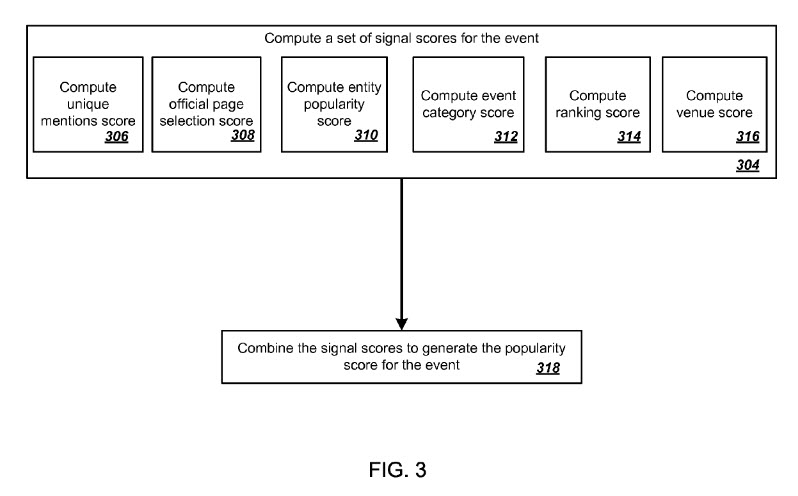

## Ranking Events without Links

This summer, Google was granted a patent that describes how the search engine might rank events based upon data that might indicate the popularity of those events, without relying on things such as the number of links pointing to pages about those events. Instead, the patent involves ranking events that occur in physical locations.

Examples of the kinds of events discussed in this patent include ranking events like music concerts, art exhibits, and athletic contests, all happening for specified periods of time at specified physical locations, such as concert halls, galleries, stadiums, or museums.

Since many events in a geographic region can happen simultaneously or at overlapping times, interested individuals may at times find it difficult to determine which events to attend. For example, individuals may be unaware that events of interest are scheduled to occur or may have difficulty identifying the most interesting events when multiple events are occurring.

This ranking events patent lays out a general process flow to describe how the patent works. It starts with receiving data about a physical location and events taking place there during a certain period and computing signal scores for those events based upon a mention of the event and a popularity score for the event based upon those signal scores.

Additional signals for ranking events can include:

1) generating an initial ranking of events based on the popularity scores;
2) computing a respective modified popularity score for each of the events based on the initial ranking, and
3) generating the ranking of events occurring in the physical location by ranking events according to the modified popularity scores.

The patent describes the process of computing a popularity score for ranking events, including:

1) obtaining information about a category for each event;
2) computing demotion values for each of the events, which is based on higher-ranked events in the same category and
3) generating the respective modified popularity score for each event by applying the demotion value for the event to the popularity score.

Computing a first signal score for the event can include:

1) Determining of the Internet sites including at least one mention of the event, a number that has been classified as ticket selling sites; and
2) Computing the first signal score based at least in part on the count of Internet sites, including at least one mention of the event and the number that have been classified as ticket selling sites.

Computing a plurality of signal scores for each of the events can also include:

1) Determining whether the event has an official web page; when the event has an official web page,
2) Determining a peak number of user selections of the official web page over a predetermined duration of time;
3) Determining a measure of relevance of the official web page to the event; and
4) Computing a second signal score of the plurality of signal scores for the event based at least in part on the peak number of user selections and the relevance measure.

Other signal score factors for ranking events can include:

1) obtaining data identifying one or more entities that are relevant to the event;
2) determining a measure of the global popularity of each of the entities; and
3) computing a third signal score of the plurality of signal scores for the event based at least in part on the global popularity of the entities relevant to the event.

Additional signal scores can also include:

1) obtaining data identifying one or more event categories that are relevant to the event;
2) determining whether any of the event categories that are relevant to the event have been classified as promoted or demoted categories; and
3) computing a fourth signal score of the plurality of signal scores for the event based at least in part on whether any of the event categories have been classified as promoted or demoted categories.

More signal scores may include:

1) obtaining search results for a search query that includes a first term identifying the physical location and a second term indicating an interest in events occurring in the physical location;
2) determining a position in a ranking of the search results of a highest-ranked search result that mentions the event;
3) determining a frequency with which the event is mentioned in the search results; and
4) computing a fifth signal score of the plurality of signal scores for the event based at least in part on the position of the highest-ranked search result that mentions the event and the frequency with which the event is mentioned in the search results.

Computing additional signal scores can include: 1) obtaining data identifying a venue hosting the event; 2) obtaining data identifying a seating capacity of the venue, and 3) computing a sixth signal score of the plurality of signal scores for the event based at least in part on the seating capacity of the venue.

The patent describes the following advantages in following the approach it describes.

1) Events in a given location can be ranked to identify those popular or interesting events easily.
2) The ranking can be adjusted to ensure that highly-ranked events are diverse and different from one another.
3) Events matching various event criteria can be ranked so those popular or interesting events can be easily identified.
4) The ranking can be provided to other systems or services that can use the ranking to enhance the user experience. For example, a search engine can use the ranking to identify the most popular events relevant to a received search query and present the most popular events to the user in response to the received query.
5) A recommendation engine can use the ranking to identify popular or interesting events to users that match the users’ interests.

[Ranking events](https://patents.google.com/patent/US9424360)
US 9424360 B2
Publication number US9424360 B2
Granted: Aug 23, 2016
Filing date: March 12, 2013
Also published as US20150161128
Inventors Kavi J. Goel, Toshihiro Yoshino, Yang-hua Chu, Hidetoshi Shimokawa, Slaven Bilac, Mingmin Xie, and Satoru Yamauchi
Original Assignee Google

Abstract:

> Methods, systems, and apparatus, including computer programs encoded on a computer storage medium, for ranking events. One of the methods includes receiving data identifying a physical location; obtaining data identifying a plurality of events occurring in the physical location during a particular period; computing a respective plurality of signal scores for each of the events, wherein computing the respective plurality of signal scores for each of the events comprises computing a first signal score for each of the events based at least in part on a count of Internet sites that include at least one mention of the event; computing a respective popularity score for each of the plurality of events by combining the respective plurality of signal scores for the event, and generating a ranking of events occurring in the physical location during the particular time based at least in part on the popularity scores.

The selection scores may include Unique Mention scores, Ticketing Sites mentions, and Official Page (of the event) selections. The patent describes how those factors into popularity scores.

An entity popularity score is a measure of the popularity of entities classified as relevant to the event. In addition, each entity may be given a topicality score and a confidence score based upon the global popularity of the obtained entities. This can be based on many search queries that include a reference to the entity submitted to a search engine.

An Event Category Score might be used to determine whether the category has been previously classified as a promoted or demoted category. A trade show may be clasFor example, aified as a demoted category because they appeal to a limited audience. In contrast, festivals and fairs may be classified as a promoted category because they tend to appeal to a broader audience but may not be well-publicized.

The system obtains search results for the search query from a search engine to compute the ranking score. The obtained search results are ranked according to scores generated by the search engine. The system can then compute the ranking score based on a position in the ranking of search results of the highest-ranked search result that identifies a resource that mentions the event, the number of mentions of the event in resources identified by a pre-determined number of highest-ranked search results, or both.

A score based on the venue’s popularity where an event takes place may also play a role in the score for ranking events. Events that are held in places that usually show more popular events may be assigned higher venue scores.
