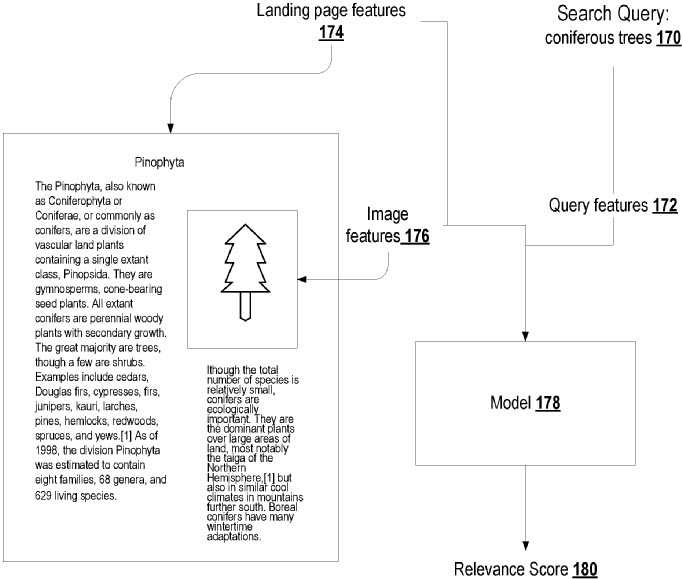

## Changes to How Google Ranks Image Search Results

We see more machine learning in how Google ranks pages and images in search results.

That may leave what we know as traditional or old-school ranking signals behind.

It is worth looking at those older ranking signals because of the role they play in ranking.

As I am writing about this new patent on ranking image results, I decided to include what I used to look at when ranking images.

Images can rank in image search and help pages rank higher, making a page more relevant for the query terms.

## These are old Features Used to Rank Image Search Results

I would use these when trying to rank image search results:

- Meaningful images reflecting what the page is about – make them relevant to a query
- An image file name relevant to what the image is about (I separate words in file names for images using hyphens, too)
- Alt text for an alt attribute to describes the image well, with text relevant to the query and avoid keyword stuffing
- A caption that is helpful and relevant to what the query term the page is about
- A title and associated text on the page relevant for what the page is about and what the image shows
- A decent sized image at a decent resolution that isn’t mistaken for a thumbnail

Those signals help rank image search results and help that page rank as well.

A new patent application uses machine learning to rank image search results. Unfortunately, it doesn’t list the features that help image rank. Those could be alt text, captions, or file names. However, it does refer to “features” that likely include those as well as other signals.

These machine learning patents will likely become more common from Google.

## Machine Learning Models to Rank Image Search Results

The machine learning model may use many different types of machine learning models.

Those models can be:

- Deep machine learning. This would be a neural network that includes many layers of non-linear operations.
- Other models. These would include a generalized linear model, a random forest, a decision tree model, and so on.)

This machine learning model accurately generates relevance scores for image-landing page pairs in the index database.”

The patent tells us about an image search system, which includes a training engine.

The training engine trains the machine learning model using training data from image-landing page pairs already associated with ground truth or known values of the relevance score.

## The Machine Learning Model Generates a Relevance Score for an Image Search Result

An example of the machine learning model generates a relevance score for an image search result from an image, a landing page, and query features. In this image, a searcher submits an image search query. The system generates image query features based on the user-submitted image search query.

That system learns landing page features for the landing page identified by the particular image search result and image features for the image identified by that image search result.

The image search system then provides the query features, the landing page features, and the image features as input to the machine learning model.

Google may rank image search results based on various factors.

## Signals Used to Rank Image Results

Those may be separate signals from:

1. The image features
2. The landing page features
3. Combining the separate signals following a fixed weighting scheme that is the same for each received search query

This patent describes how it would rank image search results in this manner:

1. Obtaining many candidate image search results for the image search query
2. Each candidate image search result identifies a respective image and a respective landing page for the respective image
3. For each of the candidate image search results processing
4. Features of the respective landing page identified by the candidate image search result using an image search result ranking machine learning model trained to generate a relevance score measuring the relevance of the candidate image search result to the image search query
5. Ranking the candidate image search results based on the relevance scores generated by the image search result ranking machine learning model

## Advantages to Using a Machine Learning Model to Rank Image Search Results

If Google can rank image search query pairs based on relevance scores using a machine learning model, it can improve the relevance of the image search results in response to an image search query.

This differs from conventional methods to rank resources because the machine learning model receives a single input that includes features of the image search query features. It also looks at a landing page and image identified by a given image search result to predict the relevance of the image search result received query.

This process allows the machine learning model to be more dynamic. In addition, it gives more weight to landing page features or image features in a query-specific manner. This can improve the image search results returned to the user.

Using a machine learning model, the image search engine does not apply the same fixed weighting scheme for landing page features and image features for each received query. Instead, it combines the landing page and image features in a query-dependent manner.

## Adjusting Weights to Various Features

The patent also tells us that a trained machine learning model can easily and optimally adjust weights assigned to various features based on changes to the initial signal distribution or additional features.

In a conventional image search, we are told that significant engineering effort must adjust the weights of a traditional manually tuned model based on changes to the initial signal distribution.

But under this patented process, adjusting the weights of a trained machine learning model based on changes to the signal distribution is significantly easier. It can work towards improving the ease of maintenance of the image search engine.

Also, if a new feature is added, the manually tuned functions adjust the function on the new feature independently on an objective. Such as loss function, while holding existing feature functions constant.)

But, a trained machine learning model can automatically adjust feature weights if a new feature is added.

Instead, the machine learning model can include the new feature and rebalance all its existing weights appropriately to optimize for the final objective.

Thus, the accuracy, efficiency, and maintenance of the image search engine can be improved.

## The Rank Image Search Results Patent Application

The Rank Image Search results patent application can be found at

[Ranking Image Search Results Using Machine Learning Models](https://patentscope.wipo.int/search/en/detail.jsf?docId=US297158879)
US Patent Application Number 16263398
File Date: 31.01.2019
Publication Number US20200201915
Publication Date June 25, 2020
Applicants Google LLC
Inventors Manas Ashok Pathak, Sundeep Tirumalareddy, Wenyuan Yin, Suddha Kalyan Basu, Shubhang Verma, Sushrut Karanjkar, and Thomas Richard Strohmann

Abstract

> Methods, systems, and apparatus, including computer programs encoded on a computer storage medium, for ranking image search results using machine learning models. In one aspect, a method includes receiving an image search query from a user device; obtaining a plurality of candidate image search results; for each of the candidate image search results: processing (i) features of the image search query and (ii) features of the respective image identified by the candidate image search result using an image search result ranking machine learning model to generate a relevance score that measures a relevance of the candidate image search result to the image search query; ranking the candidate image search results based on the relevance scores; generating an image search results presentation; and providing the image search results for presentation by a user device.

## The Indexing Engine

The search engine may include an indexing engine and a ranking engine.

The indexing engine indexes image-landing page pairs and adds the indexed image-landing page pairs to an index database.

The index database includes data identifying images and, for each image, a corresponding landing page.

The index database also associates the image-landing page pairs with:

- Features of the image search query
- Features of the images, i.e., features that characterize the images
- Features of the landing pages, i.e., features that characterize the landing page

Optionally, the index database also associates the indexed image-landing page pairs in the collections of image-landing pairs with values of image search engine ranking signals for the indexed image-landing page pairs.

## The Ranking Engine

The ranking engine uses each image search engine ranking signal in ranking the image-landing page pair in response to a received search query.

The ranking engine generates respective ranking scores for image-landing page pairs indexed in the index database based on the values of image search engine ranking signals for the image-landing page pair. These are signals accessed from the index database or computed at query time. It ranks the image-landing page pair based on the respective ranking scores. The ranking score for a given image-landing page pair reflects the relevance of the image-landing page pair to the received search query. Or the quality of the given image-landing page pair, or both.

The image search engine can use a machine learning model to rank image-landing page pairs to receive search queries.

The machine learning model is a machine learning model that is configured to receive an input that includes:

(i) The image search query features
(ii) The image features
(iii) The landing page of the image features and generates a relevance score that measures the relevance of the candidate image search result to the image search query.

Once the machine learning model generates the relevance score for the image-landing page pair, the ranking engine can then use the relevance score to generate ranking scores for the image-landing page pair in response to the received search query.

## The Ranking Engine behind the Process to Rank Image Search Results

The ranking engine may generate an initial ranking score for each image—landing page pairs using the signals in the index database.

The ranking engine can then select a certain number of the highest-scoring image—landing pair pairs for processing by the machine learning model.

The ranking engine can then rank candidate image—landing page pairs based on relevance scores from the machine learning model or use those relevance scores as additional signals to adjust the initial ranking scores for the candidate image—landing page pairs.

The machine learning model would receive a single input that includes features of the image search query, the landing page, and the image to predict the relevance. The relevance score of the particular image search result to the user image query.

We are told that this allows the machine learning model to give more weight to landing page features, image features, or image search query features in a query-specific manner, improving the quality of the image search results returned to the user.

## Features That May Be Used from Images and Landing Pages to Rank Image Search Results

The first step is to receive the image search query.

Once that happens, the image search system may identify initial image-landing page pairs that satisfy the image search query.

It would do that from pairs indexed in a search engine index database from signals measuring the quality of the pairs. It could also look at the relevance of the pairs to the search query, or both.

For those pairs, the search system identifies:

- Features of the image search query
- Features of the image
- Features of the landing page

## Features Extracted From the Image

These features can include vectors that represent the content of the image.

Vectors to represent the image may be derived by processing the image through an embedding neural network.

Or those vectors may be generated through other image processing techniques for feature extraction. Examples of feature extraction techniques can include edge, corner, ridge, and blob detection. In addition, feature vectors can include vectors generated using shape extraction techniques. These can include thresholding, template matching, and so on. Finally, instead of or in addition to the feature vectors, when the machine learning model is a neural network, the features can include the image’s pixel data.

## Features Extracted From the Landing Page

These aren’t the kinds of features that I usually think about when optimizing images historically. These features can include:

- The date the page was first crawled or updated
- Data characterizing the author of the landing page
- The language of the landing page
- Features of the domain that the landing page belong to
- Keywords representing the content of the landing page
- Features of the links to the image and landing page such as the anchor text or source page for the links
- Features that describe the context of the image in the landing page
- So on

## Features Extracted From The Landing Page That Describes The Context of the Image in the Landing Page

The patent interestingly separated these features out:

- Data characterizing the location of the image within the landing page
- Prominence of the image on the landing page
- Textual descriptions of the image on the landing page
- Etc.

## More Details on the Context of the Image on the Landing Page

The patent points out some alternative ways that the **location of the image within the Landing Page** might be found:

- Using pixel-based geometric location in horizontal and vertical dimensions
- User-device based length (e.g., in inches) in horizontal and vertical dimensions
- An HTML/XML DOM-based XPATH-like identifier
- A CSS-based selector
- Etc.

The **prominence of the image on the landing page** can be measured using the relative size of the image as displayed on a generic device and a specific user device.

The **textual descriptions of the image on the landing page** can include alt-text labels for the image. Such as text surrounding the image, and so on.

## Features Extracted from the Image Search Query

The features from the image search query can include::

- Language of the search query
- Some or all of the terms in the search query
- Time that the search query was submitted
- Location from which the search query was submitted
- Data characterizing the user device from which the query was received
- So on

## How the Features from the Query, the Image, and the Landing Page Work Together

- The features may be represented categorically or discretely
- Additional relevant features can be created through pre-existing features. Relationships may be created between one or more features through a combination of addition, multiplication, or other mathematical operations.
- For each image-landing page pair, the system processes the features using an image search result ranking machine learning model to generate a relevance score output
- The relevance score measures the relevance of the candidate image search result to the image search query. The candidate image search result measures the likelihood that a user submitting the search query would click on or otherwise interact with the search result. A higher relevance score indicates the user submitting the search query would find the candidate image search more relevant and click on it)
- The relevance score of the candidate image search result can be a prediction of a score generated by a human rater to measure the quality of the result for the image search query

## Adjusting Initial Ranking Scores

The system may adjust initial ranking scores for the image search results based on the relevance scores to:

- Promote search results having higher relevance scores
- Demote search results having lower relevance scores
- Or both

## Training a Ranking Machine Learning Model to Rank Image Search Results

The system receives a set of training image search queries For each training image search query. It also receives training image search results for the query, each associated with a ground truth relevance score.

A ground truth relevance score is the relevance score generated for the image search result by the machine learning model. This is when the relevance scores measure the likelihood that a user would select a search result in response to a given search query. Each ground truth relevance score can identify whether a user submitting the given search query selected the image search result. It can also identify a proportion of times that users submitting the given search query select the image search result.

The patent provides another example of how ground-truth relevance scores might be generated:

When the relevance scores generated by the model predict a score assigned to an image search result by a human, the ground truth relevance scores are actual scores assigned to the search results by human raters.

## Finding Features for Each Associated Image-Landing Page

The system may generate features for each associated image-landing page pair for each training image search query.

For each of those pairs, the system may identify:

(i) features of the image search query
(ii) features of the image and
(iii) features of the landing page.

We are told that extracting, generating, and selecting features may occur before training or using the machine learning model. Examples of features I listed above related to the images, landing pages, and queries.

The ranking engine trains the machine learning model by processing for each image search query

- Image search query features

The patent provides some specific implementation processes that might differ based upon the machine learning system used.

## Take Aways to Rank Image Search Results

I’ve provided some information about what kinds of features Google May has used in the past in ranking Image search results.

Under a machine learning approach, Google may be paying more attention to features from an image query. Also, features from Images and features from the landing page those images are found on. The patent lists many of those features. If you compare the older features with those under the machine learning model approach, you can see the overlap. Still, the machine learning approach covers considerably more options.
