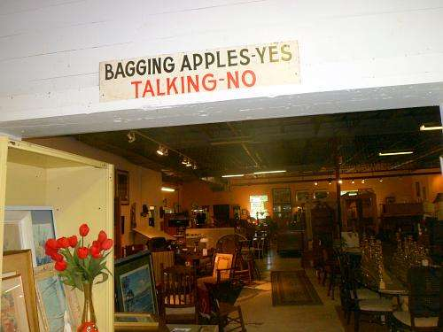

_An Antique shop, formerly an apple factory_

## Google’s Travel Time Patent

Can the amount of travel time someone might take to get to a place be a good indication of the quality of that place? That is the assumption behind a recently granted patent from Google that focuses upon [local SEO](https://www.seobythesea.com/services-from-seo-by-the-sea/local-search-seo/).

Travel time in the patent is referred to as a “time investment a person may be willing to make to visit a specific location.” The travel time patent provides more details with the words:

> Quality measures for locations are often based on one or more reviews related to the locations. For example, user reviews and/or professional reviews may be utilized to determine a quality measure for a given location. The quality measures may be associated with the given location in a database and may be utilized by one or more applications and/or provided to a user. For example, a user search for restaurants in a particular area may return search results for restaurants ranked based on the quality measure and/or displayed in combination with an indication of the quality measure. Indications of the quality measure may include a numerical rating, many stars, etc.

This patent reminded me of one granted last week, which I wrote about in the post [Google May Check to See if People Go to Geographic Locations Google May Recommend](https://www.seobythesea.com/2017/02/google-may-check-see-people-go-geographic-locations-google-may-recommend/). In both, Google is looking at whether someone might have visited a place found in Google Maps, based either upon a recommendation of a place or seeing a place in search results. The “time investment” referred to in this patent does mean the actual time it may have taken to visit a place seen in search results:

> The present disclosure is directed to methods and apparatus for determining the quality measure of a given location. In some implementations, the quality measure of a given location may be determined based on the time investment a user is willing to visit the given location. For example, the time investment for a given location may be based on comparing one or more actual distance values to reach the given location to one or more anticipated distance values to reach the given location. The actual distance values are indicative of the actual time of one or more users to reach the given location, and the anticipated distance values are indicative of an anticipated time to reach the given location. In some implementations, the anticipated distance value may be one or more distributions. Likewise, in some implementations, the actual distance value may be one or more distributions. Such distributions may be continuous and/or discrete. In some implementations, the quality measure may be based on additional factors such as one or more location characteristics of the given location and/or more user characteristics of the visitors to the given location.

How far away would you travel for a slice of pizza or a fish taco? Google seems to be using such a measure as a potential way to rank businesses against each other.

We are told that a ranking of this travel time to reach a particular location might include a ranking that indicates how many competing locations may have been bypassed to reach that particular location.

The patent is:

[Determining the quality of locations based on travel time investment](http://patft.uspto.gov/netacgi/nph-Parser?Sect1=PTO1&Sect2=HITOFF&d=PALL&p=1&u=%2Fnetahtml%2FPTO%2Fsrchnum.htm&r=1&f=G&l=50&s1=9,558,210.PN.&OS=PN/9,558,210&RS=PN/9,558,210)
Inventors: Andrew Tomkins, Sergei Vassilvitskii, Shanmugasundaram Ravikumar, Mohammad Mahdian, Bo Pang, and Prabhakar Raghavan
Assignee: Google
The United States Patent 9,558,210
Granted: January 31, 2017
Filed: March 15, 2013

Abstract

> Methods and apparatus related to associating a quality measure with a given location. For example, an anticipated distance value for a given location may be identified that indicates the anticipated time and/or distance to reach the given location. At least one actual distance may be identified that indicates the actual time for one or more members to reach the given location. In some implementations, the anticipated/actual distance values may include one or more distributions. A quality measure is then determined based on comparing the anticipated distance value and the identified actual distance value. The quality measure is associated with the given location. The quality measure may be further based on additional factors.

## New Features at Google Maps

Google Maps is issuing some interesting new approaches and new features as well. For example, the patent that this post is about notes how to travel time to a place, and whether or not people are willing to take a journey to that place may boost the rankings of places in search results. Likewise, whether or not someone may visit a place recommended in Maps results could boost or reduce the appearance of recommendations for places, as in the patent I wrote about yesterday. Today, an article has come out that tells us about the ability to make shareable lists of places with Google Maps – [Google Maps makes your favorite places social with the launch of shareable lists](https://arstechnica.com/information-technology/2017/02/google-maps-makes-your-favorite-places-social-with-launch-of-shareable-lists/).

It’s fun seeing these new features and processes added to Google Maps and may leave us guessing what may come next.

The patent looks at other aspects of a “time investment” that people may make, which could be used to measure the quality of a place found in search results, such as whether people were willing to walk to a place rather than driving. That would be a slightly different way of thinking about travel time.
