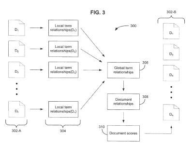

## Google’s Word Relationships Patent

My last post, [Not All Anchor Text is Equal and other Co-Citation Observations](https://www.seobythesea.com/2012/11/not-all-anchor-text-is-equal-other-co-citation-observations/), was a response to a White Board Friday video posted a couple of weeks ago at the SEOmoz Blog, [Prediction: Anchor Text is Dying…And Will Be Replaced by Co-citation](https://moz.com/blog/prediction-anchor-text-is-dying-and-will-be-replaced-by-cocitation-whiteboard-friday). I didn’t expect my next post (this one) to revisit that post and its observation that the way certain words might co-occur on pages might be a possible ranking signal that Google may be using as described in a Patent that focuses upon word relationships.

Rand noted that first page rankings for three different pages, which didn’t seem very much optimized for the queries they were returned for, might be ranked based upon a ranking signal that looks at how words tend to co-occur on pages related to those queries. My post in response explored some reranking approaches by Google that also might account for those rankings, including Phrase-Based Indexing, Google’s Reasonable Surfer Model, Named Entity Associations, Category associations involving categories assigned to queries and categories assigned to web pages, and Google’s use of synonyms in place of terms within queries.

Google’s [Phrase-Based Indexing](https://www.seobythesea.com/2011/12/10-most-important-seo-patents-part-5-phrase-based-indexing/) approach pays a lot of attention to words (phrases, actually) that appear together, or co-occur, in the top (10/100/1,000) search results for a query and may boost pages in rankings based upon that co-occurrence, and seemed like a possible reason why those pages might be appearing on the first page of results. The other reranking approaches that I included also seemed like they might be in part or fully responsible for the rankings as well. Then I found a patent granted to Google this week that seems like an even better fit, as a Co-Occurrence Patent.

**Word Relationships and Document Rankings**

The sign below is in front of an old hotel on the outskirts of town. People used to stop at the hotel on their way to Skyline Drive in the Shenandoah National Park about 30 minutes away. The two words in the sign, “Vacancy” and “Enter” convey a lot of meaning with a minimum of words.

What if you could pick out the most significant words in a document, and based upon how close they might be to each other, determine both how related they are and how significant they might be to the document they appear within together?

## How would this Word Relationships Patent Work?

Perform a query at Google for a term such as “Mockingbird” and take the top 1,000 or so documents that appear in the search results responding to that search. Extract most of the terms from those documents after marking where they appear on the page, and calculate scores for each of the words based upon things such as how many times they occur in a document, and how close to the beginning of the document they might be.

Perform a capitalization analysis and a part of speech analysis to determine if the terms might be nouns, proper nouns, named entities, or even nuggets of information such as sentences. These might be scored higher than verbs or other types of terms within the document. Other types of analysis might also be used to determine if a term is a named entity.

Filter out the terms that tend to appear pretty commonly on the Web using something like a [term frequency-inverse document frequency](http://en.wikipedia.org/wiki/Tf%E2%80%93idf) (TFIDF) score for those documents to see which terms are common. The top 20 or so terms that are above a certain threshold based upon the TFIDF analysis might be kept for a document, and the rest eliminated. These remaining terms are the most significant in the document.

Then calculate relationship scores for the terms leftover in each document. Words that interact in a document by being near each other are said to have a relationship. Proximity might be seen if the words appear in the same sentence, or the same paragraph, or within a certain number of sentences from each other. These are local term relationships. If one of the remaining terms has no local term relationships with any of the other terms, it is disregarded.

Term scores for a document are calculated based upon the first position of the term in the document, and a distance between that term and the closest distance between it and another of the terms, based upon the number of sentences apart they might be. If they are in the same sentence, that distance would be zero.

After the terms in all of the documents have been extracted and scored and word relationship scores have been figured out, determine relationships among the documents based on the local term relationships and the initial order of the documents. A score for each of those documents can be generated by looking at which documents have terms in common, and among those documents with common terms, and something like a combination of the original ranking score and a document score based upon all of the co-occurrence or term relationship scores within each document.

The Word Relationships Patent tells us that the advantages of using this method are:

- More diverse search results are presented for an ambiguous query
- The order in which search results are presented may be re-arranged such that the topmost search results introduce a more diverse range of information
- Relationships between documents that have no hyperlinks connecting them can be determined. Terms related to a given term in a corpus of documents can be identified and presented as related terms that can be used as navigational references to documents in the corpus.

The word relationships Patent is:

[Document ranking using word relationships](http://patft.uspto.gov/netacgi/nph-Parser?Sect1=PTO1&Sect2=HITOFF&d=PALL&p=1&u=%2Fnetahtml%2FPTO%2Fsrchnum.htm&r=1&f=G&l=50&s1=8,321,409.PN.&OS=PN/8,321,409&RS=PN/8,321,409)
Invented by Sharad Jain
Assigned to Google
US Patent 8,321,409
Granted November 27, 2012
Filed: June 30, 2011

Abstract

> Methods, systems, and apparatus, including computer program products, for scoring documents. A plurality of documents with an initial ordering is received. Local term relationships between terms in the plurality of documents are identified, each local term relationship is a relationship between a pair of terms in a respective document.
>
> Relationships among the documents in the plurality of documents are determined based on the local term relationships and the initial order of the documents. A respective score is determined for each document in the plurality of documents based on the document relationships.

**Word Relationships Patent Take Aways**

The process described in this Co-Occurrence Patent attempts to identify the most important and significant terms on top-ranked pages returned in response to a query. It looks at the strength of the relationships of those terms with other important terms on the same pages. It creates scores for the documents based on the locations of those terms within the documents and the relative distances between the important terms to each other (with the closest distance being the one used if the terms appear more than once).

The scores of the documents and differences in significant terms within each may influence rankings in two possibly different ways. The document scores might be combined with the original score for a page to boost it in the set of search results.

Differences in which words are significant words within the document might indicate diverse types of results and an ambiguous query term and may lead to the search engine rearranging the results to cover a broader range of meanings earlier on in search results. For example, on a query for the term “java,” there might be some results about the programming language, some about the island, and some about the drink. The significant words or terms for each page might point to three different meanings for the query term that should be represented on the first page of search results.

Because of the boosting-based upon document scores, and the rearranging based upon showing diverse results, it’s possible that some pages that aren’t as highly relevant for the query term may be moved up a lot in search results.

Look at the last webpage or blog post you might have published, and see if you can guess which words might be identified by Google as the most significant words on the page, and how strong the relationships between those words might be. Does their co-occurrence on your page influence the ranking of that page?

Note that this Words Relationship Patent process doesn’t replace an information retrieval score for a page based upon the use of the query terms (or synonyms for those terms) on the page or in links to the page, and an importance score based upon something like PageRank. Instead, it adds a filter or additional weighting and also tries to add more diversity to search query results.

Is Google using this kind of co-occurrence of significant terms on pages to influence their rankings?

- [How Google May Substitute Query Terms with Co-Occurrence](https://www.seobythesea.com/2013/08/google-substitute-query-terms-co-occurrence/)
- [Ranking Webpages Based upon Relationships Between Words (Google’s Co-Occurrence Patent)](https://www.seobythesea.com/2012/11/ranking-webpages-relationships-co-occurrence-patent/)
- [Yahoo Phrase Based Indexing in a Nutshell](https://www.seobythesea.com/2008/02/yahoo-phrase-based-indexing-in-a-nutshell/)
- [Phrase Based Information Retrieval and Spam Detection](https://www.seobythesea.com/2006/12/phrase-based-information-retrieval-and-spam-detection/)
