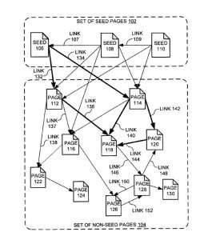

A Google patent was granted on October 20th, 2015 titled [Producing a ranking for pages using distances in a Web-link graph](http://patft.uspto.gov/netacgi/nph-Parser?Sect1=PTO1&Sect2=HITOFF&d=PALL&p=1&u=%2Fnetahtml%2FPTO2Fsrchnum.htm&r=1&f=G&l=50&s1=9,165,040.PN.&OS=PN/9,165,040&RS=PN/9,165,040). It presents some changes to Google’s original PageRank.

I wrote about the very first PageRank patent in my post [The First PageRank Patent and the Newest](https://www.seobythesea.com/2011/03/the-first-pagerank-patent-and-the-newest/), where I posted a link to the original provisional copy of Lawrence Page’s [Improved Text Searching in Hypertext Systems](https://www.seobythesea.com/improved-text-searching-in-hypertext-systems.pdf) (pdf – 1.7m)

Under this new patent, Google adds a diversified set of trusted pages to act as seed sites. When calculating rankings for pages. Google would calculate a distance from the seed pages to the pages being ranked. A use of a trusted set of seed sites may sound a little like the TrustRank approach developed by Stanford and Yahoo a few years ago as described in [Combating Web Spam with TrustRank](http://www.vldb.org/conf/2004/RS15P3.PDF) (pdf). I don’t know what role, if any, the Yahoo paper had on the development of the approach in this patent application, but there seems to be some similarities.

_Ranks would be based in part upon distances of links from seed pages._

The new patent is:

[Producing a ranking for pages using distances in a Web-link graph](http://patft.uspto.gov/netacgi/nph-Parser?Sect1=PTO1&Sect2=HITOFF&d=PALL&p=1&u=%2Fnetahtml%2FPTO2Fsrchnum.htm&r=1&f=G&l=50&s1=9,165,040.PN.&OS=PN/9,165,040&RS=PN/9,165,040)
Inventor: Nissan Hajaj
Application Date: 12.10.2006
Publication Number: 9,165,040
Publication Date: 20.10.2015
Granted: 20.10.2015
Abstract:

> Methods, systems, and apparatus, including computer programs encoded on a computer storage medium, for producing a ranking for pages on the web. In one aspect, a system receives a set of pages to be ranked, wherein the set of pages are interconnected with links.
>
> The system also receives a set of seed pages which include outgoing links to the set of pages. The system then assigns lengths to the links based on properties of the links and properties of the pages attached to the links. The system next computes shortest distances from the set of seed pages to each page in the set of pages based on the lengths of the links between the pages.
>
> Next, the system determines a ranking score for each page in the set of pages based on the computed shortest distances. The system then produces a ranking for the set of pages based on the ranking scores for the set of pages.

The “trusted pages” in this process appear to follow the same assumption that the seed pages in the Yahoo Trustrank approach follow, that “good pages seldom point to bad ones.”

The inventor of this patent has been at Google for a while. Back in 2008, he was one of the co-authors of a Google Blog post that told us that Google had achieved a milestone after indexing over a trillion pages, in the post [We knew the web was big…](https://googleblog.blogspot.com/2008/07/we-knew-web-was-big.html) According to his LinkedIn Profile, Nissan Hajaj has been a Sr. Staff Engineer at Google since August of 2004, as an “Algorithms Developer and multi-disciplined team leader/member for innovative projects in a variety fields of engineering.”

If you want to drill down into the details of this new ranking algorithm, the best place to start may be with the claims from the patent.

It’s difficult to say whether or not Google may have adopted this new ranking approach, and made it live.

Google has filed a continuation patent version of this patent, which was granted in 2018. I wrote about it in the post: [PageRank Update](https://www.seobythesea.com/2018/04/pagerank-updated/)
