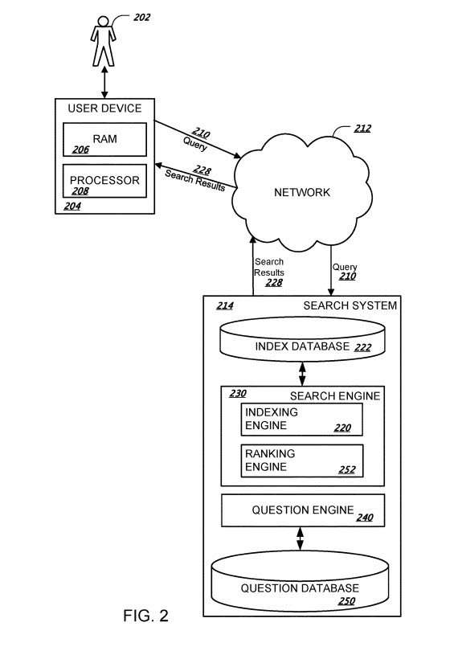
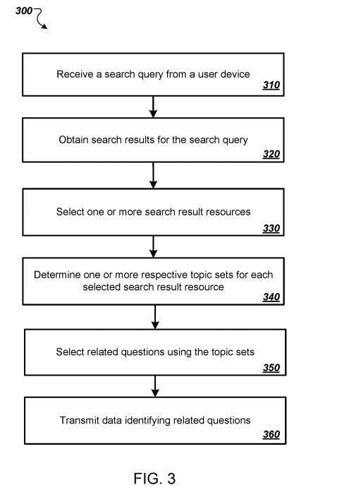

I recently bought a lemon tree and wanted to learn how to care for it. So, I started asking about it at Google, which provided me with other questions and answers related to caring for a lemon tree. As I clicked upon some of those, others were revealed that gave me more information that was helpful.

Last March, I wrote a post about Google Related Questions, [Google’s Related Questions Patent or “People Also Ask” Questions](https://www.seobythesea.com/2017/03/googles-related-questions-patent-people-also-ask-questions/).

## Google Patent Updated to Include a Question Graph

As Barry Schwartz noted recently at Search Engine Land, Google is now also showing alternative query refinements as ‘People Also Search For’ listings, in the post, [Google launches a new look for “people also search for” search refinements](https://searchengineland.com/google-launches-new-look-people-also-search-search-refinements-291918). That was enough to have me look to see if the original Google Related Questions patent was updated. It was. A continuation patent was granted in June of last year, with the same name but updated claims.

The older version of the patent can be found at [Generating related questions for search queries](http://patft.uspto.gov/netacgi/nph-Parser?Sect1=PTO1&Sect2=HITOFF&d=PALL&p=1&u=%2Fnetahtml%2FPTO%2Fsrchnum.htm&r=1&f=G&l=50&s1=9213748.PN.&OS=PN/9213748&RS=PN/9213748).

It doesn’t say anything about the changing of the wording of Google Related Questions. Some “people also search for” results don’t necessarily take the form of questions, either (so “people also ask” may be very appropriate and continue to be something we see in the future.) But the claims from the new patent contain some new phrases and language that wasn’t in the old patent. The new Google patent is at:

[Generating related questions for search queries](http://patft.uspto.gov/netacgi/nph-Parser?Sect1=PTO1&Sect2=HITOFF&d=PALL&p=1&u=%2Fnetahtml%2FPTO%2Fsrchnum.htm&r=1&f=G&l=50&s1=9,679,027.PN.&OS=PN/9,679,027&RS=PN/9,679,027)
Inventors: Yossi Matias, Dvir Keysar, Gal Chechik, Ziv Bar-Yossef, and Tomer Shmiel
Assignee: Google Inc.
US Patent: 9,679,027
Granted: June 13, 2017
Filed: December 14, 2015

Abstract

> Methods, systems, and apparatus, including computer programs encoded on computer storage media, are described for identifying related questions for a search query. One of the methods includes receiving a search query from a user device; obtaining a plurality of search results for the search query provided by a search engine, wherein each of the search results identifies a respective search result resource; determining one or more respective topic sets for each search result resource, wherein the topic sets for the search result resource are selected from previously submitted search queries that have resulted in users selecting search results identifying the search result resource; selecting related questions from a question database using the topic sets, and transmitting data identifying the related questions to the user device as part of a response to the search query.

The first claim brings a new concept into the world of related questions and answers, which I will highlight in it:

> 1. A method performed by one or more computers, the method comprising: generating a question graph that includes a respective node for each of a plurality of questions; connecting, with links in the question graph, nodes for questions that are equivalent, comprising: identifying selected resources for each of the plurality of questions based on user selections of search results in response to previous submissions of the question as a search query to a search engine; identifying pairs of questions from the plurality of questions, wherein the questions in each identified pair of questions have at least a first threshold number of common identified selected resources; and for each identified pair, connecting the nodes for the questions in the identified pair with a link in the question graph; receiving a new search query from a user device; obtaining an initial ranking of questions that are related to the new search query; generating a modified ranking of questions that are related to the new search query, comprising, for each question in the initial ranking: determining whether the question is equivalent to any higher-ranked questions in the initial ranking by determining whether a node for the question is connected by a link to any of the nodes for any of the higher-ranked questions in the question graph; and when the question is equivalent to any of the higher-ranked questions, removing the question from the modified ranking; selecting one or more questions from the modified ranking; and transmitting data identifying the selected questions to the user device as part of a response to the new search query.

## Just What is a Question Graph?

A question graph would be a semantic approach towards asking and answering questions related to each other in meaningful ways. A Drawing from the patent shows related questions are chosen from appropriate topic sets:

In addition to the “question graph” mentioned in that first claim, we are also told that Google is keeping an eye upon how often it appears that people are selecting these related questions and watching how often people are clicking upon and reading those.

The descriptions and the images in the patent are from the original version of the patent, so there aren’t any that reflect upon what a question graph might look like. For a while, Facebook introduced graph search as a feature that you could use to search on Facebook and that used questions related to each other. I found a screen that shows some of those off, and such related questions could be considered from a question graph of related questions. It isn’t quite the same thing as what Google is doing with related questions, but the idea of showing questions that may be related to an initial one in a query and keeping an eye upon those to see if people are spending time looking at them makes sense. I’ve been seeing a lot of related questions in search results and have been using them. Here are the Facebook graph search questions:

As you can see, those questions share some facts and are considered to be related to each other because they are. This makes them similar to questions found from a question graph that might mean they could be of interest to a searcher who asks the first query. Interestingly, the claims from the new patent ask about whether or not the questions being shown are being clicked upon, and that tells Google if there is any interest on the part of searchers to continue to see related questions. I’ve been finding them easy to click upon and interesting.

Are you working on questions and answers to your content?

Last Updated September 1, 2019
