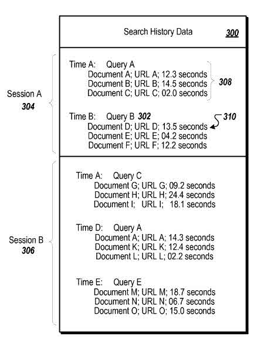
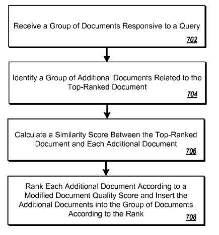

When I talk about or write about entities, it’s normally in the context of specific people, places, or things. Google was granted a patent recently which discusses a different type of entity, more narrowly. These entities are referred to as “search entities”, and the patent uses them to predict probabilities and understand the relationship between them better. This kind of analysis might result in some pages ranking higher than they otherwise might because of their similarities to other sites, and in some sets of search results favoring fresher results as well.

These search entities can include:

- A query a searcher submits
- Documents responsive to the query
- The search session during which the searcher submits the query
- The time at which the query is submitted
- Advertisements presented in response to the query
- Anchor text in a link in a document
- The domain associated with a document

There are many different ways that Google might create a “probability score” based upon relationships between these different types of search entities.

These probability scores can have the following impacts:

1) Relationships between search entities can be identified, including queries, documents retrieved, domains those documents are on, query sessions, advertisements shown in response to a query, and the time of submission of a query.

2) The strength of relationships between these entities can be measured using a metric obtained from direct relationship strengths (derived from data indicating user behavior, such as user search history data) and indirect relationship strengths (derived from the direct relationship strengths).

3) The relationships may be used in several ways. For example, the relationships can be used to propagate a property of one entity to other related entities.

4) A relationship between a first entity that has insufficient support (e.g., not enough search history data) to associate a given property with the first entity and a second entity that does have sufficient support to associate the given property with the second entity can be identified, and the given property can be associated with the first entity with higher confidence.

5) The relationships can be used to provide a query suggestion feature to a user, where queries related to queries submitted by a user are identified.

6) The relationships can be used to more accurately rank search results responsive to a query.

7) The relationships can be used to provide a vertical search feature, where documents related to a group of documents are identified.

8) The vertical search feature can be used to augment a set of search results responsive to a query with additional documents related to the top-ranked documents that are responsive to the query.

9) Scoring of long-tail documents (e.g., documents for which there is little search history and other scoring data that can be used to score the documents) can be improved by scoring documents based on anchors, text, queries, and other signals associated with related documents.

10) Domains can be classified based on queries associated with documents in the domain, and similar domains can be clustered.

11) Queries can be related based on times when they have an increase in popularity

12) Queries that are about to become popular can be identified, and fresh results can be favored for these queries.

13) Queries and sessions can be identified as spam from a session known to be spam.

14) The impact that spam sessions and spam queries have on scoring can be reduced.

The patent is:

[Search entity transition matrix and applications of the transition matrix](http://patft.uspto.gov/netacgi/nph-Parser?Sect1=PTO2&Sect2=HITOFF&p=1&u=%2Fnetahtml%2FPTO%2Fsearch-adv.htm&r=1&f=G&l=50&d=PALL&S1=08515975&OS=PN/08515975&RS=PN/08515975)
Invented by Diego Federici
Assigned to Google
Granted August 20, 2013
Filed: December 7, 2009

Abstract

> Methods, systems, and apparatus, including computer programs encoded on computer storage media, for using search entity transition probabilities. In some implementations, data identifying entities and transition probabilities between entities is stored in a computer-readable medium. Each transition probability represents the strength of a relationship between a pair of entities as they are related in search history data.
>
> In some implementations, an increase in popularity for a query is identified and a different query is identified as temporally related to the query. Scoring data for documents responsive to the different query is modified to favor newer documents. In other implementations, data identifying the first session as spam is received, and a spam score is calculated for either the second session of queries or a single query using transition probabilities. The second session (or single query) is identified as spam from the spam score.

## Search Histories

Someone submits a query to a search engine. The search system returns search results by identifying documents that match the query.

Search history data is collected as someone performs several searches, clicking upon results, viewing documents, and returning to the search results page.

The search history data may include:

- The time a query is submitted
- What documents a user clicked on, and
- How long the user dwelled on the documents.

Click data is the amount of time that someone may have viewed a document. A longer time dwelling on a document is referred to as a “long click”, and may indicate that a searcher found the document to be relevant to the query. A brief period viewing a document can be termed a “short click”, indicating a lack of document relevance.

Search history data might be divided into segments that correspond to different sessions. A query session is a period during which a user submits queries, and can be measured in a number of ways including:

- A specified period of time (for example, thirty minutes)
- By a specified number of queries (for example, fifteen queries)
- Until a specified period of inactivity (for example, ten minutes without submitting a query)
- While a searcher is logged-in
- While a searcher submits queries related to similar topics

Search history can include information about the different search entities.

## Example: Quality of Results Statistics

During Session A, at Time A, searcher looked for Query A, viewed Document A for 12.3 seconds, Document B for 14.5 seconds and, and Document C for 2.0 seconds.

First-order transition probabilities can be taken from the search history data, using an entity type-specific transfer function to calculate the transition probability between two entities.

A document-to-query transition probability taken from the search history data estimates a strength of a relationship between a document and a query based on how likely searchers viewing the document are to find the document to be a responsive search result for the query. In our example above, where the searcher viewed three different documents for different amounts of time, the document to query transition property is strongest for Document B, then for Document A, and weakest for Document C.

This probability is a part of a “quality of result” statistic estimating how responsive searchers found specific documents to be as search results for a specific query.

The statistic would look at how many long clicks there were for a document when it was presented in response to a query, divided by the total number of clicks for all documents clicked upon in response to that query.

## Other Quality of Results Statistics

A different quality of results statistic can be calculated from click data for the document, the query, and other queries similar to the query.

Queries might be considered similar when they differ only in:

- Small differences in spelling
- Small differences in word order
- The use of abbreviations
- The use of synonyms
- The use of stop words
- The edit distance for the two queries

The document-to-query transition probability might be based upon the percentage of all documents in the search results that appear to be responsive to a query.

## Example: Documents to Search Sessions Transition Probabilities

A document-to-session transition probability can also be calculated from the search history data.

This probability estimates the strength of a relationship between a document and a session based upon whether the document was viewed during the session, and optionally how many documents are viewed during the session.

In one version, a document-to-session transition probability between document A and session B might be found by analyzing whether document A was clicked on during session B. If not, the document-to-session probability is 0. If document A was clicked on, the system can calculate the document-to-session probability by dividing 1 by the number of documents that were clicked on during the session.

Alternatively, if the click on the document was a long click, it might have a value of 1, and if a short click, 0.

## Example: Queries to Search Sessions

Query-to-session and session-to-query transition probabilities can also be calculated from search history data.

A query-to-session transition probability estimates the strength of a relationship between a query and a session based on whether the query was submitted during the session and optionally how many queries were submitted during the session.

A session-to-query transition probability estimates a strength of a relationship between a session and a query based on whether the query is submitted during the session, and optionally how many sessions the query is submitted in.

A query-to-session transition probability, such as the transition probability from query A to session A, is 0 if the query A was not submitted in session A, and otherwise is 1 divided by the number of queries submitted during the session.

Again, this could include the original query, and queries that are similar to that query.

## Example: Queries to Time Transitions

Query-to-time transition probabilities can be generated from the search history data.

A query-to-time transition probability measures the strength of a relationship between a given query and a given time based on whether the given query had an increase in popularity at the given time, and optionally, how often the given query had increases in popularity.

The transition probability from query A and time B can be calculated from the search history data by determining whether query A has a significant increase in popularity at time B. If not, then the query-to-time transition probability is 0. If query A does have a significant increase in popularity at time B, then the system can calculate the query-to-time transition by dividing 1 by the number of times the query had a significant increase in popularity.

Whether a given query had a significant increase in popularity at a given time can be determined by analyzing a popularity measure for the query over time.

The popularity measure can be the number of times a query is submitted during a given period divided by the total number of queries submitted during the period. If the change in popularity measures from one time period to the next changes more than a threshold, then the query had a significant increase in popularity during the time where the change was observed. The threshold can be determined empirically and can be:

- An absolute amount,
- A percentage of the popularity measure for the first period,
- A percentage of the popularity measure for the period where the change was observed.

### The Impact of Geographical Locations on Queries to Time Transitions and Geographic Locations

The transition probability from a query to time can be further based on the geographic location from where the query was submitted, for example, to identify whether there has been a significant increase in popularity for the query from a certain geographic location at a certain time.

For example, the popularity measure can be the number of times the query is submitted from a given geographic location divided by the total number of queries submitted from that geographic location.

Examples of geographic location include, for example, continents, countries, states, and cities.

## Example: Time to Query Transitions

A time-to-query transition probability can be taken from the search history data, too.

A time-to-query transition probability estimates a strength of relationship from a time and a query based on whether the query had an increase in popularity at the time, and optionally, how many other queries had an increase in popularity at the time.

The transition probability from time B and time A is calculated from the search history data by determining whether query A has a significant increase in popularity at time B. If not, then the query-to-time transition probability is 0. If query A does have a significant increase in popularity at time B, then the query-to-time transition is 1 divided by the number of queries having a significant increase in popularity at time A.

The transition probability from a time to a query can be further based on the location where the query was issued, for example, to identify whether there has been a significant increase in popularity for the query from a certain location at a certain time.

## Domain and Document Transition Probabilities

The system can calculate document-to-domain transition probabilities and domain-to-document transition probabilities from relationships between documents and domains that are external to the search history data.

The document-to-domain transition probability measures whether a given document is in a given domain.

In some implementations, the document-to-domain transition probability, such as the transition probability from document A to domain A, is 0 if the document is not in the domain, and 1 if the document is in the domain.

Heuristics can be used to resolve permanent redirects during aggregation and avoid aggregation over hosting domains such as blogspot.com.

For example, the system can look at domain registration to determine who is associated with certain documents and certain domains and can receive feedback from human evaluators on documents that have permanent redirects and what domains are hosting domains.

Other heuristics for resolving permanent redirects and avoiding aggregation over hosting domains can also be used.

A domain-to-document transition probability measures the strength of a relationship between a given domain and a given document, for example, based on how important the document is to the domain (e.g., whether the document is in the domain, and optionally, how many other documents are in the domain).

In some implementations, the domain-to-document transition probability, such as the transition probability from domain A to document A, is 0 if the document is not in the domain, and otherwise is 1 divided by the number of documents in the domain.

## Queries to Advertisement Transitions

The system can also calculate a query-to-advertisement transition probability that measures how important revenue from an advertisement is to the overall revenue generated for the query.

The system may calculate the transition probability from query B to advertisement A by dividing the revenue generated when advertisement A is displayed in response to query B by the total revenue generated by advertisements presented in response to query B.

The system can also calculate an advertisement-to-query transition probability that measures how important revenue from a query is to the overall revenue generated for an advertisement.

For example, the system can calculate the transition probability from advertisement A to query B by dividing the revenue generated when advertisement A is presented in response to query B by the total revenue generated from advertisement A

## Other Uses of Transition Probabilities

- Determining how commercial a query is
- Identifying related queries
- Higher rankings for documents based upon shared queries for those documents
- Identifying documents relevant to a topic from an initial group of documents related to a topic
- Augmenting a group of documents responsive to a query with documents related to the top ranked document in the group of documents
- Identifying a group of additional documents related to the top-ranked document
- Scoring and ranking a first document relevant to a query based on anchors from a second document that is related to the first document
- Classifying a domain based on queries related to the domain
- Identifying a second spam session from a first spam session
- Identifying an spam query from an spam session

Heres’ an example of one of those from the patent’s images:

