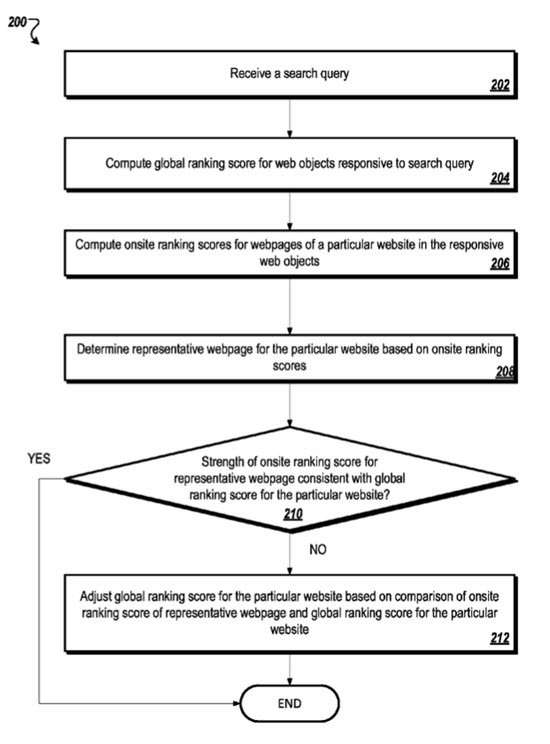
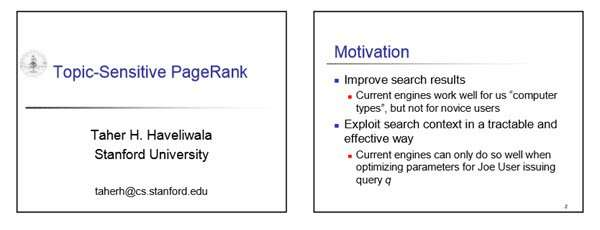

Representatives from Google announced recently that they would no longer be updating their PageRank toolbar annotations for web pages. Google had been updating those 3-4 times a year for over a decade.

Does this news indicate that Google is [no longer using PageRank](https://searchengineland.com/google-toolbar-pagerank-finally-officially-dead-205277), or that PageRank has changed in some significant way? (The ranking signal isn’t the toolbar annotation itself, which was too infrequently updated to be an accurate reflection of what PageRank might have been for a page)

_We’ve been told that Google will no longer be updating this annotation or proxy for PageRank._

Could it be a sign that Google has found something different?

A Google patent granted this past September has aspects that involve a global score for web pages (or websites) that in some ways are similar to PageRank.

It also has a way of ranking individual pages within a site that could lessen the global score if the pages similar to a query aren’t essential to the site.

_A flow chart from the patent giving an overall synopsis of how it works._

There are elements of the ranking signals used that are independent of the topic of a query involving things such as how many links are pointed to pages and how many links are pointed externally from the pages of a site.

Parts of it reminded me of [Jon Kleinberg’s Hubs and Authorities](http://www.cs.cornell.edu/home/kleinber/auth.pdf) scores. That was developed around the time that PageRank was, but looked at a couple of different metrics to determine how authoritative pages might be.

There also seems to be an element that looks at the themes of pages and sites and links from them to other pages on other sites, and find value in common topics between them, like a [Topic Sensitive PageRank](http://infolab.stanford.edu/~taherh/papers/topic-sensitive-pagerank-tkde.pdf).

_A slide from a presentation from the inventor of Topic Sensitive Pagerank, who has long been a Google Search Engineer_

The patent starts simply by telling us that search engines rank web pages and other objects (images, videos, books, businesses, and others) to show search results responsive to a query. The order of those results may be based on various factors.

One type of information used in rankings can be from external sources to the web pages, which reflect both quality of that page and information about the content of the page that reflected the relevance of the web page for a query.

## Global Rankings

When a search engine receives a query, objects (pages, images, media files, etc.) are ranked to generate a global ranking. The ranking is based at least in part on how relevant they are to a query and the relative authority of each object compared to other objects, including objects based on other sites and the same site.

## Onsite Rankings

Many pages from each site can be ranked based on onsite criteria to create an onsite ranking.

A combined ranking is created for each page based on a combination of the global rank of the site and the onsite ranking of the page.

In response to a query, a list of pages may be presented based on combined rankings.

## Possible Features in this Process

So, the global ranking of a page is modified by the website’s internal structure it is within, or some threshold level of the relative authority of the page compared to other pages, possibly based in part on the relative placement of the page within the internal structure. This could be done in part by analyzing links to the page from other pages on the site. Sort of like a PageRank analysis limited to a single site.

This ranking might involve looking at:

- One of a type of the search query
- A type of the corresponding website
- A relative age of the particular resource with respect to other pages from the site
- A type of content associated with the particular resource

The onsite ranking criteria used to rank Web pages within the site are different than the global ranking criteria used to rank the web pages.

## A Representative Onsite Ranking for a Page

Onsite ranking scores are computed for pages of a site compared to other pages of the site. A representative page may be determined for the site based on the onsite ranking scores for the site’s pages. The global ranking score for the site may be adjusted based on the onsite ranking score for the representative page.

Additional aspects of ranking features:

- The global ranking score for a site may be computed based on data identified without reading information from the particular site. In other words, that score is [query independent](https://www.microsoft.com/en-us/research/publication/query-independent-evidence-in-home-page-finding/) and the topic of the query doesn’t matter.
- The global ranking score for a site may be based, at least in part, on a level of trust in a domain associated with the particular site. This sounds like it anticipates the possibility that multiple sites might be contained on one domain, like a WordPress.com.

Interestingly, the link above using the anchor “query independent” is from an article partially by one of the inventors of this patent, titled “Query-Independent Evidence in Home Page Finding.” I suspect that I’ll be looking for and finding more aspects of this patent reflected in other papers and patents and so on.

## Possible Advantages

The patent points out the following “advantages.”

(1) Search result relevance might be increased by incorporating local signals into their rankings.

(2) Local signals may include information relevant to a particular site and may also provide additional information for ranking a site relative to other sites in search results.

(3) In the possibility of reading inaccurate or unreliable data from local signals, that may be balanced by looking at the structure of a site or the relative authority of the site when using local signals to rank search results.

[Onsite and offsite search ranking results](https://patents.google.com/patent/US8843477)
Invented by Sundeep Tirumalareddy, and Trystan G. Upstill
Assigned to Google
US Patent 8,843,477
Granted September 23, 2014
Filed: October 31, 2011

Abstract

> Methods, systems, and apparatus, including computer programs encoded on a computer storage medium, for ranking search results.
>
> One method includes ranking web objects in response to a search query to:
>
> - Generate a global ranking based on the relevance of each web object to the search query and relative authority of each web object compared to other web objects in the plurality of web objects, each web object including a web page in a corresponding website that includes a plurality of web pages;
> - Ranking the plurality of web pages corresponding to each website based on onsite ranking criteria to generate an onsite ranking;
> - Generating a combined ranking for each web page based on a combination of the global ranking of the web object that includes the web page and the onsite ranking of the web page; and
> - Presenting web pages responsive to the search query based on the combined rankings.

## Offsite Data

The global ranking may involve the offsite data, including signals that can be identified without reading information from the web object, such as:

- Number of links to a page or site from other unrelated sites
- Number of times the page or site has been selected in search results for a particular query
- Other statistical data about the relevance or authority of a site associated with the page

## Onsite Data

Onsite data may also be used with offsite data to compute the global ranking score in the search results.

Onsite data can include data based on information obtained from the page or site, such as:

- number of keywords on the web page or website responsive to the search query
- Location of the responsive keywords
- Number of links to the web page from other pages on the same domain, and/or
- Placement of the web page in the website’s structure – a homepage may be regarded as more important than another page requiring navigation through several hyperlinks before it can be viewed.

## Other Issues Regarding Ranking Web Pages

More than one page on a site might be relevant to a query, and these “related” pages might be compared by looking at things such as the “onsite data” listed above that includes things such as keywords on a web page related to a query, etc.

For example, the global ranking score may be based on offsite data and onsite data, but more weight may be given to offsite data when calculating the global ranking score. Similarly, the onsite ranking score may be based on onsite data and offsite data but with more weight given to the onsite data.

Some other signals may include:

(1) How many times a word is used – a page with more than one instance of the word “laptop” could indicate the page is relevant to “laptop computers.”

(2) How prominent a word is on a page – Like using that word “laptop,” further confirming its importance in the content of the web page if it appears in the header of the page.

(3) How important the word is on a page compared to other pages on the site, such as how often it is linked to other pages on the same domain compared to others.

## Offsite Data

This kind of page data may be seen as being outside the webmaster’s control that may indicate relevance, authority, popularity, or importance to a certain subject matter or a specific query.

***Topical Relevance to other sites*** – This offsite data may relate to how important or authoritative a site might be compared to other sites as well, or to the importance of a particular page on a site compared to pages on other sites. So, pages associated with well-respected domains and are relevant to laptop computers, and all links to a particular site can indicate the relative importance of the site being linked to.

***Authoritative Relevance to other sites*** – The number of links to the site from others may indicate a higher authority associated with the particular site. The offsite data associated with a website may include information reflecting the site’s authority. A site with a high level of authority, generally relating to laptop computers, could be trusted to display pages with reliable content relating to laptop computers.

***Off site factors that indicate authority on site*** – Further, a site may be trusted to place pages in appropriate locations within site according to the relative importance of each page, accurately defining the relevance of pages on the site.

***Reliability Signals*** – These may include:

- The number of external links to pages from a site and the authority of external websites that have links to the website. Sites associated with a great number of external links may be assigned a higher authority value than sites having fewer external links. This sounds a lot like Jon Kleinberg’s hub scores, where some sites are seen as very reliable pages that connect other important pages.

- A site linked to by an external site with higher authority (such as a more reputable website) may be assigned a higher authority value than a site linked to by an external website with less authority.

- The patent tells us that generally, the larger the number of external links to a web page, the higher the site’s authority hosting the web page.

- A site’s relevance to a query about laptop computers may also be measured by how often a specific search result has been chosen in response to the query.

## Other Factors

The onsite ranking criteria may also be used to determine the importance of a particular resource within the website based on other factors, such as the type of query or the type of site.

A web page with information related to the cheapest product of the same brand found on a site may receive a high onsite ranking.

An onsite ranking for a forum site may assign higher onsite rankings to pages containing newer forum posts.

This mix of onsite ranking signals and off-site ranking signals has implications of its own as well.

For instance, imagine a ranked high page according to the off-site signals but is ranked lowly based upon the on-site signals. Overall, the site might be an important one, but the page on that particular topic may be rare on the site or of not much importance on the site.

A site that sells men’s clothes could be critical, but it might also sell watches and might only sell 2 types of watches, which could make those 2 pages those watches appear upon to be not that important.

Above, where there was a discussion of a “representative” local scored web page, if the query involved men’s watches, the “representative score of the watch pages might be pretty low, and those could negatively impact a combined score for all pages. That site that doesn’t focus much on Men’s watches (2 pages only, out of possibly a whole lot more, probably shouldn’t rank that well for the term).

Thanks to Erik Fantasia of http://www.aroundthisworld.com/ and about.com for asking me to blog about this patent. I missed it in late September. I’m glad and thankful that he pointed it to my attention.

I’ve written a few posts about links. These were ones that I found interesting:

5/30/2006 – [Web Decay and Broken Links Can be Bad for Your Site](https://www.seobythesea.com/2006/05/web-decay-and-dead-links-can-be-bad-for-your-site/)
12/11/2007 – [Google Patent on Anchor Text Indexing and Crawl Rates](https://www.seobythesea.com/2007/12/google-patent-on-anchor-text-and-different-crawling-rates/)
1/10/2009 – [What is a Reciprocal Link?](https://www.seobythesea.com/2009/01/what-are-reciprocal-links-and-what-do-search-engines-think-of-them/)
5/11/2010 – [Google’s Reasonable Surfer: How the Value of a Link May Differ Based upon Link and Document Features and User Data](https://www.seobythesea.com/2010/05/googles-reasonable-surfer-how-the-value-of-a-link-may-differ-based-upon-link-and-document-features-and-user-data/)
8/24/2010 – [Google’s Affiliated Page Link Patent](https://www.seobythesea.com/2010/08/googles-affiliated-page-link-patent/)
7/13/2011 – [Google Patent Granted on PageRank Sculpting and Opinion Passing Links](https://www.seobythesea.com/2011/07/google-patent-granted-on-pagerank-sculpting-and-opinion-passing-links/)
11/12/2013 – [How Google Might Use the Context of Links to Identify Link Spam](https://www.seobythesea.com/2013/11/google-context-of-links-identify-link-spam/)
12-10-2014 – [A Replacement for PageRank?](https://www.seobythesea.com/2014/12/replacement-pagerank/)
4/24/2018 – [PageRank Update](https://www.seobythesea.com/2018/04/pagerank-updated/)

Last Updated July 1, 2019
