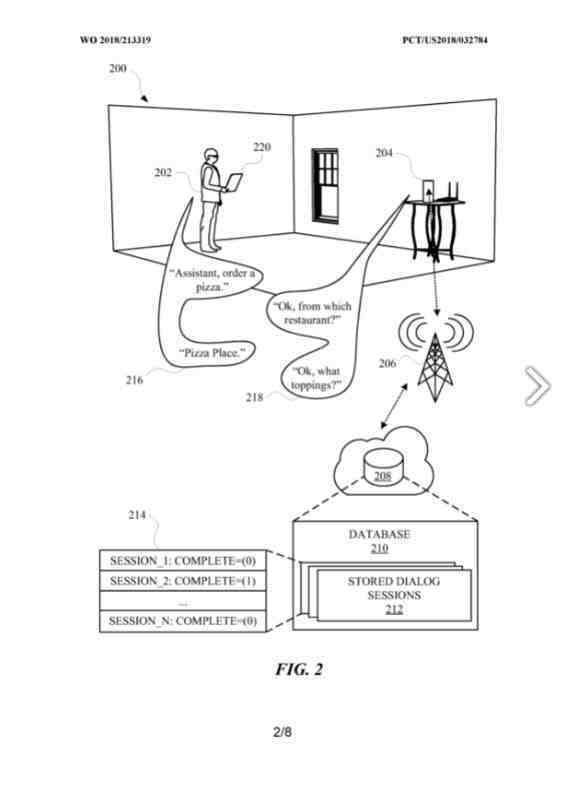
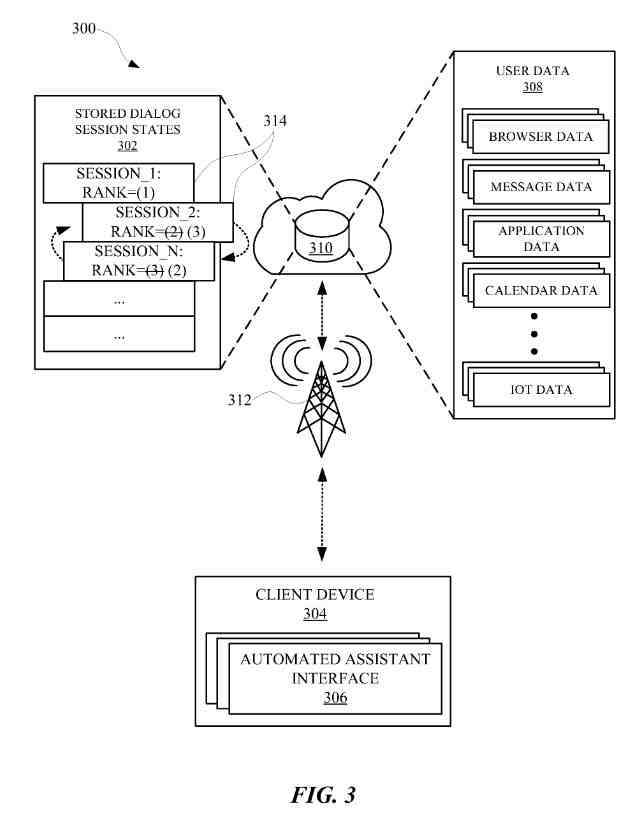

I have a Google Speaker at home to perform some searches and listen to some music.

Google has been granted patents on automated assistants that tell us more about how they work.

The search input approach that automated assistants use is different from what I am used to using a desktop computer or my phone.

Some of the other patents about automated assistants that I have written about include:

- [Unsolicited Content in Human to Computer Dialog](https://www.seobythesea.com/2022/02/unsolicited-content/)
- [Human to Computer Dialog at Google](https://www.seobythesea.com/2022/01/human-to-computer-dialog-at-google/)
- [Completing Human to Computer Dialogs with Automated Assistants](https://www.seobythesea.com/2022/02/completing-human-to-computer-dialogs-with-automated-assistants/)
- [A User Programmable Automated Assistant from Google](https://www.seobythesea.com/2022/02/user-programmable-automated-assistant/)
- [Google Mum Update](https://gofishdigital.com/blog/google-mum-update/)
- [Google Automated Assistant Search Results](https://gofishdigital.com/blog/automated-assistant-search-results/)
- [How an Automated Assistant May Respond to Queries from Children](https://gofishdigital.com/blog/automated-assistant-may-respond-to-children/)
- [The Google Assistant and Context-Based Natural Language Processing](https://gofishdigital.com/blog/context-based-natural-language-processing/)

Another patent from Google has been recently granted: “Systems, Methods, And Apparatuses For Resuming Dialog Sessions Via Automated Assistant.”

This is exciting because Google is fleshing out different aspects of how Automated Assistants work in the Google search ecosystem. It allows us to look behind the curtain at Google and see what steps they are taking to get behind the curtain. I will focus on the summary of the patent rather than the full description.

Automated assistants may use several computing devices, such as smartphones, tablet computers, wearable devices, automobile systems, and standalone personal assistant devices.

The automated assistants receive input from the user (such as typed and spoken natural language input) and respond with responsive content (visual and audible natural language output).

As with most patents, this one introduces the problem that the patent gets intended to help solve. The algorithm behind the patent gets used to solve issues anticipated by the inventors of the patent.

The problem behind this patent?

We get told that:

> While interacting with an automated assistant, a user may become distracted and not complete the interaction to the point of a task or action getting satisfied by the robotic assistant.

Because of this, the searcher may have to repeat inputs to the automated assistant to have the computerized assistant complete the task or action.

This doesn’t seem like a big problem, but the patent expands on the troubles involved:

> This can be a waste of computational resources and human time. The automated assistant would reprocess the user’s commands that were already processed during the previous interaction.
>
> The described implementations relate to systems, methods, and apparatuses for tracking incomplete interactions with an automated assistant so that they can be subsequently completed without having to repeat previous commands. Humans may engage in human-to-computer dialogs with interactive software applications referred to herein as “automated assistants.”
>
> For example, humans (who, when they interact with automated assistants, may be referred to as “users”) may provide commands and requests using spoken natural language input (i.e., utterances) which may, in some cases, be converted into text and then processed, and by providing textual (e.g., typed) natural language input.

The patent gets more technical too. It tells us that:

> Automated assistants can be used to track incomplete interactions with the automated assistant so that they can be subsequently completed without repeating previous commands.
>
> Furthermore, tracking incomplete interactions allows the user to complete an exchange by their election should the user be interrupted during an interaction or choose not to continue at some point during the interaction.
>
> For example, an automated assistant can be used by a user to place a phone call with contact through spoken commands (e.g., “Assistant, please call Sally”) to an automated assistant interface of a client device.
>
> The automated assistant can respond via the mechanical assistant interface with options of who exactly the user is referring to (e.g., “Would you like to call Sally Smith, Sally Beth, or Sally O’Malley?”).
>
> The user may then become distracted and not respond to the automated assistant, thereby rendering the conversation between the user and the robotic assistant incomplete because the automated assistant did not perform an action and complete a task (e.g., calling Sally) conversation.
>
> The conversation between the automated assistant and the user can be stored in memory, which the computerized assistant can access at a later time when the user is determined to be interested in having the robotic assistant perform the action.
>
> For example, after the initial incomplete conversation, the user can be participating in an email thread that mentions someone named Sally. The automated assistant can acknowledge the mention of Sally in the email thread and provide a selectable element at an interface of the client device.

The patent description often includes a “summary” of the solution described in the patent as an algorithm, and this patent is not different than many of the others from Google (the patents I listed at the top of this post also introduce algorithms the inventors decided should be addressed when it comes to automated assistants.

This patent is intended to continue conversations and has a phone call as an action that can further that activity:

> The selectable element can include the phrase “Call Sally.” In response to the user selecting the selectable element, the automated assistant can provide an output corresponding to where the previous conversation ended (e.g., “Would you like to call Sally Smith, Sally Beth, or Sally O’Malley?”). In this way, the user does not have to repeat past commands to the automated assistant, thereby streamlining the path to completing the intended action (e.g., placing a phone call to Sally).

## Is the Human to Computer Dialog Session Complete or Incomplete?

The automated assistant can store specific conversations according to whether the discussions were complete or incomplete. Conversations between the user and the robotic assistant can include multiple different spoken or typed commands from the user and multiple different responsive outputs from the automated assistant.

The user may intend for a task or action to be performed/completed in the conversation.

The task or action can be:

- Placing a call
- Booking an event
- Sending a message
- Controlling a device
- Aaccessing information
- Any other action that can be performed by a computing device

## The Focus Here Is On Completing An Action

When a task is completed as a result of the conversation, the conversation can be stored with a field or slot that includes a parameter indicating that the conversation resulted in an action (e.g., STORE_CONVERSATION=(content=” call sally; Would you like to call . . . ;”, action=”call,” complete=”1″).

When a task is not completed as a result of the conversation, the conversation can be stored with a field or slot that includes a parameter indicating the conversation did not result in a task being completed (e.g., STORE_CONVERSATION=(content=” call sally; Would you like to call . . . ;”, action=”call,” complete=”0″). The “complete” parameter can indicate whether a task was completed by using a “1” to show action was completed and “0” to indicate an effort was not completed.

The conversation can be stored as complete even when a performed task was not necessarily completed. For example, the user can engage in a few rounds of discussion with the automated assistant to get the computerized assistant to start a music application for playing music.

However, the automated assistant may ultimately determine that a subscription for the music application has expired, and therefore the computerized assistant is unable to open the music application. The conversation between the user and the automated assistant can be stored by the automated assistant as a complete conversation.

In this way, subsequent suggestions for conversations to complete will not include the music application conversation as the conversation was ultimately conclusive concerning the music application, despite the music application not providing music.

## Raanking Human to Computer Dialogs

This aspect of this patent shouldn’t come as a surprise.

Conversation suggestions can be ranked and presented at a conversational interface to allow the user to complete more relevant conversations that did not result in the completion of a task.

Ranking of incomplete conversations can be performed by a device separate from a client device (e.g., computing systems forming a so-called “cloud” computing environment) with which the user is engaging to preserve the computational resources of the client device.

The suggestions can be presented as selectable elements at a conversational user interface of the client device, along with other selectable factors that can be associated with the conversation suggestion.

**For example, a previous incomplete conversation can be associated with a food order that the user was attempting to place but ultimately did not complete because the user did not provide an address for the food to be delivered.**

Subsequently, while viewing a food website, the user can be presented with a conversation suggestion corresponding to the incomplete food order conversation.

## Increasing the Rank of that Human to Computer Dialog

If the user selects the conversation suggestion, a rank associated with the incomplete conversation can be increased.

However, if the user does not select the conversation suggestion, then the rank associated with the conversation suggestion can be decreased (or, in some cases, unaltered).

The rank decrease can be that the conversation suggestion does not appear the next time the user is looking at the food website.

In this way, other higher-ranked conversation suggestions can be presented to the user so that the user might be presented with conversation suggestions that the user would be more interested in continuing to the point of completion.

## Suggestions for Completing Human to Computer Dialogs

Suggestions for completing conversations can be ranked and weighted according to certain computer-based activities of the user. These can go beyond the actions of having conversations.

For example, incomplete conversations suggestions related to a hotel booking can be presented to a user searching for hotels.

The user can select an incomplete conversation suggestion to be taken back to where the user left off in a previous conversation with the automated assistant without having to repeat past commands or other statements to the robotic assistant.

During the previous conversation, the user may have provided the number of guests and the dates for the hotel booking but may not have paid for the hotel booking. Therefore the conversation was not complete as a hotel was not booked. The hotel conversation can be stored as incomplete and subsequently provided in association with a selectable element when the user uses a search application to find places to vacation.

## Where Conversation Suggestions Might Take Place

The conversation suggestions can be provided on a home page of a client device.

The home page can provide multiple suggestions related to various applications on the client device.

For example, the home page can provide reminders about events stored in the calendar application of the client device and provide news article summaries from a news application on the client device.

As the user is exploring the home page, the user can be presented with conversation suggestion elements that transition the user to a conversational user interface when selected by the user.

The conversational user interface can be populated with inputs from the user and responses from the automated assistant during a previous incomplete conversation associated with the conversation suggestion element.

## Not Having To Repeat The Previous Inputs in Human to Computer Dialog

In this way, the user does not necessarily have to repeat the previous inputs to lead the automated assistant to perform the intended initially action (e.g., booking a hotel, placing a call, performing a function of an application). Other suggestion elements that are not conversation suggestions can also be presented on the home page contemporaneously with the conversation suggestion element.

The other suggestion elements can be different from than suggestions that were provided at the conversational interface during the previous interactions between the user and the automated assistant.

This change of suggestion elements could be based on the assumption that the user was not interested in the previously provided suggestion elements if the user did not select those previously presented suggestion elements.

## Suggestions Based on Interests of Others

This patent seems to make sense to broaden suggestions beyond the person interacting with the automated assistant. The actions suggested might come from outside sources such as a video.

Conversation suggestions can be presented to the user based on ranking and weights established based on other users’ aggregate interests.

For example, a video may be of particular interest to people due to the video being presented on a popular website.

If the user previously had a conversation with the automated assistant regarding finding and playing the video, but the conversation did not ultimately result in the video being played, the conversation can be stored as incomplete.
The stored conversation can then be ranked based on other people’s interest in the video.

For example, the stored conversation can be ranked higher if people have recently been searching for the video than when people have not been searching for the video.

For example, if after the incomplete conversation, other people watch the video, and after that, the user searches for the video, the user can be presented with a conversation suggestion for completing the conversation to watch the video.

## The Summary Finally Focuses on Interaction with a Person and an Automated Assistant in a Human to Computer Dialog

A method implemented by processors is set forth. The process can include analyzing the content of a human-to-computer dialog session between the user and an automated assistant application.

The user can engage with the automated assistant application using a first client device of client devices operated by the user. The method can also include determining, based on the analysis, that the user did not complete a task raised during the human-to-computer dialog session.

The method can further include, based on the determining, storing a state of the human-to-computer dialog session in which the task is primed for completion.

Additionally, after the storing, the method can provide to the client devices data indicative of a selectable element that is selectable to enable the user to complete the task.

The data can be generated based on the state.

Furthermore, the selectable element can invoke the automated assistant application in the state to resume the human-to-computer dialog session and can be selectable to cause the task to be completed.

The task can include dialing a telephone number, and the stored state can identify the incomplete job. The method can also include assigning a rank to the stored state and comparing the position to other ranks associated with other stored conditions of human-to-computer dialogs.

Providing the selectable element can be based on the comparison.

Additionally, assigning the rank can include identifying an activity of the user that indicates a level of interest of the user in completing the task.

Resuming the human-to-computer dialog can cause the automated assistant application to provide, as the output of the client devices, at least one previous response of the robotic assistant.

Other implementations may include a non-transitory computer-readable storage medium storing instructions executable by a processor (e.g., a central processing unit (CPU) or graphics processing unit (GPU)) to perform a method such as the methods described above and elsewhere herein.

Yet another implementation may include a system of computers and robots that include processors operable to execute stored instructions to perform a method such as the methods described above and elsewhere herein.

## This Resuming Dialog Sessions In A Human to Computer Dialog Patent Can Be Found At

[Systems, methods, and apparatuses for resuming dialog sessions via automated assistant](https://patft.uspto.gov/netacgi/nph-Parser?Sect1=PTO1&Sect2=HITOFF&d=PALL&p=1&u=%2Fnetahtml%2FPTO%2Fsrchnum.htm&r=1&f=G&l=50&s1=11,264,033.PN.&OS=PN/11,264,033&RS=PN/11,264,033Z)
Inventors: Vikram Aggarwal, Jung Eun Kim, and Deniz Binay
Assignee: Google LLC
US Patent: 11,264,033
Granted: March 1, 2022
Filed: March 20, 2019

Abstract

> Methods, apparatus, systems, and computer-readable media are provided for storing incomplete dialog sessions between a user and an automated assistant to complete the dialog sessions in furtherance of specific actions.
>
> While interacting with an automated assistant, a user can become distracted and not complete the interaction to the point of the automated assistant performing some action.
>
> The automated assistant can store the interaction as a dialog session in response.
>
> Subsequently, the user may express interest, directly or indirectly, in completing the dialog session, and the automated assistant can provide the user with a selectable element that, when selected, causes the dialog session to be reopened.
>
> The user can then continue the dialog session with the automated assistant so that the initially intended action can be performed by the automated assistant.
