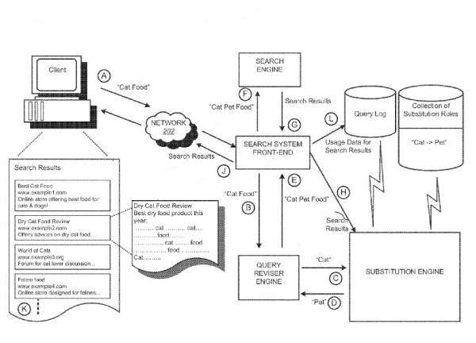
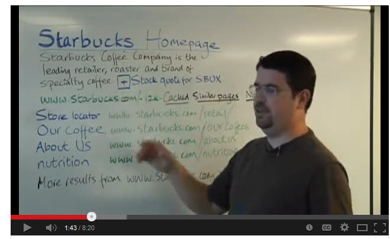
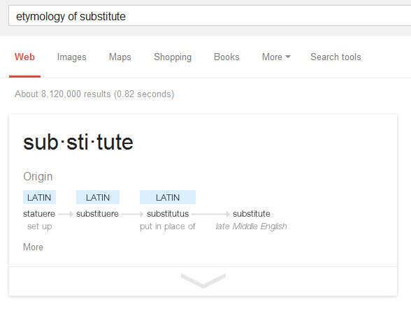
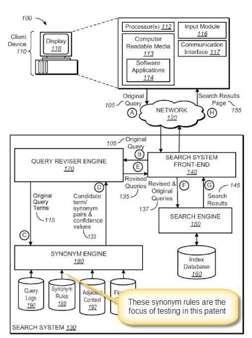

*Within the announcement Google made earlier this year about the Hummingbird update, the search engine might rewrite queries, substituting some terms within them, when they think doing so might improve the results that searchers see. A very recent Google patent describes how Google might use a data-driven approach to explore how effective those substitutions might be.*

**There is a history of Google making changes to queries and results to try to provide better search results.**

***Titles*** – In January of 2012, a Google Webmaster Central blog post told us that Google might sometimes [change the title](https://webmasters.googleblog.com/2012/01/better-page-titles-in-search-results.html) of a page in search results if they thought the new title might lead to more clicks and views of a page. While that might not be what the author of a page intended, it shows that Google is trying to make it easier for people to find the information they are searching for. I’ve run across sites where all the pages had the same titles, but unique main headings, and saw Google add the text for the main headings to those titles for each page.

In the screenshot below from a Matt Cutts video on [snippets](https://support.google.com/webmasters/answer/35624?hl=en#3), (page includes some great suggestions for titles as well), Matt offers some unsolicited advice for Starbucks, telling them that it might not be a bad idea to replace the word “homepage” in their title with “coffee” since few people probably search for “Starbucks homepage,” and much more likely search for “Starbucks coffee.”

***Queries*** – Google has often made efforts to rewrite queries that searchers perform if the search engine thinks that search results might lead to results that better match the intent behind a query. This can include returning pages that include [synonyms](https://www.seobythesea.com/2010/01/google-synonyms-update/) or good [substitutes](https://www.seobythesea.com/2013/08/google-substitute-query-terms-co-occurrence/). Google also will rewrite queries with possible query refinements within search results, and will even ask a searcher in a prompt if they intended something different at the top of a query, especially when they might think that a searcher may have misspelled a query term.

***OneBoxes*** – Google will also [display one box results](https://searchengineland.com/googles-onebox-patent-application-10325) based upon indications that searchers might prefer to see things like definitions or weather boxes or local results in response to some queries as well. It’s not just a matter of which search results are most “relevant” for a query, but rather which results they think searchers might prefer to see based upon several factors. The decisions to show such results can be based on click rates that the one box results receive.

**Hummingbird is specifically aimed at returning better (higher quality) search results, by how it may rewrite queries**

Google announced the Hummingbird update earlier this year, on their 15th anniversary, and its focus is to rewrite queries that are long and complex, and similar to what people might speak on mobile devices, but hidden within that circumstance is an intent to also improve the quality of search results for all queries. As noted during a press conference the day that the update was announced, Search Engine Land’s Danny Sullivan told us:

> In particular, Google said that Hummingbird is paying more attention to each word in a query, ensuring that the whole query ‘the whole sentence or conversation or meaning is taken into account, rather than particular words. The goal is that pages matching the meaning do better, rather than pages matching just a few words.
>
> ~ [FAQ: All About The New Google ‘Hummingbird’ Algorithm](https://searchengineland.com/google-hummingbird-172816)

How does Google work to return pages that “better match the meaning” when it might rewrite queries? Part of that challenge is in better re-writing a query to uncover such pages. It’s not a matter of finding pages in search results that have some of the words from the original query and looking for pages that might have more high-quality links to them, or more Facebook likes, or more Google +’s, or some other kind of “correlation” between ranking signals and ranking search results. It involves ways to try to better interpret the words within the original queries and doing a better job of finding pages that better match the intent behind a search.

Google’s Hummingbird update involves doing better when it rewrites queries by changing some of the words within an original long and complex query to capture the meaning behind those words rather than just returning pages in search results that contain all the words within the original query. This can be done by looking for synonyms or substitute terms for words within those queries from places like search results or [Query Sessions](https://www.seobythesea.com/2013/09/google-reform-queries-based-co-occurrence-query-sessions/).

Those substitutes or synonyms within similar contexts might share many similar words in documents returned for them in a Google search, as the words that they are replacing. For example, a search that includes “cat food” within it might be replaced by a search that includes “pet cat food” instead of just “cat food.” If you search each of those terms, many of the same words (referred to in this context as co-occurring words) might show up within the documents that appear as search results for each, like in the screenshot at the top of this post.

But how might Google decide whether or not when it may rewrite queries, that might lead to higher quality results? Do they come close to matching the intent of the person who performed the search with the pages returned?

A patent from Google granted this week explores how Google might test and investigate rules that they follow in finding substitutes/synonyms for terms in a query to rewrite queries, to see how well-received those are by searchers. The patent is:

[Removing substitution rules](http://patft.uspto.gov/netacgi/nph-Parser?Sect1=PTO1&Sect2=HITOFF&d=PALL&p=1&u=%2Fnetahtml%2FPTO%2Fsrchnum.htm&r=1&f=G&l=50&s1=8,600,973.PN.&OS=PN/8,600,973&RS=PN/8,600,973)
Invented by Dan Popovici and Jeremy D. Hoffman
Assigned to Google
US Patent 8,600,973
Granted December 3, 2013
Filed January 3, 2012

Abstract

> Methods, systems, and apparatus, including computer programs encoded on a computer storage medium, remove substitution rules. According to one implementation, a method includes:
>
> - Identifying a revised search query that was revised to include a substitute term of a query term;
> - Identifying search results that were generated using the revised search query, wherein each search result references a resource;
> - Determining, by one or more computers, that none of the resources referenced by a subset of the search results include the substitute term of the query term; and
> - In response to determining that none of the resources referenced by the subset of search results include the substitute term of the query term, incrementing a no-match score for the substitute term.

Google may test these substitute queries by (1) exploring whether or not the substitute terms appear with search results returned, and (2) checking to see if searchers click upon those particular results where the substitutes do appear. The screenshot below is from the patent I called The Hummingbird Patent, and I mentioned this substitution process and substitution rules in my post on [The Google Hummingbird Patent?](https://www.seobythesea.com/2013/09/google-hummingbird-patent/).

The patent tells us that the advantages of using this approach to rewrite queries include:

1. Substitute term rules which do not improve search quality can be identified empirically from search result data.
2. Substitute term rules which generate only a few additional search results may still be helpful if the users respond to the substitute term rule with positive feedback.
3. Specific contexts of which substitute term rules improve search quality can be identified, and the general context substitute term rule may be modified accordingly.

Much like Google may test titles that they change based upon whether or not those changes improve the click-throughs on those result, or decides whether or not people want to see Onebox results by whether or not people click upon them, this data-driven approach to seeing whether or not synonym or substitute rules for changing queries results in actual clicks can give Google an idea of how helpful those changed queries might be.

I’ve written a few posts about synonyms in search. Here are some of those:

- 2/19/2006 – [Multi-Stage Query Processing at Google](https://www.seobythesea.com/2006/02/google-looks-at-multi-stage-query-processing/)
- 5/25/2007 – [Refining Queries Using a Local Category Synonym](https://www.seobythesea.com/2007/05/refining-queries-using-category-synonyms-for-local-and-other-searches/)
- 12/29/2008 – [How a Search Engine Might Use Synonyms to Rewrite Search Queries](https://www.seobythesea.com/2008/12/how-a-search-engine-might-find-synonyms-to-use-to-expand-search-queries/)
- 1/23/2009 – [Google to Expand Language Search and Shrink Our World?](https://www.seobythesea.com/2009/01/search-engines-to-expand-language-search-and-shrink-our-world/)
- 6/29/2009 – [Semantic Relations from Query Logs](https://www.seobythesea.com/2009/06/query-logs-and-the-slang-of-the-web/)
- 12/22/2009 – [Google Search Synonyms Are Found in Queries](https://www.seobythesea.com/2009/12/how-google-may-expand-searches-using-synonyms-for-words-in-queries/)
- 1/19/2010 – [Google Synonyms Update](https://www.seobythesea.com/2010/01/google-synonyms-update/)
- 1/27/2010 – [Paid Search Results and Query Expansion using Synonyms and Related Concepts](https://www.seobythesea.com/2010/01/paid-search-results-and-query-exansion-using-synonyms-and-related-concepts/)
- 2/16/2011 – [More Ways Search Engine Synonyms Might be Used to Rewrite Queries](https://www.seobythesea.com/2011/02/more-ways-a-search-engine-might-identify-synonyms-to-expand-queries-with/)
- 8/12/2013 – [How Google May Substitute Query Terms with Co-Occurrence](https://www.seobythesea.com/2013/08/google-substitute-query-terms-co-occurrence/)
- 9/27/2013 – [The Google Hummingbird Patent?](https://www.seobythesea.com/2013/09/google-hummingbird-patent/)
- 12/8/2013 – [How Google May Rewrite Queries](https://www.seobythesea.com/2013/12/rewrite-search-terms/)
- 9/9/2013 – [How Google May Reform Queries Based on Co-Occurrence in Query Sessions](https://www.seobythesea.com/2013/09/google-reform-queries-based-co-occurrence-query-sessions/)
- 10/15/2013 – [Google’s Hummingbird Algorithm Ten Years Ago](https://www.seobythesea.com/2013/10/googles-hummingbird-algorithm-ten-years-ago/)
- 12/21/2015 = [How Google Might Make Better Synonym Substitutions Using Knowledge Base Categories](https://www.seobythesea.com/2015/12/how-google-might-make-better-synonym-substitutions-using-knowledge-base-categories/)

Last Updated July 4, 2019.
