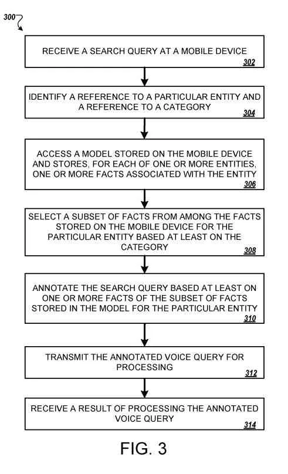
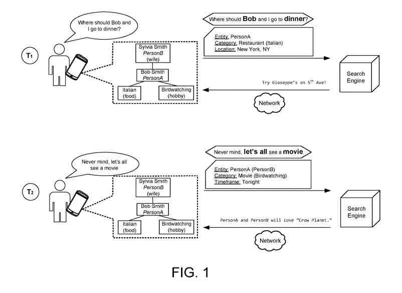

## Rewritten Queries On Search Engines Using Mobile Devices

People write queries for search engines to find answers that fill their situational or informational needs. A recently granted patent from Google describes how a search engine might provide rewritten queries for people searching using handheld mobile devices such as mobile phones. Queries are rewritten using annotations from a user-specific knowledge graph that may be built using data from many applications on the mobile device.

The patent provides details of how rewritten queries might provide more personalized results, and take advantage of data from the knowledge graph it is building and may do so in a way that can be transparent to a searcher.

I have posted about rewritten queries in the past when writing about [Hummingbird](https://www.seobythesea.com/2013/09/google-hummingbird-patent/) and [Rankbrain](https://www.seobythesea.com/2017/09/word-vector-approach/).

The recently granted Google patent surfaces the idea of rewritten queries to protect personally identifiable information on mobile devices such as phones and programs that may get used on them, built with a user-specific knowledge graph. It refers to that information as private knowledge graphs.

## A User-Specific Knowledge Graph

Google introduced its large [knowledge graph](https://blog.google/products/search/introducing-knowledge-graph-things-not/) in 2012. I have written about smaller user-specific knowledge graphs before in a post called [User-Specific Knowledge Graphs to Support Queries and Predictions](https://www.seobythesea.com/2019/11/user-specific-knowledge-graphs/). I also covered a white paper from Google on Personalized Knowledge Graphs called [Where will we go with Personalized Knowledge Graphs?](https://www.seobythesea.com/2020/09/personalized-knowledge-graphs/)

Web searches from mobile devices have become standard over the past years. Web search engines attempt to rank results to given search queries in the most relevant order. A query gets annotated and becomes a rewritten query before processing.

This way, it may include more query terms, such as synonyms, that were not present in the original query or to otherwise place the query in better condition for processing by the search engine. Google understanding that rewritten queries and user-specific knowledge graphs can mean better searches on mobile devices, using rewritten queries from data saved up on mobile devices and collected into a user-specific knowledge graph. Those rewritten queries may not even get explicitly seen by searchers on those devices.

Search can become more assistive if a search engine better understands the searcher issuing a query. The query “where to have dinner with David” may get meaningless to a server-side search engine unless the search engine has detailed information about the searcher and their contacts.

## Mobile Devices Use More User-Specific Knowledge Than Desktop Computers

Handheld devices often have more user-specific knowledge than a server-side search engine. This knowledge may come from what a searcher has earlier typed, what he has seen on-screen, or in his current environment. This approach to search can lead a mobile device to create rewritten queries.

Mobile search queries may get rewritten on a client device, using extended knowledge available to that device. This extended knowledge may get based on:

- A searcher’s previous text entry
- On-screen information
- Device sensors
- Etc.

## Rewritten Queries Get Enhanced By More Data Such as Private Information Related to Entities

The vast knowledge allows the server-side assistant to operate with a much better understanding of the searcher. Rewritten Queries may get enhanced by the selective inclusion of more data, such as private information related to entities and categories indicated by a query that the searcher may share with the search engine.

In one general aspect, rewritten queries performed by mobile computers include:

- Sending, by a mobile device, a search query
- Identifying, by the mobile device and based on the search query, a reference to a particular entity, and a reference to a category
- Accessing, by the mobile device, a model stored on the mobile device
- Storing facts for each of the categories associated with the entity
- Choosing, by the mobile device, facts from among the facts stored in the model for the entity, based on the category
- Annotating, by the mobile device, the search query based at least on facts of the subset of facts that get stored in the model for the particular entity
- Transmitting, from the mobile device to a search engine, the annotated search query for processing
- Receiving, by the mobile device and from the search engine, a result of processing the annotated search query

## Annotations for Rewritten Queries

The rewritten queries process may include the following features:

- Identifying, by the mobile device and based on the search query
- (i) An entity
- (ii) A category may include annotating the search query
- Annotating, by the mobile device, the search query based at least on facts of the subset of facts that get stored in the model for the particular entity may get done by an on-device query rewrite engine of the mobile device
- Deciding, by the mobile device, facts stored in the model for the entity, based on the category, gets done through machine learning. The reference to the particular entity may get implicit
- Selecting, by the mobile device, a subset of facts from among the facts stored in the model for the entity, based at least on the category, done based at least on a rule set
- Picking, by the mobile device and from the search query, query terms, and the referenced category
- Processing, by the mobile device, the query terms, and the referenced category to determine a fact type relevant to the search query
- Locating, by the mobile device, facts from facts stored in the model for the entity, based on the category and the fact type
- Removing, by the mobile device, private information associated with the facts of the subset of facts before the transmission of the annotated search query to the search engine

## The User-Specific Knowledge Graph and Rewritten Queries

In another general aspect, at least one computer-readable storage medium encoded with executable instructions that, when executed by a processor, cause the at processor to perform operations including:

- Retrieving, at a mobile device, a search query
- Finding, by the mobile device and based on the search query
- (i) A particular entity
- (ii) A category
- Accessing, by the mobile device, a model that
- (i) Gets stored on the mobile device
- (ii) For each of entities, stores facts that get associated with the entity
- Choosing, by the mobile device, facts from the facts stored in the model for the entity, based on the category
- Marking, by the mobile device, the search query based at least on facts stored in the model for the entity
- Sending, from the mobile device to a search engine, the annotated search query for processing
- Gathering, by the mobile device and from Google, a result of processing the annotated search query

The following features may further include:

- Recieving, by the mobile device and based on the search query
- (i) A particular entity
- (ii) A category includes annotating the search query
- Annotating, by the mobile device, the search query gets based at least on facts of the subset of points stored in the model for the mobile device’s entity on-device query rewrite engine

## Machine Learning And Searches on The Mobile Device

Through machine learning, the mobile device may select a subset of facts from among the points stored in the model for the particular entity, based at least on the category.

The reference to a particular entity may get implicit. And, the mobile device may select a subset of facts from among the points stored in the model for the specific entity, based at least on the category, based on a ruleset. The operations may further include: identifying, by the mobile device and from the search query, query terms and the referenced category; processing, by the mobile device, the query terms, and the referenced category to determine a fact type relevant to the search query. Responding to the query can also involve selecting facts from the model for the entity based on the category and the fact type by the mobile device.

The operations may further comprise removing private information associated with the facts of the subset of attributes by the mobile device before transmitting the annotated search query to Google.

## The On-Device Query Rewriting Patent

This patent is at the following location:

[On-device query rewriting](https://patft.uspto.gov/netacgi/nph-Parser?Sect1=PTO1&Sect2=HITOFF&d=PALL&p=1&u=%2Fnetahtml%2FPTO%2Fsrchnum.htm&r=1&f=G&l=50&s1=11,120,090.PN.&OS=PN/11,120,090&RS=PN/11,120,090)
Inventors: David Petrou and Matthew Sharifi
Assignee: GOOGLE LLC
US Patent: 11,120,090
Granted: September 14, 2021
Filed: July 8, 2019

Abstract

> Methods, systems, and apparatus, including computer programs encoded on a computer storage medium, relating to on-device query annotating.
>
> A search query gets received, and a mobile device identifies a reference to a particular entity and a category based on the query.
>
> A model that gets stored on the mobile device and stores facts associated with entities gets accessed. A subset of points from among the attributes stored in the model for the particular entity gets selected.
>
> The search query gets annotated based on the subset of points stored in the model for the particular entity.
>
> The annotated search query gets transmitted from the mobile device to a search engine for processing. The mobile device receives a result of processing the annotated search query.

## Annotating A Query Using An On-Device Query Rewrite Engine

An on-device query rewrites engine processes each typed or spoken query and attaches annotations before sending the query to the server-side search engine.

The annotations may get selected to reveal only pieces of information that the searcher has asked to get exposed.

Given the query “where to have dinner with David,” the searcher asks to reveal information about David’s restaurant preferences.

But, the mobile device will not reveal irrelevant information, such as his favorite football team.

In further detail, the on-device query rewrite engine depends on a private knowledge base constructed and maintained on the device. This patent refers to the user-specific knowledge graph as a private knowledge graph.

This private knowledge base gets built based on processing of various local data, including:

- Earlier typed text
- Received notifications
- On-screen content
- Sensor data
- etc.

## Extracting Entities During On-Device Query Rewriting

The local data gets processed on the device to extract entities, such as names of restaurants.

The on-device query rewrite engine extracts higher-level information such as relationships between entities.

Also, the on-device query rewrite engine may determine that a restaurant, Bob’s Diner, hosts meetings for a local Audubon Society chapter that Jon uses.

Besides, facts relating to and relationships between entities may get curated by the searcher.

Also, the on-device query rewrite engine may select appropriate parts of the secret knowledge base for a given query.

And, the on-device query rewrite engine may analyze or classify a query into a category, such as restaurants, movies, family-friendly activities, etc.

## The User-Specific Knowledge Graph

The properties from the query may get used to performing a search over the private knowledge graph, such as all pieces of information relating to restaurants and the person entity “David.”

Results from the search over the private knowledge graph may use facts relating to the entities and categories of the query.

The retrieved facts from the knowledge graph may get attached to the query before the query goes to the server for processing.

The query attachments, or annotations, use a format structured or unstructured.

Structured annotations include predefined categories.

“Dinner” can get annotated with “Italian” and “restaurants” if that is the implicit category based on facts retrieved from the private knowledge graph.

Unstructured annotations include basic information the mobile device determined relevant to answering the query effectively.

The annotations may show all text entries from screens that refer to both “David” and any entity of type “restaurant.”

## Removing Private Information Unrelated to the Query

The raw text may get processed by the mobile device to remove private information unrelated to the query.

Annotations get added to the query by the on-device query rewrite engine, and the query gets sent to the server with a search request.

The server then provides search results, acts, or answers questions to better understand the searcher, her query, and the context in which the query gets processed.

This context is often crucial to creating a server-side assistant that understands a searcher and her meaning when she asks “where to have dinner with David.”

## Facts and Relationships are Collected in the User-Specific Knowledge Grpah

Given the search query “where to have dinner with David,” the mobile device can inform the server who David is, what types of restaurants he likes, and which restaurants he has attended.

Not all rich context gets transmitted to the server.

A mobile device can process each search query and remove personal information relating to the identified entities and categories irrelevant to the query.

Also, the mobile device can determine what data to withhold from the server based on searcher input.

And, the mobile device may determine what data to withhold from the server or remove from the annotation using machine learning.

## Another On-Device Rewritten Query About Going to a Restaurant

At a time, T1, a searcher, Jon, takes out his mobile device and asks: “Where should Bob and I go to dinner?” Jon may type his question, or the mobile device may present a dialog box upon detecting that Jon and Bob are talking about going to dinner tonight.

The computing device receives the question as a query.

Jon’s mobile device contains Jon’s personal information, as well as personal information relating to Jon’s friends, family, colleagues, and acquaintances.

Jon can store that Bob’s favorite Formula 1 team is McLaren-Honda or that Lisa doesn’t like French food.

## A Mobile Device Stores Facts and Information With Which a Searcher Interacts

A mobile device can store facts and information about people, places, and things Jon interacts with.

Also, Jon can send his grandmother an email reminding her of her appointment at Marshmallow Man’s Auto Body Shop to replace her 1957 BMW Isetta brakes.

And, the mobile device can store that Jon’s grandmother owns a 1957 BMW Isetta and needs its brakes replaced.

The phone can store that Marshmallow Man’s Auto Body Shop replaces brakes on Isettas and that Jon’s grandmother uses Marshmallow Man’s Auto Body Shop only.

This personal information may get stored on the device.

Also, the mobile device may store the information in a model that contains information relating to many different people, places, things, etc.

The model may be a user-specific knowledge graph.

The model and the information remain on Jon’s mobile device.

## User-Specific Knowlege Graphs

Knowledge Graphs get covered in detail in this patent, so they expand to knowledge graphs from knowledge bases—the reason why I mentioned User-specific knowledge graphs at the start of this post.

A knowledge graph is a collection of data representing entities and relationships between entities. (Nodes represent entities, and a relationship between nodes are edges – together, they are knowledge graphs.)

The data gets visualized as a graph, where entities are nodes and relationships between entities are edges between nodes.

Each edge gets associated with a relationship, and the edge represents the relationship connected by the edge.

If node A represents a person’s alpha, node B represents a person’s beta. An edge E gets associated with the relationship “is the father of,” then having the edge E connect the nodes in the direction from node A to node B in the graph represents that alpha is the father of beta.

A knowledge graph is a variety of convenient physical data structures.

And, a knowledge graph may use a triple representing a relationship from the first to the second entity [alpha, beta, is the father of], or [alpha, is the father of, beta].

## Each Entity and Each Relationship Will Get Included In Many Triples

Every entity and each relationship generally will get included in many triples.

Each entity can get stored as a node, as a record or an object, and linked through a linked list data structure to the entity’s relationships and the other entities.

A knowledge graph can get stored as an adjacency list in which the adjacency information includes relationship information.

It is generally helpful to represent each distinct entity and each different relationship with a unique identifier.

The entities can include particular people, places, things, artistic works, concepts, events, or other entities.

Thus, a knowledge graph can include data defining relationships between people, such as co-stars in a movie and covering relationships between people and things. It may also cover relationships between people and places, such as a particular person born for a specific city and other relationships between entities. One distinctive singer recorded a song about data defining relationships between areas and items, such as one type of wine comes from an exact geographic location.

Every node has a type based on the kind of entity the node represents. The classes can each have a schema specifying the data categories that get maintained about entities represented by nodes of the type and how the search engine should store the data.

So, for example, a node of a type for representing a person could have a schema defining fields for information such as birth date, birthplace, and so on.

Such information can get represented by fields in a type-specific data structure or triples that look like node-relationship-node triples, e.g., [person identifier, was born on, date], or in any other convenient predefined way.

Some or all the information specified by a type schema can get represented by links to nodes in the knowledge graph; for example, [one person identifier, child of, another person identifier], where the other person identifier is a node in the graph.

## Protecting Personally Identifiable Information

For situations in which the systems discussed here collect personal information about searchers or may use personal data. The searcher may get provided with an opportunity to control whether programs or features collect personal information, such as information about a searcher’s social network, social actions or activities, profession, preferences, or current location. It can also control whether and how to receive content from the content server that is more relevant to the searcher.

Besides, specific data may get anonymized in ways before it gets stored or used so that personally identifiable information gets removed. A searcher’s identity may get anonymized. No personally identifiable information can get determined for the searcher. A searcher’s geographic location may get generalized where location information is obtained (such as a city, ZIP code, or state level). A searcher’s particular area cannot get determined. Thus, the searcher may control how information gets collected about them and used by a content server.

Jon’s mobile device can parse Jon’s spoken query for essential words that will assist a search engine with providing better results for Jon’s query. In this example, the mobile device determines that Jon is asking about Bob. More particularly, Jon is asking about Bob Smith. Jon’s mobile device could have chosen this from emails exchanged between Jon and Bob about having dinner tonight. The mobile device could have determined this from a calendar event, a text message, etc.

The mobile computer can access the model stored locally to find personal information related to Bob Smith.

Several facts related to Bob get shown.

In this example, Bob has a wife, Sylvia; he likes to go birdwatching as a hobby, and he enjoys Italian food.

A mobile device can anonymize entity identifiers.

And, the mobile device can anonymize Bob and Sylvia when sending information about either person through a network, a search engine, etc., by associating each with a person identifier.

In this example, Bob gets associated with PersonA. Sylvia gets associated with PersonB.

## Determining Facts Relevant to a Query

Also, the mobile device can then determine which facts are relevant to Jon’s query.

Jon asked about “Bob” and “dinner.”

The mobile computer can determine that Jon is asking about food and that Bob likes Italian food.

The model contains other facts. A mobile device determines that Jon is only asking about dinner with Bob, not Sylvia.

This mobile device can then determine that Bob has a wife, Sylvia, who is not relevant.

And, the mobile device determines that Bob’s hobby, birdwatching, does not relate to food, so the fact that Bob is an avid birdwatcher is not relevant, either.

The computing device may then attach the relevant facts to or annotate Jon’s query.

And, the mobile device may identify components of the query with which to attach the relevant facts.

Jon’s mobile device can identify an entity, a query category, and a location.

In this example, the entity is Bob Smith; the query category is “Restaurant,” and New York, N.Y.

The device may offer privacy control by sending information about Bob to a search engine or across a network as data associated with a personal identifier of PersonA.

The mobile may determine that Jon is in New York, N.Y. from GPS data stored locally.

In some examples, Jon may not be in New York–Bob may be in New York, and Jon could visit Bob that weekend.

## How The Query Gets Answered From A User-Specific Knowledge Graph

A mobile device may determine this situation from emails, text messages, etc., between Jon and Bob.

The computing device may determine that Jon is visiting Bob from a calendar event, reminder, etc., stored locally.

The relevant fact (that Bob loves Italian food) may get attached to the appropriate component of the query: the category “Restaurant.”

Relevant facts may get attached to the query as more fields.

A mobile device may add an “Annotation” component with the value “Italian” to the query.

In some examples, the mobile device may simply add “Italian” to the query.

Besides, the mobile device can organize components of the query or flag, particularly relevant components.

And, the mobile device may add many annotations to the query.

Also, the mobile device may add annotations with the values “Italian,” “pizza,” and “Chianti” to the query to state that Bob loves Italian cuisine, including pizza and Chianti.

A mobile device can withhold specific facts from the annotations.

Because Sylvia and birdwatching are not relevant to Jon and Bob’s dinner plans, the mobile device may not include the annotations with Jon’s query.

## Annotated Queries use User-Specific Knowledge Graphs and Are Rewritten Queries

The annotated query gets sent to a search engine over a network.

The handheld device can send the query to Google over the Internet.

Google may then process the annotated query to provide Jon with a result.

The search engine may receive the query “Where should Bob and I go to dinner?” and the annotations that Bob refers to PersonA, that the query gets related to “Restaurant” and, more specifically, “Italian Restaurant,” and that Jon and PersonA are currently in New York, N.Y.

Google may then process the query with the annotations to provide Jon with a more personalized, specific, and relevant result.

Then, the search engine may provide a result for the annotated search query to Jon’s mobile device.

The result may get transmitted over the network to the mobile device for display.

Jon’s mobile device may present the result “Try Giuseppe’s on 5.sup.the Ave!” on display.

Also, Jon’s mobile device may read the result to him. It can make a reservation under his name. And it can send a calendar invitation to PersonA, etc.

The mobile may receive a result referencing PersonA and map the person identifier to the entity associated with the person identifier; in this example, Bob Smith gets related to the person identifier PersonA.

In some examples, the mobile device provides results to the searcher with PersonA replaced by Bob Smith.

At a T2, Jon may change his mind and decide, “Never mind, let’s all see a movie.”

Jon can say the query to his mobile device, enter it into a search field, etc.

In some examples, Jon could receive a text message or phone call from Bob requesting a change of plans: Bob may decide to bring Sylvia along.

The computer can receive the new query and, once again, access the model for relevant facts.

In this example, Jon does not explicitly state just to whom “let’s all” refers.

A mobile device may identify a person without receiving explicit information.

And, the mobile device may determine that Jon asks about Bob and another person since Jon asked about Bob.

## The Mobile Device Can Use the User-Specific Knowledge Graph to Rewrite a Query And Respond to that Query

The computing device can then access the model stored locally to find personal information related to Bob Smith and find Sylvia Smith.

Jon mentioned “Let’s all” and “movie.” The mobile device can determine that Jon is asking about an activity, specifically a movie and that Bob and Sylvia join.

The handheld determines that Bob’s love for Italian food is not relevant to activities or movies.

This mobile device may determine that Bob’s hobby, birdwatching, gets related to activities, so Bob loves birdwatching is relevant.

The computer may then annotate Jon’s query.

Jon’s mobile device can identify an entity, a query category, and a timeframe.

The entity is Bob Smith; the query category is “Movie” and tonight’s timeframe in this example.

The device may:

- Determine that Jon is talking about seeing a movie tonight using data stored locally
- Decide the timeframe from emails, text messages, etc., between Jon and Bob
- Note that Jon and Bob are talking about going to a movie tonight from a calendar event, reminder, etc., stored locally
- Attach Sylvia as an annotation to Jon’s query

In this example, the mobile device may identify Bob as PersonA and Sylvia as PersonB, attaching PersonB as an annotation to the entity PersonA.

The fact that Bob loves birdwatching may get attached to the appropriate component of the query: the category “Movie.”

The annotated query gets sent to the search engine over the network. Google may process the query, “Never mind, let’s all see a movie.” The annotations provide Jon with a more personalized, specific, and relevant result.

Google may provide a result for the annotated search query to Jon’s mobile device.

The result may get transmitted over the network to the mobile device for display. In this example, the search engine receives information about entity PersonA and annotation PersonB.

This search engine may send Jon’s mobile device results as “PersonA and PersonB will love “Crow Planet!”.

Jon’s mobile device may then map the person identifiers PersonA and PersonB to Bob and Sylvia Smith, respectively, and display “Bob and Sylvia will love “Crow Planet.”

Jon’s mobile device may read the result to him, buy tickets to the movie, send a calendar invitation to Bob and Sylvia, etc.

## A System For Annotating Queries With Selected Facts Stored On A User’s Mobile Device

The system represents a system that may get used to performing the process.

According to an example, an on-device query rewrites the engine processes each typed or spoken query and attaches annotations before sending the query to the server-side search engine.

The annotations may get selected to reveal only pieces of information that the searcher has asked to get exposed.

Given the query “where to have dinner with David,” the searcher asks to reveal information about David’s restaurant preferences.

Mobile devices can be various devices, such as personal digital assistants, cellular telephones, smartphones, and other similar computing devices.

The components shown here, their connections and relationships, and their functions become exemplary and do not limit the implementations described and claimed in this document.

The system includes a mobile device in communication with a network in contact with a search engine.

A mobile device communicates through connections, such as WiFi, Ethernet, and other appropriate connection media.

Google gets coupled to the network. It can communicate with the network through communications protocols or protocol families such as TCP/IP, IPX/SPX, X.25, and other appropriate communications protocols or protocol families.

The network can communicate with the mobile device using before mentioned communications protocols or protocol families.

A search of the mobile device submits a search query.

The search query includes references to at least one entity and at least one category.

## Entities and the Relationships Between Them are at the Heart of this Patent

Entities are proper nouns, including people, places, organizations, brands, etc.

Categories include classifications of what queries get directed to, including restaurants, movies, activities, etc.

The search query gets communicated to the mobile device in various forms, such as a spoken query, a typed query, an implied query, and other appropriate query forms.

The searcher can email his project group suggesting that they go to lunch on campus at midnight.

In other examples, the searcher can type a question into a search engine about what shop he should go to get his engine rebuilt.

In this example, the searcher speaks to the mobile device, saying: “Yo! I’m bored. What’s Matty Matt up to?”.

The search query can show as an indirect question that does not reference an entity, a category, or both.

A searcher can ask the mobile device: “What should we do?”.

The searcher may have received a text message from Sarah about going to dinner the next night.

In other examples, the search query is a direct question that references an entity or a category.

Also, a searcher can type: “Where is the best place for Matt and me to go birdwatching together?”.

## Natural Language Processing to Parse Query Inputs

The computing device includes a natural language processing system, which uses language modeling to parse query inputs.

The natural language processing system uses language models such as n-gram models, unigram models, and other appropriate language models.

This natural language processing system includes a query annotator.

The query annotator annotates the parsed queries in various ways, attaching notes or keywords to expand the question, narrow the query, redirect the query, rewrite the query, etc.

Still, the natural language processing system can receive an input of “What should Kelsey and I have for dinner?”, determine that the query gets related to food, and attach the keyword “food” to the query, creating an annotated request.

The fact selector is an on-device query rewrite engine that selects and attaches facts to queries.

In this example, the fact selector attaches facts to queries that have already gotten rewritten.

In other examples, the fact selector can attach facts to queries received directly from a searcher.

## A Local User-Specific Knowledge Graph

The local knowledge graph gets stored locally on the mobile device and contains searcher-specific data. (This sounds like the reason why I cited the user-specific knowledge graph above.)

Nodes of the local knowledge graph may get determined from what a searcher has earlier said, typed, what he has seen on-screen, what is in his current environment, sensor data, and any other appropriate sources of information.

The local knowledge graph creates a context for a searcher’s queries and assists a search engine by providing relevant, personalized answers.

The local knowledge graph contains facts associated with entities. The local knowledge graph has three points related to George, fifteen facts associated with Burger Emporium, and one fact associated with Spot, George’s dog.

The facts get associated with categories, such as food, hobbies, family, and other appropriate types.

A fact associated with George is that he likes to go fishing with Spot.

In this example, the fact gets associated with George and Spot’s entities and gets related to the hobby category.

In the illustrated example, the local knowledge graph includes a part associated with Matt.

The local knowledge graph may associate a person identifier with Matt to provide anonymity when transmitting information across a network or search engine.

In this example, the person identifier is PersonM.

The part of the local knowledge graph associated with Matt includes two facts.

The facts can get associated with an interest level. Matt’s interest in horseback riding is 0.9. His interest in the activity beekeeping is 0.3. An attractive value gets measured out of 1, and a value less than 0.5 indicates dislike or disinterest in a category, entity, etc. In other examples, an attractive value gets measured with both positive and negative numbers.

In some examples, the local knowledge graph contains a predetermined set of facts. Each point gets assigned an attractive value upon the mobile device receiving, detecting, identifying, etc., information relevant to the truth. The local knowledge graph can include several facts associated with the food category, including Italian, French, blueberries, ice cream, Cajun, and other appropriate types of foods.

In one example, each of the facts can have null values or 0 values until the mobile device detects that a searcher, Tom, has posted on his blog that he loves blueberries and ice cream. The local knowledge graph can then store a positive value in the blueberries and ice cream facts. In some examples, the local knowledge graph has set discounts based on the searcher’s words uttered, typed, or otherwise entered. For instance, if Tom had said he loved blueberries, blueberries would get assigned a value of 1. Otherwise, if Tom had said he liked blueberries, blueberries would get given a value of 0.7.

## The Local User-Specific Knowledge Graph Can Sort And Find Out About Other Facts

The local knowledge graph can sort, attach values to, etc., facts about other facts. Chris can tell his mom that he loves horseback riding and downhill skiing but that he prefers horseback riding. The local knowledge graph can then rank horseback riding above downhill skiing but choose both as positively viewed by Chris.

The local knowledge graph may learn from a searcher’s choices to rearrange, reorder, reevaluate, etc., facts relative to each other. Max loves Mexican food, but he always chooses to go to a French restaurant with Sam. The local knowledge graph can link French restaurants with Sam.

The local user-specific knowledge graph can include more facts each time the mobile device detects a new reality. The local knowledge graph can add a new node to David’s points for each fact saw associated with David.

The fact selector receives the annotated request from the natural language processing system and selects a relevant fact from the local knowledge graph. In some examples, the fact selector uses the annotated request to search the local user-specific knowledge graph.

In some instances, the fact selector can only access the local knowledge graph with prior consent from a mobile device user. The support is either explicit or implicit. The searcher can ask about “dinner with Dan” and implicitly permit the fact selector to access the part of the local knowledge graph associated with Dan. In other examples, a mobile device user can select facts, categories, etc., to keep from the fact selector. Also, the searcher can choose all points associated with clothing as inaccessible by the fact selector. The searcher can specify all the facts related to the location of his private cabin as unavailable by the fact selector.

In this example, the fact selector determines that the annotated request gets associated with Matt and the activity category. The fact selector accesses the local knowledge graph and looks for facts related to the activity category. The fact selector determines two points associated with the activity category: horseback riding and beekeeping.

In some examples, the fact selector selects facts that get positively viewed by the entity. In this example, the fact selector selects horseback riding, which Matt likes, and not beekeeping, which Matt dislikes. In some instances, the fact selector selects facts that get negatively viewed by the entity. A query could ask: “What should I avoid mentioning when I meet Jane, Roger’s wife?”. The fact selector would then select facts negatively viewed by Jane.

## Interesting How Data Is Collected to Improve Search Using Rewritten Queries

In addition, the fact selector processes each annotated request and attaches facts before transmitting the request to a server-side search engine (e.g., the search engine). The annotated request with the linked points gets rewritten. The annotations may get structured or unstructured. The query gets annotated with predefined categories (e.g., “dinner” gets annotated with “Italian restaurants”) when the annotations become structured.

When the annotations become unstructured, the query gets annotated with essential information. The fact selector has determined to answer the query effectively. The fact selector can attach all text from screens of the mobile device that refer to both Matt and horseback riding. The fact selector processes the raw data to remove private information that would not help in answering the query.

The fact selector transmits the rewritten query request to the network. And, the rewritten request can become a new, rewritten query.

The rewritten request is possibly the original query or the annotated request with further annotations or attachments.

The rewritten query includes the identified entity and category (PersonM and activity, respectively) referenced in the original query.

Additionally, the fact selected by the fact selector gets attached to the rewritten query. In this example, the fact that Matt loves horseback riding gets attached to the identified category. In other instances, the rewritten query includes the original query: “Yo! I’m bored. What’s Matty Matt up to?” as well as the identified entity and category. The actual query may get anonymized with the person identifier. The original query included in rewritten query may become: “Yo! I’m bored. What’s PersonM up to?”.

The network then transmits rewritten queries to Google. The search engine can access a global knowledge graph to process the rewritten request and answer a mobile device user. Google can use any service or machine, including 1. sup. St, party and 3.sup.rd party services. When given a movie query or OpenTable, Google can use IMDb to find a place to eat.

The global knowledge graph can get created, curated, updated, etc., using information obtained from the Internet or other services or databases available to the worldwide knowledge graph.

Google processes rewritten queries to produce answers to rewritten requests. The search engine uses web crawling, indexing, and other appropriate procedures to search for answers to received queries.

## On Finding An Answer, The Search Engine Presents A Result To The Mobile Device

On finding an answer, the search engine presents a result to the mobile device. The result may include more than one result. If the search engine is a website search engine, the result may provide pages of results. In some instances, the search engine is a local search engine or a website search engine set only to produce one result.

This example indicates the query becoming answered (Things to do with PersonM) and the answers produced. Two “Things to do with PersonM” get found: Vivian’s Corral and Henry’s Rodeo. Both answers of the result get related to horses or horseback riding and get tailored to PersonM’s interests. Vivian’s Corral and Henry’s Rodeo may get attractions near the user of the mobile device and PersonM.

A mobile device may map the person identifier to the entity stored within the mobile device before presenting the result to the searcher. The handheld may replace PersonM with Matt before answering the searcher.

Using the result, the user of the mobile device may interact with the results.

The searcher may buy tickets to Vivian’s Corral or get directions to Henry’s Rodeo.

And, the searcher can select the result to open the right application.

A mobile device can automatically open a navigation application and populate the destination with the address of Henry’s Rodeo.

Also, the mobile device can present the mobile device user with a menu of suitable applications or actions.

The applications or actions may get presented based on the search result selection.

If the user selects a restaurant, Yelp or OpenTable may get presented.

## An Example Process That Provides A Searcher With More Relevant Results and Rewritten Queries

Briefly, according to an example, the process includes receiving a search query at a mobile device.

The computing device may receive a search query of “Yo! I’m bored. What’s Matty Matt up to?” from a mobile device user.

Google may identify a reference to a particular entity and a relation to a category and building rewritten queries.

The natural language processing system or query annotator may identify a reference to Matt and a reference to an activity.

This natural language processing system or query annotator may annotate the original query, creating the annotated request.

It continues by accessing a model stored on the handheld and storing facts associated with each entity’s entity.

And, the fact selector may access the local user-specific knowledge graph on the mobile device to help build and answer rewritten queries.

It may then select a subset of facts from among the points stored on the mobile device for the particular entity based on the category.

Also, the fact selector may select a subset of facts from the local knowledge graph relating to PersonM and the activity category.

Google may move on to annotating the search query based on the subset of facts stored in the model for the particular entity.

And the fact selector may select horseback riding and produce the rewritten query that includes the entity and the annotated category. Horseback riding is an activity.

It also includes transmitting the annotated search query for processing.

## Rewritten Queries in Action

The fact selector may send rewritten queries to the network, which would result in sending the rewritten queries to the search engine.

This rewriting of queries concludes by receiving a result of processing the annotated search rewritten queries.

Google may access a global knowledge graph to process rewritten queries and send results to the mobile device.
