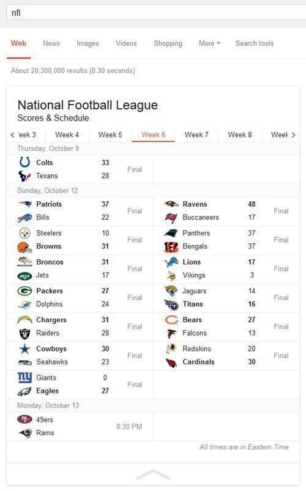

## Revisting the Subscribed Links Patent Five Years Later and Finding the Rich Snippets Patent

I first looked at this patent five years ago but called it the [Subscribed Links Patent](https://www.seobythesea.com/2009/09/google-subscribed-links-patent-why-do-some-onebox-results-require-no-subscription/).

At the time, Google had a [Subscribed links](https://www.askdavetaylor.com/what_are_google_subscribed_links/) program, where site owners could create specialized search results based upon certain patterns of queries, that would show additional content for a searcher. For some of those, you had to log into your Google Account and subscribe to certain links to be shown special content.

Oddly, some of those specialized search results didn’t require subscriptions, and didn’t require logging in. Much like these NFL sports Scores from this weekend:

That Subscribed links program ended in 2011, as Google closed some programs that it was running, under the name of a [Fall Spring Clean](https://googleblog.blogspot.com/2011/09/fall-spring-clean.html). What Google said about that program in the announcement of the ending of the subscribed links program was:

> **Subscribed Links**: Subscribed Links enabled developers to create specialized search results that were added to the normal Google search results on relevant queries for subscribed users. Although we’ll be discontinuing Subscribed Links, developers will be able to access and download their data until September 15, at which point subscribed links will no longer appear in people’s search results.

I’m no longer referring to that patent as Google’s Subscribed Links patent, but instead Google’s Rich Snippets Patent because while the subscribed links program was discontinued, the rich snippets programs till lives on and has been somewhat popular. The mystery of the patent to me, and why it allowed for some unsubscribed richer and content heavier search results to show up was answered with an announcement at the Google Webmaster Central Blog about Rich

Snippets, which were announced in 2009 by Ramanathan Guha, who also was one of the two inventors on this patent. I don’t think that is a coincidence.

Under this patent, when site owners provided some additional content in response to queries and presented them in certain patterns, rich snippets might appear. I’ve included here a list of pages from Google about rich snippets if you want to dig deeper into how they were developed over time:

## Google and Others Blog Posts and Support Pages

- May 12, 2009 – [Introducing Rich Snippets](https://webmasters.googleblog.com/2009/05/introducing-rich-snippets.html)
- January 22, 2010 – [Introducing a new Rich Snippets format: Events](https://webmasters.googleblog.com/2010/01/introducing-new-rich-snippets-format.html)
- March 11, 2010 – [Microdata support for Rich Snippets](https://webmasters.googleblog.com/2010/03/microdata-support-for-rich-snippets.html)
- April 13, 2010 – [Better recipes on the web: Introducing recipe rich snippets](https://webmasters.googleblog.com/2010/04/better-recipes-on-web-introducing.html)
- September 02, 2010 – [Rich snippets: testing tool improvements, breadcrumbs, and events](https://webmasters.googleblog.com/2010/09/rich-snippets-testing-tool-improvements.html)
- February 24, 2011 – [Slice and dice your recipe search results](https://googleblog.blogspot.com/2011/02/slice-and-dice-your-recipe-search.html)
- June 02, 2011 – [Introducing schema.org: Search engines come together for a richer web](https://googleblog.blogspot.com/2011/06/introducing-schemaorg-search-engines.html)
- November 8, 2012 – [Good Relations and Schema.org](http://blog.schema.org/2012/11/good-relations-and-schemaorg.html)
- November 9, 2012 – [GoodRelations Fully Integrated with Schema.org](https://www.dataversity.net/goodrelations-fully-integrated-with-schema-org/)
- September 26, 2013 –[Customizing Results Snippets](https://developers.google.com/custom-search/docs/snippets)
- November 13, 2013 – [Where Schema.org Is At: A Chat With Google’s R.V. Guha](https://www.dataversity.net/schema-org-chat-googles-r-v-guha/)
- September 22, 2014 – [Introducing Structured Snippets, now a part of Google Web Search](https://ai.googleblog.com/2014/09/introducing-structured-snippets-now.html)

## Google Support Pages

- About rich snippets and structured data
- [Rich snippets guidelines](https://developers.google.com/search/docs/guides/intro-structured-data?rd=1&hl=en)
- [Structured data testing tool](https://search.google.com/structured-data/testing-tool/u/0/?hl=en&rd=1)

## Of Patterns and Patents

In response to a query matching a certain pattern, the invention described in the patent can result in:

- Links to useful external sites, including deeplinks using URL patterns based on the query
- Text giving status or factual information about some category of thing, which will allow a user to get answers to some set of questions directly on the result page without having to click through to an external site
- Links and text (and optionally richer interface primitives) that allow the user to interact usefully with external providers; and/or
- IFRAMED content hosted on 3rd party servers.

## Search Parameters

Under the patent, different types of information may be displayed in different formats based uon the kind and format of a query used.

(1) A site owner/content provider might decide what type of search query will trigger retrieval of content from that provider.

(2) The content provider also specifies how the search query will be parsed, and how the extracted query terms will be used to retrieve content.

(3) Finally, the content provider specifies how the retrieved content will be displayed in the user’s browser window.

In one embodiment, users can select which types of specialized search results they wish to receive, and add them to their results pages in order to enhance their search experience with the third-party content.

The patent is:

[Generating specialized search results in response to patterned queries](http://patft.uspto.gov/netacgi/nph-Parser?Sect1=PTO2&Sect2=HITOFF&p=1&u=%2Fnetahtml%2FPTO%2Fsearch-adv.htm&r=1&f=G&l=50&d=PALL&S1=07593939&OS=PN/07593939&RS=PN/07593939)
Invented by Nicholas Brock Weininger, and Ramanathan V. Guha
Assigned to Google
US Patent 7,593,939
Granted September 22, 2009
Filed: March 30, 2007

Abstract

> Third party content providers can specify parameters for generating specialized search results in response to queries matching specific patterns.
>
> In this way, generic search website can be enhanced to provide specialized search results to subscribed users.
>
> In one embodiment, these specialized results appear on a given user’s result pages only when the user has subscribed to the enhancements from that particular content provider, so that users can tailor their search experience and see results that are more likely to be of interest to them. In other embodiments the specialized results are available to all users.

## Take Aways

The patent provides more details on things such as query patterns (and “trigger patterns” for queries) and data objects that might help define search results in the future, and how a content provider might get involved in displaying those.

Schema markup isn’t a part of the patent, and seems to have made a role for itself in the idea of presenting rich snippets for specific sites.

The rest of the patent is worth spending time on, and helps set the stage for some of the changes that we may see in the future as more schema is developed for website owners and content creators, and those working on using Semantic Web markup to share data across the Web.

Google’s rich snippets efforts do seem to have a tie-in to the subscribed links days at Google, and we still see some results like the NFL scores above that don’t seem to fit into something like a schema. It’s interesting seeing where this might head next, and how a site owner can set themselves up to succeed. It definitely appears that some of the path to the future goes through schema.org.
