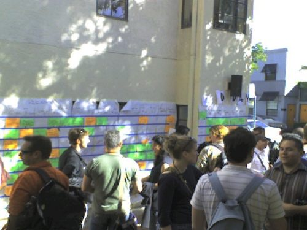
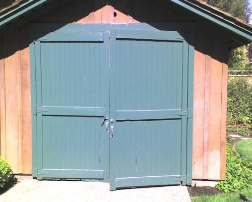
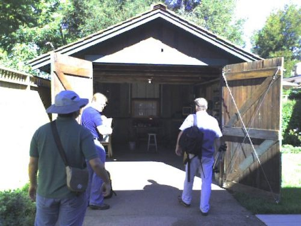
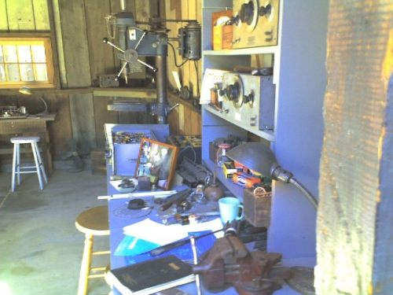
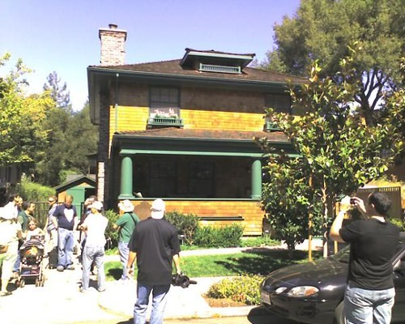
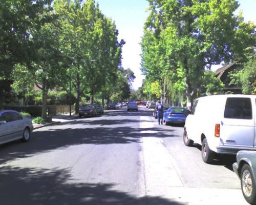

A little glimpse into my journey to the San Jose Search Engine Strategies Conference this past week.

Friday…

I headed out to BWI airport outside of Baltimore, usually about an hour drive, and wondered if I would make my flight after an accident delayed traffic along the way. I hope the people involved the collision are ok. I managed to get through security, and make it to the plane on time for my journey to Salt Lake City.

After my layover in Utah (wish I had a window seat, so that I could actually have seen the lake – did see the [Bonneville Salt Flats](https://utah.com/bonneville-salt-flats) from my aisle seat), I get on a plane headed for San Jose. I end up sitting next to a rocket scientist (the NASA documents and his killing time solving maths problems were a giveaway).

The plane arrives without any delays or problems, and I take a cab to the [Airport Best Western](http://www.bestwesternsanjose.com/) (closer to the center of Santa Clara than San Jose), where I was planning on spending very little time over the weekend, before moving to the [Fairmont](https://www.fairmont.com/san-jose/) in downtown San Jose.

At the hotel, I connect to the Web, and make plans to travel to Palo Alto on Saturday and Sunday.

This was my second San Jose SES, and I planned on a couple of extra days to see a little of the area in addition to the Conference, which is why I arrived on Friday instead of Sunday.

Last year, I spent a few days before the conference in San Francisco (a chilly relief from the 100+ degree weather that I had left behind in Delaware). This year, my extra-curricular destination was a little closer. I wanted to see what the Standford University Campus was like, and maybe checkout some of the other towns between San Jose and San Francisco.

Saturday…

Thanks to David Dalka, I found out that [BarcampBlock](http://barcamp.org/w/page/400429/BarCampBlock) was happening in [Palo Alto](https://www.cityofpaloalto.org/). Somehow I never made it to the Stanford Campus, but I got pretty close. I set out a little later than I wanted after running some errands, and made it to the CalTrain and then to downtown Palo Alto. I’m a little jealous of how easy it is to get from town to town between San Francisco and San Jose by rail.

A terrific crew, including [Liz Henry](http://liz-henry.blogspot.com/2007/08/organizing-barcampblock_19.html) and [SocialText](http://web.archive.org/web/20110704093655/http://www.socialtext.com/blog/2007/09/286/) organized the two day event.

Sunday…

Sunday featured a private tour of the most famous garage in Silicon Valley – the one where it all started. Keri Morgret (thanks Keri!) let me know that Robert Scoble had arranged a tour of the garage where the first product for Hewlett-Packard was produced (an audio oscillator). He was offering a chance to be included in the tour for the first five people who wrote on his wall at Facebook. Keri left a message, asking to reserve a spot for me. I made a facebook friend request with Robert, and Robert sent details on the visit to Keri, who forwarded them to me.

I had planned on taking the CalTrain to Palo Alto for day two, and missed the train by a couple of minutes (checking my bags at the Fairmont probably made me late). A taxi managed to get me to the quiet little neighborhood in Palo Alto that was the birthplace of HP in the 1930s.

Robert did a great job of capturing the HP tour on video, available at his blog. Anne Mancini, who is a librarian, and HP’s Corporate Archivist, gave us a wonderful overview of the history of the garage and Hewlett and Packard’s life while living and working there. Brian Solis has some great pictures from the visit.

Dave Packard and his wife lived in the first floor of the house, and Bill Hewlett lived in a [little shed](https://www.flickr.com/photos/jauderho/1221563642/in/set-72157601633109731/) ([inside](https://www.flickr.com/photos/jauderho/1221573182/in/set-72157601633109731/)) in the back yard for the first nine months they were there. After he married, he moved out of the shed.

Robert Scoble made up some tshirts for the tour (thanks for the tour and the tshirt, Robert), and we returned back to BarcampBlock, which was a few blocks away in downtown Palo Alto.

My favorite BarcampBlock presentation was the one that the CEO of [XEODesign](http://www.xeodesign.com/about/) gave on the four most important emotions in gameplay, doing a nice job of describing research in which those four different kinds of fun were looked for and found on Social Network sites. The most liked sites by participants of their studies involved at least three of the different kinds of fun that they describe. I’ll be keeping those in mind the next time I suggest a social network for a site.

While back at Barcampblock, I found out about a mixup with the reservations for the hotel that were made by the office, and I had to leave early and rush back and cover the hotel costs so that I had a room for the week.

I hopped on the CalTrain and made my way back to San Jose. By Sunday night, many people had started arriving for the Conference. I think that there were about 40 of us at dinner. I had the chance to make some new friends, catch up with some old friends, and meet some friendly folks who told me that they read SEO by the Sea.

More on the Conference itself tomorrow…
