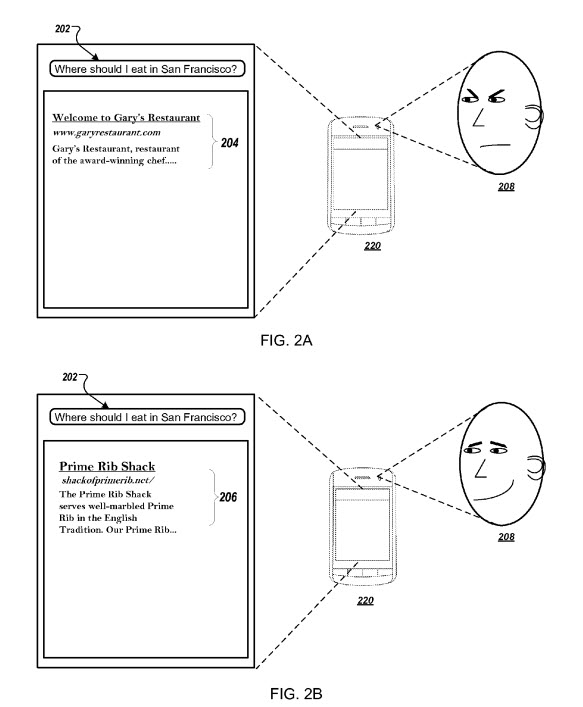

## Ranking using Biometric Parameters at Google

Do you search through Google on your phone? How do you know whether or not Google is watching you as you do and keeps on eye on whether you like the results you receive during your searches? Could Satisfaction with search results be a ranking signal that Google may use now or in the future? Are they keeping an eye on Biometric Parameters while you search, watching you through your phone’s camera?

A newly published Google patent application describes technology that would modify scoring and ranking of query results using Biometric Parameters of user satisfaction or negative engagement with a search result. In other words, Google would track how satisfied or unsatisfied someone might be with search results, and using machine learning, build a model based upon that satisfaction, raising or lowering search results for a query. This kind of reaction might be captured using a camera on a searcher’s phone to see their reaction to a search result, as depicted in the following screenshot from the patent:

This satisfaction would be based upon Google tracking and measuring biometric parameters of a user obtained after the search result is presented to the user to determine whether those may indicate negative engagement by the user with a search result.

For example, someone searches for “Seafood Restaurants,” and the top result is a restaurant they had visited before and didn’t like, causing them to frown, which may be captured on their phone’s camera. That reaction may be seen as a negative signal by the search engine and could count against that restaurant ranking as highly for that query term. The patent tells us that such a reaction may influence search results for multiple searches:

> The actions include providing a search result to a user, receiving one or more biometric parameters of the user and a satisfaction value, and training a ranking model using the biometric parameters and the satisfaction value. Determining that one or more biometric parameters indicate likely negative engagement by the user with the first search result comprises detecting:
>
> - Increased body temperature
> - Pupil dilation
> - Eye twitching
> - Facial flushing
> - Decreased blink rate
> - Increased heart rate.

The Biometric Parameters patent is:

[Ranking Query Results Using Biometric Parameters](http://appft.uspto.gov/netacgi/nph-Parser?Sect1=PTO1&Sect2=HITOFF&d=PG01&p=1&u=%2Fnetahtml%2FPTO%2Fsrchnum.html&r=1&f=G&l=50&s1=%2220160103833%22.PGNR.&OS=DN/20160103833&RS=DN/20160103833)
Inventors: Jason Sanders, Gabriel Taubman
Assignee: Google
US Patent Application 20160103833
Published April 14, 2016
Filed: February 28, 2013

Abstract

> Methods, systems, and apparatus, including computer program products, provide query results using biometric parameters. One of the methods includes providing a search result in response to receiving a search query. If one or more biometric parameters of a user indicate likely negative engagement by the user with the first search result, an additional search result is obtained and provided in response to the search query.

## Take Aways

When I think of how often I get my face right up on my phone’s screen while searching for something, the idea that Google might use the phone’s camera to capture my facial impressions as I’m looking at results doesn’t surprise me. Would Google use such Biometric Parameters signals to rank search results or build a model of biometric reactions to search results? It’s an interesting question. Instead of social media likes or dislikes, these rankings would be based upon what would be perceived as actual likes or dislikes.

Could you envision Google using a Biometric Parameter approach like this one in ranking search results?
