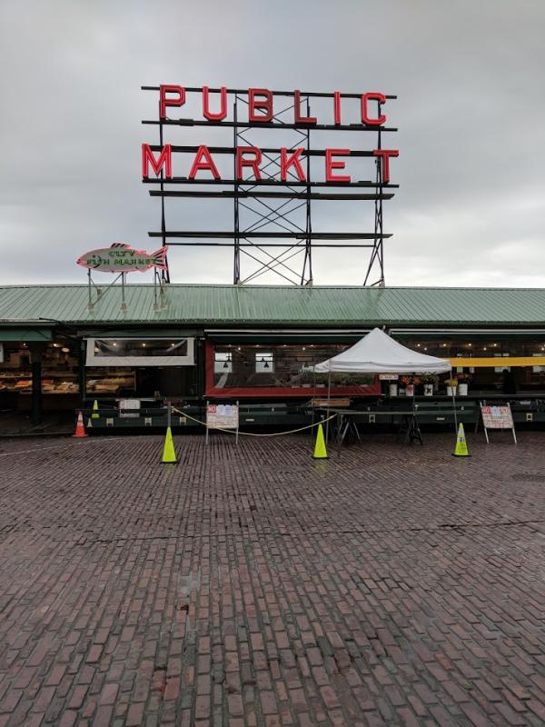

## Visiting Seattle to Speak about Structured Data

I spoke at SMX Advanced this week on Schema markup and Structured Data. It was part of an introduction to its use at Google.

I had the chance to visit Seattle and tour some of it. I took some photos, but I would like to go back sometimes and take a few more and see more of the City.

One of the places that I did want to see was Pike Place market. But, unfortunately, it was a couple of blocks away from the Hotel I stayed at (the Marriott Waterfront.)

It is a combination of fish and produce market and is home to one of the earliest Starbucks.

I could see living near the market and shopping there. It has a comfortable feel to it.

This is a view of the Farmers Market from the side. I wish I had the chance to come back later in the day and see what it was like other than in the morning.

This was a nice little park next to Pike Place Market, which looked like a place to take your dog for a walk while in the area, and had a great view of Elliot Bay (the central part of Puget Sound.)

This is a view of the waterfront closer to the conference center.

You can see Mount Ranier from the top of the Conference Center.

## My presentation on Structured Data for SMX Advanced 2018

**[Smx advanced-william-slawski-final](https://www.slideshare.net/billslawski/smx-advancedwilliamslawskifinal)** from **[Bill Slawski](https://www.slideshare.net/billslawski)**Schema, Structured Data & Scattered Databases Such as the World Wide Web. My role in this session is to introduce Schema and Structured Data and how Google is using them on the Web.

## The First Provisional Patents Filed at Google by Its Founders

Google is possibly best known for the PageRank Algorithm invented by founder Lawrence Page, from whom it has taken a name. In what looks like the second patent filed by someone at Google was the DIPRE (Dual interactive pattern relation expansion) patent, invented and filed by Sergey Brin. But, he didn’t name it after himself (Brinrank) as Page did with PageRank.

The provisional patent filed for this invention was the whitepaper, [Extracting Patterns and Relations from Scattered Databases such as the World Wide Web](http://ilpubs.stanford.edu:8090/421/1/1999-65.pdf). The process behind it is set out in the paper. It involves a list of 5 books, titles, authors, Publishers, Year published. Unlike PageRank, it doesn’t involve crawling web pages and indexing links from Page to page, and anchor text. Instead, it involves collecting facts from page to page, and when it finds pages that contain properties and attributes from these five books, it collects similar facts about other books on the same site. Once it finished, it would move on to other sites. It would then look for those same 5 books and collect more books. The idea is to eventually know where all the books are on the Web and facts about those books that could answer them.

## Sergey Brin’s First Patent Was On Structured Data

This is where we see Google considering structured data on the web and how helpful it could be.

When I first started out doing in-house SEO, it was for a Delaware incorporation business, and geography was an important part of my pages’ queries. I had started looking at patents, and ones such as this one on [Generating Structured Data](http://patft.uspto.gov/netacgi/nph-Parser?Sect1=PTO1&Sect2=HITOFF&d=PALL&p=1&u=/netahtml/PTO/srchnum.htm&r=1&f=G&l=50&s1=7,788,293.PN.&OS=PN/7,788,293&RS=PN/7,788,293) caught my attention. It focused on collecting data about local entities or local businesses and properties related to those. The team led by Andrew Hogue, who was in charge of the Annotation framework at Google, was responsible for “The Fact Repository,” an early version of Google’s Knowledge Graph.

If you’ve heard of NAP consistency and mentioned being important to local search, the local search focused on collecting structured data that could answer businesses’ questions. Patents about location prominence followed, which told us that a link counted as a mention, and a patent on local authority, which determined which Website was the authoritative one for a business. But, it seemed to start with collecting structured data about businesses at places.

## The DIPRE Algorithm Focused on Crawling the Web to Find Facts

The DIPRE Algorithm focused on crawling the web to find facts, and Google Maps built that into an approach that could be rank places and answer questions about them.

If you haven’t had a chance to use Google’s experimental table search, it is worth trying out. It can answer questions to find answers from data-based tables across the web, such as “what is the longest wooden pier in California,” which is the one in Oceanside, a town next to the one I live in. It is from a Web tables project at Google.

Database fields are sometimes referred to as schema, and table headers that tell us what kind of data is in a table column may also be “schema.” A data-based web table could be a small structured database, and Google’s Webtable project found a lot of information found in web tables on the Web.

## Google Papers on Structured Data

Try out the first link above (the WebTables Project Slide) when you get the chance, and do some searches on Google’s table search. The second paper described the WebTables project when it first started, and the one that follows it describes some of the things that Google researchers learned from the Project. We’ve seen Structured Snippets like the one above grabbing facts to include in a snippet (in this case, from a data table on the Wikipedia page about the Oceanside Pier.)

When a data table column contains the same data that another table contains, and the first doesn’t have a table header label, it might learn a label from the second table (this is a way to learn semantics or meaning from tables). These are truly scattered databases across the World Wide Web, but through crawlers, that information can display and become useful, as the DIPRE Algorithm described.

In 2005, the Official Google Blog published this short story, which told us about Google sometimes answering direct questions in response to queries at the top of Web results. I don’t remember when these first started appearing. Still, I do remember Definition results about a year earlier, which you could type out “Define:” and a word or ask “What is” before a word, and Google would show a definition, and there was a patent that described how they were finding definitions from glossary pages, and how to ideally set up those glossaries so that your definitions might be the ones that end up as responses.

## When Google Introduced the Knowledge Graph

In 2012, Google introduced the Knowledge Graph, which told us that they would be focusing on learning about specific people, places, and things and answering questions about those instead of just continuing to match keywords in queries to keywords in documents. They told us that this was a move to things instead of strings, like the books in Brin’s DIPRE or Local Entities in Google Maps.

We could start using the Web as a scattered database, with questions and answers from places such as Wikipedia tables helping answer queries such as “What is the capital of Poland.”

And Knowledge bases such as Wikipedia, Freebase, IMDB, and Yahoo Finance could be the sources of facts about properties and attributes about things such as movies and actors and businesses where Google could find answers to queries without having to find results that had the same keywords in the document as the query.

## The Start of Schema.org and More Organization for Structured Data

In 2011, The Schema.org site was a joint project from Google, Yahoo, Bing, and Yandex. It provided structured data as machine-readable text added to web pages. This text is machine-readable only, much like XML sitemaps are machine-readable, to provide an alternative channel of information to search engines about the entities pages are about and the properties and attributes on those pages.

While Schema.org came out in 2011, it was to be extendable and let subject matter experts add a new schema, like this extension from GS1 (the inventors of barcodes in brick and mortar stores). If you haven’t tried out this demo from them, it is worth getting your hands on to see what is possible.

## When Google Came Out with Biperpedia, Their Ontology of Search

In 2014, Google published its Biperpedia paper. It tells us about how they might create ontologies from Query streams. These are sessions about specific topics. That is done by finding terms to extract data from the Web about. Search engines would do focused crawls of the web at one point. They would start at sources such as DMOZ so that the Index of the Web they were constructing contained pages about a wide range of categories. By using query stream information, they crowdsource the building of resources to build ontologies. This paper tells us that Biperpedia enabled them to build ontologies larger than they had developed through Freebase. This may be partially why wiki data replaced freebase.

The Google+ group I’ve linked to above on the Schema Resources Page has members who work on Schema from Google, such as Dan Brickley, the head of Schema for Google. Learning about extensions is a good idea, especially if you might consider participating in building new ones. The community group has a mailing list, which lets you see and participate in discussions about the growth of Schema.
