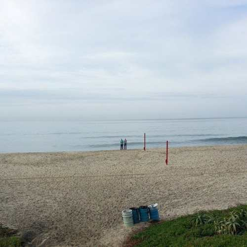
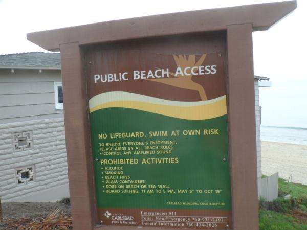
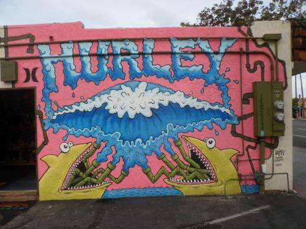
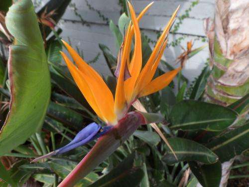
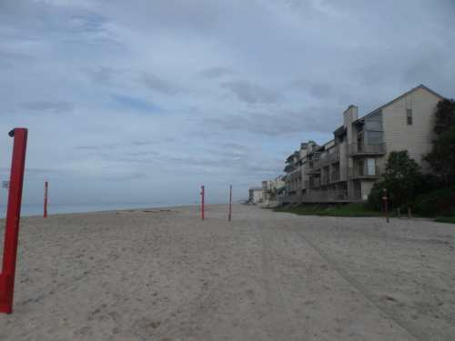
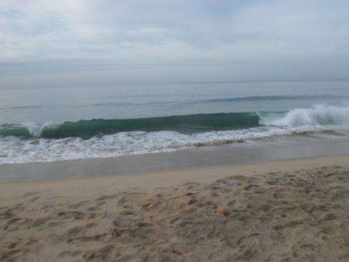
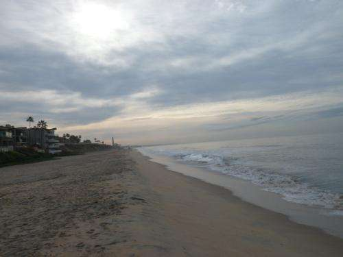

SEO by the Sea started as an idea that found its way into my head as I watched sails bounce up and down through a window on the Chesapeake Bay.

_Carlsbad Village Beach_

I’ve been looking at some different waters over the last week, thousands of miles away.

_A Public Beach Access information sign provides details about nearby beaches._

These beaches aren’t much like the Jersey shore I grew up with. But they are pretty nice.

_There are a lot of fun murals and places to explore in Carlsbad._

And there’s an artistic touch to the many communities that make up the San Diego beach community.

I will have to get used to seeing some different sights and warm weather where rain doesn’t fall much.

_There’s lots of sand no matter where you look._

I might have to learn to take lots of long walks in the sand, on a nearby beach.

_Even the Smaller Waves make me think of surfing on water instead of upon web sites._

And I’ll be joining my friend Barbara Starr as a co-administrator in the Lotico San Diego Semantic Web Meetup.

_I think this beach has me under its sway._
