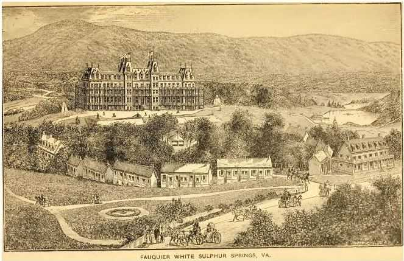
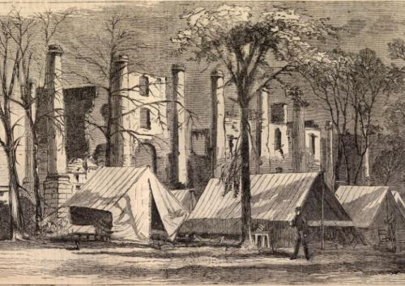
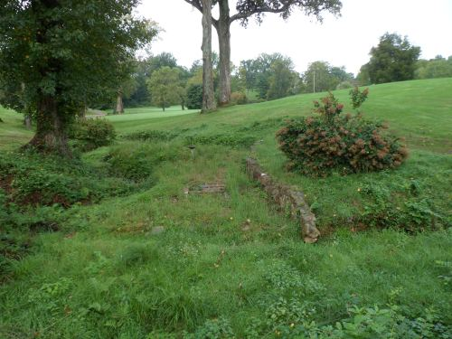

I read a novel not long ago, [Rainbow’s End](https://en.wikipedia.org/wiki/Rainbows_End) by Vernor Vinge, that suggested that in the future, one of the most popular technology positions would be that of software archeologist, with development and programming skills capable of digging through many lines of code to decipher where they originated and how they might work with other kludges within a program to interact in meaningful ways. It made me wonder how important it would be to have a sense of the history of the growth and development of the Web.

A trip to the [US Library of Congress Photographs](http://www.loc.gov/pictures/) website showed me a little of the local history of my region that I didn’t know much about, including the existence of a resort I hadn’t heard of before about five miles from where I live that could house more than a thousand people, and which had been the vacation spot of Presidents, Senators, Supreme Court Justices, and more.

I was excited to learn about the Fauquier Virginia White Sulpher Springs Spa partially because it was part of something that happened in my region that wasn’t directly tied to the revolution or the Civil War. Most of the local history I hear about involves one or the other of those events as if the time between them, and the time after rarely happened.

In the 1830s, a couple of large hotels and several cabins were constructed around springs at a location roughly 50 miles west of Washington, DC, to allow people to take advantage of the healthy waters of those springs. During a cholera epidemic in Richmond in 1849, the Virginia Legislature picked everything up and moved to the resort to continue the business of government in healthier surroundings.

The resort was located within a mile of a bridge that played a strategic transportation role during the Civil War. A number of the larger buildings were set on fire during a battle for possession of the bridge. No one knows whether the North or the South was responsible for the destruction. The image below from Harper’s Weekly shows Union troops camped in front of the ruins and notes that they were still drinking from the springs on the property.

After the War, the resort regained popularity as a resort, with people being transported by stagecoach from a train station in Warrenton. In the 1930s, Walter P. Chrysler purchased the land, and supposedly a number of the buildings on the site were restored to their former glory.

A visit this past weekend showed that the spa had been replaced by a [country club](https://www.fauquiersprings.com/) with a fairly modern main building and golf cart paths and greens dotting the countryside. One grass overgrown patch near the entrance to the country club showed some landscaping features that included a few stone steps down to a place where water could be collected and a very weathered birdbath.

I asked a groundskeeper if he knew of any old buildings or structures on the property, and he said that he was new to the job, only having been there a year, and didn’t know about anything like that. The people inside the main building did know about a fire that caused the present building to replace the old one. But that fire happened maybe 30 years ago. A look around the clubhouse showed some old prints from the early 1800s, but it seemed like the people who worked there were oblivious to much of the history of the land they worked upon.

There were many resorts in Virginia, and in the rest of the Country that centered around healthy spring waters. In more northeastern states like those in New England, many blossomed into urban centers, but in Virginia, these resorts were often places found in the countryside to visit during the warm summer months. The healing powers of the waters and the country air were a prescription of health for the times, and seem to have been replaced by a morning or mid-day getaway for a few holes on the greens.

I can’t help but think of how the landscape of the Web is changing and transforming as well, from the days when [Altavista](https://web.archive.org/web/20010405140824/http://www.altavista.com/) and [Excite](http://www.excite.com/) and [Lycos](http://www.lycos.com/) were some of the most popular search engines on the face of the World Wide Web, to be supplanted by Google and Bing these days.

The Yahoo Directory was one of the most important places to have your website listed in the 90s, and well as the Open Directory Project, and now it seems clear that a human-edited directory can’t keep up with the growth of the Web.

With a phrase like “[More wood behind fewer arrows](https://googleblog.blogspot.com/2011/07/more-wood-behind-fewer-arrows.html),” Google recently announced that they would be ending many of the projects they were testing at Google Labs.

Once extremely popular social site [Myspace](https://myspace.com/) keeps on losing ground to newer social sites such as [Facebook](https://www.facebook.com/), and even Google’s new social site Google Plus.

The search engine optimization and web promotion I’ve been doing for the last 15 years have changed over that time, and the web and search changes.

Thinking back, I remember producing ranking reports years ago that included 10 or 11 search engines. Many site owners that we did SEO for only had rudimentary log file statistics programs on their sites that they barely looked at. Now, many of the sites you look at have Google Analytics account code installed on their pages.

The help guidelines from the search engines have transformed over time as well. I remember when I first read the AltaVista FAQ that suggested adding up to 1024 characters worth of keywords to your meta keywords tag. Google’s [Webmaster Guidelines](https://support.google.com/webmasters/answer/35769?hl=en) used to suggest that you submit your web address to high-quality directories to make it easier for your site to be found online. That suggestion appears to have been replaced by a statement to “Make sure all the sites that should know about your pages are aware your site is online.”

Many sites you visit these days have buttons and widgets that allow people to share your pages with others through Twitter and Facebook, Google Plus, and other services. Years ago, sites sometimes provided ways for you to share a link to a page via email.

I’ve been writing about patents and whitepapers from the search engines here, and sometimes feel as much like a historian as a blogger or someone searching for ideas and assumptions and concepts explained in those primary documents from the search engines.

Some of the patents I’ve looked at describe changes that likely happened at Google or Yahoo, or Microsoft, though possibly not quite in the same manner as described within the patents themselves. Some of them describe things that might still happen, as soon as the technology or the web itself matures enough to make them possible. Some of those patents describe alternative pathways that the search engines could or might have taken, but didn’t because of changes in technology or because they might not have made sense from a business standpoint.

Many of them have described things the search engines may have implemented that were impossible to see on the surface, that required digging down below what we see of the interfaces of Google or Yahoo or Bing. I’m staggered sometimes in seeing some of the hints at technology below the surface that many patents hold.

Just like I’m staggered to imagine the resort that existed five miles down a sleepy little country road from me, that housed thousands, and was a place of healing and recreation for many people for a good number of years, is now a sleepy little country club for people to hit around a few golf balls casually.
