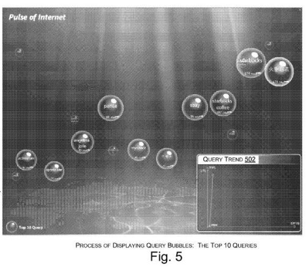

When you walk into the lobby of Building 42 at the Googleplex, you can see a display that shows you queries entered into the search engine at any one time. It’s a mesmerizing sight, and I found myself wondering about the people and motivations behind some of the search terms I saw flowing down the screen.

Imagine that instead of seeing one query at a time, that search information was analyzed, and queries were bundled together, to maybe provide us with more meaning.

Can search engines be used to tell us what the world is thinking at any one time? Would looking at the most popular search queries that people type into a search engine provide us with some insights?

**Most Popular Search Queries Information from Search Engines**

Popular search query information is available from the major search engines, though some services created to provide us with a look at what people are searching for the most.

Google gives us quite a lot of information with a number of services, including [Google Trends](https://trends.google.com/trends/), [Google Trends for Websites](https://trends.google.com/trends/), Google Insights for Search, and [Google Hot Trends](https://trends.google.com/trends/trendingsearches/daily?geo=US).

Yahoo also lets us look at the words people are searching for with a service that is updated daily – the [Yahoo Buzz Index](https://www.yahoo.com/news/).

Ask shows off weekly search information on their IQ – Interesting Queries page.

None of the information from any of those services is updated in real-time, or near real-time.

**Presenting Trends About the Most Popular Search Queries Visually**

Imagine being able to see the most popular search queries from different parts of the world as they are searched for, and being able to break those down into their geographic origins or by demographics for searchers, and being able to look at the pages that people clicked upon for those queries.

A new patent filing from Microsoft describes a way of visualizing search activity, using log file information from the search engines, and capturing search keywords as they are used, or very close to a real-time capture.

The screenshots from the patent filing aren’t of the highest quality, but the one above is a variation that could be used which shows a map of the world, with bubbles floating from the bottom from different parts of the world, standing for specific popular queries from those areas, with the sizes of the bubbles indicating how popular the queries are.

Those bubbles could be clicked upon, to find out more information, such as which pages people clicked upon to see information about those queries. The bubbles can also change in size as they float up to the top, to show changes in the popularity of each query.

The information presented is taken from Microsoft’s search log data, and it represents what Microsoft calls a real-time “pulse of the Internet.”

The patent application is:

[Internet Visualization System and Related User Interfaces](http://appft1.uspto.gov/netacgi/nph-Parser?Sect1=PTO2&Sect2=HITOFF&u=%2Fnetahtml%2FPTO%2Fsearch-adv.html&r=1&p=1&f=G&l=50&d=PG01&S1=20080256444.PGNR.&OS=dn/20080256444&RS=DN/20080256444)
Invented by Min Wang, Weizhu Chen, Benyu Zhang, Zheng Chen, Jian Wang
Assigned to Microsoft
US Patent Application 20080256444
Published October 16, 2008
Filed January 10, 2008

Different types of information that could be shown might include:

1. Geographic origins of queries,
2. Demographics of Internet users submitting each query,
3. Most popular queries for a given geographical region or demographic category,
4. Clicked-on links associated with each query, and;
5. Displayed pages of the clicked-on links.

This system may also allow viewers with multiple views of the information presented, by allowing them to filter it based upon geographical and demographic information. I’m not sure how they might capture some of this information, but they tell us they they could filter by:

- Gender,
- Age,
- Nationality,
- Organization,
- Interests,
- Income,
- Profession,
- Hobbies,
- Shopping habits, or;
- Web pages linked to.

**Privacy and Removal of Some Information**.

We are given some information about the kinds of things that might not show up in this visualization of Microsoft’s searches.

The patent application doesn’t go into much detail on privacy, but it does touch upon the topic a little.

We are told that an anonymizer might strip some queries of private and personal information, and other filters might be used to remove:

- noise or repetitiveness in the queries,
- Unintelligible queries, or;
- Undesirable queries, such as search queries that include illegal or undesirable requests.

**Conclusion**

I’d love to see more detailed information from all of the search engines on what they consider to be the most popular search queries. I suspect that all of them may provide more detailed looks in the future.
