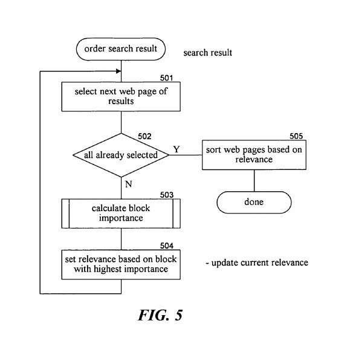

## After Web Page Segmentation, What is Next?

Many web pages contain more than one topical section, or blocks, which may make it difficult for a search engine to tell what a page is about when it is trying to index that page.

These blocks may include such things as the main content area, navigation bars, headings, footers, advertisements, and other content that may refer to other pages on a site, or on other sites.

It is likely that a search engine may engage in web page segmentation to better understand what those blocks of a page may be.

## The Value of Knowing the Most Important Block in Web Page Segmentation

Being able to identify a block within a web page that represents the primary topic of that page may help a search engine decide which words are the most important ones on the page when it tries to associate the page with keywords that someone might search with to find that page. This is an important reason for web page segmentation.

Identifying that content might also help the search engine decide what topic is most relevant to any ads that they might show on the page if they are an advertising partner with the publisher of the page.

Or how to break a page into multiple parts when displaying a page in parts for mobile devices on a proxy server, and show the most important parts of the page first.

Knowing a primary topic for a page could help a search engine decide which pages across the web might be related by topic.

Determining the most important block on a page could influence the weight and importance of links from different blocks on a page, so that a link from the most important block on a page has more value than a link from the least important block – a [Block Level Link Analysis](https://www.microsoft.com/en-us/research/publication/block-level-link-analysis/).

A Microsoft patent granted in April explores the identification of a block within a web page that represents the primary topic for that page, and how identifying that block might be helpful in many ways.

## Noise Information and Primary Topics

A page from a news site on the Web might contain an article about an international political event and “noise information” like a diet advertisement, a legal notices section, and a navigation bar.

A search engine attempting to index the full content of the page might choose keywords based upon the noise information instead of from text related to the primary topic of the page – the political event. Another reason to engage in web page segmentation.

That news page shouldn’t rank well in a search for the keyword “diet,” but it might, even though the primary topic of the page involves an international political event.

Pages that appear in search results where the query terms searched for are related to the primary content of those pages are likely to provide a much better experience for a searcher than pages appearing in those search results where noise on the page is related to the query searched for by someone.

The Microsoft web page segmentation patent is:

[Method and system for calculating importance of a block within a display page](http://patft.uspto.gov/netacgi/nph-Parser?Sect1=PTO2&Sect2=HITOFF&u=%2Fnetahtml%2FPTO%2Fsearch-adv.htm&r=1&p=1&f=G&l=50&d=PTXT&S1=7,363,279.PN.&OS=pn/7,363,279&RS=PN/7,363,279)
Invented by Wei-Ying Ma, Ji-Rong Wen, Ruihua Song, Haifeng Liu
Assigned to Microsoft
US Patent 7,363,279
Granted April 22, 2008
Filed April 29, 2004

The abstract for the web page segmentation patent tells us that it describes:

> A method and system for identifying the importance of information areas of a display page. An importance system identifies information areas or blocks of a web page.
>
> A block of a web page represents an area of the web page that appears to relate to a similar topic.
>
> The importance system provides the characteristics or features of a block to an important function that generates an indication of the importance of that block to its web page.
>
> The importance system “learns” the importance function by generating a model based on the features of blocks and the user-specified importance of those blocks.
>
> To learn the importance function, the importance system asks users to provide an indication of the importance of blocks of web pages in a collection of web pages.

## After Web Page Segmentation, Identifying the importance of information areas of a web page

This system attempts to identify and understand different information areas, or blocks, of a web page – where a block represents an area on a page that seems to relate to a similar topic, after web page segmentation. For example, a news article might be one block, and an advertisement might be another.

After the blocks of a page are identified, an importance system might look at the characteristics or features of each block to determine how important each block might be.

This importance system would use an algorithm that builds a statistical model based upon features of blocks, and upon human input determining the importance of a number of blocks in a collection of web pages.

The model might help the search engine learn to determine which blocks are the most important so that it can use that model on other pages that aren’t reviewed by people.

The kinds of features that might be used in the model might include “spatial” features such as the size of blocks or their locations or both, as well as “content” features such as the number of links within a block or the number of words within the block. Understanding the features of different blocks in an important stage in web page segmentation

A block located in the center of a page might be considered more important that another block at the bottom of a page.

Some “content” features might include:

- The number and size of images in the block,
- The number of links, and the number of words in each link, in the block,
- The number of words in the text of the block,
- User interaction of the block, looking at things like the number and size of input fields, and;
- Forms within the block, again looking at number and size number ans size of input fields.

When people review pages to provide input for the model, they might rate different kinds of blocks with different weights.

For example, an advertisement or copyright notice or decoration might be given a score of 1,

Navigation or directory information might be given a score of 2.

Information that is relevant to the primary topic but not of prominent importance such as “related topics” and “topic indexes” might be given a score of 3.

The most prominent page of the page such as a headline or the main content might be given a value of 4.

## Web Page Segmentation Conclusion

The patent describes some of the different methods that might be used for web page segmentation, but a more detailed look at that process is available in a Microsoft paper titled [Block-based Web Search](https://www.microsoft.com/en-us/research/publication/block-based-web-search/) (pdf).

A process for breaking web pages into smaller blocks for display on small screens is described in the Microsoft paper [Adapting Web Pages for Small-Screen Devices](https://dl.acm.org/doi/10.1109/PERCOM.2005.16) (pdf)

The ideas of a “block-based” HITS algorithm, a block-level structure in an inverted index of web documents, a ranking of blocks similar to a ranking of pages, and expansion of query terms based upon the content found in the most important blocks are discussed in Microsoft Research Asia at the Web Track of TREC 2003.

It shouldn’t be a surprise that [Yahoo](http://wwwconference.org/www2007/papers/paper588.pdf) (pdf) and [Google](https://www.seobythesea.com/2006/07/google-and-document-segmentation-indexing-for-local-search/) have been exploring web page segmentation to find the most important segments upon pages.
