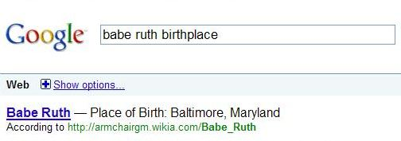

If you were to search for [Ronald Reagan Movies] at Google or Yahoo or Bing, would you expect to see a list of movies that the former President and actor appeared in?

It’s more likely that you would see a set of web pages that contain the words “Ronald” and “Reagan” and “Movies,” which might contain the names of films starring the former politician and thespian.

A patent application from Yahoo published last week explores ways to return information directly to searchers, based upon building search taxonomies of information about specific people, places, and things, gathered from information found on web pages, rather than having searchers look through multiple web pages to find answers to queries such as “Ronald Reagan movies.”

Both Yahoo and Google do some question answering when faced with certain queries that involve “named entities,” or the names of well-known people, places, and things. For example, search at either search engine for [Babe Ruth birthplace], and above the web pages on the search results pages appears an answer to that question:

But neither search engine provides more detailed sets of information, such as lists of quotes from certain people, or movies that they might have appeared within, or political offices held. Would these be the kinds of things that people might like to see in search results? Yahoo’s patent filing explores how they might build taxonomies of information about someone like Ronald Reagan, and extract information from web pages to build answers to questions like those for display on a search result page. The patent filing is:

[Creation and Enrichment of Search-Based Taxonomy for Finding Information from Semistructured Data](http://appft.uspto.gov/netacgi/nph-Parser?Sect1=PTO2&Sect2=HITOFF&u=%2Fnetahtml%2FPTO%2Fsearch-adv.html&r=1&p=1&f=G&l=50&d=PG01&S1=20090282010.PGNR.&OS=dn/20090282010&RS=DN/20090282010)
Invented by Sudharsan Vasudevan, Rohan Monga, Hemanth Sambrani, and N S Sekar
US Patent Application 20090282010
Assigned to Yahoo!
Published November 12, 2009
Filed June 18, 2008

Abstract

> Techniques are provided for creating and updating an entity hierarchy (search taxonomies) based on information captured about user interaction with a system. Techniques are also provided for using the taxonomy to determine the nature of entities represented by terms submitted to a search engine. Search logs analyzed for related sets of entities and used to improve the taxonomy for storing information.
>
> Once the taxonomy is created, information across data sources is fetched and aggregated based on the taxonomy. When the system is queried, the query is modified to a predefined template, and the best fit result is promptly returned. A feedback mechanism is also provided to enhance taxonomy and entity data based on search volumes. This system enables search engines to provide accurate answers when entities, their attributes, and relationships are involved.

The inventors of the search taxonomies patent use Ronald Reagan as one example because he can fit into more than one “main” category in a taxonomy or classification system, with a history as both a movie star and a politician. Under the “movie stars,” category might attribute such as “date of birth” as well as “movies acted.” Under the “politicians” category, we might also see “date of birth,” but other attributes such as “offices held” may also be included.

What’s kind of interesting about this is that it reminds me of the structure at the roots of Yahoo’s origin as a directory. We’re told that Yahoo would build search taxonomies using a combination of feedback from search query logs and from manual human intervention. The human editing aspect of building a taxonomy would help make sure information is correct, and automated feedback from query logs would help make sure that the taxonomy was up-to-date and included very recent information from search trends.

Many of the search taxonomies examples included in the patent description involve well-known people or places or things, often referred to as “named entities,” such as Johnny Depp or the Empire State Building. Still, the patent filing tells us that it might include broad and specific categories that don’t involve named entities as well, from “humans” to “11th-grade teachers.”

For many of the search taxonomies that a system like this might create, the search engine might start with pre-existing data sources that provide information such as the Internet Movie Database (not specifically named in the patent filing), or yellow page directories.

When it comes to certain types of categories, such as those that might list people, there may be default attributes associated with those that are defined by human editors, such as a “date of birth,” or “place of birth,” or a “date of death.”

Other attributes that could be applied to categories might be learned by looking at search logs to see what people are looking for. An example might be that people often look for quotes from someone like “Mark Twain.” If those kinds of searches tend to be common, it might be reasonable for a search engine to collect Mark Twain quotes to show to searchers when there are queries for [mark twain quotes].

Some people, places, and attributes have common alias or alternative names. For example, when you search for a date of birth for someone, you might use the words “birthday,” or “born,” or “d.o.b.” When someone searches for Johnny Depp, they might also search for “Johnny D.,” “J. Depp,” and “Jack Sparrow.” A search query including “United States” might call the country “US,” or “USA,” or “United States of America.” A search engine may learn to associate these alias names automatically from search logs.

Sources for categories and attributes to display to searchers might be identified by editors and click-through information from searchers, as seen in search logs. Some sources might be given higher “confidence levels” from those human editors, or by the search engines, though the patent doesn’t tell us the qualities that might be used to determine those confidence levels. Presumably, if a particular web page were used to provide information and answers to queries, the search engine would link to that page like in the examples above about Babe Ruth’s birthplace from Google and Yahoo.

**Search Taxonomies Conclusion**

The patent does go into more detail on how it might build search taxonomies, and how it might decide what information might be shown in response to certain kinds of queries.

While that is worth spending some time with, what is most interesting about this patent application is that it shows a desire to answer questions to queries directly, rather than to present searchers with pages that may or may not provide those answers. Of course, the search engines will likely continue to show web pages that might be good results for queries from searchers after displaying answers.

If you’re a searcher looking for information on a topic, and search engines answered your questions directly like this, how comfortable would you feel with those answers?

If you’re a site owner, would it bother you that a search engine might mine your website to display answers and potentially keep visitors from coming directly to your website for those answers?
