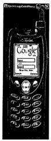
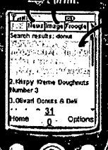
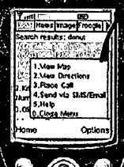
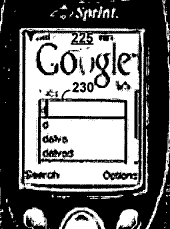

In a new patent application, Google unveils a specialized client software that isn’t a web browser, for searching through the Google search engine on mobile devices, and for viewing emails. This software can read html, but doesn’t work quite the same way that normal web browsers do.

I wrote a post last night at Search Engine Land on a patent application from Google on how they might speed up the reception of search results, in response to a query – [New Google Mobile Phone Search Patent Application](https://searchengineland.com/new-google-mobile-phone-search-patent-applications-10786). It’s difficult to tell whether or not that method would work with this specialized software, but the patent documents do share authors, so it’s possible that they could function together.

[Customized data retrieval applications for mobile devices providing interpretation of markup language data](http://appft1.uspto.gov/netacgi/nph-Parser?Sect1=PTO1&Sect2=HITOFF&d=PG01&p=1&u=%2Fnetahtml%2FPTO%2Fsrchnum.html&r=1&f=G&l=50&s1=%2220070066364%22.PGNR.&OS=DN/20070066364&RS=DN/20070066364)
Invented by Elad Gil, Shumeet Baluja, Maryam Kamvar, and Cedric Beust
US Patent Application 20070066364
Published March 22, 2007
Filed: September 19, 2005

The abstract starts by telling us that this covers:

> Systems and techniques, including computer software, for retrieving information to a mobile device involve installing a data retrieval application on the mobile device.

It then goes into more detail on how it works:

> The data retrieval application includes instructions for presenting a structured data display on the mobile device,
>
> defining a structure of the structured data display,
>
> requesting selected hyperlinks included in the structured data display, and;
>
> rendering markup language information received in response to the selected hyperlinks.
>
> A user request to retrieve data through the data retrieval application is received, and data is retrieved in response to the received user request.

What do we actually see in response to a search? The abstract isn’t completely clear here in the next section, but what it means is that what we see may depend upon the kind of device we are using:

> The retrieved data is displayed according to the structure of the structured data display, and a user can select a hyperlink in the displayed data to retrieve and render markup language information using the data retrieval application.

It does discuss features of the software, which I’ve tried to break down a little:

1) The data retrieval application is a search application or an electronic mail client application.

2) When a person performs a search, they receive hyperlinks in response, but a browser application isn’t accessed.

3) This software can run on phones, PDAs, and other wireless devices.

4) when someone clicks through to a page from an hyperlink returned in results, they may not see a web page, but rather a version of the content of that page set up to be viewed specifically on a mobile device.

6) When someone receives an HTML formatted email, instead of seeing the HTML that accompanies the email message, they may instead see formatting for display on the mobile device.

7) The software does allow people to follow links in search results or emails, but not to generally surf the web, or enter URLs in an address bar – it doesn’t come with an address bar.

8) There may be an optional location field in the search application, where zip codes could be entered.

9) It may also contain tabs, to allow for other searches such as for news or images.

A snippet from the patent filing goes into more detail. First, it tells us that this clearly isn’t a browser, nor does it launch a browser:

> Unlike conventional applications that support hypertext and other hyperlinks, which typically launch a separate, default browser application to retrieve data associated with a hyperlink, the data retrieval application 110 does not use an inter-application program call to launch or otherwise access the functionalities of a separate browser application.

Then it discusses why, which seems to involve at least two reasons – launching a new application is a bad user experience, and the non-browser program can also give us access to other data involving the results, such as maps or product search:

> As a result, the data retrieval application 110 avoids the potential for an unsatisfactory user experience that can result from the delays generally inherent in activating a separate browser application and loading a web page. The data retrieval application 110 also provides for convenient access to a broad set of data associated with an initial set of retrieved data and allows viewing of results that are web-specific within the data retrieval client application 110.

Images from the patent application show other possible features in the screens for the phones:

Here’s a view of search results

Map results, with an overview to let us look at more maps or other functions such as getting directions or making a phone call to an identified location or sending them a txt message or email:

It appears to also offer [Predictive queries](https://www.seobythesea.com/2006/06/google-predicting-queries/) to a searcher as they are typing in their search terms:

There have been a lot of rumors about a Google Phone recently, but the software in this patent application shows a way of performing searches on Google that doesn’t require a specialized phone. It isn’t quite surfing the Web, but it does look pretty useful.
