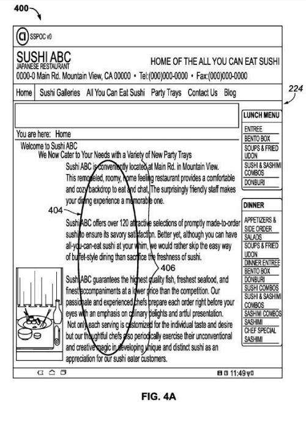

Visitors to a website may want to perform certain actions related to Entities (specific places or people or things) displayed to them on the Web.

For example, at a page for a restaurant (an entity), a person viewing the site may want to create a reservation or get driving directions to the restaurant from their current location. Doing those things may require a person to take several steps, such as selecting the name of the restaurant and copying it, pasting that information into a search box, and submitting it as a search query, selecting the site from search results, determining if making a reservation is possible on the site, and then providing information necessary to make a reservation; getting driving directions may also require multiple steps.

Using a touch screen device may potentially be even more difficult because the site would possibly then be limited to touch input. This patent is very much about using touch screens.

A patent granted to Google this week describes a way to easily identify an entity such as a restaurant on a touch device, and select it online and take some action associated with that entity based upon the context of a site the entity is found upon. Actions such as booking a reservation at a restaurant found on a website or procuring driving directions to that site, or other actions could be easily selected by the user of a site.

The patent is:

[Semantic selection and purpose facilitation](http://patft.uspto.gov/netacgi/nph-Parser?Sect1=PTO1&Sect2=HITOFF&d=PALL&p=1&u=%2Fnetahtml%2FPTO%2Fsrchnum.htm&r=1&f=G&l=50&s1=9,305,108.PN.&OS=PN/9,305,108&RS=PN/9,305,108)
Inventors: Paul Nordstrom, Casey Stuart Whitelaw,
Assignee: Google
US Patent 9,305,108
Granted April 5, 2016
Filed: October 5, 2012

Abstract

> Computer-implemented methods for proposing actions to a user to select based on the user’s predicted purpose for selecting content are provided. In one aspect, a method includes receiving an identifier of a referent entity associated with user-selectable content, identifying, based on a prediction of a purpose in selecting the content, at least one action to be executed that is associated with the entity, and providing, for display, at least one identifier of the at least one action to the device for selection by a user. Systems, graphical user interfaces, and machine-readable media are also provided.

## How Entity Actions Might be Selected by a Site Visitor

A person searches for a site using text such as “sushi restaurants in Mountain View.” That person then circles the text “we love Ramen Sushi out of all of the places we’ve been to” on the web page they found with that search by circling the text using touch input. Based on the content they chose and the context of their selection of that text, The system decides that the viewer of the page has selected “Ramen Sushi,” and it proposes that entity to the user. The user can confirm that and is then given many actions to perform on the entity based on the context of that selection.

_Someone circles an entity on a touch screen to perform actions on it._

The context can include:

- The current location of the device
- A past location of the device
- The type of the device
- A previous action associated with the entity taken by the user or another user
- A search query
- Information on another user associated with the user
- The file from which the user-selectable content was selected
- The remaining content from which the user-selectable content was selected

Entity Actions might then be displayed that could include:

- Directions to Ramen Sushi
- Make a reservation at Ramen Sushi
- Operating hours for Ramen Sushi
- Reviews of Ramen Sushi

Once an entity action is chosen, it can be performed by the system.

Entities are contained in an entity database, which may contain attributes or properties associated with the entity, and those can be pre-defined and can have associated descriptors such as “location,” “restaurant,” and “phone number.” For example, an entity that is a person such as George Washington can have an associated descriptor “notable person.”

The patent tells us that entities listed in the entity database can be associated with one or many user purposes and/or actions based on an associated descriptor.

A purpose is something that a user wants to do or find out concerning an entity selected. These entity actions are shown in a menu to the user as choices of actions to take regarding selected entities. These purposes may be referred to as a “task.” The patent provides several examples that include:

> “play” (e.g. for games and sports), “rate” or “evaluate,” “travel to,” “contact,” “communicate,” “share,” “record,” “remember,” dine,” “consume,” “experience” or “enjoy” (e.g. art, music), “reserve” (tickets, etc.), “compare,” “learn,” “study,” “understand,” “purchase,” “repair,” “fix,” “teach,” “cook,” and “make.” For the example purpose “dine,” an example sub-purpose can be “eat dinner,” from which example sub-purposes can be “make reservation,” “get directions,” and “find parking.”

The patent tells us that users can select multiple entities of the same type simultaneously to compare them.

Entities, purposes, and actions can be added to the entity database either manually or automatically with a user (or even an owner of the entity) adding information. The patent provides some examples of how information might be added to the entity database, but it seems fairly wide open under the patent.

The patent doesn’t mention [Schema](https://schema.org/) vocabulary, which would be one way for a site owner to add entity information to an entity database.

Entities may be products, and actions presented to a user could include providing a review of the product, identifying a seller of the product, providing a price for the product, or providing an offer (e.g., discount or coupon) associated with the product. If the entity is a service, such as watching a movie or a plumber for hire, the actions that may be presented to the user could include “providing a review of the service, identifying the availability of the service (e.g., showtimes), identifying a location where the service is being provided (e.g., an address of the plumber), or providing an option to purchase the service (e.g., purchasing tickets for the movie or rates offered by the plumber).”

## Entity Actions Take Aways

The entity database described in this patent could be a massive one, containing multiple businesses (like those from Google Maps), multiple products, multiple people (like those found at a knowledge base like Wikipedia), and multiple potential actions and tasks with those entities.

This seems to be a fairly aspirational patent, which might require many steps to be put into place before it is implemented. However, it does present a vision of how entities on the web could eventually be acted upon by people who see them on web pages.

This could be something that Google may intend to do, and some of the pieces for it are in place, such as a [knowledge graph](https://www.google.com/intl/es419/insidesearch/features/search/knowledge.html) filled with entities, and [a schema system that is extendable](https://schema.org/docs/extension.html). It’s interesting seeing a patent that lays out a framework as this one does. Is this a future path that Google will follow? We may need to wait to see.

Added: Google has added entity actions to sites, and now has an [Actions on Google Glossary](https://developers.google.com/assistant/actions/glossary). Instead of basing the selection of actions on touch screens, Google has done this with voice selections and describes how it works with Google Assistant. I haven’t seen a patent that describes entity actions using voice instead of touch screens, and I suspect that one will not appear.

Last Updated; June 2, 2019
