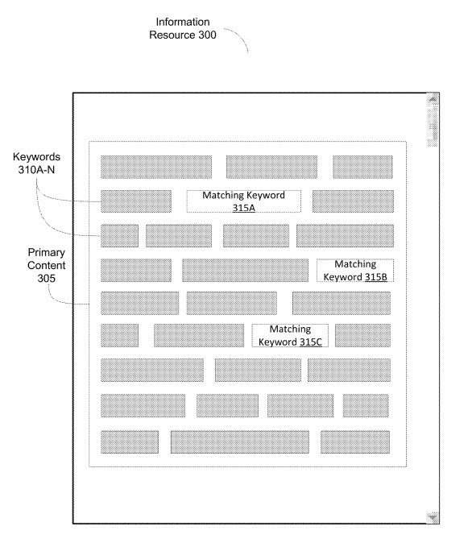
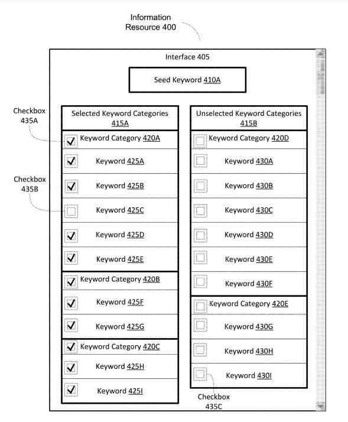
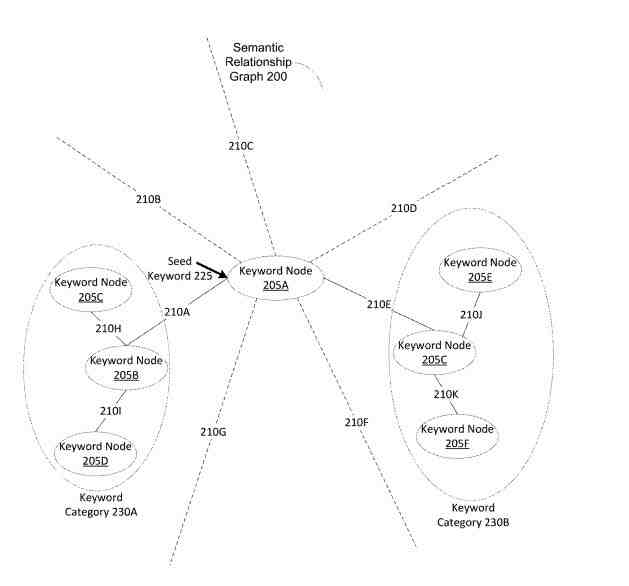
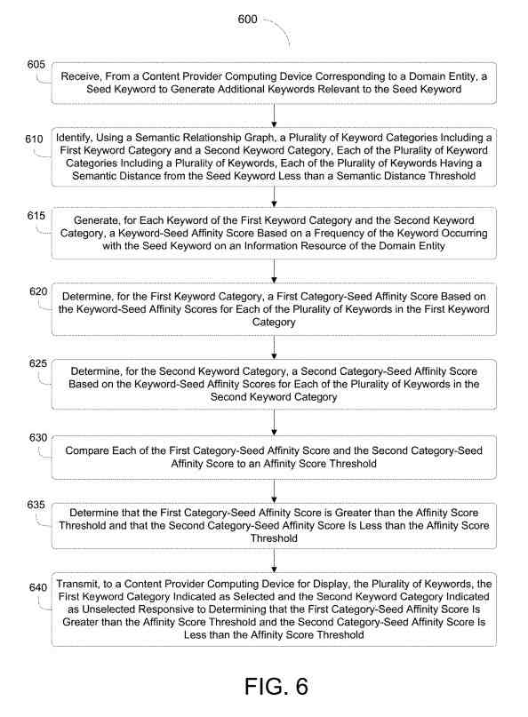
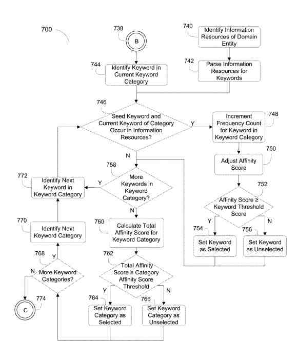
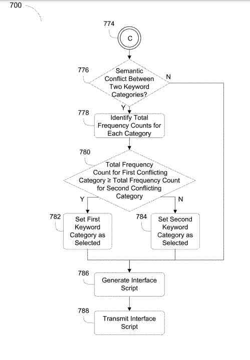
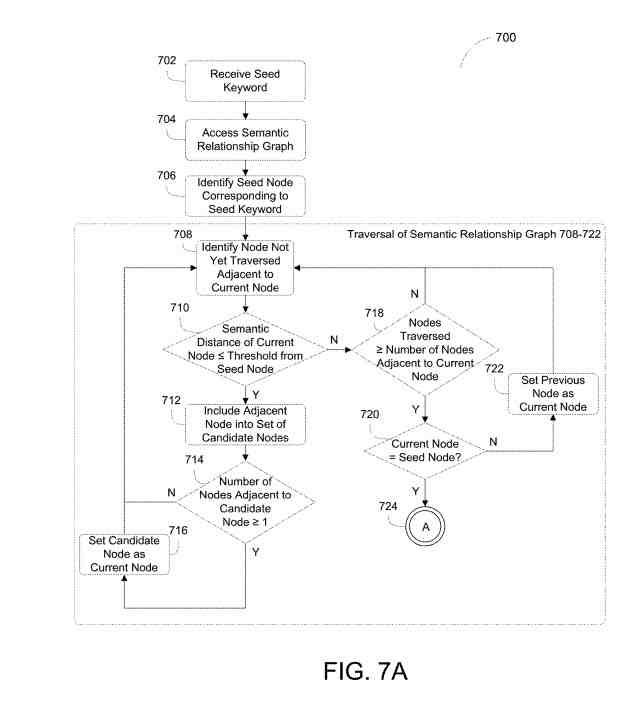
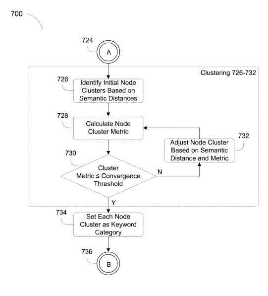

## Prelude – What is a Keyword?

Usually, a term or a phrase is selected to get associated with a page so that the page may rank for that term or phrase in search results. That is known as selecting a keyword for a page.

## Domain Terms as Keywords

There are other times when you may add words or phrases to a page to get it to rank for a selected keyword term or phrase. For instance, in the case of [context vectors](https://www.seobythesea.com/2016/10/google-patents-context-vectors-improve-search/), domain terms (as in knowledge domains) that can help identify the meaning behind a keyword term or phrase chosen for a page can help the search engine understand which meaning is being indexed. For example, when a page is optimized for the term “horse” and domain terms such as “stirrups,” or “saddle,” or “thoroughbred,” are added to the page, the right meaning for that keyword can get returned by the search engine.

## Frequently Co-Occurring Complete and Meaningful Phrases in Phrase-Based Indexing

In [Phrase-based Indexing](https://www.seobythesea.com/2006/02/move-over-pagerank-googles-looking-at-phrases/), a keyword may get selected for a page, and Phrases that are frequently -co-occurring on other pages that rank highly for the same phrase may be added to that page. Google has Indexed these frequently co-occurring complete and meaningful phrases in a posting list according to one of the many Phrase-based indexing patents. I wrote about this approach to an inverted index of phrases in this post on phrase-based indexing: [Are You Using Google Phrase-Based Indexing?](https://gofishdigital.com/are-you-using-google-phrase-based-indexing/), which covers the patent: [Index server architecture using tiered and sharded phrase posting lists](https://patft.uspto.gov/netacgi/nph-Parser?Sect1=PTO1&Sect2=HITOFF&d=PALL&p=1&u=%2Fnetahtml%2FPTO%2Fsrchnum.htm&r=1&f=G&l=50&s1=9,652,483.PN.&OS=PN/9,652,483&RS=PN/9,652,483).

## LSI Keywords

Unfortunately, some SEO tool makers and SEO writers have written about something called “LSI Keywords” without showing that LSI (Latent Semantic Indexing) was used to generate those keywords. Even worse, there is a lack of proof that adding LSI Keywords to a page can help that page rank for a specific term. Also sadly, people who have written about LSI Keywords appear to make up what LSI Keywords actually are, pointing in many cases to tools such as suggestions from Google Keyword planner, highlighted words in search results, and Google query refinements as “LSI Keywords.” Those sources claim they are “LSI Keywords” and provide no examples of them being used in helping a page to rank for other keywords.

Google has warned people against “keyword stuffing,” where people repeat the same keyword over and over on a page and “stuff” the page with that keyword. At some point, Google may look with disdain at when pages are heavily stuffed with something like random semantically and relevance-related keywords intended to get a page to rank for another keyword. Since we have not seen any official words from Google on LSI Keywords, except that they do not exist, it is difficult to predict how Google will react to their use or overuse.

I have seen at least one site penalized for keyword stuffing by simply referring to entities pictured in alt text twice. Google pays attention to what you are putting on pages.

## Semantic Relevance Of Keywords

This patent describes how Google may provide keywords that have semantic relevance. The patent does not say that pages are intended to rank for these terms and phrases, or that you should add these terms and phrases to help your page rank for another term. This patent on semantic relevance was originally filed in 2016 and describes a data processing system that may identify semantically related keywords from information sources on the Web. I suspect that I will return to this patent and read it over again on a regular basis. It seems to provide good questions about keywords. We may see Google provide us with tools like the keyword suggestion tool, based on making suggestions about keywords that have semantic relevance.

Details about the Full Semantic Relevance of Keywords Patent follow.

## Just What is the Semantic Relevance of Keywords?

On the Web, content providers show content for display on end-user computers. The content typically takes the form of portions that may get displayed. For example, portions of content typically get provided by way of web pages, with each part of the content being provided as a web page.

At least one aspect gets directed to measuring the semantic relevance of keywords by parsing information resources.

The semantic relevance of Keywords is based on the semantic distances among each of the keywords.

## The Data Processing System Behind The Semantic Relevance of Keywords

This process starts with a data processing system with multiple processors. It can receive a seed keyword from a content provider computing device corresponding to a domain entity to generate more keywords relevant to the seed keyword.

The data processing system can use a semantic relationship graph to identify keyword categories, including a first keyword category and a second keyword category.

Each of the keyword categories includes keywords. Each of the keywords can have a semantic distance from the seed keyword less than a semantic distance threshold.

The data processing system can generate, for each keyword of the first keyword category and the second keyword category, a keyword-seed affinity score based on the frequency of the keyword occurring with the seed keyword on an information resource of the domain entity.

## How The Data Processing System Works

The data processing system can:

- Decide on a first category-seed affinity score based on the keyword-seed affinity scores for each of the keywords in the first keyword category
- Pick a second category-seed affinity score based on the keyword-seed affinity scores for each of the keywords in the second keyword category
- Compare the first category-seed affinity scores and the second category-seed affinity score to a threshold
- Choose the first category-seed affinity score is greater than the affinity score threshold and the second category-seed affinity score is less than the threshold
- Send, to a content provider computing device for display, the keywords. The first keyword category can become indicated as selected. The second keyword category can get indicated as unselected responsive to determining that the first category-seed affinity score is greater than the affinity score threshold and the second category-seed affinity score is less than the affinity score threshold
- Identify a semantic conflict between the first and second keywords. using the semantic relationship graph
- Note the first category-seed affinity score to the second category-affinity score, which is responsive to identifying the semantic conflict between the first and second categories
- Send the keywords. The first keyword category can get indicated as selected and the second keyword category can become indicated as unselected, responsive to determining that the first category-seed affinity score is greater than the second category-seed affinity score

## Also, The data processing system can:

- Identify a semantic conflict among the first, second, and third, using the semantic relationship graph
- Find a first category group and a second category group, based on the semantic conflict, the first category group includes the first keyword category, the second category group includes the second keyword category, and the third keyword category
- Calculate a first group-seed affinity score for the first category group and a second group-seed affinity score for the second category group
- Compare the first group-seed affinity score to the second group-seed affinity score
- Send the keywords. The first keyword category can get indicated as selected and the second keyword category and the third keyword category can become indicated as unselected, responsive to determining that the first group-seed affinity score is greater than the second group-seed affinity score
- Pick, for each keyword of the first keyword category and the second keyword category, the keyword-seed affinity score to a second affinity score threshold
- Gather a subset of keywords for each of the first keyword categories and the second categories, each with a keyword-seed affinity score less than the second affinity score threshold
- Send the keywords. The subset of keywords in the first or second keywords can get indicated as unselected responsive to identifying the subset of keywords. Each has a keyword-seed affinity score less than the second affinity score threshold
- Calculate a first combination score based on the keyword-seed affinity scores for each keyword in the first keyword category
- Build a second combination score based on the keyword-seed affinity scores for each of the keywords in the second keyword category
- Parse the information resource to identify the terms of the information resource and place each of the terms on the information resource
- Grow, using the semantic relationship graph, for at least one keyword of the first keyword category and the second keyword category, a first semantic match between at least one of the terms of the information resource and the respective keyword
- Figure out the keyword-seed affinity score based on the placement of the corresponding keyword on the information resource, responsive to determining the first semantic match and determining the second semantic match
- Visulaize a hierarchical depth of the information resource
- Adjust, for each of the keyword-seed affinity scores of the first keyword category and the second keyword category, the keyword-seed affinity score by a preset weight based on the hierarchical depth identified for the information resource
- Identify a normalization factor indicating the average frequency of the keyword across information resources for each keyword of the first and second keyword category
- Adjust, for each of the keyword-seed affinity scores of the first keyword category and the second keyword category, the keyword-seed affinity score by the normalization factor
- Create, using the semantic relationship graph, from the keywords, a first topical keyword representative of the first keyword category and a second topical keyword representative of the second keyword category. The first topical keyword can have the first smallest semantic distance in the first keyword category less than the semantic distance threshold. The second topical
- Send the keywords. The keywords can get categorized into the first keyword category with the first topical keyword and the second keyword category and with the second topical keyword, responsive to identifying the first topical keyword and the second topical keyword
- Send a script. The script can trigger the content provider computing device to display a keyword selection interface. The keyword selection interface can include a first content element indicating each of the keywords of the first keyword category as selected and a second content element indicating each of the keywords of the second keyword category as unselected

## Measuring Semantic Relevance of Keywords By Parsing Information Resources

Using the semantic relationship graph, the data processing system can determine a second semantic match between at least one of the terms of the information resource and the seed keyword.

## A System For Measuring The Semantic Relevance Of Keywords By Parsing An Information Resource

At least one aspect gets directed to a system for measuring the semantic relevance of keywords by parsing information resources.

The system can include a keyword generator module executed on a data processing system having processors.

The keyword generator module can receive a seed keyword from a content provider computing device corresponding to a domain entity to generate additional keywords relevant to the seed keyword.

Using a semantic relationship graph, the keyword generator module can identify keyword categories, including a first keyword category and a second keyword category.

Each of the keyword categories can include keywords. Each of the keywords can have a semantic distance from the seed keyword less than a semantic distance threshold.

## A Keyword-Seed Affinity Score Based On The Frequency Of The Keyword

The system can include a frequency calculator module executed on the data processing system. The frequency calculator module can determine a keyword of the first keyword category and the second keyword category, a keyword-seed affinity score based on the frequency of the keyword occurring with the seed keyword on an information resource of the domain entity.

The frequency calculator module can determine a first category-seed affinity score based on the keyword-seed affinity scores for each of the keywords in the first keyword category.

The frequency calculator module can determine a second category-seed affinity score based on the keyword-seed affinity scores for each of the keywords in the second keyword category. The system can include a keyword selector module executed on the data processing system. The keyword selector module can compare the first category-seed affinity scores and the second to an affinity score threshold.

The keyword selector module can determine that the first category-seed affinity score is greater than the affinity score threshold and that the second category-seed affinity score is less than the threshold. The system can include an interface provider module executed on the data processing system.

The interface provider module can get configured to send the keywords to a content provider computing device for display. The first keyword category can become indicated as selected. The second keyword category can get indicated as unselected responsive to determining that the first category-seed affinity score is greater than the affinity score threshold and the second category-seed affinity score is less than the affinity score threshold.

Using the semantic relationship graph, the keyword selector module can identify a semantic conflict between the first and second keywords.

The frequency calculator module can compare the first category-seed affinity score to the second category-affinity score, responsive to identifying the semantic conflict between the first and second categories.

The interface provider module can send the keywords. The first keyword category can become indicated as selected. The second keyword category can get indicated as unselected, responsive to a determination that the first category-seed affinity score is greater than the second category-seed affinity score.

The keyword selector module can:

- Compare each keyword of the first keyword category and the keyword-seed affinity score to a second affinity score for the second keyword category threshold
- Identify a subset of keywords for each of the first keyword categories and the second keyword category, each with the keyword-seed affinity score less than the second affinity score threshold

The interface provider module can send the keywords. The subset of keywords in the first or second keywords can become indicated as unselected responsive to identifying the subset of keywords, each having the keyword-seed affinity score less than the second affinity score threshold.

## The System Includes A Resource Parser Module Executed On the Data Processing System

The Resources Parser Module can:

- Parse the information resource to identify the terms of the information resource and place each of the terms on the information resource
- Determine, using the semantic relationship graph, for at least one keyword of the first keyword category and the second keyword category, a first semantic match between at least one of the terms of the information resource and the respective keyword
- Decide, using the semantic relationship graph, for at least one keyword of the first keyword category and the second keyword category, a second semantic match between at least one of the terms of the information resource and the seed keyword

The resource parser module can identify a hierarchical depth of the information resource.

## The Frequency Calculator Module Can Calculate The Keyword-Seed Affinity Score

The frequency calculator module can:

- Calculate the keyword-seed affinity score based on the placement of the corresponding keyword on the information resource, responsive to determining the first semantic match and the second semantic match
- Adjust, for each of the keyword-seed affinity scores of the first keyword category and the second keyword category, the keyword-seed affinity score by a preset weight based on the hierarchical depth identified for the information resource
- Identify, for each keyword of the first keyword category and the second keyword category, a normalization factor indicating the average frequency of the keyword across information resources
- Set the normalization factor for each keyword-seed affinity score of the first and second keywords

At least one aspect gets directed to measuring the semantic relevance of keywords by parsing information resources. A data processing system with processors can receive a seed keyword from a content provider computing device corresponding to a domain entity to generate more keywords semantically relevant to the seed keyword.

The data processing system can access, from a database, a semantic relationship graph including nodes representing keywords and edges. Each edge can connect two respective nodes and define a semantic distance between the two keywords representing the two respective nodes.

## The data processing system can traverse the nodes of the semantic relationship graph

The data processing system can traverse the nodes of the semantic relationship graph to identify a seed node representing the seed keyword for each candidate node next to the seed node, a semantic distance between the seed keyword and the keyword of the adjacent node.

The data processing system can identify a set of candidate nodes from the nodes next to the seed node having a respective edge with a respective semantic distance between a seed node-candidate node pair of less than a semantic distance threshold. The data processing system can identify information resources of the domain entity.

The data processing system can parse the information resources for each candidate keyword of the candidate nodes to determine the frequency at which the seed keyword and the candidate keyword occur in the information resources.

The data processing system can identify the candidate keywords of the set of candidate nodes, the first set of keywords, and the second set of keywords. Each of the first sets of keywords can have a frequency greater than or equal to a frequency threshold. Each of the second sets of keywords can have a respective frequency less than the frequency threshold.

The data processing system can send sets to the content provider computing device instructions to display at the content provider computing device. The first set of keywords is selected as relevant, and the second set of keywords is unselected as irrelevant based on the corresponding frequencies and the frequency threshold.

The data processing system, the data processing system can adjust for each candidate keyword of the set of candidate keywords, the frequency by the normalization factor for the respective keyword.

The data processing system can access the semantic relationship. Each of the edges can define the two respective nodes as semantically conflicting.

## With The Semantic Relationship Graph, The Data Processing System Can Identify A Semantic Conflict Between The Keyword

Using the semantic relationship graph, the data processing system can identify a semantic conflict between the keywords of the candidate keywords based on the respective edge indicating two corresponding keywords as semantically conflicting.

The data processing system can compare the first frequency of the first keyword of the candidates to the second frequency of the second keyword of that candidate keywords, responsive to identifying the semantic conflict.

The data processing system can identify, for each keyword of the set of candidate nodes, using a clustering algorithm, one of a first keyword category and a second keyword category based on the semantic distances among each keyword of the candidate nodes. The data processing system can identify the first keyword category as selected and the second keyword category as unselected based on the corresponding frequency of each keyword and the frequency threshold.

[Systems and methods for measuring the semantic relevance of keywords](https://patft.uspto.gov/netacgi/nph-Parser?Sect1=PTO1&Sect2=HITOFF&d=PALL&p=1&u=%2Fnetahtml%2FPTO%2Fsrchnum.htm&r=1&f=G&l=50&s1=11,106,712.PN.&OS=PN/11,106,712&RS=PN/11,106,712)
Inventors: Justi Lewis, and Gavin James
Assignee: Google LLC
US Patent: 11,106,712
Granted: August 31, 2021
Filed: October 24, 2016

Abstract

> A server can receive a seed keyword to generate more keywords relevant to the seed keyword.
>
> The server can identify, using a semantic relationship graph, keyword categories.
>
> Each keyword can have a semantic distance from the seed keyword less than a threshold.
>
> The server can generate, for each keyword of the keyword categories, a keyword-seed affinity score based on the frequency of the keyword occurring with the seed keyword on an information resource.
>
> The server can determine a category-seed affinity score for each keyword category based on the keyword-seed affinity scores for each keyword in the keyword category.
>
> The server can compare each category-seed affinity score to a threshold.
>
> The server can send, for display, the keywords.
>
> One keyword category can get indicated as selected, and another can get indicated as unselected based on the comparison.

In computer networked environments, servers can provide and select content items for display with information resources based on keywords in a search query submitted via a search page by a client device. Through content selection management platforms, content providers can choose which of these keywords may get used in selecting these content items of the content provider. Content providers can also provide a seed keyword to such content selection management platforms to generate and discover more related keywords. These related keywords can get generated and/or discovered using a semantic relationship graph.

## What Is the Semantic Relationship Graph?

The semantic relationship graph can specify to what degree each keyword gets related to one another. However, generating and providing such an assorted list of related keywords may overwhelm content providers with a multitude of complex information. From a human-computer interaction (HCI) perspective, the over-inclusion of keywords may lead to content providers designating inaccurate or otherwise irrelevant keywords to use in selecting content items.

The over-inclusion of keywords may also lower the likelihood that users will interact with the selected content items. Furthermore, the generated list of related keywords may overburden the server without filtering, resulting in increased processing power consumption, inefficiency, and time in selecting the relevant content items for display at the client device.

## Measuring The Semantic Relevance of Keywords By Parsing Information Resources

To resolve these and other technical challenges, the present disclosure provides systems and methods of measuring the semantic relevance of keywords by parsing information resources to identify or discover more accurate and relevant keywords. In overview, a server (e.g., a data processing system) can generate a list of keywords using a seed keyword provided by a content provider using a semantic relationship graph.

The semantic relationship graph may specify a semantic distance between each keyword and the seed keyword. Based on the semantic distances among each of the keywords, the list of keywords may get classified into keyword categories, each having a subset of the keywords.

The server can also identify the content provider’s y information resources (e.g., web pages using domain names provided by the content provider and extract terms from the identified information resources.

For each keyword of the generated list, the server can calculate a keyword affinity score by measuring the number of times the keyword occurs along with the seed keyword across the information resources of the content provider.

The keyword affinity score may also get weighed or adjusted based on a prominence location of the keyword itself on the respective information resource, a path level of the information resource, and a nominal frequency of the keyword in a general corpus, among others. If the keyword affinity score is greater than or equal to a predefined threshold score for individual keywords, the server can set the keyword as selected for use in selecting content items. On But, if the keyword affinity score is less than the threshold score, the server can set the keyword as unselected for use in selecting content items.

## Category Affinity Scores For Each Classified Keyword Category

Additionally, the server can calculate a category affinity score for each classified keyword category using the keyword affinity scores for the keywords of the keyword category. For example, the server can compute a weighted average sum of the keyword affinity scores to calculate the category affinity score. If the category affinity score is greater than or equal to a predefined threshold score for individual categories, the server can set the keyword category as selected for use in selecting content items.

But, if the category affinity score is less than the threshold score, the server can set the keyword category as unselected for use in selecting content items. Besides selecting or unselecting each keyword category, the server can set all the keywords as selected or unselect keywords. The server can also set individual keywords of the keyword category as selected or unselected.

Certain keyword categories may not be appropriate in conjunction with other keyword categories in selecting content items. For example, A semantic conflict may exist between the keyword categories. To determine whether there is a semantic conflict, the server may use the semantic relationship graph to identify the semantic distance between each keyword across different keyword categories or identify which keywords across the different keyword categories get designated as unrelated.

If there is a semantic conflict between two keyword categories, the server can compare the respective category affinity scores to resolve the semantic conflict. If the category affinity score of one keyword category is greater than the category affinity score of the other keyword category, the server can set the first keyword category as selected and the second keyword category as unselected for use in selecting content items.

The server can then send a list of keyword categories and the keywords to the content provider computing device for display. The list of keyword categories may become part of the instructions (e.g., a script) to display each keyword or keyword category in a user interface.

The user interface, in turn, can become part of the content selection management platform. The user interface can also state which keyword and category get selected or unselected for users in selecting content items. In this manner, the content provider can differentiate which keywords and keyword categories have gotten selected or unselected and may get better informed in designating which keywords or keyword categories to use to automatically select content items for display in content items.

## A Data Processing System for Measuring the Semantic Relevance Of Keywords

Shown is a block diagram depicting one implementation of an environment for measuring the semantic relevance of keywords. The environment includes at least one data processing system. The data processing system can include at least one processor and a memory, i.e., a processing circuit. The memory stores processor-executable instructions that cause the processor to perform the operations described herein when executed by a processor.

The processor may include a microprocessor, application-specific integrated circuit (ASIC), field-programmable gate array (FPGA), etc., or combinations thereof. The memory may include, but is not limited to, electronic, optical, magnetic, or any other storage or transmission device capable of providing the processor with program instructions.

The memory may further include a floppy disk, CD-ROM, DVD, magnetic disk, memory chip, ASIC, FPGA, read-only memory (ROM), random-access memory (RAM), electrically-erasable ROM (EEPROM), erasable-programmable ROM (EPROM), flash memory, optical media, or any other suitable memory from which the processor can read instructions.

The instructions may include code from any suitable computer programming language. The data processing system can include computing devices or servers that can perform various functions.

The network can include computer networks such as the internet, local, wide, metro or other area networks, intranets, satellite networks, other computer networks such as voice or data mobile phone communication networks, and combinations thereof. The system’s data processing system can communicate via the network, for instance, with at least one content provider computing device, at least one content publisher computing device, or at least one client device. Each content provider computing device, at least one content publisher computing device, or at least one client device may become associated with, correspond to, or otherwise belong to a domain entity.

## What Are Domain Entities?

The domain entity may become an account or otherwise a party associated with information resources. The domain entity may get identified by or associated with an entity identifier or a resource identifier. For example, the domain entity may get associated with the resource identifier “www.example1.com” and “www.example2.com.” In this example, the domain entity may become associated with variants of the resource identifier, such as “www.example1.com/index” or “www.example2.com/ex2/folder3.” Using at least one content provider computing device, one content provider computing device, or one client device, the domain entity may host information resources, each identified by resource identifiers (e.g., uniform resource locators).

The network may become any form of computer network that relays information between the content provider computing device, data processing system, and content sources, such as web servers and advertising servers. For example, the network may include the Internet and other types of data networks, such as a local area network (LAN), a wide area network (WAN), a cellular network, a satellite network, or other types of data networks. The network may also include any number of computing devices (e.g., computers, servers, routers, network switches, etc.) configured to receive and send data within the network.

The network may further include any number of hardwired and wireless connections. For example, the content provider computing device may communicate wirelessly (e.g., via WiFi, cellular, radio, etc.) with a transceiver that gets hardwired (e.g., via a fiber optic cable, a CAT5 cable, etc.) to other computing devices in the network.

The content provider computing devices can include servers or other computing devices operated by a content provider entity to provide content items for display on information resources at the client device. The content provided by the content provider computing device can, for example, include third-party content items for display on information resources, such as a website or web page that includes primary content, e.g., content provided by the content publisher computing device. The content items can also get displayed on a search results web page.

For instance, the content provider computing device can provide or become the source content items for display in content slots of content web pages, such as a web page of a company where the primary content of the web page gets provided by the company, or for display on search results landing page provided by a search engine. The content items associated with the content provider computing device can get displayed on information resources other than web pages, such as content displayed as part of the execution of an application on a smartphone or other client device.

## The Content Publisher Computing Device

The content publisher computing device can:

- Include servers or other computing devices operated by a content publishing entity to provide primary content for display via the network. For instance, the content publisher computing device can include a web page operator who provides primary content for display on the web page. The primary content can include content other than that provided by the content publisher’s computing device. The web page can also include content slots configured to display third-party content items from the content provider computing devices
- Operate the website of a company and can provide content about that company for display on web pages of the website. The web pages can, for example, include content slots configured for the display of third-party content items such as ads of the content provider computing device
- Use a search engine computing device (e.g., server) of a search engine operator that operates a search engine website. The primary content of search engine web pages (e.g., results or landing web page) can include results of a search and third-party content items displayed in content slots such as content items from the content provider computing device
- Run a server for serving video content

The client devices can include computing devices configured to communicate via the network to display data such as the content provided by the content publisher computing device (e.g., primary web page content or other information resources) and the content provided by the content provider computing device (e.g., third party content items configured for display in a content slot of a web page).

The client device, the content provider computing device, and the content publisher computing device can include desktop computers, laptop computers, tablet computers, smartphones, personal digital assistants, mobile devices, consumer computing devices, servers, clients, digital video recorders, a set-top box for a television, a video game console, or any other computing device configured to communicate via the network.

The client devices can become communication devices through which end-user publishers can submit requests to receive content. The requests can become requests to a search engine, and the requests can include search queries. The requests can include a request to access a web page.

## More Aspects of the Software Behind the Semantic Relevance of Keywords

The content provider computing devices, the content publisher computing device, and the client devices can include a processor and a memory, i.e., a processing circuit. The memory stores machine instructions that cause the processor to perform the operations described herein when executed by a processor. The processor may include a microprocessor, application-specific integrated circuit (ASIC), field-programmable gate array (FPGA), etc., or combinations thereof. The memory may include, but is not limited to, electronic, optical, magnetic, or any other storage or transmission device capable of providing the processor with program instructions.

The memory may further include a floppy disk, CD-ROM, DVD, magnetic disk, memory chip, ASIC, FPGA, read-only memory (ROM), random-access memory (RAM), electrically-erasable ROM (EEPROM), erasable-programmable ROM (EPROM), flash memory, optical media, or any other suitable memory from which the processor can read instructions. The instructions may include code from any suitable computer programming language.

## User Interface Devices

The content provider computing devices, the content publisher computing devices, and the client devices may also include user interface devices. In general, a user interface device refers to any electronic device that conveys data to a user by generating sensory information (e.g., visualization on a display, sounds, etc.) and converts received sensory information from a user into electronic signals (e.g., a keyboard, a mouse, a pointing device, a touch screen display, a microphone, etc.).

The user interface devices may become internal to a housing of the content provider computing devices, the content publisher computing device, and the client devices (e.g., a built-in display, microphone, etc.) or external to the housing of content provider computing devices, the content publisher computing device and the client devices (e.g., a watch connected to the content provider computing device, a speaker connected to the content provider computing device, etc.), according to various implementations.

For example, the content provider computing devices, the content publisher computing device, and the client devices may include an electronic display, which visually displays web pages using webpage data received from content sources and from the data processing system via the network.

A content placement campaign manager or third-party content provider, such as an advertiser, can communicate with the data processing system via the content provider computing devices.

The advertiser can communicate with the data processing system via a user interface displayed on the content provider computing devices.

The data processing system can include at least one server. For instance, the data processing system can include servers located in one data center or server farm.

The data processing system includes a content placement system. The data processing system can include at least one keyword generator module, at least one resource parser module, at least one frequency calculator module, and at least one database. The keyword generator module, the resource parser module, the frequency calculator module, the keyword selector module, and the interface provider module each can include at least one processing unit, server, virtual server, circuit, engine, agent, appliance, or another logic device such as programmable logic arrays configured to communicate with the database and with other computing devices (e.g., the content provider computing device, the content publisher computing device, or the client device) via the network.

The keyword generator module, the resource parser module, the frequency calculator module, the keyword selector module, and the interface provider module can include or execute at least one computer program or script. The keyword generator module, the resource parser module, the frequency calculator module, the keyword selector module, and the interface provider module can become separate components, a single component, or part of the data processing system. The keyword generator module, the resource parser module, the frequency calculator module, the keyword selector module, and the interface provider module can include combinations of software and hardware, such as processors configured to execute scripts.

The data processing system can also include content repositories or databases. The databases can become local to the data processing system.

The databases can become remote to the data processing system but can communicate via the network with the data processing system. The databases can include a semantic relationship graph, a term dictionary, resource identifiers, and a keyword list interface script. More details of the contents of the database will get provided below.

The keyword generator module can receive a seed keyword to generate more keywords relevant to or otherwise associated with the seed keyword.

The keyword generator module can receive seed keywords to generate more keywords relevant to or otherwise associated with the seed keywords.

The seed keywords can correspond to a seed phrase. The seed phrase may include keywords.

The seed keyword may become part of a request for more keywords. The request for more keywords may also include an entity identifier specifying a domain entity or resource identifiers associated with the domain entity. The seed keyword may get received from the content provider computing device, the content publisher computing device, or the client device.

The seed keyword may get received from a content selection and delivery management platform executed on any content provider computing device, the content publisher computing device, or the client device.

## The Canonical Form For The Seed Keyword

The content provider computing device, the content publisher computing device, or the client device from which the seed keyword gets received may correspond to, get associated with, or otherwise belong to the domain entity. Before further processing the seed keyword, the generator module can generate or determine a canonical ford using a dictionary or look-up tab for the seed keyword.

The dictionary or the look-up table may specify a canonical form for each variant of the word. The canonical form may be representative of a standardized lexical representation of the keyword. For example, if the received seed keyword is “mice,” the keyword generator module can generate “mouse” as the canonical form for the seed keyword by performing a look upon the dictionary specifying that “mouse” is the canonical form. For “mice.”

## Using a Semantic Relationship Graph

To generate more keywords relevant to or otherwise associated with the seed keyword, the keyword generator module can access a semantic relationship graph or a data structure (e.g., array, linked list, graph, tree, heap, etc.) from the databases. The semantic relationship graph may include keywords or phrases. The semantic relationship graph may also specify, choose, or otherwise define a semantic distance or relevance measure between the keywords. The semantic relationship graph may be pre-generated using preset keywords and predefined semantic distances or relevance measures using natural language processing techniques.

The keywords and the semantic distance or relevance measure between each of the keywords may become dynamically determined using natural language processing techniques.

The keywords and the semantic distance or relevance measure between each of the keywords may become updated from time to time by applying natural language processing techniques to a corpus of keywords retrieved from a variety of sources (e.g., information resources, scanned books, etc.).

## Edges and Nodes In a Semantic Relationship Graph

The semantic relationship graph can include nodes and edges. The nodes may each represent a keyword.

The nodes may represent a phrase including two or more keywords. The edges may connect or link two of the nodes. Each edge may define or specify the semantic distance or relevance measure between the two respective nodes’ to two keywords in the semantic relationship graph. Each edge may also define or specify whether the two respective nodes in the semantic relationship graph are semantically concurring or semantically conflicting.

The semantic relationship graph may get implemented using any data structure, such as an array, linked list, tree, or heap, among others. Using the semantic relationship graph, the keyword generator module can identify or search for a node corresponding to the seed keyword. The node corresponding to the seed keyword may get referred to as a seed node or an initial node.

The keyword generator module can:

- Traverse the semantic relationship graph to identify the seed node
- Search a look-up table or dictionary for the seed node within the semantic relationship graph. Each look-up table and dictionary may become a data structure used to index or reference the keywords or the nodes of the semantic relationship graph
- Identify a set of nodes adjacent or connected to the seed node via a respective edge from the seed node corresponding to the seed keyword on the semantic relationship graph
- Determine whether the adjacent node is semantically concurring or semantically conflicting with the seed node. The keyword generator module can identify a semantic distance of the respective edge from the seed node for an adjacent or connected node with a keyword semantically concurring with the seed keyword
- Compare the semantic distance to a first semantic distance threshold

The data structure for each look-up table and the dictionary may become separate from the semantic relationship graph.

The first semantic distance threshold may get predefined.

## How The Keyword Generator Module Works

The keyword generator module may:

- Calculate the first semantic distance threshold based on the semantic distances between each adjacent keyword and the seed keyword. For example, the keyword generator module may set the first semantic distance threshold to filter out a certain percentage (e.g., 50-70%) of keywords next to the seed keyword found during traversal. If the semantic distance of the respective edge between the seed node and the adjacent node is less than the first semantic distance threshold, the keyword generator module can identify the node as a candidate node and identify the corresponding keyword as a candidate keyword
- Include the node in a set of candidate nodes. Each node in the set of candidate nodes can have a semantic distance less than the first semantic distance threshold from the seed node
- Identify a set of nodes adjacent or connected to the respective candidate via a respective for each candidate edge if any. The keyword generator module can determine whether there are nodes adjacent or connected to the respective candidate node. If there are nodes adjacent or connected to the respective candidate node, the keyword generator module can again identify a semantic distance of the respective edge for each candidate node
- Identify a semantic distance between the adjacent node and the candidate node for each adjacent node. The keyword generator module can determine or calculate a total semantic distance between the adjacent node to the seed node via the candidate node. For example, the keyword generator module can add the semantic distance between the seed node and the candidate node and the semantic distance between the node next to the candidate node and the candidate node itself
- Compare the semantic distance between the adjacent and nodes to the semantic distance threshold. If the total semantic distance of the respective edge between the seed node and the node next to the candidate node is less than the semantic distance threshold, the keyword generator module can identify the adjacent node as a candidate node and the corresponding keyword as a candidate keyword
- Compare the semantic distance between the candidate and adjacent nodes to a second semantic distance threshold

The second semantic distance threshold may become less than or equal to the first threshold for the distance between the seed and the original candidate node.

The keyword generator module can:

- Calculate the second semantic distance threshold based on the semantic distances between the adjacent keyword and the candidates or between the adjacent and seed keywords. For example, the keyword generator module may set the second semantic distance threshold to filter out a certain percentage (e.g., 50-70%) of keywords next to the candidate keyword found during traversal. If the semantic distance of the respective edge between the candidate node and the node next to the candidate node is less than the other semantic distance threshold, the keyword generator module can identify the adjacent node as a candidate node and the corresponding keyword as a candidate keyword
- Repeat this process for each node in the semantic relationship graph and continue adding more nodes or keywords to the set of candidate keywords traversing the semantic relationship graph until all the nodes within the semantic distance threshold of the seed node have gotten visited
- Identify keyword categories from the set of candidate nodes and keywords. Each keyword category may include keywords with a semantic distance from the seed keyword or another candidate keyword less than the semantic distance threshold
- Apply a clustering algorithm to the set of candidate nodes and the respective semantic distances to one another candidate node to identify keyword categories. The clustering algorithm may become, for example, a k-nearest neighbors (k-NN) algorithm, principal component analysis (PCA), expectation-maximization (EM), and hierarchical cluster analysis (HCA), among others
- Identify the semantic distances between each candidate keyword within the semantic relationship graph
- Use the clustering algorithm to identify clusters of the candidate nodes based on the identified semantic distances. For example, using the k-NN algorithm, the keyword generator module can choose an initial set of k nodes at random as a mean for k clusters and assign the nearest node to the cluster. The keyword generator module can then calculate a centroid using the identified semantic distances for each cluster and adjust the mean. In this example, the keyword generator module may repeat these steps until convergence, when the mean for each cluster changes by less than a predetermined margin
- Set or assign the keywords of the nodes in each cluster to a keyword category
- Identify keyword categories based on the level or depth of the candidate node from the seed node
- Identify the depth of the candidate node from the seed node via the respective edge on the semantic relationship graph
- Identify a topical keyword for each keyword category representative of the respective keyword category
- Choose a topical keyword from keywords for each keyword category

The nodes are into a respective keyword category. For each identified subset of candidate nodes, the keyword generator module can identify nodes adjacent, connected, or nearest to the respective candidate node. The keyword generator module can set or assign the keyword of the identified nodes adjacent, connected, or nearest to the respective candidate to node the respective keyword category corresponding to the candidate node.

Using the semantic relationship graph, the keyword generator module can determine or calculate semantic distances between keywords within each keyword category using the semantic relationship graph.

For each keyword category, the keyword generator module can identify a keyword with the smallest semantic distance from all the other keywords of the respective keyword category. The keyword generator module can set the identified keyword with the smallest semantic distance from all the keywords in the keyword category as the topical keyword representative of the respective keyword category.

## One Implementation of A Semantic Relationship Graph

In the example depicted, the semantic relationship graph can include seven keyword nodes with edges connecting each keyword node. In the context of the data processing system, the keyword generator module may have identified a keyword node is corresponding to that of the seed keyword. The keyword generator module may have identified all the adjacent nodes that connect the edges to the seed keyword noes. The keyword generator module may identify a semantic distance between the seed keyword node and the adjacent nodes defined by the edges.

Out of the adjacent nodes, the keyword generator module may have identified two of the adjacent nodes as having semantic distances below the threshold and consequently as the candidate nodes. The keyword generator module may then repeat the process with the candidate nodes. The keyword generator module may have identified keyword nodes with semantic distances defined by the edges below the threshold from the seed keyword node via keyword node. Similarly, the keyword generator module may have identified keyword nodes with semantic distances defined by the edges below the threshold from the seed keyword node via keyword node. The keyword generator module can then apply a clustering algorithm to identify keyword nodes as a cluster and one keyword category and keyword nodes as another cluster and another keyword category.

To retrieve information resources to measure the semantic relevance of the keywords, the resource parser module can identify information resources of the domain entity. The domain entity may correspond to or get associated with at least one of the content provider computing devices, the content publisher computing device, or the client device. The domain entity may become an account or otherwise a party associated with the information resources. The domain entity may become identified by or associated with an entity identifier or a resource identifier.

The entity identifier or the resource identifier may get received with the seed keyword. The resource parser module can search for or identify resource identifiers associated with the domain entity. Each of the resource identifiers (e.g., universal resource locator (URL)) can include a hostname and a pathname (e.g., “www.example.com/level1/level2/page.html”). For example, the resource parser module can use a network entity indexer (e.g., web crawler) to identify a multitude of information resources (e.g., web pages) available via the network and find a subset of the identified information resources as belonging to the domain entity based on the hostname of the resource identifier.

## The Resource Parsar Module Recieves Resource Identifiers

The resource parser module can receive resource identifiers for the information resources from the content provider computing device, the content publisher computing device, or the client device.

The resource parser module can retrieve, get, or otherwise access the information resources of the domain entity. The resource parser module can parse the accessed information resources of the domain entity to obtain, retrieve, or otherwise identify keywords on the accessed information resources. For each identified keyword, the resource parser module can identify the associated resource identifier, the associated information resource, and properties of the keyword from the information resource.

For example, the properties of the keyword may include a location on the information resource, a font type, a font size, and color, among others. The resource parser module can store the keywords of information resources, the resource identifier associated with the keywords, and the properties of the keywords on the databases.

Using the keywords of the information resources identified by the resource parser module, the frequency calculator module can generate a keyword-seed affinity score for each keyword of the candidate keywords or the keyword category. The keyword-seed affinity score may represent or state a frequency at which the seed keyword and the candidate keyword occur together on the domain entity’s information resources. The frequency calculator module can determine or otherwise calculate a frequency count at which the seed keyword and each candidate keyword occur in the information resources.

## How the Frequency Calculator Module Gets Involved in Determining Semantic Relevance

The frequency calculator module can perform a search algorithm to determine whether the seed and candidate keywords occur in information resources. The searching algorithm can be, for example, a linear search, hashing, or binary search algorithm, among others. Each instance, the seed keyword, and the candidate keyword occur together across any information resources. The resource parser module can increment the frequency count. The frequency calculator module can set the keyword-seed affinity score to the frequency count for each candidate keyword.

The frequency calculator module can:

- Change or change the keywords of the information resources to a canonical form
- Identify a lexical match between the candidate keyword and any keywords on information resources. The lexical match can become, for example, a character by character exact or similar match between the candidate keyword and any of the keywords of the information resource
- Identify a keyword from the information resources
- Compare characters of the keyword from information resources to characters of the candidate keyword to determine a one-to-one character match. If the characters of the keyword of the information are a one-to-one match to the characters of the candidate keyword, the frequency calculator module can determine that there is a lexical match between the candidate keyword and the keyword of the information resources
- Use the semantic relationship graph to determine a semantic match between the candidate keyword and any keywords on the information resources. The frequency calculator module can identify the node of the semantic relationship graph corresponding to the candidate keyword. The frequency calculator module can determine whether the semantic distance between a node corresponding to any one of the keywords of the information resource and the identified node corresponding to the candidate keyword is less than a third semantic threshold
- Calculate the third semantic distance threshold based on the semantic distances between each candidate keyword and the keyword of information resources. For example, the third semantic distance threshold may get set to filter out a certain percentage (e.g., 80-95%) of keywords related to the candidate keyword. If the frequency calculator module determines that the third semantic distance is less than the semantic threshold, the module can determine a semantic match between the candidate keyword and the keyword of the information resource
- Maintain a counter to increment the frequency count for the candidate keyword
- Generate or determine the keyword-seed affinity score from the frequency count. The keyword-seed affinity score may use a weighted measure of the number of occurrences of the candidate keyword (either with a lexical match or a semantic match) appearing together with the seed keyword on the information resources
- Adjust the keyword-seed affinity score for the candidate keyword based on the semantic distance between the candidate keyword and the keyword of the information resource. The frequency calculator module can adjust the keyword-seed affinity score for the candidate keyword based on the properties of the respective keyword
- Determine or calculate a weighting factor to adjust the keyword-seed affinity score for the candidate keyword. The weighting factor may become based on the location of the keyword on the information resource. For example, the frequency calculator module can increase the keyword-seed affinity score if the corresponding candidate keyword appears relatively toward the top of the associated information resource. On the other hand, the frequency calculator module can decrease the keyword-seed affinity score if the corresponding candidate keyword appears relatively toward the bottom of the associated information resource
- Determine or calculate a weighting factor to adjust the keyword-seed affinity score for the candidate keyword based on the font size of the candidate keyword on the information resources of the domain entity. For example, the frequency calculator module can increase the keyword-seed affinity score if the corresponding candidate keyword is relatively larger than other keywords on the information resource. In contrast, the frequency calculator module can decrease the keyword-seed affinity score if the corresponding candidate keyword is relatively smaller than other keywords on the information resource
- Adjust the keyword-seed affinity score for the candidate keyword based on the information resource’s hierarchical depth or level. The frequency calculator module can identify the resource identifier for the information resource on which the lexical match or the semantic match between the candidate keyword and any of the keywords of the domain entity’s information resources. The frequency calculator module can parse the resource identifier to identify the hierarchical depth or the level of the information resource from the pathname of the resource identifier. For example, if the resource identifier for the information resource upon which a lexical match occurred is “www.example.com/index/sub1/”, the frequency calculator module can identify that the hierarchical depth is two from the pathname “/index/sub1/” based on the slashes
- Adjust the keyword-seed affinity score or the frequency score by a normalization factor for the candidate keyword
- Identify a general corpus. The general corpus may specify a nominal or average frequency at which keywords occur. The general corpus may get retrieved from the databases or information resources other than those belonging to the domain entity. The nominal frequency may become, for example, a term frequency-inverse document frequency (td-idf) measure
- Identify the nominal frequency of the candidate keyword from the general corpus
- Calculate or determine the normalization based on the nominal frequency of the candidate keyword identified from the general corpus. For example, the frequency calculator module can identify many of the information resources of the domain entity and calculate a quotient of the number of information resources and the nominal frequency from the general corpus as the normalization factor

Based on the frequency calculator module determining the lexical match or semantic match between the candidate keyword and any one of the keywords on the information resources, the frequency calculator module can calculate, increment, or otherwise update the frequency count for the candidate keyword. The frequency count may measure the number of occurrences of the candidate keyword (either with a lexical match or a semantic match) appearing together with the seed keyword on the information resources.

The third semantic distance threshold may get predefined.

## An information resource with keywords matching the seed keyword or a keyword of a keyword category

The information resource may become a single web page and may include primary content and other secondary content elements. The primary content can include keywords. In the context of the data processing system, the resource parser module may have identified the information resource as belonging to the domain entity from which the seed keyword got received.

Also, the resource parser module may have parsed the information resource to retrieve the keywords on the primary content of the information resource. In conjunction with the resource parser module, the frequency calculator module can search for the seed keyword and a candidate keyword of the set of candidate keywords or one of the keyword categories among the keywords of the information resource. Through the search, the frequency calculator module may have identified three keywords 315A-C, with at least one matching the seed keyword and the other one or two matching one or two of the candidate keywords.

Upon finding the matches, the frequency calculator module can assign a frequency count to each candidate keyword. The frequency calculator module can also calculate a keyword-seed affinity score from the frequency count and adjust the keyword-seed affinity score based on the location of the matching keywords on the information resource. In this example, the frequency calculator module can weigh the keyword-seed affinity score of the candidate keyword corresponding to the matching keyword lower than that of the candidate keyword corresponding to matching keyword 315B, as the keyword appears lower on the information resource the keyword.

The frequency calculator module can generate or calculate a category-seed affinity score for each keyword category. The frequency calculator module can calculate a combined score for the respective keyword category based on the keyword-seed affinity scores of each keyword in the keyword category. The combination score may use an average of the keyword-seed affinity scores for the keywords in the keyword category.

The average may become a weighted average to account for adjusting the keyword-seed affinity score for the keywords of the keyword category. For example, while calculating the average of the keyword-seed affinity scores, the frequency calculator module can adjust the average based on the properties of the keywords, placement of the keywords, and others.

The frequency calculator module can calculate the combined score for the respective keyword category based on the frequency counts for the keywords in the keyword category. The combination score may average the frequency counts for the keywords in the respective keyword category.

The keyword selector module can

- Identify, or select keywords within keyword categories or individual candidate keywords relevant to the seed keyword and the domain entity. To select individual keywords within a keyword category as relevant, the keyword selector module can compare the keyword-seed affinity score to a keyword-seed affinity score threshold for each candidate keyword of the set of candidate keywords or each of the keyword categories
- Identify a subset of keywords within each keyword category. The respective keyword-affinity score is greater than or less than, or equal to the keyword-seed affinity score threshold. If the keyword-seed affinity score is greater than or equal to the threshold, the keyword selector module can determine, identify, or select the keyword relevant to the seed keyword and domain entity. If the keyword-seed affinity is less than the keyword-seed affinity score threshold, the keyword selector module can determine, identify, or unselect the respective keyword as irrelevant to the seed keyword and domain entity
- Compares the frequency count to a threshold frequency count for each candidate keyword of the set of candidate keywords
- Identify the subset of candidate keywords with a respective frequency count greater than or equal to, or less than the threshold frequency count

## Getting the Threshold Frequency Count Involved

The threshold frequency count may get predefined.

The keyword selector module can dynamically set or determine the threshold frequency count based on the number of candidate keywords in the keyword subset. For example, the keyword selector module can set the threshold frequency count to filter a certain percentage (e.g., 40-60%) of the candidate keywords from the subset. If the frequency count is greater than or equal to the threshold frequency count, the keyword selector module can determine, identify, or select the keyword relevant to the seed keyword and domain entity. If the frequency count is less than the threshold, the keyword selector module can determine, identify, or unselect the respective keyword as irrelevant to the seed keyword and domain entity.

The keyword selector module compares the keyword-seed affinity score to a threshold for each candidate keyword of the set of candidate keywords.

The keyword selector module can identify the subset of keywords in each category with a respective keyword-seed affinity score greater than or equal to or less than the threshold.

The keyword-seed affinity score threshold may get predefined.

The keyword selector module can dynamically set or determine the keyword-seed affinity score threshold based on the number of keywords in the respective category. For example, the keyword selector module can set the keyword-seed affinity score threshold to filter a certain percentage (e.g., 40-60%) of the candidate keywords from the keyword category.

If the keyword-seed affinity score is greater than or equal to the threshold, the keyword selector module can determine, identify, or select the keyword relevant to the seed keyword and domain entity. If the keyword-seed affinity score is less than the threshold, the keyword selector module can determine, identify, or unselect the respective keyword as irrelevant to the seed keyword and domain entity.

The keyword selector module can identify, identify or select more keyword categories or subsets of candidate keywords relevant to the seed keyword and the domain entity. To select keyword categories as relevant to the seed keyword and the domain entity, the keyword selector module can compare the category-seed affinity scores of each keyword category to a category-seed affinity score threshold. The keyword selector module can identify the category-seed affinity score of each keyword category as greater than or less than, or equal to the category-seed affinity score threshold. If the category-seed affinity score is greater than or equal to the category-seed affinity score threshold, the keyword selector module can determine, identify, or select the respective keyword category that is relevant to the seed keyword and domain entity.

The keyword selector module can determine, identify, or select the respective keyword category as relevant, while determining, identifying, or selecting a subset of the keywords in the keyword category is irrelevant. If the category-seed affinity score is less than the threshold, the keyword selector module can determine, identify, or unselect the respective keyword category as irrelevant to the seed keyword and domain entity. Using the semantic relationship graph, the keyword selector module can identify or determine a semantic conflict between two or more keyword categories.

Certain keyword categories may not become appropriate in conjunction with other keyword categories in selecting content items. For example, the keyword categories may become unrelated to each other (e.g., “squash” (racquet) versus “squash” (vegetable)).

The keyword selector module can identify or determine the semantic conflict based on the edges of the semantic relationship graph.

The keyword selector module can identify or determine nodes for each keyword in the keyword categories.

The keyword selector module can identify nodes connecting each node representing a keyword by traversing the semantic relationship graph.

The keyword selector module can whether each identified edge connecting the respective two nodes specify that each keyword represented by the two nodes is semantically conflicting.

If an edge specifies that the two nodes representing keywords across two different keyword categories are semantically conflicting, the keyword selector module can determine or identify a semantic conflict between the respective keyword categories.

If an edge specifies that the two nodes representing keywords across two different keyword categories are not semantically conflicting, the keyword selector module can identify a lack of a semantic conflict between the respective keyword categories.

The keyword selector module can determine, calculate, or count edges specifying that the connected nodes representing the respective keywords are semantically conflicting.

The keyword selector module can compare the number of edges specifying that the connected nodes representing the respective keywords are semantically conflicting to a threshold number. The keyword selector module can identify a semantic conflict between the two respective keyword categories if the edges are greater than or equal to the threshold number. If the number of edges is less than the threshold number, the keyword selector module can identify a lack of semantic conflict between the two respective keyword categories.

The keyword selector module can determine that two or more keyword categories are semantically conflicting based on the semantic distances between the keywords across the two or more keyword categories.

The keyword selector module can traverse the semantic relationship graph to identify the semantic distances between the keywords across the two or more keyword categories.

The keyword selector module can compare a semantic distance for a keyword in one keyword category to another keyword in another keyword category to a semantic distance threshold. The semantic distance threshold may differ from the threshold used to identify the keywords in the keyword category from the seed keyword. If the semantic distance is greater than the semantic distance threshold, the keyword selector module can identify or determine that a semantic conflict between the two respective keyword categories.

If a semantic conflict gets identified or determined between the two or more keyword categories, the keyword selector module can compare the respective category-seed affinity scores with one another keyword selector module can select the category corresponding to the higher or highest category-seed affinity score by comparing the category-seed affinity scores.

The keyword selector module can determine, identify, or select the keyword category corresponding to the higher or highest category-seed affinity score relevant to the seed keyword and domain entity.

The keyword selector module can identify, or select the category corresponding to the lower or lowest category-seed affinity score as irrelevant to the seed keyword and domain entity.

The keyword selector module can identify a semantic conflict between groups of keyword categories based on keyword categories identified as having semantic conflicts.

## The Keyword Selector Module Can Identify Groups of Keyword Categories Based On A Lack Of A Semantic Conflict

The keyword selector module can identify groups of keyword categories based on a lack of a semantic conflict between the respective keyword categories. For example, there may be four keyword categories “A,” “B,” “C,” and “D.” Based on either the edges specifying the semantic conflicts between the nodes or the semantic distances, the keyword selector module can identify a semantic conflict between keyword categories “A” and “B,” “A” and “C,” and “B” and “D.” From the identified semantic conflicts, the keyword selector module can identify keyword categories “A” and “D” as one group and “B” and “C” as another group.

The keyword selector module can determine or calculate a group-seed affinity score for each of the groups of keyword categories identified as having semantic conflicts with one another.

The keyword selector module can compare the group-seed affinity score for each keyword category to one another.

The keyword selector module can determine, identify, or select the group of keyword categories corresponding to the higher or highest group-seed affinity score as relevant to the seed keyword and domain entity.

The keyword selector module can determine, identify, or select the group of keyword categories corresponding to the lower or lowest category-seed affinity score as irrelevant to the seed keyword and domain entity.

The interface provider module can generate an interface to state keyword categories and keywords as selected or unselected based on the corresponding frequency count, the keyword-seed affinity score, the category-seed affinity score, or the group-seed affinity score.

The interface may become part of an information resource or a separate application, among others. The interface may include lists of keyword categories and keywords as selected or unselected.

The list of keyword categories as selected may be different or separate from the list of keyword categories as unselected. The interface provider module can send the interface to the content provider computing device, the content publisher computing device, or the client device that sent the seed keyword.

The interface provider module can generate or send the interface, responsive to identifying or determining keywords or keyword categories as relevant or irrelevant to the seed keyword and the domain entity.

## Keywords And Keyword Categories Generated From The Seed Keyword Designated As Selected Or Unselected

The interface may include an input for the seed keyword, a list of selected keyword categories, unselected keyword categories, keyword categories, and keywords. The list of selected keyword categories may generally show along the left side of the information resource. The list of unselected keyword categories may generally show along the right side of the information resource. Under the selected keyword categories column, some of the keywords may get selected, but others may get unselected.

While under the unselected keyword categories column, all the keywords may get unselected. Using the semantic relationship graph and the seed keyword, the keyword generator module may have generated the keywords and determined keyword categories for each keyword. The resource parser module may identify information resources belonging to the domain entity that submitted the seed keyword.

In conjunction with the resource parser module, the frequency calculator module may have calculated the frequency count of the generated keywords and the seed keyword occurring together across the identified information resources. Using frequency count, the frequency calculator module may have calculated a keyword-seed affinity score for each keyword. Then, the keyword-seed affinity scores for the keywords of the keyword category calculated a category-seed affinity score for the keyword category.

The keyword selector module may have compared the category-seed affinity scores to a threshold score to identify certain categories as selected (420A-C) and other categories as unselected as relevant to the seed keyword and the domain entity. Besides, the keyword selector module may have determined individual keywords as selected or unselected, even when the keyword category gets selected (e.g., keyword as unselected under keyword category as selected as indicated by the checkboxes). The interface provider module may have used the results to generate an interface with one column listing select keywords and another listing unselected keywords.

## An information resource with an interface showing keywords and keyword categories generated from the seed keyword designated as selected or unselected

The seed keyword received from the domain entity may be “spatula.” By traversing the semantic relationship graph from the node corresponding to “spatula,” the keyword generator module may have identified keywords, such as “steel,” “handle,” and “culinary,” The keyword generator module may have classified the generated keywords into keyword categories “material,” “component,” “color,” “discipline,” and “service.”

In conjunction with the resource parser module, the frequency calculator module may have calculated the frequency count, the keyword-seed affinity score, and the category-seed affinity score for each keyword category. Based on the comparison, the keyword selector module may compare the frequency counts and affinity scores to a threshold and identify keyword categories as selected and keywords as unselected. From the results of the keyword selector module, the interface provider module may then generate the interface.

By traversing the semantic relationship graph to find more keywords and parsing information resources of a domain entity to calculate the relevance and affinity of the keyword to the domain entity, the techniques detailed herein may improve the discovery of keyword nodes with more accurate and relevant keywords to use in content selection campaign platforms.

The keywords and categories generated using the semantic relationship graph may get filtered and classified as selected or unselected based on relevance and affinity. These classifications may better inform the content provider in selecting which keywords and keyword categories to use in the content selection campaign.

Also, the filtering may reduce processing power burdens, decrease time, and increase the efficiency of servers during the content selection and serving process while improving the selection of more relevant content items. Furthermore, from human-computer interaction (HCI) considerations, selecting more relevant content items may result in a greater likelihood that end-users will interact with the selected content item, thereby improving the user experience with the information resources the content item gets displayed upon.

## Using Semantic Relevance To Identify Keyword Categories

The functionality described herein can get performed or otherwise executed by the data processing system, the content provider computing device, or any combination thereof. In brief overview, a data processing system can receive a seed keyword from a content provider computing device corresponding to a domain entity to generate more keywords relevant to the seed keyword. The data processing system can use a semantic relationship to identify keyword categories, including a first keyword category and a second keyword category. Each of the keyword categories can include keywords. Each of the keywords can have a semantic distance from the seed keyword less than a semantic distance threshold.

The data processing system can generate, for each keyword of the first keyword category and the second keyword category, a keyword-seed affinity score based on the frequency of the keyword occurring with the seed keyword on an information resource of the domain entity. The data processing system can determine, for the first keyword category, a first category-seed affinity score based on the keyword-seed affinity scores for each of the keywords in the first keyword category.

The data processing system can determine, for the second keyword category, a second category-seed affinity score based on the keyword-seed affinity scores for each of the keywords in the second keyword category. The data processing system can compare the first category-seed affinity score and the second category-seed affinity score to an affinity score threshold.

The data processing system can determine that the first category-seed affinity score is greater than the affinity score threshold and the second category-seed affinity score is less than the affinity score threshold. The data processing system can send, to a content provider computing device for display, the keywords.

The first keyword category can become indicated as selected. The second keyword category can get indicated as unselected responsive to determining that the first category-seed affinity score is greater than the affinity score threshold and the second category-seed affinity score is less than the affinity score threshold.

In further detail, the data processing system can receive a seed keyword from a content provider computing device corresponding to a domain entity to generate more keywords relevant to the seed keyword.

The data processing system can receive seed keywords to generate more keywords relevant to or otherwise associated with the seed keywords.

The seed keywords can correspond to a seed phrase. The seed phrase may include keywords.

The seed keyword may become part of a request for more keywords. The request for more keywords may also include an entity identifier specifying a domain entity or resource identifiers associated with the domain entity. The seed keyword may become received from the content provider computing device, the content publisher computing device, or the client device.

The seed keyword may get received from a content selection and delivery management platform executed on any content provider computing device, the content publisher computing device, or the client device.

The content provider computing device, the content publisher computing device, or the client device from which the seed keyword becomes received may correspond to associated with or otherwise belong to the domain entity. Before further processing the seed keyword, the data processing system can generate or determine a canonical form for the seed keyword using a dictionary or look-up table. The dictionary or the look-up table may specify a canonical form for each variant of the word.

The canonical form may be representative of a standardized lexical representation of the keyword. For example, if the received seed keyword is “mice,” the data processing system can generate “mouse” as the canonical form for the seed keyword by performing a look-up on the dictionary specifying that “mouse” is the canonical form for “mice.”The data processing system can use a semantic relationship graph to identify keyword categories, including a first keyword category and a second keyword category.

Each of the keyword categories can include keywords. Each of the keywords can have a semantic distance from the seed keyword less than a semantic distance threshold. The semantic relationship graph may get traversed to discover or otherwise find more keywords quantifiably relevant to the seed keyword. The data processing system can access a semantic relationship graph or a data structure (e.g., array, linked list, graph, tree, heap, etc.) from the databases. The semantic relationship graph may include keywords or phrases.

The semantic relationship graph may also specify, designate, or otherwise define a semantic distance or relevance measure between the keywords. The semantic relationship graph may become pre-generated using preset keywords and predefined semantic distances or relevance measures using natural language processing techniques.

The keywords and the semantic distance or relevance measure between each of the keywords may become dynamically determined using natural language processing techniques.

The keywords and the semantic distance or relevance measure between each of the keywords may become updated from time to time by applying natural language processing techniques to a corpus of keywords retrieved from a variety of sources (e.g., information resources, scanned books, etc.).

The semantic relationship graph can include nodes and edges. The nodes may each represent a keyword.

The nodes may represent a phrase including two or more keywords. The edges may connect or link two of the nodes. Each edge may define or specify the semantic distance or relevance measure between the respective nodes’ two keywords in the semantic relationship graph. Each edge may also define or specify whether the two respective nodes in the semantic relationship graph are semantically concurring or semantically conflicting.

The semantic relationship graph may get implemented using any data structure, such as an array, linked list, tree, or heap, among others. Using the semantic relationship graph, the data processing system can identify or search for a node corresponding to the seed keywords using the semantic relationship graph. The node corresponding to the seed keyword may get referred to as a seed node or an initial node.

The data processing system can traverse the semantic relationship graph to identify the seed node.

The data processing system can search a look-up table or dictionary for the seed node within the semantic relationship graph. Each look-up table and dictionary may become a data structure used to index or reference the keywords or the nodes of the semantic relationship graph.

The data structure for each look-up table and the dictionary may become separate from the semantic relationship graph.

From the seed node corresponding to the seed keyword on the semantic relationship graph, the data processing system can identify a set of nodes adjacent or connected to the seed node via a respective edge.

The data processing system can determine whether the adjacent node is semantically concurring or semantically conflicting with the seed node. For each adjacent or connected node having a keyword semantically concurring with the seed keyword, the data processing system can identify a semantic distance of the respective edge from the seed node.

The data processing system can compare the semantic distance to a first semantic distance threshold.

The first semantic distance threshold may get predefined.

The data processing system may calculate the first semantic distance threshold based on the semantic distances between the adjacent and seed keywords. For example, the data processing system may set the first semantic distance threshold to filter out a certain percentage (e.g., 50-70%) of keywords next to the seed keyword found during traversal.

If the semantic distance of the respective edge between the seed node and the adjacent node is less than the first semantic distance threshold, the data processing system can identify the node as a candidate node and identify the corresponding keyword as a candidate keyword. The data processing system can include the node in a set of candidate nodes. Each node in the set of candidate nodes can have a semantic distance less than the first semantic distance threshold from the seed node.

For each candidate node, the data processing system can identify a set of nodes adjacent or connected to the respective candidate via a respective edge, if any. The data processing system can determine whether more nodes are adjacent or connected to the respective candidate node. If there are more nodes adjacent or connected to the respective candidate node, the data processing system can again identify a semantic distance of the respective edge for each candidate node.

The data processing system can identify a semantic distance between the adjacent node and the candidate node for each adjacent node. The data processing system can determine or calculate a total semantic distance between the adjacent node to the seed node via the candidate node. For example, the data processing system can add the semantic distance between the seed node and the candidate node and the distance between the node next to the candidate node and the candidate node itself.

The data processing system can compare the total semantic distance between the adjacent and seed nodes to the semantic distance threshold. If the total semantic distance of the respective edge between the seed node and the node next to the candidate node is less than the semantic distance threshold, the data processing system can identify the adjacent node as a candidate node and the corresponding keyword as a candidate keyword.

The data processing system can compare the semantic distance between the candidate and adjacent nodes to a second semantic distance threshold.

The second semantic distance threshold may be less than or equal to the first threshold for the distance between the seed and the original candidate node. The second semantic distance threshold may get predefined.

The data processing system calculates the second semantic distance threshold based on the semantic distances between the adjacent keyword and the candidates or between the adjacent and seed keywords. For example, the data processing system may set the second semantic distance threshold to filter out a certain percentage (e.g., 50-70%) of keywords next to the candidate keyword found during traversal. If the semantic distance of the respective edge between the candidate node and the node next to the candidate node is less than the other semantic distance threshold, the data processing system can identify the adjacent node as a candidate node and the corresponding keyword as a candidate keyword.

The data processing system can repeat this process for each node in the semantic relationship graph. It can continue to add more nodes or keywords to the set of candidate keywords traversing the semantic relationship graph until all the nodes within the semantic distance threshold of the seed node have gotten visited.

The data processing system can identify keyword categories from the set of candidate nodes and keywords. Each keyword category may include keywords with a semantic distance from the seed keyword or another candidate keyword less than the semantic distance threshold.

The data processing system can apply a clustering algorithm to the set of candidate nodes and the respective semantic distances to one candidate node to identify keyword categories. The clustering algorithm may be, for example, k-nearest neighbors (k-NN) algorithm, principal component analysis (PCA), expectation-maximization (EM), and hierarchical cluster analysis (HCA), among others.

The data processing system can identify the semantic distances between each candidate keyword within the semantic relationship graph.

The data processing system can use the clustering algorithm to identify clusters of the candidate nodes based on the identified semantic distances. For example, using the k-NN algorithm, the data processing system can choose an initial set of k nodes at random as a mean for k clusters and assign the nearest node to the cluster. The data processing system can then calculate a centroid using the identified semantic distances for each cluster and adjust the mean. In this example, the data processing system may repeat these steps until convergence, when the mean for each cluster changes by less than a predetermined margin.

The data processing system can set or assign the keywords of the nodes in each cluster to a keyword category.

The data processing system can identify keyword categories based on the level or depth of the candidate node from the seed node.

The data processing system can identify the depth of the candidate node from the seed node via the respective edge on the semantic relationship graph.

The data processing system can identify a subset of candidate nodes that have a depth of one from the seed node. The data processing system can assign each node of the identified subset of candidate nodes into a respective keyword category. For each node of the identified subset of candidate nodes, the data processing system can identify nodes adjacent, connected, or nearest to the respective candidate node. The data processing system can set or assign the keyword of the identified nodes adjacent, connected, or nearest to the respective candidate to node the respective keyword category corresponding to the candidate node.

The data processing system can identify a topical keyword for each keyword category representative of the respective keyword category.

For each keyword category, the data processing system can select a topical keyword from the keywords of the keyword category.

The data processing system can determine or calculate semantic distances between each of the keywords within each keyword category using the semantic relationship graph.

For each keyword category, the data processing system can identify a keyword with the smallest semantic distance from all the other keywords of the respective keyword category.

The data processing system can set the identified keyword with the smallest semantic distance from all the keywords in the keyword category as the topical keyword representative of the respective keyword category.

The data processing system can generate, for each keyword of the first keyword category and the second keyword category, a keyword-seed affinity score based on the frequency of the keyword occurring with the seed keyword on an information resource of the domain entity. The keyword-seed affinity score can state the relevance of the keyword with not only the seed keyword but also to the keywords of the information resources associated with the domain entity. With the keyword-seed affinity score, the data processing system can improve the accuracy of discovering or finding keywords relevant to the domain entity.

To retrieve information resources to measure the semantic relevance of the keywords, the data processing system can identify information resources of the domain entity. The domain entity may be associated with at least one content provider computing device, the content publisher computing device, or the client device. The domain entity may be an account or otherwise a party associated with the information resources. The domain entity may get identified by or associated with an entity identifier or a resource identifier.

The entity identifier or the resource identifier may get received with the seed keyword. The resource parser module can search for or identify resource identifiers associated with the domain entity.

Each of the resource identifiers (e.g., universal resource locator (URL)) can include a hostname and a pathname (e.g., “www.example.com/level1/level2/page.html”). For example, the resource parser module can use a network entity indexer (e.g., web crawler) to identify a multitude of information resources (e.g., web pages) available via the network and find a subset of the identified information resources as belonging to the domain entity based on the hostname of the resource identifier.

The data processing system can receive resource identifiers for the information resources from the content provider computing device, the content publisher computing device, or the client device.

The data processing system can retrieve, get, or otherwise access the domain entity’s information resources. The data processing system can parse the accessed information resources of the domain entity to get, retrieve, or otherwise identify keywords on the accessed information resources. For each identified keyword, the data processing system can identify the associated resource identifier, the associated information resource, and properties of the keyword from the information resource.

For example, properties of the keyword may include a location on the information resource, a font type, a font size, and color, among others. The data processing system can store the keywords of the information resources, the resource identifier associated with the keywords, and the properties of the keywords on the databases.

Using the keywords of the information resources identified by the data processing system, the system can generate a keyword-seed affinity score for each keyword of the set of candidate keywords or the keyword category. The keyword-seed affinity score may represent or state a frequency at which the seed keyword and the candidate keyword occur together on the domain entity’s information resources. The data processing system can determine or otherwise calculate a frequency count at which the seed keyword and each candidate keyword occur in the information resources.

The data processing system can perform a search algorithm to determine whether the seed and candidate keywords occur in the information resources. The searching algorithm can be, for example, a linear search, hashing, or binary search algorithm, among others. Each instance, the seed keyword, and the candidate keyword occur together across any information resources. The data processing system can increment the frequency count. The data processing system can set the keyword-seed affinity score to the frequency count for each candidate keyword.

The data processing system can change the keywords of the information resources to a canonical form.

The data processing system can identify a lexical match between the candidate keyword and any keywords on the information resources. The lexical match can be, for example, a character by character exact or similar match between the candidate keyword and any of the keywords of the information resource.

The data processing system can identify a keyword from the information resources.

The data processing system can compare characters of the keyword from the information resources to characters of the candidate keyword to determine a one-to-one character match. If the characters of a keyword of the information are a one-to-one match to the characters of the candidate keyword, the data processing system can determine that there is a lexical match between the candidate keyword and the keyword of the information resources.

The data processing system can use the semantic relationship graph to determine a semantic match between the candidate keyword and any keywords on the information resources. The data processing system can identify the node of the semantic relationship graph corresponding to the candidate keyword. The data processing system can determine whether the semantic distance between a node corresponding to any one of the keywords of the information resource and the identified node corresponding to the candidate keyword is less than a third semantic threshold.

The third semantic distance threshold may get predefined.

The data processing system can calculate the third semantic distance threshold based on the semantic distances between each candidate keyword and the keyword of the information resources. For example, the third semantic distance threshold may be set to filter out a certain percentage (e.g., 80-95%) of keywords related to the candidate keyword. If the data processing system determines that the third semantic distance is less than the semantic threshold, the data processing system can determine a semantic match between the candidate keyword and the keyword of the information resource.

Based on the data processing system determining the lexical match or semantic match between the candidate keyword and any one of the keywords on the information resources, the data processing system can calculate, increment, or otherwise update the frequency count for the candidate keyword. The frequency count may measure the number of occurrences of the candidate keyword (either with a lexical match or a semantic match) appearing together with the seed keyword on the information resources.

The data processing system can maintain a counter to increment the frequency count for the candidate keyword.

The data processing system can generate or determine the keyword-seed affinity score from the frequency count. The keyword-seed affinity score may use a weighted measure of the number of occurrences of the candidate keyword (either with a lexical match or a semantic match) appearing together with the seed keyword on the information resources.

The data processing system can adjust the keyword-seed affinity score for the candidate keyword based on the semantic distance between the candidate keyword and the keyword of the information resource. The data processing system can adjust the keyword-seed affinity score for the candidate keyword based on the properties of the respective keyword.

The data processing system can determine or calculate a weighting factor to adjust the keyword-seed affinity score for the candidate keyword. The weighting factor may get based on the location of the keyword on the information resource. For example, the data processing system can increase the keyword-seed affinity score if the corresponding candidate keyword appears relatively toward the top of the associated information resource. The data processing system can decrease the keyword-seed affinity score if the corresponding candidate keyword appears relatively toward the bottom of the associated information resource.

The data processing system can determine or calculate a weighting factor to adjust the keyword-seed affinity score for the candidate keyword based on the font size of the candidate keyword on the information resources of the domain entity. For example, the data processing system can increase the keyword-seed affinity score if the corresponding candidate keyword is relatively larger than other keywords on the information resource. In contrast, the data processing system can decrease the keyword-seed affinity score if the corresponding candidate keyword is relatively smaller than other keywords on the information resource.

The data processing system can adjust the keyword-seed affinity score for the candidate keyword based on the information resource’s hierarchical depth or level. The data processing system can identify the resource identifier for the information resource on which the lexical match or the semantic match between the candidate keyword and any of the keywords of the domain entity’s information resources.

The data processing system can parse the resource identifier to identify the hierarchical depth or the level of the information resource from the pathname of the resource identifier. For example, if the resource identifier for the information resource upon which a lexical match occurred is “www.example.com/index/sub1/”, the data processing system can identify that the hierarchical depth is two from the pathname “/index/sub1/” based on the slashes.

The data processing system can adjust the keyword-seed affinity score or the frequency score by a normalization factor for the candidate keyword.

The data processing system can identify a general corpus. The general corpus may specify a nominal or average frequency at which keywords occur. The general corpus may get retrieved from the databases or information resources other than those belonging to the domain entity. The nominal frequency may become, for example, a term frequency-inverse document frequency (td-idf) measure.

The data processing system can identify the nominal frequency of the candidate keyword from the general corpus.

The data processing system can calculate or determine the normalization based on the nominal frequency of the candidate keyword identified from the general corpus. For example, the data processing system can identify many of the information resources of the domain entity and calculate a quotient of the number of information resources and the nominal frequency from the general corpus as the normalization factor.

The data processing system can determine, for the first keyword category, a first category-seed affinity score based on the keyword-seed affinity scores for each of the keywords in the first keyword category. The data processing system can determine a second category-seed affinity score based on the keyword-seed affinity scores for each of the keywords in the second keyword category). The category-seed affinity score can state the relevance of the keywords and the respective keyword categories with the seed keyword and the keywords of the information resources associated with the domain entity.

The data processing system can improve the accuracy of discovering or finding keywords relevant to the domain with the category-seed affinity scores. The data processing system can generate or calculate a category-seed affinity score for each keyword category.

## How the Data Processing System Gets Involved in Semantic Relevance

The data processing system can calculate a combined score for the respective keyword category based on the keyword-seed affinity scores of each keyword in the keyword category. The combination score may be an average of the keyword-seed affinity scores for the keywords in the keyword category.

The average may be a weighted average to account for adjusting the keyword-seed affinity score for the keywords of the keyword category. For example, while calculating the average of the keyword-seed affinity scores, the data processing system can adjust the average based on properties of the keywords, placement of the keywords, and others.

The data processing system can calculate the combined score for the respective keyword category based on the frequency counts for the keywords in the keyword category. The combination score may average the frequency counts for the keywords in the respective keyword category.

The data processing system can compare the first category-seed affinity score and the second category-seed affinity score to an affinity score threshold. The data processing system can determine that the first category-seed affinity score is greater than the affinity score threshold and the second category-seed affinity score is less than the affinity score threshold. With the comparison between the affinity scores and the threshold, the data processing system can filter out, narrow, or otherwise reduce the number of keywords processed in selecting content items, thereby reducing processing power consumption at the data processing system.

The data processing system identifies or selects keywords within keyword categories or individual candidate keywords relevant to the seed keyword and the domain entity. To select individual keywords within a keyword category as relevant, the data processing system can compare the keyword-seed affinity score to a keyword-seed affinity score threshold for each candidate keyword of the set of candidate keywords or each of the keyword categories. The frequency data processing system can identify a subset of keywords within each keyword category.

The respective keyword-affinity score is greater than or less than, or equal to the keyword-seed affinity score threshold. If the keyword-seed affinity score is greater than or equal to the threshold, the data processing system can determine, identify, or select the keyword relevant to the seed keyword and domain entity. If the keyword-seed affinity is less than the keyword-seed affinity score threshold, the data processing system can determine, identify, or unselect the respective keyword as irrelevant to the seed keyword and domain entity.

For each candidate keyword of the candidate keywords, the data processing system compares the frequency count to a threshold frequency count.

The data processing system can identify the subset of candidate keywords with a respective frequency count greater than or equal to, or less than the threshold frequency count.

The threshold frequency count may become predefined.

The data processing system can dynamically set or determine the threshold frequency count based on the number of candidate keywords in the keyword subset. For example, the data processing system can set the threshold frequency count to filter a certain percentage (e.g., 40-60%) of the candidate keywords from the subset. If the frequency count is greater than or equal to the threshold frequency count, the data processing system can determine, identify, or select the keyword relevant to the seed keyword and domain entity. If the frequency count is less than the threshold, the data processing system can determine, identify, or unselect the respective keyword as irrelevant to the seed keyword and domain entity.

The data processing system compares the keyword-seed affinity score to a keyword-seed affinity score threshold for each candidate keyword of the set of candidate keywords.

The data processing system can identify the subset of keywords in each keyword category with a respective keyword-seed affinity score greater than or equal to, or less than the keyword-seed affinity score threshold.

The keyword-seed affinity score threshold may get predefined.

The data processing system can dynamically set or determine the keyword-seed affinity score threshold based on the number of keywords in the respective category. For example, the data processing system can set the keyword-seed affinity score threshold to filter a certain percentage (e.g., 40-60%) of the candidate keywords from the keyword category.

If the keyword-seed affinity score is greater than or equal to the threshold, the data processing system can determine, identify, or select the keyword relevant to the seed keyword and domain entity. If the keyword-seed affinity is less than the keyword-seed affinity score threshold, the data processing system can determine, identify, or unselect the respective keyword as irrelevant to the seed keyword and domain entity.

The data processing system can identify, identity, or select keyword categories or subsets of candidate keywords relevant to the seed keyword and the domain entity. To select keyword categories as relevant to the seed keyword and the domain entity, the data processing system can compare the category-seed affinity scores of each keyword category to a category-seed affinity score threshold.

The data processing system can identify the category-seed affinity score of each keyword category as greater than or less than, or equal to the category-seed affinity score threshold. If the category-seed affinity score is greater than or equal to the threshold, the data processing system can determine, identify, or select the respective keyword category that is relevant to the seed keyword and domain entity.

The data processing system can determine, identify, or select the respective keyword category as relevant while determining, identifying, or selecting a subset of the keywords in the keyword category is irrelevant. If the category-seed affinity score is less than the threshold, the data processing system can determine, identify, or unselect the respective keyword category as irrelevant to the seed keyword and domain entity.

The data processing system can identify or determine a semantic conflict between two or more keyword categories using the semantic relationship graph. Certain keyword categories may not be appropriate in conjunction with other keyword categories in selecting content items. For example, the keyword categories may become unrelated to each other (e.g., “squash” (racquet) versus “squash” (vegetable)).

The data processing system can identify or determine the semantic conflict based on the edges of the semantic relationship graph.

The data processing system can identify or determine nodes for each keyword in the keyword categories.

The data processing system can identify nodes connecting each node representing a keyword by traversing the semantic relationship graph.

The data processing system can whether each identified edge connecting the respective two nodes specifies that each keyword represented by the two nodes is semantically conflicting.

If an edge specifies that the two nodes representing keywords across two different keyword categories are semantically conflicting, the data processing system can determine or identify a semantic conflict between the respective keyword categories.

If an edge specifies that the two nodes representing keywords across two different keyword categories are not semantically conflicting, the data processing system can identify a lack of a semantic conflict between the respective keyword categories.

The data processing system can:

- Decide, calculate, or count many edges specifying that the connected nodes representing the respective keywords are conflicting
- Compare the number of edges specifying that the connected nodes representing the respective keywords are semantically conflicting to a threshold number. If the number of edges is greater than or equal to the threshold number, the data processing system can identify a semantic conflict between the two respective keyword categories. If the number of edges is less than the threshold number, the data processing system can identify a semantic conflict between the two respective keyword categories
- Figure that two or more keyword categories are semantically conflicting based on the semantic distances between the keywords across the two or more keyword categories
- Traverse the semantic relationship graph to identify the semantic distances between the keywords across the two or more keyword categories
- Calculate a semantic distance for a keyword in one keyword category to another keyword in another keyword category to a semantic distance threshold. The semantic distance threshold may differ from the threshold used to identify the keywords in the keyword category from the seed keyword. If the semantic distance is greater than the semantic distance threshold, the data processing system can identify a semantic conflict between the two respective keyword categories
- Identifies or selects the keyword category corresponding to the higher or highest category-seed affinity score relevant to the seed keyword and domain entity
- Find a semantic conflict between groups of keyword categories based on those identified as having semantic conflicts
- Create groups of keyword categories based on identifying a lack of a semantic conflict between the respective keyword categories. For example, there may be four keyword categories “A,” “B,” “C,” and “D.” Based on either the edges specifying the semantic conflicts between the nodes or the semantic distances, the data processing system can identify semantic conflicts between keyword categories “A” and “B,” “A” and “C,” and “B” and “D.” From the identified semantic conflicts, the data processing system can identify keyword categories “A” and “D” as one group and “B” and “C” as another group
- Generate or calculate a group-seed affinity score for each of the groups of keyword categories identified as having semantic conflicts with one another
- Compare the group-seed affinity score for each of the groups of keyword categories to one another
- Determine, identify, or select the keyword categories corresponding to the higher or highest group-seed affinity score as relevant to the seed keyword and domain entity
- Select the group of keyword categories corresponding to the lower or lowest category-seed affinity score as irrelevant to the seed keyword and domain entity
- Send, to a content provider computing device for display, the keywords. The first keyword category can get indicated as selected. The second keyword category can get indicated as unselected responsive to determining that the first category-seed affinity score is greater than the affinity score threshold and the second category-seed affinity score is less than the affinity score threshold. Providing the keywords with subsets indicated as relevant or irrelevant may better inform content providers in selecting more relevant keywords to use in content selection campaigns

If a semantic conflict gets identified or determined between the two or more keyword categories, the data processing system can compare the respective category-seed affinity scores with one another. The data processing system can select the keyword category corresponding to the higher or highest category-seed affinity score from comparing the category-seed affinity scores.

As a result, the content items chosen and provided to client devices for display may become more relevant to each end-user. They may lead to higher interaction rates, thereby improving human-computer interactions (HCI) and user experience with the information resources the content item gets displayed. The data processing system can generate an interface to state keyword categories and keywords as selected or unselected based on the corresponding frequency count, the keyword-seed affinity score, the category-seed affinity score, or the group-seed affinity score.

The interface may become part of an information resource or a separate application, among others. The interface may include lists of keyword categories and keywords as selected or unselected.

The list of keyword categories as selected may become different or separate from the list of keyword categories as unselected. The data processing system can send the interface to the content provider computing device, the content publisher computing device, or the client device that sent the seed keyword.

The data processing system can generate or send the interface, responsive to identifying or determining keywords or keyword categories as relevant or irrelevant to the seed keyword and the domain entity.

## Depicting Measuring The Semantic Relevance of Keywords

The functionality described here can get performed or otherwise executed by the data processing system, the content provider computing device, or any combination thereof.

In further detail, a data processing system can receive a seed keyword. That seed keyword may get received from a computing device and may get used to generate more keywords relevant to the seed keyword.

A data processing system can access a semantic relationship graph. This semantic relationship graph may include keywords or phrases. The semantic relationship graph may specify, choose, or otherwise define a semantic distance or relevance measure between the keywords or phrases.

The data processing system can identify a seed node from the semantic relationship graph corresponding to the seed keyword. The data processing system can traverse the semantic relationship graph to identify keywords relevant to the seed keyword. Other functionalities or algorithms may get used to traverse the semantic relationship graph. The data processing system can identify a node not yet traversed next to the seed node or current node.

This data processing system can determine whether the semantic distance of the current node from the seed node is less than or equal to a threshold.

If the semantic distance is less than or equal to the threshold, the data processing system can include the adjacent node into a set of candidate nodes. The data processing system can determine whether the number of nodes next to the candidate node is greater than or equal to one. If the number of nodes next to the candidate node is greater than or equal, the data processing system can set the candidate node as the current node.

In either case, the data processing system can return to functionality. If the semantic distance is greater than the threshold, the data processing system can determine whether the number of nodes traversed is greater than or equal to the number of nodes next to the current node. If not, the data processing system can return to the functionality.

If so, the data processing system can determine whether the current node is the seed node. If the current node is not the seed node, the data processing system can set the previously referenced node as the current node and return to the functionality. If the current node is the seed node, the data processing system can continue.

## Clustering The Identified Keywords Into Keyword Categories

One step towards semantic relevance involves the data processing system clustering the identified keywords into keyword categories.

Other functionalities and algorithms may get used to identifying keyword categories. The data processing system can identify initial node clusters based on semantic distances from each other. The data processing system can calculate a node cluster metric. These can include centroid, mean, average. Those can become based on semantic distances.

The data processing system can determine whether the cluster metric is less than or equal to the convergence threshold. If not, the data processing system can adjust the node cluster based on the semantic distances and the cluster metric and repeat the functionality. The data processing system can set each node cluster as a keyword category and continue.

Separate or in parallel form to the other functionalities, the data processing system can identify information resources of the domain entity. The data processing system can parse the information resources for keywords. From, the data processing system can identify a keyword from one of the keyword categories. The data processing system can determine whether the seed keyword and the current keyword of the keyword category occur across the information resource.

If both the seed keyword and the current keyword occur across the information resources, the data processing system can increment the frequency count for the keyword in the keyword category. The data processing system can calculate and adjust a keyword affinity score based on the frequency count of various factors. These can include the location of keywords on information resources).

The data processing system can determine whether the keyword affinity score in the keyword category is greater than or equal to the keyword threshold score. If the keyword affinity score is greater equal or above the keyword threshold score, the data processing system can set the keyword as selected. The data processing system can set the keyword as unselected if the keyword affinity score is less than the keyword threshold score.

If the seed keyword and the current keyword do not apply across the information resources, the data processing system can determine whether there are any more keywords in the current keyword category. If so, the data processing system can identify the next keyword in the keyword category. If not, the data processing system can calculate a category affinity score for the keyword category based on the keyword affinity scores of each of the keywords.

The data processing system can determine whether the total category affinity score is greater than or equal to the threshold. If so, the data processing system can set the keyword category as selected. If not, the data processing system can set the keyword category as unselected.

In either event, the data processing system can determine whether there are any more keyword categories. If there are more keyword categories, the data processing system can identify the next keyword category, identify a keyword in the next keyword category, and repeat the functionality. If there are no more keyword categories, the data processing system can continue.

The data processing system can identify any semantic conflicts between any two keyword categories using the semantic relationship graph. The data processing system can identify the total frequency counts for each keyword category with a semantic conflict. The data processing system can determine whether the total frequency count for one keyword category is greater than or equal to the total frequency count for another keyword category with the semantic conflict.

If so, the data processing system can set the first keyword category as selected. If not, the data processing system can set the other keyword category as selected. In any event, the data processing system can generate the interface script using the selected and unselected keywords and keyword categories. The data processing system can send the interface script to the computing device that provided the seed keyword.

## A Computer System That Uses Semantic Relevance

These include the keyword generator module, the resource parser module, and the frequency calculator module to determine semantic relevance. The computer system can provide information via the network for display. The computer system has many processors coupled to the memory, communications interfaces, output devices (e.g., display units), and input devices. The processors can become part of the data processing system or the other components such as the keyword generator module, the resource parser module, the frequency calculator module, the keyword selector module, and the interface provider module.

In the computer system, the memory may comprise any computer-readable storage media. It may store computer instructions such as processor-executable instructions for implementing the various functionalities described here for respective systems.

Referring to the system, the data processing system can include memory to store information related to the availability of inventory of content units, reservations of content units, among others. The memory can include the database. The processors may execute instructions stored in the memory and also may read from or write to the memory various information processed and or generated according to execution of the instructions.

A lot of things have been happening to make SEO more semantic in addition to this move towards the semantic relevance of keywords. I’ve been adding to a post that I’ve been updating when new patents come out that is worth spending time with: [What is Semantic SEO?](https://gofishdigital.com/what-is-semantic-seo/)
