Google has started showing Direct answers to questions related to SEO. That has made me wonder how much someone could learn about SEO at Google with those direct answers, and I wanted to see what terms Google was showing results from and which sources. I expect there to possibly be a log of churn in the answers Google shows results from.

I started off by asking about SEO itself:

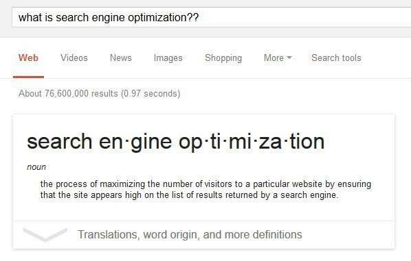

I then wanted to look at some topics that might have questionable answers and advice and asked about the next three topics to see if SEO myths were being promoted by Google Direct Answer. It seemed like they are given the following three answers about Reciprocal links, Keyword Density, and LSI (Latent Semantic Indexing):

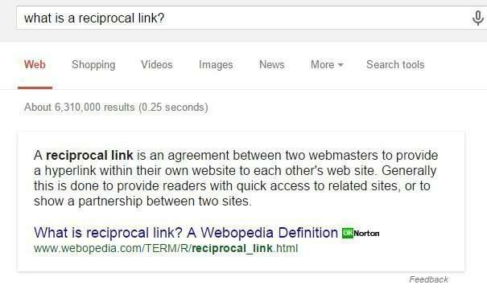

_What are reciprocal links?_

[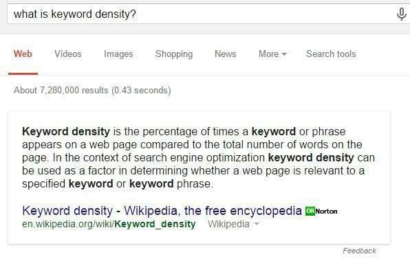](https://www.seobythesea.com/wp-content/keyword-density.jpg)

_What is Keyword Density?_

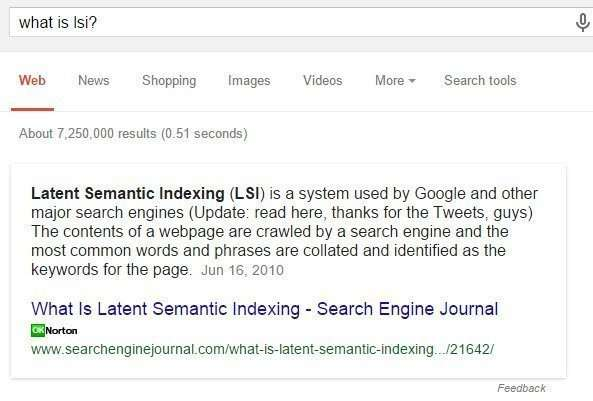

_What is LSI (Latent Semantic Indexing?)_

Do not trust Google’s Answers to those, It needs to work on improving the correctness of results, maybe though a [knowledge-based trust](https://www.newscientist.com/article/mg22530102-600-google-wants-to-rank-websites-based-on-facts-not-links/?ignored=irrelevant).

I then wanted to see how Google might describe some of it’ more recent upgrades – Panda, Penguin, Hummingbird, Pigeon, and the recently announced Doorway pages update.

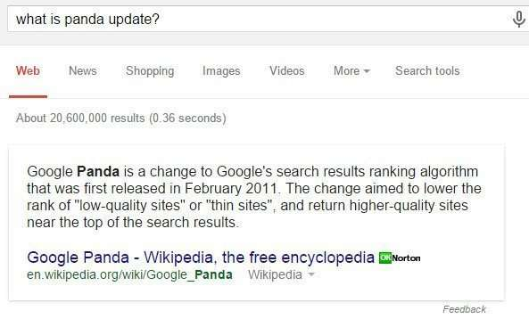

_Google’s Panda Update_

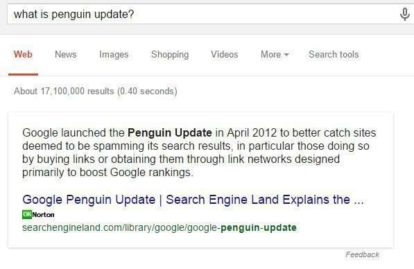

_Google’s Penguin Update_

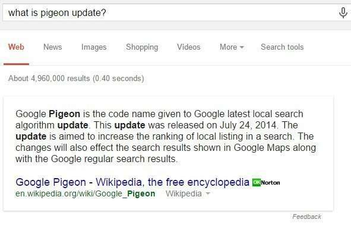

_Google’ Pigeon Update_

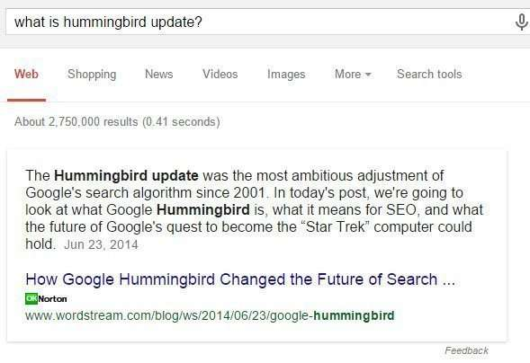

_Google’s Hummingbird Update_

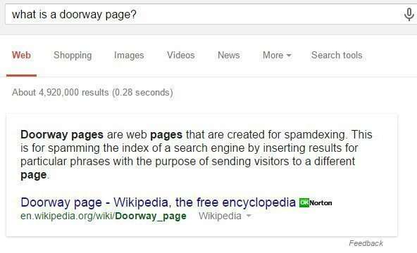

_Google recently announced they they would be launching a new algorithm aimed at fighting link schemes using doorway pages._

I wanted to try seeing if there were direct answers for other SEO-related terms, so I tried a few at random:

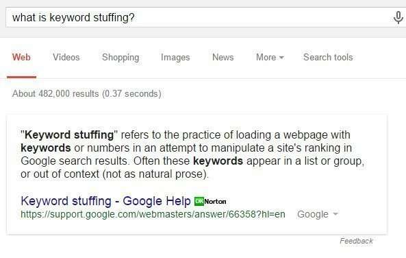

_What would a search for “keyword Stuffing” bring searchers?_

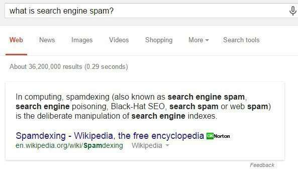

_As SEOS, we are often concerned with how Google migh define “Search Engine Spam” – something we want to avoid if possible._

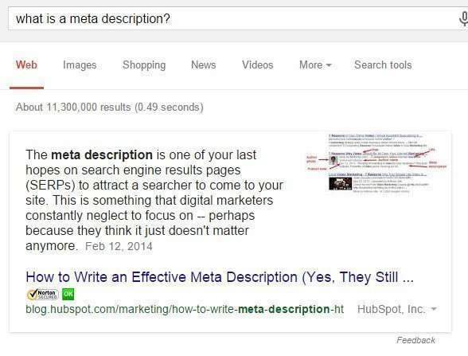

_Doing an SEO Audit for a site, it’s important to know good practices for different HTML elements of a page, like Meta descriptions._

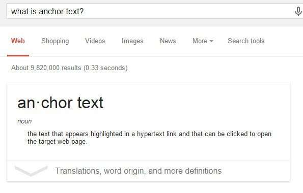

_Knowing how to use text in links (anchor text) reasonably well can also be helpful._

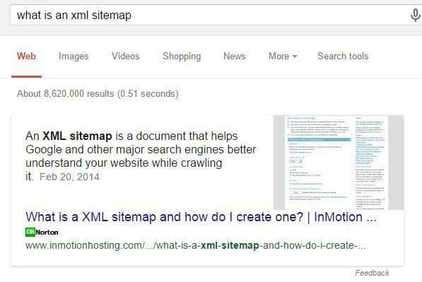

_Knowing how to set up an XML Sitemap for a page can make it more likely that all of the pages for a site will get indexed._

Setting up and taking advantage of the information provided at Google Webmaster Tools and Bing Webmaster Tools can be very helpful

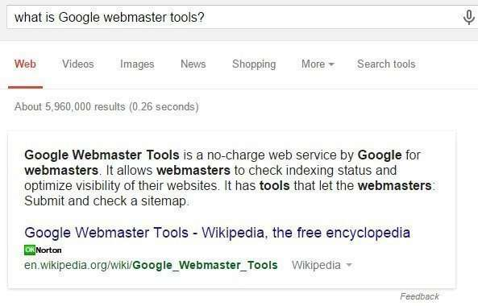

_Many of the tools pages and help pages from Google are in direct answers about them, with links to more information about them_

Semantic Search Topics seem to be covered well in Google’s Direct Answers, like this one on Named Entities:

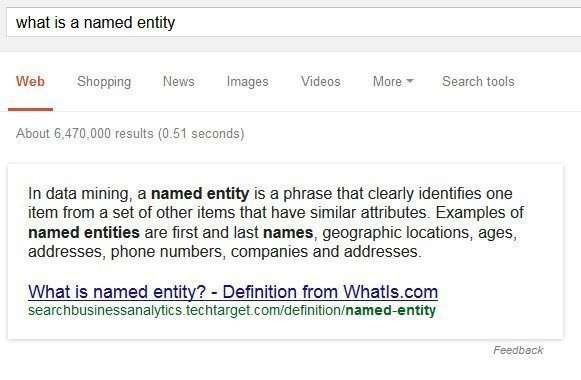

_Google uses it’s understanding of what is a named entity to provide knowledge panels to searchers._

Some specialized search results happen at Google when a query term triggers an answer box result at Google as well.

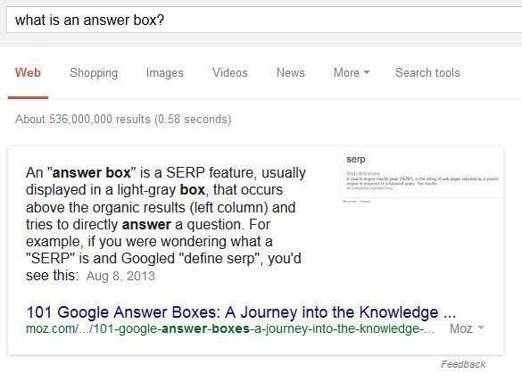

_Answer box results are query results that seem to answer a question based upon what may be a trigger term in an original query_

Google may show query results that have specialized features that tend to be richer than most other search results, that use schema.org markup found on pages being indexed to use to display rich snippets, which may stand out from other results and led to more click-throughs – search engines seem to like these because they make search results seem much more interesting, and display more data in those search results.

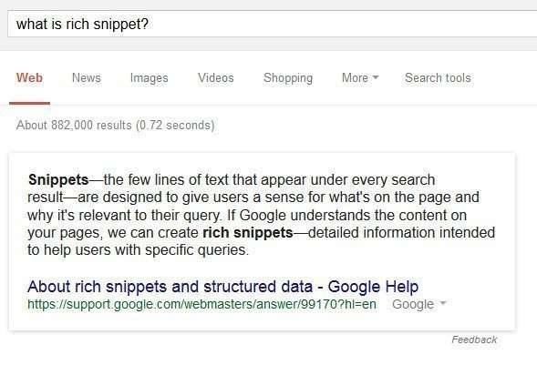

## Take-Aways

This was my first foray into exploring Google’s direct answers for SEO-related terms. I’m not surprised that a number of them were created from Wikipedia pages, or in some cases from Google help and support pages. Some seem to promulgate SEO myths, like the answers about Keyword Density and the one about LSI (Latent Semantic Indexing), but the ones related to the Semantic Web seem more up to date.

I’ll probably be revisiting many of these to see if the sources they use for answers change over time – I do expect some churn in those as people try to rewrite their pages to start showing up as Direct Answers.
