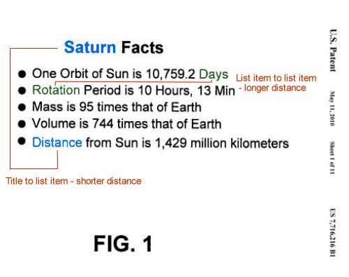

“SEO is Dead,” is something that you may have seen grace the headlines of a blog post or news article in the past few years.

Some have pronounced SEO as being dethroned by Social Media Optimization (or Social Media Marketing). Or that Personalized Search, or Google Instant, or Universal Search, or Google Caffeine, or some other search update has changed around search so much that SEO no longer has value.

I responded to one of those “SEO is Dead” posts earlier this year with a post about [Good SEO](https://www.seobythesea.com/2010/03/good-seo/). The author I was responding to questioned whether creating great content, using standards-based HTML and sharing that content with friends should sufficient for your site to rank well in Search Engines without SEO.

SEO isn’t dead, but it is constantly evolving as are searchers and search engines and the Web itself.

I’ve written many posts in 2010 that describe patents and whitepapers which hint at some of the ways that SEO has changed, and thought it might be worth spending revisiting some of the things that I’ve seen and written about.

Of course, there are many other things about SEO that have changed that I haven’t written about over the past year, but I’m going to use this post to start pointing out some things I’ve been thinking about.

This first post focuses upon a couple of concepts described in Google patents granted in 2010 – the Reasonable Surfer, and Semantic Closeness. There will be sequels covering other ways that SEO has been changing.

**Links and the Reasonable Surfer**

The early PageRank papers described how links from one site to another might influence the rankings of pages being pointed towards. In the simple version presented in those papers, there was a presumption that every link pointed out from on a page carried the same amount of weight, or PageRank, to the pages being pointed towards.

Hints from representatives at the search engines have been telling us that this may not be so for at least a couple of years. In 2008 [Interview with Yahoo’s Priyank Garg](https://blogs.perficient.com/2008/07/07/eric-enge-interviews-yahoos-priyank-garg/), we were told that not all links carry the same weight:

> The irrelevant links at the bottom of a page, which will not be as valuable for a user, don’t add to the quality of the user experience, so we don’t account for those in our ranking. All of those links might still be useful for crawl discovery, but they won’t support the ranking.

In a 2009 blog post on [PageRank sculpting](https://www.mattcutts.com/blog/pagerank-sculpting/), Google’s Matt Cutts added a very interesting disclaimer to his post about the value of links and how Google may calculate that value:

> Disclaimer: Even when I joined the company in 2000, Google was doing more sophisticated link computation than you would observe from the classic PageRank papers. If you believe that Google stopped innovating in link analysis, that’s a flawed assumption.
>
> Although we still refer to it as PageRank, Google’s ability to compute reputation based on links has advanced considerably over the years. I’ll do the rest of my blog post in the framework of “classic PageRank” but bear in mind that it’s not a perfect analogy.

When I was searching through Google patents to write about this past May, I came across one that described a framework for calculating the value that links might pass along on a page based upon a mix of features about the links themselves, the pages those links appeared upon, and the pages the links pointed to.

Even though the patent, [Ranking documents based on user behavior and/or feature data](http://patft.uspto.gov/netacgi/nph-Parser?Sect1=PTO2&Sect2=HITOFF&u=%2Fnetahtml%2FPTO%2Fsearch-adv.htm&r=1&p=1&f=G&l=50&d=PTXT&S1=7,716,225.PN.&OS=pn/7,716,225&RS=PN/7,716,225), was originally filed in 2004, it showed a considerable evolution in thought about links from the early days of PageRank.

The “random surfer,” described in early [PageRank](http://web.archive.org/web/20170106094458/http://ilpubs.stanford.edu:8090/422/1/1999-66.pdf) [papers](http://infolab.stanford.edu/~backrub/google.html), might randomly choose any link that appeared on a page, or even get bored with the page and jump to a completely different page.

The “Reasonable Surfer,” of the new patent took a different approach, looking at where a link appears on a page, how relevant the anchor text used in the link is to the page it appears upon, how commercial that anchor text might appear to be, what color or font size might be used in the link, and more.

I describe more of those features in my post, [Google’s Reasonable Surfer: How the Value of a Link May Differ Based upon Link and Document Features and User Data](https://www.seobythesea.com/2010/05/googles-reasonable-surfer-how-the-value-of-a-link-may-differ-based-upon-link-and-document-features-and-user-data/).

Many in the SEO industry had the sense that not all links were created equal before the patent was granted, but before the Reasonable Surfer, we didn’t have a good framework to use to describe how links might be treated differently in different situations. It’s 6 years after the Reasonable Surfer patent was filed.

Chances are that the Reasonable Surfer model has evolved as well.

**Keyword Proximity and Semantic Closeness**

Look on many SEO audits and site reviews, and one of the pieces of advice that you may see is that when you are optimizing for a certain phrase, the closer the words in that phrase are together when they appear on a page, the more relevant that page might be considered by search engines for that phrase.

That seems to make some sense.

For example, if you want a page to rank well for the phrase “ice cream” (without the quotation marks), it’s likely that this first sentence:

“I went to the store to buy ice cream,”

is more relevant for the term than:

“I went to the store to buy cream, and slipped on the ice.”

In May, I wrote about another recently granted Google patent that adds a twist to this concept of proximity, in the post [Google Defines Semantic Closeness as a Ranking Signal.](https://www.seobythesea.com/2010/05/google-defines-semantic-closeness-as-a-ranking-signal/)

The way that information is presented on a page may influence how close a search engine may perceive two words to be.

For example, I have a list using the HTML unordered list element <ul> with the heading “Saturn Facts,” which describes the orbital period of the planet, how quickly it rotates, its mass, its volume, and its distance from the Sun, as seen in the image below:

The list itself is considered a semantic construction, in that each item listed is equally as important to the title as any of the other items.

Even though “volume” is in the next to last item in the list, under this patent, it is considered to be just as semantically close to the word “Saturn” as the word “Rotation,” which appears in the second item on the list. That’s because, again, each of the list items is considered to be as equally distant from the title as any other.

The use of semantic constructions like lists put a twist on the concept of proximity, and how the closeness of two words might indicate that a page may be more or less relevant for a certain phrase.

Again, SEO is evolving.

More to come…

The second part of this series is [Son of SEO is Undead (Google Caffeine and New Product Refinements)](https://www.seobythesea.com/2010/11/son-of-seo-is-undead-google-caffeine-and-new-product-refinements/)

The third and final part of the series is [SEO is Undead Again (Profiles, Phrases, Entities, and Language Models)](https://www.seobythesea.com/2010/11/seo-is-undead-again-profiles-phrases-entities-and-language-models/)
