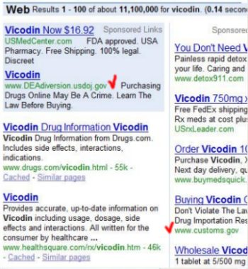

I was exploring the FirstGov web site from the US government, and their section on web content, and I wondered how much of our tax dollars are being spent on paid search. I remember seeing some paid ads by the DEA last summer, and the agency is still using Google Adwords.

On the webcontent.gov page about [search engines](https://web.archive.org/web/20070704014628/http://www.usa.gov/webcontent/technology/search/search.shtml), the webmasters provide information to help people working on US government sites add site searches, and they also give a window into future additions on the webcontent.gov site, including “Getting found on search engines (search engine optimization).”

I looked around to see if they had anything about paid advertising, and found some guidelines about advertising on government sites, but nothing about using paid search on search engines.

I’m tempted to volunteer some information and assistance on SEO, especially if it could help them to build a more balanced online advertising presence within Google and other search engines (and maybe reduce my tax bill).

By the way, the Drug Enforcement Administration ad shown in the picture above leads to a consumer warning on the dangers and possible illegality of buying drugs online. The link on the US Customs and Border Protection advertisement leads to a 404 error message page (at “http://www.cbp.gov/xp/cgov/travel/alerts/medication_drugs.xml”.

Both sites seem to have a healthy presence in paid advertisments for the names of prescription drugs. I’ll check back tomorrow on the US Customs page to see if they noticed that their landing page is missing in action. Sadly, I’m guessing that it’s been like that for a while.

After searching for a webmaster email address, or some type of way of contacting them for about twenty minutes, I found a way to “ask a question” which I used to send the following message:

> Hi,
>
> I noticed that you are using paid search to advertise on Google, and the link being used on your site points to this page:
>
> http://www.cbp.gov/xp/cgov/travel/alerts/medication_drugs.xml
>
> When I visit the page, I receive a 404 – page not found message.
>
> Either the page is missing, or you may need to make some changes to your advertising campaign.
>
> Thanks.

I hope that reporting this doesn’t get me into hot water with the Customs and Border Protection Department. (I am a third generation US citizen.)
