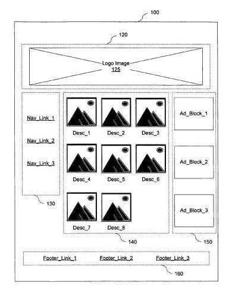

Yesterday, I wrote about how Google may be looking at the [semantics associated with HTML heading elements](https://www.seobythesea.com/2012/01/heading-elements-and-the-folly-of-seo-expert-ranking-lists/), and the content that they head, and how the search engine might be looking at such content with similar headings across the Web to determine how much weight to give words and phrases within those headings.

That post was originally part of the introduction to this post, but it developed a life of its own, and I ran with it. Here, we’re going to look at semantics related to other HTML structures, primarily lists, and tables.

I’m going to bundle a handful of patents together for this choice of one of the 10 most important SEO patents since I think they work together to illustrate how a search engine might use semantic structures to learn about how words and concepts might be related to each other on the Web. Some of these patents are older, and one of them is a pending patent application published this week. I’m also going to include several white papers that help define a process that might seem to be very much behind the scenes at Google. I’m going to focus upon Google with this post, though expect that similar things may also be happening at other search engines as well.

## Google Sets

Google Sets was a service retired earlier this year through Larry Page’s “more wood behind fewer arrows” initiative, but when it was active, it was the longest-running beta service running at Google, and it spent its last few years in Google Labs.

The [process behind Google Sets](https://www.seobythesea.com/2008/03/how-google-sets-works/) sounds simple enough. You entered some terms that might be members of the same set, and Google would tell you other terms that might also be members of that set.

The patent behind Google Sets was [System and methods for automatically creating lists](https://patents.google.com/patent/US7350187B1/en), filed originally in 2003, and what was interesting about it is that it extracted information in list format from the Web to find terms that were related in some manner. Those lists weren’t limited to HTML list elements, but could also be content formatted in some list like form, such as:

- HTML tags (e.g., <UL>, <OL>, <DL>, <H1>-<H6> tags).
- Items placed in a table,
- Items separated by commas or semicolons,
- Items separated by tabs.
- Other ways.

Google was taking advantage of the formatting of HTML list items, but it wasn’t relying upon them solely.

## Lists, Titles, Headings and Semantic Closeness

When I originally planned this series and was trying to decide which patents to include, this particular patent was one of my first choices, not because it received much fanfare when I wrote about it in 2010 in [Google Defines Semantic Closeness as a Ranking Signal](https://www.seobythesea.com/2010/05/google-defines-semantic-closeness-as-a-ranking-signal/), but rather because it illustrated so well how Google was considering the semantics of HTML elements.

Quite simply, every item in a list is equally as close to the heading of that list. When we think about SEO, and how relevant a search engine might consider a page to be for a specific phrase, one of our first impulses is to believe that the closer the words within that phrase might be to each other, the more relevant a search engine is going to find them to be for the phrase.

But the semantics of a list confuses that somewhat.

The heading for a list can be a heading element such as a <h2>, but it doesn’t have to be. It could also be regular paragraph text that stands out in some way, such as the use of a larger font.

The patent also goes on to tell us that it isn’t limiting semantic closeness to just lists:

> For headings and titles, a term in the title of a document may be considered to be close to every other term in document regardless of the word count between the terms. Similarly, a term occurring in a heading may be considered to be very close to other terms that are below the heading in the tree structure.

So, words in the HTML title element of a page are equally the same distance to every word on a page.

Words in an HTML heading element on a page are equally the same distance to every word that they are a heading for.

## Semantically Distinct Regions of a Page

In addition to looking at explicit HTML semantic structures on a page, or implicit structures like lists within the text that are separated by commas or HTML break elements  , a search engine might also attempt to understand how different parts of a page are grouped and understand how those parts are related to both each other and the other groupings on a page.

In the Google patent, [Determining semantically distinct regions of a document](http://patft.uspto.gov/netacgi/nph-Parser?Sect1=PTO2&Sect2=HITOFF&p=1&u=%2Fnetahtml%2FPTO%2Fsearch-adv.htm&r=1&f=G&l=50&d=PALL&S1=07913163&OS=PN/07913163&RS=PN/07913163), we are told that Google may perform a pseudo-rendering of a web page when it crawls the page to determine “the approximate position and size of each element of the document” to identify semantically distinct regions of a document.

Each of these regions, or “chunks” as the patent calls them, can play a role in several search-related applications. For example:

*Link analysis* – Links in different semantic regions might be assigned different weights. Sounds like one of the features of the [reasonable surfer](https://www.seobythesea.com/2011/12/most-important-seo-patents-reasonable-surfer/) patent.

*Text analysis* – Identical text in different semantic regions of a page might be assigned different weights based upon their location. So, if a query term is matched in the image blocks section of the picture above instead of in the footer, the page should be given a higher query score than if the term were found in the footer, and thus a higher position in the list of search results because the main content area where those image blocks are is usually the primary target of a visitor to a page.

*Image captioning* – text close to an image is more likely relevant to the image than text farther away from the image, and might be used to create a caption for the image, which could then be used in applications like image search.

*Snippet construction* – Chunks might be in a document’s chunk tree might be assigned a pseudo-title, and those pseudo-titles might be relied upon to construct a more accurate snippet of the page for search results, capturing the major topics of the page and including at least one of the pseudo-titles.

## Google’s WebTables Project

Google Sets collected information that appears in implied and explicit lists on the Web to tell you about other terms that could be included in the same set of terms when you submitted at least a couple of terms to the application. [Google Squared](https://googleblog.blogspot.com/2009/06/square-your-search-results-with-google.html), before it became another victim of Google’s “more wood behind fewer arrows,” let you search for a specific topic, such as [Presidents of the United States], and you would have search results returned to you in the form of tables, with a first column listing the names of the Presidents, a second column that might tell you the dates of their births, the third column with place of birth, the fourth column with their political party, and so on.

Instead of searching lists, like Google Sets, Google Squared pulled information from tables across the Web. It collected not only subjects associated with your query, such as the names of the Presidents, but also attributes associated with those subjects.

An article in *Communications of the ACM*, [Structured Data on the Web](http://web.eecs.umich.edu/~michjc/papers/cacm-cafarella-2011.pdf) (pdf), provides a very readable and high level (and highly recommended) look at the [WebTables](http://sirrice.github.io/files/papers/webtables-vldb08.pdf) (pdf) project behind Google Squared. By crawling and trying to make sense of data found in structures like tables across the Web, Google provides ways to:

- Improve Web Search
- Make question answering better
- Integrate Data from multiple sources on the Web

The data shown in the spreadsheets returned by Google Squared would pull in information from more than one table so that the birthdates for the Presidents might be found in several Web tables, and the political party affiliations of the Presidents might be pulled in from many other tables on the Web.

Not only did Google Squared take advantage of the structure of tables, but it also learned labels and schema from those tables related to the data and attributes that it discovered. Google uses those labels to create something it calls the *Attribute Correlation Statistics Database (ACSDb)*

The ACSDb calculates the probabilities that certain attributes will appear for a certain Google Squared query.

Chances are there may be a table somewhere on the Web listing the Presidents that might include an attribute like “favorite color.” Chances are that there aren’t many Web tables like that which tell us the favorite color of each president, and because there’s so little collaboration amongst publishers of tables on the Web regarding President’s favorite colors, that attribute is unlikely to show up in a Google Squared result.

The ACSDb could be used to suggest labels for database designers to suggest for certain types of attributes, in an “auto schema” approach somewhat like the “auto complete” that we see for Google Instant Queries.

Synonym finding is also aided by the ACSDb as well so that when you decide to include phone numbers as a label in a table, Google Squared might offer “phone-#” as a synonym for “phone number.”

If you’d like to delve more deeply into the kind of extraction of data that Webtables does, the following whitepapers are worth a look:

- [Uncovering the Relational Web](http://web.eecs.umich.edu/~michjc/papers/webtables_webdb08.pdf)
- Web-Scale Extraction of Structured Data

A related application is Google’s Fusion Tables which allows you to upload spreadsheets and use visualization tools of different types to view data within your spreadsheets in different ways. One of the inventors behind Webtables and Fusion was interviewed about Google Fusion last August: [Google Fusion Tables. Interview with Alon Y. Halevy](http://www.odbms.org/blog/2011/08/google-fusion-tables-interview-with-alon-y-halevy/)

Google Fusion also enables you to merge data sets belonging to different owners, such as one that lets you see [Global Earthquake activity since 1973](http://maptd.com/map/earthquake_activity_vs_nuclear_power_plants/) in the same image as the locations of nuclear power plants. Last summer when I visited the town at the epicenter of an earthquake in Virginia a few days before, I found myself rethinking the visit upon seeing a sign for a local nuclear power plant. Could have used that visualization.

## Adding Semantics to Tables on the Web

Many tables you run across on the Web are missing header rows with attribute names or have poorly named attribute labels in those rows. A Google paper presented at [The 37th International Conference on Very Large Data Bases](http://www.vldb.org/2011/) held in late August and early September of 2011, in Seattle, Washington, describes how data collected from projects like the Webtable project can be used to annotate tables that are missing that kind of information. The paper is [Recovering Semantics of Tables on the Web](http://static.googleusercontent.com/media/research.google.com/en/us/pubs/archive/37232.pdf) (pdf).

Here’s the “why” behind this approach:

> In principle, we would like to associate semantics with each table in the corpus, and use the semantics to guide retrieval, ranking, and table combination. However, given the scale, breadth, and heterogeneity of the tables on the Web, we cannot rely on hand-coded domain knowledge. Instead, this paper describes techniques for automatically recovering the semantics of tables on the Web. Specifically, we add annotations to a table describing the sets of entities the table is modeling, and the binary relationships represented by columns in the tables.

So when a someone searches for George Herbert Walker Bush’s favorite snack (pork rinds or popcorn?), and there were some tables on the Web that contained that kind of information, but most of them were unlabeled, this semantic recovery process would help return more results for that search, even if the term “favorite snack” didn’t appear on those pages with those tables.

The paper does a pretty good job of presenting this semantic recovery process, but there’s a patent application that also came out this week on the same topic, and a number of the co-authors on the table are listed as inventors on the patent filing.

[Table Search Using Recovered Semantic Information](http://appft.uspto.gov/netacgi/nph-Parser?Sect1=PTO1&Sect2=HITOFF&d=PG01&p=1&u=%2Fnetahtml%2FPTO%2Fsrchnum.html&r=1&f=G&l=50&s1=%2220120011115%22.PGNR.&OS=DN/20120011115&RS=DN/20120011115)
Invented by Jayant Madhavan, Chung M. Wu, Alon Halevy, Gengxin Miao, Marius Pasca, and Warren H. Y. Shen
US Patent Application 20120011115
Assigned to Google
Published January 12, 2012
Filed July 8, 2011

Abstract

> Methods, systems, and apparatus, including computer programs encoded on a computer storage medium, for searching tables using recovered semantic information.
>
> In general, one aspect of the subject matter described in this specification can be embodied in methods that include the actions of:
>
> - receiving a collection of tables, each table including a plurality of rows, each row including a plurality of cells;
> - recovering semantic information associated with each table of the collection of tables, the recovering including determining a class associated with each respective table according to a class-instance hierarchy including identifying a subject column of each table of the collection of tables; and
> - labeling each table in the collection of tables with the respective class.

## Takeaways

Google has published several patents and papers and launched many services that show how they might be using the semantics of content presentation on a web page to index that content, to answer questions, to even add labels to table columns that are missing attribute labels.

When Google first started extracting content from lists found on the Web to build Google Sets, they were taking advantage of the semantic structures of those lists, to understand which words might fit together as part of the same sets.

The “semantic closeness” of list items and the headings for those lists, or of HTML title elements and the words on those pages, or of HTML headings, and the content they head has some implications for copywriters who want to include several phrases on the same page:

For example, under this semantic closeness approach, the following two sets of lists might be equally relevant to the other for the phrases contained within them:

List # 1

**bicycles**
Schwinn
Huffy
Coker
Gitane
Kona
Mongoose

List # 2

Schwinn bicycles
Huffy bicycles
Coker bicycles
Gitane bicycles
Kona bicycles
Mongoose bicycles

Google might look at the locations of different sections on a page by using a crawling program that does a pseudo rendering of a page to see where content on the page is located. Those locations could have semantic meaning based on their locations, such that, for example, links in the main content area might carry more weight than links in a footer on the page.

While Google has been introducing labels for different kinds of content for web publishers such as recipe or rating schema, they’ve created an Attribute Correlation Statistics Database powered by labels found on tables on the Web that enables them to do things like creating labels for table columns that might be missing table headers with attribute labels.

Are you paying enough attention to the semantic structures on Web pages?

**All parts of the 10 Most Important SEO Patents series:**

[Part 1 – The Original PageRank Patent Application](https://www.seobythesea.com/2011/12/10-most-important-seo-patents-part-1-the-original-pagerank-patent-application/)
[Part 2 – The Original Historical Data Patent Filing and its Children](https://www.seobythesea.com/2011/12/10-most-important-seo-patents-original-historical-data-patent-filing-children/)
[Part 3 – Classifying Web Blocks with Linguistic Features](https://www.seobythesea.com/2011/12/10-most-important-seo-patents-part-3-classifying-web-blocks-with-linguistic-features/)
[Part 4 – PageRank Meets the Reasonable Surfer](https://www.seobythesea.com/2011/12/most-important-seo-patents-reasonable-surfer/)
[Part 5 – Phrase Based Indexing](https://www.seobythesea.com/2011/12/10-most-important-seo-patents-part-5-phrase-based-indexing/)
[Part 6 – Named Entity Detection in Queries](https://www.seobythesea.com/2012/01/named-entity-detection-in-queries/)
[Part 7 – Sets, Semantic Closeness, Segmentation, and Webtables](https://www.seobythesea.com/2012/01/sets-semantic-closeness-segmentation-and-webtables/)
[Part 8 – Assigning Geographic Relevance to Web Pages](https://www.seobythesea.com/2012/02/assigning-geographic-relevance-web-pages/)
[Part 9 – From Ten Blue Links to Blended and Universal Search](https://www.seobythesea.com/2012/02/ten-blue-links-to-blended-universal-search/)
[Part 10 – Just the Beginning](https://www.seobythesea.com/2012/03/just-the-beginning/)
