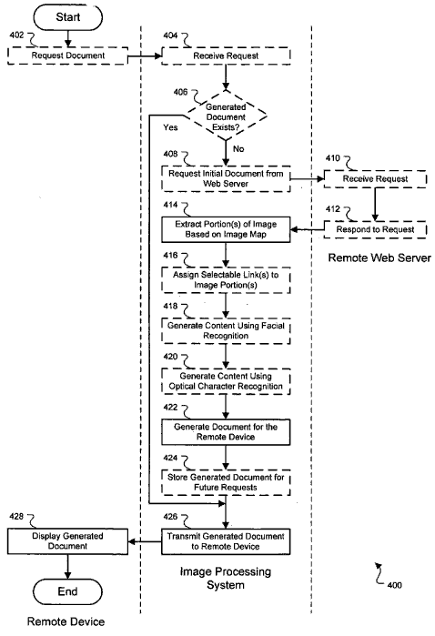

## Questions About Image Propcessing

A recent commentator asked if image search from the search engines would soon involve indexing text found within images using optical character recognition (OCR) software, which tries to read words that are parts of images.

My answer was that it would be computationally expensive for a search engine to try to do that, so it might be a while before we see it.

So, it’s kind of fun to eat my words and unveil a new Google patent application that describes how the search engine might handle image processing of image map navigation when trying to render web pages for small screens while trying to use OCR to read text within those image maps.

[](https://www.flickr.com/photos/bragadocchio/1471377166/)

The document talks about using OCR software to read image text and use face recognition technology to crop larger “image map” images and display faces and other exciting pictures from those image maps.

Back in May, [Google Blogoscoped reported](http://blogoscoped.com/archive/2007-05-28-n84.html) on an unofficial way of showing human faces in image searches. Is Google also reading text that is part of an image? Are they developing technology for mobile devices that can be used in image processing?


## Google Image Processing Patent in Use?

[System and method for image processing](http://appft1.uspto.gov/netacgi/nph-Parser?Sect1=PTO2&Sect2=HITOFF&u=%2Fnetahtml%2FPTO%2Fsearch-adv.html&r=1&p=1&f=G&l=50&d=PG01&S1=20070201761.PGNR.&OS=dn/20070201761&RS=DN/20070201761)
Invented by Michael F. Lueck
US Patent Application 20070201761
Published August 30, 2007
Filed: September 22, 2005

Abstract


> A computer-implemented method of processing an image for display on a mobile communication device includes extracting a portion of a vision based on an image map. The image map relates to the part of the image.
>
> The method also includes generating a document that comprises the extracted portion of the image and transmitting the generated document to a remote device for display. The process may also involve assigning a selectable link to the removed part of the image and receiving a request from the remote machine for an initial document having the vision and image map.
>
> Additionally, the method may include storing in a database the generated document and transmitting the stored generated document in response to future requests for the initial document.


## Image Processing Methods Described In The Patent

Presenting an image from an image map on a phone or PDA might involve:

- Extracting part of an image based on an image map,
- Creating a document which includes that extracted portion of the image,
- Sending that generated document to be displayed on a handheld device, and;
- Assigning a hyperlink to the extracted portion of the image.

Receiving a request from the phone or PDA could involve:

- Receiving and understanding information about the display capabilities of the handheld
- Modifying the dimensions of the extracted portion of the image based on those display capabilities
- Cropping the extracted portion of the image based on the display capabilities, if necessary.

The initial document might get retrieved from a web server, and the image selected in many different ways:

- Organizing elements in the initial document into a document object model tree and traversing the tree to locate the image map, or;
- Serially parsing elements in the initial document to find the image map, or;
- Generating content of the image map by using a facial recognition algorithm, where the range includes coordinates used to specify the portion of the image for extraction, or;
- Generating content of the image map by using an optical character recognition algorithm, where the range comprises coordinates used to specify the portion of the image for extraction.

4) Some specialized HTML tags for specific types of handheld devices might be used to display an image map, such as <PDA>, which could include attributes such as “height” and “width” for display on screens of different sizes for different phones or PDAs.

5) Looking at the HTML for the image map, including coordinates (positions) within the images in area elements, like the following, where the linked-to documents can be associated with the ideas that get mapped out:


```
<MAP name="map1">
 <AREA href="guide.html"
          alt="Access Guide"
          shape="rect"
          coords="0,0,118,28">
 <AREA href="search.html"
          alt="Search"
          shape="rect"
          coords="184,0,276,28">
 <AREA href="shortcut.html"
          alt="Go"
          shape="circle"
          coords="184,200,60">
 <AREA href="top10.html"
          alt="Top Ten"
          shape="poly"
          coords="276,0,276,28,100,200,50,50,276,0">
</MAP>
```


## Image Processing Conclusion

This system attempts to associate parts of an image map with links within the map, even if it means breaking the image up into pieces, cropping some of those parts, and possibly using facial recognition software and optical character recognition software for text displayed within the image.

Continuing to use an image map as part of the navigational system that shows on a handheld may be the best way to provide a good user experience to someone viewing a web page through a phone or PDA.

While this image processing patent application applies to pages using image maps as navigation, when trying to take a web page and present it to someone on a handheld device, it may point to helpful image processing techniques that could get implemented in the future.
