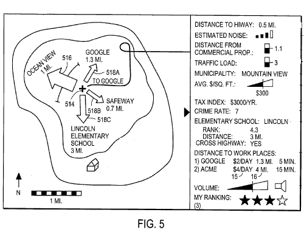

Would you use an internet mapping system that could show you changes in distances to places that you’ve identified as you move around?

How about one where specific templates could be created to show you information about locations to help you with tasks such as home hunting or school hunting or vacationing?

Google explores those kinds of abilities in a new patent application titled [Dynamic Exploration of Electronic Maps](http://appft1.uspto.gov/netacgi/nph-Parser?Sect1=PTO2&Sect2=HITOFF&u=%2Fnetahtml%2FPTO%2Fsearch-adv.html&r=1&p=1&f=G&l=50&d=PG01&S1=20080059205.PGNR.&OS=dn/20080059205&RS=DN/20080059205) (US Patent Application 20080059205).

The templates for different tasks could be created by Google or Google users or by both. The maps might use some technology like AJAX to update distances and other information on the fly.

For a task like house hunting, the patent filing gives us the following example of some of the metrics that might be shown on the map, or next to the map:

1. Demographic, psychographic, and/or other statistical data describing a population of a region,
2. Boundary data describing governmental and quasi-governmental boundaries,
3. Cost information describing costs of living,
4. Real estate values,
5. Fuel costs,
6. Traffic and weather data describing traffic congestion, average temperatures, and air quality,
7. Location data describing locations of entities such as offices, commercial centers, schools, religious facilities, hospitals and public transportation,
8. Average noise,
9. Locations of registered sexual offenders,
10. Whether ocean views are available from a location etc.,
11. Others.

Being able to set up your template for the next time you go on a vacation, or when you are going on shopping excursions or looking at schools in an area could be useful.

It would be great to see this developed more fully, and in a way that would work well on a smartphone or PDA since it could show things like changes in distances to different destinations on the map and traffic congestion information.
