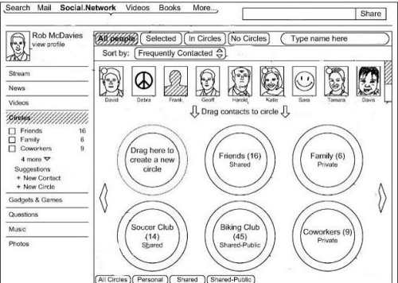

Google published 8 patent applications at the USPTO today that describe key elements of Google Plus and a number of alternatives that may or may not become part of Google’s social network. These include 2 applications on how social connections can be sorted into different social circles, 4 filings about how content can be shared in the system, and 2 more pending patents on differences in what might be shown to the author of content created on the social network and what might be visible to people viewing that content who aren’t the authors.

The patent filings are pretty detailed, and if you’ve spent some time using Google Plus, you’ll recognize a lot of the features being described within the patents, and see some that you might wish were included and others you may hope are never added.

**Unlaunched Circles Features**

Imagine that you could set up some private circles and invite specific people to join those circles. Or that you could set up publicly shared circles and people can see those and request membership in them. Presently you can’t see the names of the circles that other people have created in Google Plus, and they can’t see yours.

We’re also told of the possibility of some social circles being automatically generated based upon information found in a user’s profile, from things such as demographic data, job data, or information about interests such as sports or hobbies. This particular feature sounds like the friends clustering technology that [Google’s acquisition of Katango](https://www.seobythesea.com/2011/11/patents-from-googles-acquisition-of-apture-and-katango-highlighted-search-youtube-sliders-and-intelligent-social-media-agents/) brought to the search engine when they acquired them last November.

Katango had developed an iPhone application for Facebook that people could use to automatically create groups or circles of friends for them automatically, based upon interests stated in profiles of even in things stated in interactions on social networks. The Google patents don’t go quite that far and instead are limited to just explicit information from profiles for such clustering and automatic circle creation.

Another feature indicated in the patent filings is the possibility of the system making suggestions to add people to certain circles. The example given is that someone in email data associated with a particular user might share the same last name, and they are someone who is contacted frequently through email. The suggestion might be to add the contact to a family social circle.

The creation of certain circles could be suggested as well based upon that email data as well, such as a “professional contacts social circle” if there are some email contacts that haven’t already been added to any circles and those people are emailed frequently.

**Authorization of Access and Posting by Third Parties?**

Another possible feature mentioned in the patents is that other sites could be given permissions to post to Google Plus on a user’s behalf. We’ve seen this with sites that allow you to log in with Twitter or Facebook and leave comments or track a Klout score or provide other services or information. A quick snippet on that from the patent filings:

> In some implementations, information can be posted on a user’s behalf by systems and/or services external to the social network or the server system 112. For example, the user may post a review of a movie to a movie review website, and with proper permissions that website may cross-post the review to the social network on the user’s behalf.

There’s been some rumors of Google launching a third party commenting system sometimes in the near future. These patent filings don’t appear to cover that, but it’s possible that such a system might allow for this type of access so that when you log into your Google Account to leave a comment somewhere, you’re also granting permission to have your comment posted on your Google Plus stream.

**Autocomplete and Rankings**

When you write something in Google Plus, you can start typing in someone’s name, with a “+” symbol in front of it, and Google Plus will present a drop-down that you can use to choose from different Google Plus members. The order of people listed in those drop-downs may appear in an order based upon a ranking score, with contacts having a higher ranking score listed above contacts with a lower ranking score.

Or they may be listed based upon ranking scores for the different social circles they might be in. So someone from your “Family” circle might be shown before someone from your “Friends” social circle, if the Family Circle has a higher ranking score.

Those ranking scores might be based upon a popularity of contacts and/or social circles. If you tend to share information more with one contact than another, the first contact may have a higher ranking score. A social circle that is shared with more frequently might rank higher (as well as the contacts within it) than other social circles that you share less frequently with.

The auto complete will show people who aren’t direct contacts of yours as well, but someone who is a direct contact will show up as an autocomplete suggestion above someone who might not be a direct contact, but rather connected to you indirectly as a contact of someone whom you’re connected to.

Rankings within autocomplete suggestions could also be based upon a frequency of interactions as well. So if you often email someone, or they email you, they might rank higher than someone whom your infrequently connect with.

**Other Interesting Tidbits**

The patent filings use the “at” symbol (@) rather than the “plus” symbol (+) to describe the way that you might trigger a link and a notice to someone that you’ve mentioned them in a post or comment on Google Plus, though it looks like both were being consider as alternatives:

> In one example, a user can input the text “@Frank” (or “+Frank”) in a text region (e.g., content input area 305 of the content sharing interface 300) as part of a textual post.

Google Plus could potentially be activated and shared while using other applications as well, such as Office Productivity programs, so that people can share what they are working upon through Google Plus without having to leave those other programs. Here’s what the patent filings tell us about that:

> In some implementations, the content-sharing application can be provided as an add-on to other applications that can be executed using a computing device. In some examples, a productivity application (e.g., a word processing application, a spreadsheet application, a presentation application, an email application) can be executed to provide a graphical user interface (GUI) through which a user can perform tasks (e.g., create and/or edit a document, a spreadsheet, a presentation, and/or an email).
>
> The content-sharing application can be executed to provide a content sharing interface within the GUI of the productivity application. In this manner, a user can share digital content with contacts while working in the productivity application, without having to switch applications and/or accessing a social networking service website.

I’ve covered a number of “alternative implementations” or potential future features in Google Plus that we could possibly see, but there are more in the patent applications. What looks interesting to you that I didn’t write about?

The pending patent applications are:

**Social Circle Pending Patents**

[Social Circles in Social Networks](http://appft.uspto.gov/netacgi/nph-Parser?Sect1=PTO1&Sect2=HITOFF&d=PG01&p=1&u=%2Fnetahtml%2FPTO%2Fsrchnum.html&r=1&f=G&l=50&s1=%2220120110096%22.PGNR.&OS=DN/20120110096&RS=DN/20120110096)
Invented by Joseph Smarr, Paul Adams, Shimrit Ben-Yair, Jonathan Terleski, and Mandy R. Sladden
Assigned to Google
US Patent Application 20120110096
Published May 3, 2012
Filed: June 20, 2011

Abstract

> Methods, systems, and apparatus, including computer programs encoded on a computer storage medium, for transmitting contact data for displaying graphical representations of contacts for display to a user, the contacts being contacts of the user within a computer-implemented social networking service, generating a first social circle of the user, the first social circle comprising a first subset of contacts of the user within the social networking service and defining a first distribution for digital content, generating a second social circle of the user, the second social circle comprising a second subset of contacts of the user within the social networking service and defining a second distribution for digital content, and, in response to user input, providing the first social circle and the second social circle for selection by the user to define a distribution of digital content, the distribution comprising at least one of the first distribution and the second distribution.

[Social Circles in Social Networks](http://appft.uspto.gov/netacgi/nph-Parser?Sect1=PTO1&Sect2=HITOFF&d=PG01&p=1&u=%2Fnetahtml%2FPTO%2Fsrchnum.html&r=1&f=G&l=50&s1=%2220120110052%22.PGNR.&OS=DN/20120110052&RS=DN/20120110052)
Invented by Joseph Smarr, Paul Adams, Shimrit Ben-Yair, Jonathan Terleski, and Mandy R. Sladden
Assigned to Google
US Patent Application 20120110052
Published May 3, 2012
Filed: June 20, 2011

Abstract

> Methods, systems, and apparatus, including computer programs encoded on a computer storage medium, for receiving first user input, the first user input provided by a user of a computer-implemented social networking service and indicating first digital content that is to be distributed using the social networking service, receiving second user input through a distribution interface that is displayed to the user, the second user input defining a distribution for the first digital content, the distribution comprising at least one of a first sub-distribution that is defined based on a first social circle and a second sub-distribution, the first social circle comprising a first subset of contacts, and distributing the first digital content to contacts of the user based on the distribution.

**Content Sharing Pending Patents**

[Content Sharing Interface for Sharing Content in Social Networks](http://appft.uspto.gov/netacgi/nph-Parser?Sect1=PTO1&Sect2=HITOFF&d=PG01&p=1&u=%2Fnetahtml%2FPTO%2Fsrchnum.html&r=1&f=G&l=50&s1=%2220120110474%22.PGNR.&OS=DN/20120110474&RS=DN/20120110474)
Invented by Rita Chen, Shimrit Ben-Yair, Jonathan Terleski, and Joseph Smarr
Assigned to Google
US Patent Application 20120110474
Published May 3, 2012
Filed: June 20, 2011

Abstract

> Methods, systems, and apparatus, including computer programs encoded on a computer storage medium, for displaying, within a web page, a representation of a content sharing interface, the content sharing interface including a content input area, receiving user input to the content input area, in response to the user input, expanding the content sharing interface to include an expanded content input area and a distribution interface, the expanded content input area displaying a graphical representation of digital content that is to be distributed, receiving user input to the distribution interface, the user input indicating contact(s) to which the digital content is to be distributed, in response to receiving the user input, displaying an icon within the distribution interface, the icon being a graphical representation of the contact(s), and in response to the user input, transmitting a post data set including digital content data and distribution data to a server computing system.

[Content Sharing Interface for Sharing Content in Social Networks](http://appft.uspto.gov/netacgi/nph-Parser?Sect1=PTO1&Sect2=HITOFF&d=PG01&p=1&u=%2Fnetahtml%2FPTO%2Fsrchnum.html&r=1&f=G&l=50&s1=%2220120110464%22.PGNR.&OS=DN/20120110464&RS=DN/20120110464)
Invented by Rita Chen, Shimrit Ben-Yair, Jonathan Terleski, and Joseph Smarr
Assigned to Google
US Patent Application 20120110464
Published May 3, 2012
Filed: June 20, 2011

Abstract

> Methods, systems, and apparatus, including computer programs encoded on a computer storage medium, for presenting, within a web page, a graphical representation of a content sharing interface including at least one button icon, receiving user input to the button icon, in response to the user input, expanding the content sharing interface to include an expanded content input area and a distribution interface, the expanded content input area displaying a graphical representation of digital content that is to be distributed, receiving user input to the distribution interface, the user input indicating contact(s) to which the digital content is to be distributed, in response to receiving the user input, displaying icon(s) within the distribution interface, the icon(s) being a graphical representation of the contact(s), and transmitting a post data set including digital content data and distribution data to a server computing system.

[Content Sharing Interface for Sharing Content in Social Networks](http://appft.uspto.gov/netacgi/nph-Parser?Sect1=PTO1&Sect2=HITOFF&d=PG01&p=1&u=%2Fnetahtml%2FPTO%2Fsrchnum.html&r=1&f=G&l=50&s1=%2220120110064%22.PGNR.&OS=DN/20120110064&RS=DN/20120110064)
Invented by Rita Chen, Shimrit Ben-Yair, Jonathan Terleski, and Joseph Smarr
Assigned to Google
US Patent Application 20120110064
Published May 3, 2012
Filed: June 20, 2011

Abstract

> Methods, systems, and apparatus, including computer programs encoded on a computer storage medium, for presenting a graphical representation of a content sharing interface of a social networking service on a display, receiving first user input to the content sharing interface, in response to the first user input, expanding the content sharing interface to include an expanded content input area and a distribution interface, the expanded content input area displaying a graphical representation of digital content that is to be distributed, receiving second user input to the distribution interface, the second user input indicating contact(s) to which the digital content is to be distributed, in response to receiving the second user input, displaying icon(s) within the distribution interface, and transmitting a post data set to the server computing system, the post data set comprising digital content data and distribution data.

[Content Sharing Interface for Sharing Content in Social Networks](http://appft.uspto.gov/netacgi/nph-Parser?Sect1=PTO1&Sect2=HITOFF&d=PG01&p=1&u=%2Fnetahtml%2FPTO%2Fsrchnum.html&r=1&f=G&l=50&s1=%2220120109836%22.PGNR.&OS=DN/20120109836&RS=DN/20120109836)
Invented by Rita Chen, Shimrit Ben-Yair, Jonathan Terleski, and Garrett F. Boyer
Assigned to Google
US Patent Application 20120109836
Published May 3, 2012
Filed: June 20, 2011

Abstract

> Methods, systems, and apparatus, including computer programs encoded on a computer storage medium, for receiving user input indicating a distribution for digital content, the distribution indicating one or more contacts to which the digital content is to be distributed, processing the distribution based on one or more policies, each of the one or more policies providing a limitation on distribution of digital content, based on the processing, determining that the distribution violates at least one policy of the one or more policies, and in response to the determining, transmitting notification data to display a notification to a user that the distribution violates the at least one policy.

**Visibility Inspector Pending Patents**

[Visibility Inspector in Social Networks](http://appft.uspto.gov/netacgi/nph-Parser?Sect1=PTO1&Sect2=HITOFF&d=PG01&p=1&u=%2Fnetahtml%2FPTO%2Fsrchnum.html&r=1&f=G&l=50&s1=%2220120110088%22.PGNR.&OS=DN/20120110088&RS=DN/20120110088)
Invented by Ray Jiunn-An Su, Jonathan Terleski, Joseph Smarr, and Shimrit Ben-Yair
Assigned to Google
US Patent Application 20120110088
{ublished May 3, 2012
Filed: June 20, 2011

Abstract

> Methods, systems, and apparatus, including computer programs encoded on a computer storage medium, for transmitting a content data set to a computing device for displaying content to a non-author user, receiving user input from the non-author user, the user input corresponding to the content, and, in response to receiving the user input, transmitting first data and second data to the computing device for display to the non-author user, the first data comprising a number of contacts associated with an author user, the author user having authored the content, the second data being a sub-set of the first data and comprising a number of contacts associated with the non-author user.

[Visibility Inspector in Social Networks](http://appft.uspto.gov/netacgi/nph-Parser?Sect1=PTO1&Sect2=HITOFF&d=PG01&p=1&u=%2Fnetahtml%2FPTO%2Fsrchnum.html&r=1&f=G&l=50&s1=%2220120110076%22.PGNR.&OS=DN/20120110076&RS=DN/20120110076)
Invented by Ray Jiunn-An Su, Jonathan Terleski, Joseph Smarr, and Shimrit Ben-Yair
Assigned to Google
US Patent Application 20120110076
Published May 3, 2012
Filed: June 20, 2011

Abstract

> Methods, systems, and apparatus, including computer programs encoded on a computer storage medium, for transmitting a content data set to a computing device for displaying digital content to an author user, the author user having authored the digital content, receiving user input from the author user, the user input corresponding to the digital content, and, in response to receiving the user input, transmitting first data and second data to the computing device for display to the author user, the first data comprising a number of contacts that are able to access the digital content and the second data indicating one or more relationships between the author user and the contacts.
