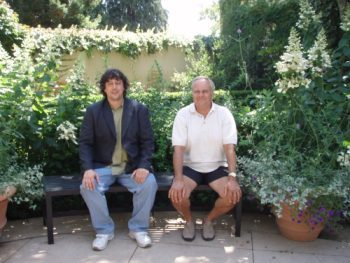
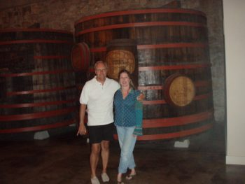
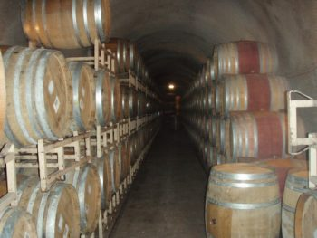
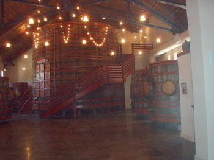
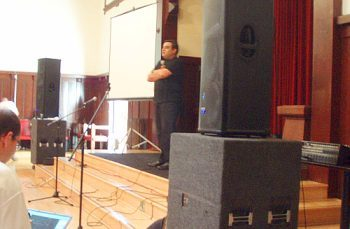
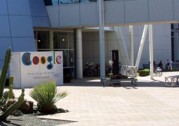
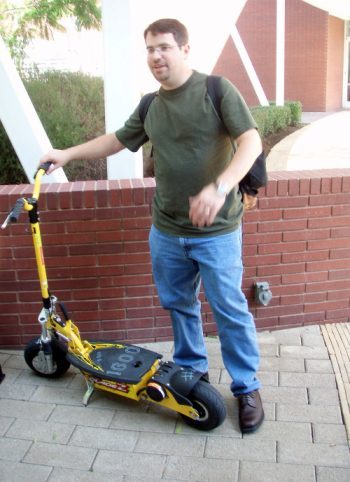
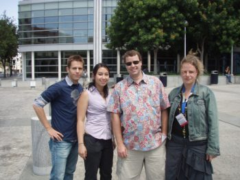
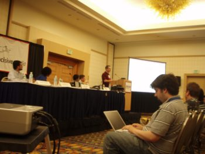
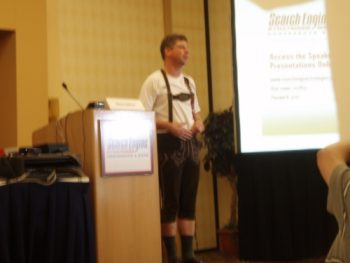

Now that I’ve had a chance to catch a little shut-eye after a restless late-night flight from the San Francisco Airport to Baltimore Friday night, I’ve been able to sort through the pictures I took on the trip. I bought a new camera the day I began my journey, and I’m still getting used to it, so sadly many of my pictures were a little too blurry to share. But some of them turned out ok, and a sampling of those appear below.

I had a great time in California, many chances to share some time with old friends and to make new ones, and the opportunity to exchange some ideas with a lot of sharp folks. Thanks to everyone who made this trip and conference such an enjoyable visit to the west coast. Here are some images from my visit:

Before traveling to the Search Engine Strategies Conference, I had the chance to spend a few days touring around San Francisco, including a trip to some wineries in Sonoma Valley. Here’s a picture of me and one of my hosts, Barry Swain, relaxing in front of a wine tasting room.

Donna and Barry Swain, who gave me a great tour of Sonoma Valley and part of Marin County. Donna volunteers with me as one of the moderators at Cre8asite Forums.

One of the wineries we visited had over half a mile of underground caves which they used to store their wine. The drill used to make the cave was of the same type used to drill the tunnel under the English Channel.

Another winery hosted the largest barrel of wine I’ve ever seen.

On the Saturday before the conference, I attended Wordcamp 2006. Om Malik gave one of the many excellent presentations at the conference, as did [Neil Patel](https://www.searchenginejournal.com/category/social-media-marketing/) and Cameron Olthuis.

On the Monday during the week of the conference, I had a chance to visit the Googleplex, along with a number of other webmasters (Thanks to Matt Cutts and Adam Lasnik.)

During the visit, Matt Cutts showed us how googlers sometimes traveled from one building to another. We weren’t allowed to take pictures once entering the buildings.

Some of the folks who joined me on the trip to the Googleplex Monday afternoon – Matt Inman and Rebecca Kelley of [SEOMoz](https://moz.com/), David Zuls, and Susan Geraeds.

The crew at search Engine roundtable did a great job of [covering the sessions](https://www.seroundtable.com/archives/004366.html) at the conference, and I got a picture of Barry Schwartz furiously blogging away during the *Search Engine Q and A on Links*. Search engine representatives included Kaushal Kurapati of Ask, Ramez Naam from MSN, Adam Lasnik from Google (shown speaking), and Rajat Mukherjee from Yahoo. The presentation was moderated by…

…Danny Sullivan, wearing a pair of lederhosen – as a result of a lost bet over the world cup.
