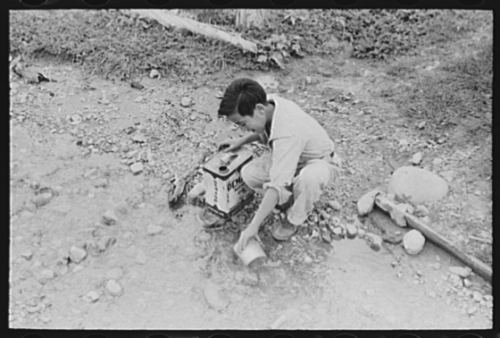
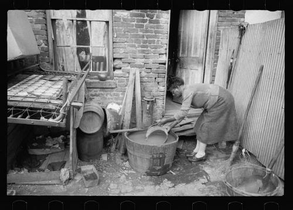
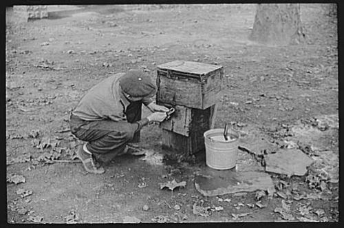

Stop, close your eyes, and take a moment to think about your home, without water faucets, without showerheads, without garden hoses, and without toilets. We use water to drink, to clean, to cook, to grow things, to cool our cars, to do countless things that we often take for granted because we have easy access to one of the most abundant, and most precious resources in the world.

Imagine instead that your only easy access to water was from a dirty irrigation ditch, like in the photo below from a New Mexico back in the 1930s.

Or imagine that you lived in Washington, DC, and your only source of water was a backyard faucet shared by many homes, as shown in this image from 1935:

Now imagine the coal company shutting off all public utilities to your home, including water when they decided to abandon the local mine:

The images above are from the United States in the 30s and 40s, but there are many people across the globe right now struggling for access to water. People who don’t have the convenience of a dirty irrigation ditch near their home or a shared urban faucet in their back yards.

Today is Blog Action Day 2010, a day when bloggers join together to write about and start a conversation about a specific topic. This year’s topic is Water – and how almost a billion people in the world don’t have access to clean and safe drinking water.

Now imagine that you can help, through groups like Unicef or [Water.org](https://water.org/) or Engineers without Borders.

You can.

[Petitions](https://www.change.org/petitions) by Change.org|Start a Petition »
