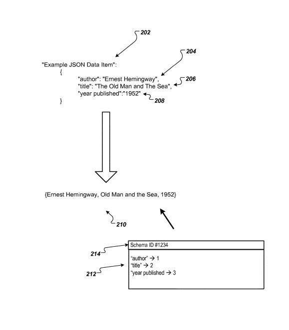
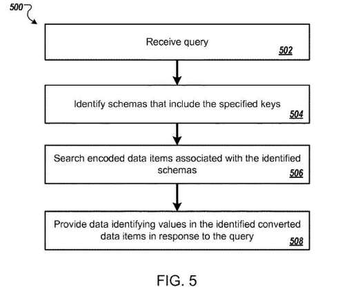

## Search Using Structured Data

Structured Data is information that is formatted into a repository that a search engine can read easily. Some examples include XML markup in XML sitemaps and schema vocabulary found in JSON-LD scripts. It is distinct from semi-structured and unstructured data that have less formatting.

A search engine that answers questions based upon crawling and indexing facts found within structured data on a site works differently than a search engine that looks at the words used in a query and tries to return documents using unstructured data which contains the same words as the ones in the query; hoping that such a matching of strings might contain an actual answer to the informational need that inspired the query in the first place. Search using Structured Data works a little differently, as seen in this flowchart from a 2017 Google patent:

_“Flow Chart Showing Structured Data in a Search_

In [Schema, Structured Data, and Scattered Databases such as the World Wide Web](https://www.seobythesea.com/2018/06/schema-structured-data-and-scattered-databases/), I talked about the Dipre Algorithm in a patent from Sergey Brin, as I described in the post, [Google’s First Semantic Search Invention was Patented in 1999](https://www.seobythesea.com/2014/09/google-first-semantic-search-invention-patented-1999/). That patent and algorithm described how the web might be crawled to collect patterns and relations information about specific facts. In that case, about books. In the Google patent on structured data, we see how Google might look for factual information set out in structured data such as JSON-LD, to be able to answer queries about facts, such as, “What is a book, by Ernest Hemingway, published in 1948-1952.

This newer patent tells us that it might solve that book search in this manner:

> In particular, for each encoded data item associated with a given identified schema, the system searches the locations in the encoded data item identified by the schema as storing values for the specified keys to identify encoded data items that store values for the specified keys that satisfy the requirements specified in the query. For example, if the query is for semi-structured data items that have the value “Ernest Hemingway” for an “author” key and that have values in a range of “1948-1952” for a “year published” key, the system can identify encoded data items that store a value corresponding to “Ernest Hemingway” in the location identified in the schema associated with the encoded data item as storing the value for the “author” key and that store a value in the range from “1948-1952” in the location identified in the schema associated with the encoded data item as storing the value for the “year published” key. Thus, the system can identify encoded data items that satisfy the query efficiently, i.e., without searching encoded data items that do not include values for each key specified in the received query and without searching locations in the encoded data items that are not identified as storing values for the specified keys.

## Structured Data and JSON-LD

It was interesting seeing Google come out with a patent about searching semi-structured data that focused upon the use of JSON-LD. We see them providing an example of JSON on one of the Google Developer’s pages at [Introduction to Structured Data](https://developers.google.com/search/docs/guides/intro-structured-data)

As it tells us on that page:

> This documentation describes which fields are required, recommended, or optional for structured data with special meaning to Google Search. Most Search structured data uses schema.org vocabulary, but you should rely on the documentation on developers.google.com as definitive for Google Search behavior, rather than the schema.org documentation. Attributes or objects not described here are not required by Google Search, even if marked as required by schema.org.

The page then points us to the [Structured Data Testing Tool](https://search.google.com/structured-data/testing-tool/u/0/), to be used as you prepare pages for use with Structured Data. It also tells us that for checking on Structured Data after it has been set up, the [Structured Data Report in Google Search Console](https://www.google.com/webmasters/tools/structured-data?pli=1) can be helpful and is what I usually look at when doing site audits.

The [Schema.org](https://schema.org/) website has had a lot of JSON-LD examples added to it, and it was interesting to see this patent focus upon it. As they tell us about it in the patent, it seems that they like it:

> Semi-structured data is self-describing data that does not conform to a static, predefined format. For example, one semi-structured data format is JavaScript Object Notation (JSON). A JSON data item generally includes one or more JSON objects, i.e., one or more unordered sets of key/value pairs. Another example of a semi-structured data format is Extensible Markup Language (XML). An XML data item generally includes one or more XML elements that define values for one or more keys.

## Machine Readable Extraction of Facts

I’ve used the analogy of how XML sitemaps are machine-readable, compared to HTML Sitemaps, and that is how JSON-LD shows off facts in a machine-readable way on a site, as opposed to content that is in HTML format. As the patent tells us, that is the purpose of this patent:

> In general, this specification describes techniques for extracting facts from collections of documents.

The patent discusses schemas that might be on a site, and key/value pairs that could be searched, and details about such a search of semi-structured data on a site:

> The aspect further includes receiving a query for semi-structured data items, wherein the query specifies requirements for values for one or more keys; identifying schemas from the plurality of schemas that identify locations for values corresponding to each of the one or more keys; for each identified schema, searching the encoded data items associated with the schema to identify encoded data items that satisfy the query; and providing data identifying values from the encoded data items that satisfy the query in response to the query. Searching the encoded data items associated with the schema includes: searching, for each encoded data item associated with the schema, the locations in the encoded data item identified by the schema as storing values for the specified keys to identify whether the encoded data item stores values for the specified keys that satisfy the requirements specified in the query.

The patent providing details of the use of JSON-LD to provide a machine-readable set of facts on a site can be found here:

[Storing semi-structured data](http://patft.uspto.gov/netacgi/nph-Parser?Sect1=PTO1&Sect2=HITOFF&d=PALL&p=1&u=%2Fnetahtml%2FPTO%2Fsrchnum.htm&r=1&f=G&l=50&s1=9,754,048.PN.&OS=PN/9,754,048&RS=PN/9,754,048)
Inventors: Martin Probst
Assignee: Google Inc.
US Patent: 9,754,048
Granted: September 5, 2017
Filed: October 6, 2014

Abstract

> Methods, systems, and apparatus, including computer programs encoded on computer storage media, store semi-structured data. One of the methods includes maintaining a plurality of schemas; receiving a first semi-structured data item; determining that the first semi-structured data item does not match any of the schemas in the plurality of schemas; and in response to determining that the first semi-structured data item does not match any of the schemas in the plurality of schemas: generating a new schema, encoding the first semi-structured data item in the first data format to generate the first new encoded data item following the new schema, storing the first new encoded data item in the data item repository, and associating the first new encoded data item with the new schema.

## Take Aways on Structured Data Use

Using Structured Data such as in Schema Vocabulary in JSON-LD formatting, you make sure that you provide precise facts in key/value pairs that provide an alternative to the HTML-based content on the pages of a site. Make sure that you follow the [Structured Data General Guidelines](https://developers.google.com/search/docs/guides/sd-policies) from Google when you add it to a site. That page tells us that pages that don’t follow the guidelines may not rank as highly or become ineligible for rich results appearing for them in Google SERPs. Another Google Page about Structure Data is a guide page titled [Understand how structured data works](https://developers.google.com/search/docs/guides/intro-structured-data), which contains links to helpful pages to enable you to learn more about how structured data is used at Google.

And if you are optimizing a site for Google, it also helps to optimize the same site for Bing, and it is good to see that Bing seems to like JSON-LD. It has taken a while for Bing to do that (see Aaron Bradley’s post, [An Open Letter to Bing Regarding JSON-LD](http://www.seoskeptic.com/open-letter-bing-regarding-json-ld/).) It appears that Bing has listened a little, adding some capacity to check on JSON-LD after it is deployed: [Bing announces Bing AMP viewer & JSON-LD support in Bing Webmaster Tools](https://searchengineland.com/bing-announces-bing-amp-viewer-json-ld-support-in-bing-webmaster-tools-300037). The Bing Markup Validator does not yet help with JSON-LD, but Bing Webmaster Tools now helps debug JSON-LD. I like using this [Structured Data Linter](http://linter.structured-data.org/) myself.

Last Updated June 8, 2019
