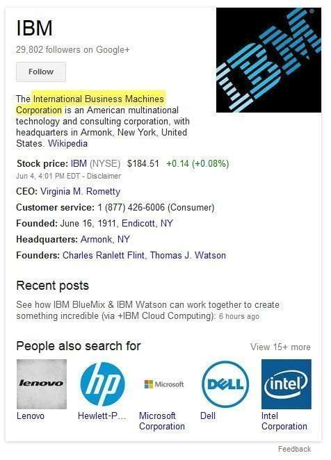

## Entity Synonyms

When Google indexes the Web, it’s often been convenient to think about the search engine running two different methods or approaches that seem to run in parallel. One of those involves the crawling and indexing and ranking of pages on the web (and images, videos, news, podcasts, and other documents).

The other approach doesn’t look at pages as much as it indexes objects it finds on the Web, or what we often refer to as named entities, which are specific people, places, or things – real or fictional. We see this second kind of crawling often referred to as fact extraction and see the results of such extraction as Knowledge Panel results or even things like Google’s OneBox Question & Answer results.

When SEOs talk about Google and the programs it uses to crawl and index pages on the Web, we usually refer to those crawlers as robots or spiders or even Googlebot and don’t differentiate these crawling programs much. Not the kind of robot above (which is a new twist from Google), but it’s probably time to start thinking of Googlebot differently.

I’ve written about both types of crawling, and for the second type of crawling and indexing, I’ve been placing those posts in my [Fact Extraction and Knowledge Graphs](https://www.seobythesea.com/category/fact-extraction/) category. (I added the “Knowledge Graphs” part of that a year or two ago because it seemed to make sense.)

A newly granted patent for Google brings the differences between the two types of crawlers closer together, by having one of the fact extraction crawlers pay more attention to links and anchor text to learn more about entities that might be referred to in those links, including new (synonymous) names for those entities. The text in links to pages about Entities may include entity synonyms that could describe those entities on those pages. These fact extraction crawlers have been referred to by Google as “janitors” in the past, and here are some posts I’ve written that talks more about how these janitors work:

- June 29, 2007 – [Google Janitors Clean Up Facts on the Web](https://www.seobythesea.com/2007/06/google-janitors-clean-up-facts-on-the-web/)
- August 5, 2007 – [Google on the Extraction and Visualization of Facts](https://www.seobythesea.com/2007/08/designating-data-objects-for-analysis/)
- January 11, 2013 – [Building Google’s Knowledge Base and Identifying Locations in Web Pages](https://www.seobythesea.com/2013/01/knowledge-base-locations-in-web-pages/)

If you want even more, following the category link above to “Fact Extraction”. A few years ago, Google acquired the patents from a company called MetaWeb. I wrote the post [Google Gets Smarter with Named Entities: Acquires MetaWeb](https://www.seobythesea.com/2010/07/google-gets-smarter-with-named-entities-acquires-metaweb/). The newly granted patent talks about how it uses a feature of one of MetaWeb’s patents – assigning a unique ID for each named entity so that there were multiple names for the same specific entity, they can each be associated with that unique ID.

This entity synonyms patent describes how Google uses janitors to identify new names for an entity, and assigns them a unique ID so that Google understands that the names are synonyms for the same entities. An example of an entity in the patent that has multiple names is “International Business Machines Corporation” otherwise known as “IBM” or “Big Blue”.

The entity synonyms patent is:

[Learning synonymous object names from anchor texts](http://patft.uspto.gov/netacgi/nph-Parser?Sect1=PTO2&Sect2=HITOFF&p=1&u=%2Fnetahtml%2FPTO%2Fsearch-adv.htm&r=1&f=G&l=50&d=PALL&S1=08738643&OS=PN/08738643&RS=PN/08738643)
Invented by Krzysztof Czuba, Jonathan T. Betz, Jeffrey C. Reynar
Assigned to Google
US Patent 8,738,643
Granted May 27, 2014
Filed: August 2, 2007

Abstract

> A repository contains objects representing entities. The objects also include facts about the represented entities. The facts are derived from source documents.
>
> Entity synonyms for objects can be determined by:
>
> - Identifying a source document from which one or more facts of the entity represented by the object were derived,
> - Identifying a plurality of linking documents that link to the source document through hyperlinks, each hyperlink having an anchor text,
> - Processing the anchor texts in the plurality of linking documents to generate a collection of synonym candidates for the entity represented by the object, and
> - Selecting a synonymous name for the entity represented by the object from the collection of synonym candidates.

I’ll be breaking the processes behind the entity synonyms patent down into specifics with my next post, but I’d recommend getting your head around fact extraction, and the idea that Googlebot’s fact extracting cousins are known as “janitors,” and there are multiple kinds of janitors, including some that look at the anchor text in links pointing to pages about entities to find entity synonyms.

I’ve written a few posts about named entities. These are some that I wanted to share:

- [Do You Have a Named Entity Strategy for Marketing Your Web Site?](https://www.seobythesea.com/2013/12/named-entity-strategy/)
- [How I Came to Love Entities and Start Doing Entity Optimization](https://www.seobythesea.com/2014/10/came-love-entities/)
- [How Google Uses Named Entity Disambiguation for Entities with the Same Names](https://www.seobythesea.com/2015/09/disambiguate-entities-in-queries-and-pages/)
- [How Named Entities Connected to Trending Topics can be used to Address Real Time Search Results](https://www.seobythesea.com/2015/03/how-named-entities-connected-to-trending-topics-can-be-used-to-address-real-time-search-results/)
- [Not Brands but Entities: The Influence of Named Entities on Google and Yahoo Search Results](https://www.seobythesea.com/2010/08/not-brands-but-entities-the-influence-of-named-entities-on-google-and-yahoo-search-results/)
- [How Knowledge Base Entities can be Used in Searches](https://www.seobythesea.com/2014/07/knowledge-base-entities-used-in-searches/)
- [Finding Entity Names in Google’s Knowledge Graph](https://www.seobythesea.com/2014/06/entity-names-in-google/)
- [Google Gets Smarter with Named Entities: Acquires MetaWeb](https://www.seobythesea.com/2010/07/google-gets-smarter-with-named-entities-acquires-metaweb/)
- [Entity Associations with Websites and Related Entities](https://www.seobythesea.com/2014/01/entity-associations-websites-related-entities/)
- [How Google Might Identify Entity Synonyms Using Anchor Text](https://www.seobythesea.com/2014/06/synonyms-for-entities/)
- [Extracting Facts for Entities from Sources such as Wikipedia Titles and Infoboxes](https://www.seobythesea.com/2014/08/extracting-facts-for-entities-from-sources/)
- [Extracting Semantic Classes and Corresponding Instances from Web Pages and Query Logs](https://www.seobythesea.com/2014/09/extracting-semantic-classes-instances-from-web-pages-query-logs/)
- [How Google May Identify Main Entities](https://www.seobythesea.com/2015/04/how-google-may-identify-central-entities-from-resources/)
- [How Google’s Knowledge Graph Updates Itself by Answering Questions](https://www.seobythesea.com/2018/10/how-googles-knowledge-graph-updates-itself-by-answering-questions/)

Last Updated June 26, 2019.
